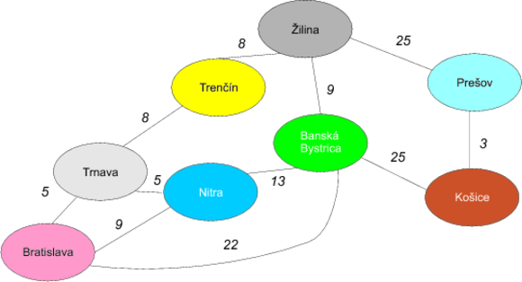
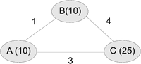
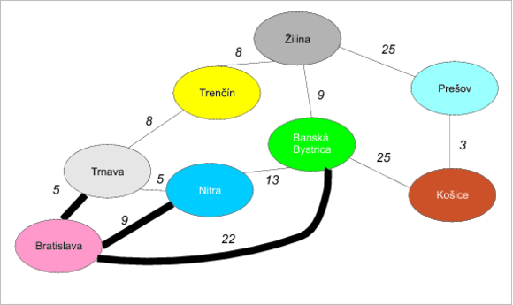
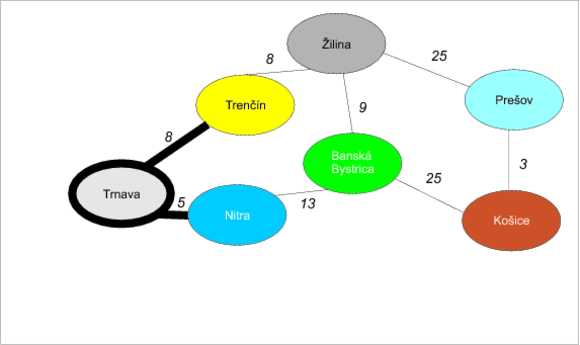
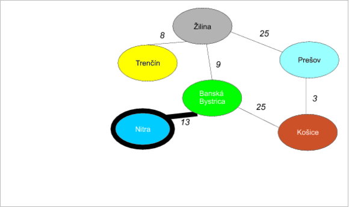
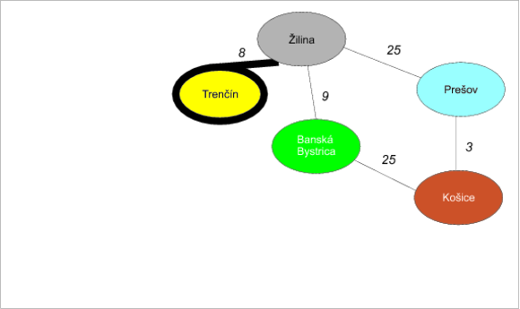
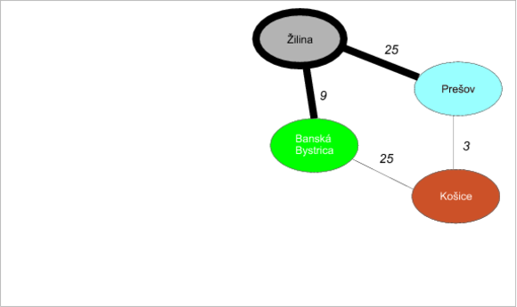
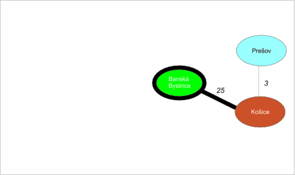
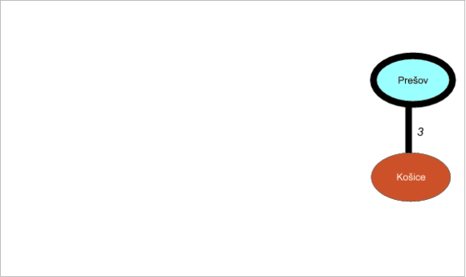

Cestujeme na východ
===================

Predstavte si, že vás ktosi prinútil odcestovať na obchodné rokovanie z Bratislavy do Košíc a ste nútení na to použiť auto. Aby ste znížili náklady, budete chcieť asi nájsť optimálnu cestu — pre jednoduchosť predpokladajme, že je to najkratšia cesta. Na to použijete asi klasický autoatlas Slovenskej republiky, v ktorom si cestu vypočítate sami. Ako druhú možnosť môžete použiť niektorý z existujúcich internetových plánovačov ciest, ktoré vám cestu vypočítajú samé. 

Ako vlastne fungujú takého vyhľadávače? Alebo ako by ste našli optimálnu cestu ručne? 

Pre jednoduchosť budeme narábať so zjednodušenou mapou Slovenska, ktorá nemusí celkom zodpovedať realite. (Pre jednoduchosť udávame vzdialenosti v desiatkach kilometrov.) 



Grafy na pomoc!
===============

Podobne ako v prípade hľadania minimálnej kostry hneď uvidíme v mape Slovenska *grafovú štruktúru*. Jednotlivé mestá (ovály) zodpovedajú *uzlom* a čiary natiahnuté medzi nimi *hranám*. Tento graf je ohodnotený (keďže hrany majú váhy zodpovedajúce vzdialenostiam medzi uzlami) a neorientovaný (čiara medzi Bratislavou a Trnavou znamená, že sa vieme dostať aj jedným aj druhým smerom). 

V tomto prípade sa snažíme dostať z Bratislavy do Košíc tak, aby sme prechádzali po najkratších čiarach. 

Jedným z optimálnych riešení je napríklad cesta Bratislava→Banská Bystrica→Košice dĺžky 47. 

Ako sme na to prišli? 

Dijkstrov algoritmus
====================

V tomto prípade sa snažíme nájsť *najkratšiu cestu* v neorientovanom ohodnotenom grafe s nezápornými ohodnoteniami hrán. Asi najznámejším algoritmom na túto úlohu je **Dijkstrov algoritmus** z roku 1959.

Edgser W. Dijkstra bol povestný holandský ~~fyzik~~/~~matematik~~/informatik. Je iróniou, že originálny článok s týmto problémom má len niečo nad jednu stranu :-) 

Keby sme algoritmus nepoznali, možno by nám napadla prvá vec: a to ísť stále po najkratších hranách. Podľa toho by sme najprv došli z Bratislavy do Trnavy (50 km), potom do Nitry (50 km, spolu už 100 km), lenže... už by sme narazili. Z Bratislavy do Nitry sa dá totiž dostať priamo a to 90 km priamou cestou. Vidieť teda, že takýto *pažravý* spôsob sa dlhodobo nevypláca.

Dijkstrov algoritmus týmto problémom predchádza. Postavený je na nasledovných ideách: 

1. Budeme udržiavať odhady vzdialeností od počiatočného uzla. Na začiatku sú všetky uzly nekonečne ďaleko (okrem počiatočného uzla, ten má vzdialenosť 0). Počas algoritmu budeme tieto odhady vylepšovať. Aby sme na konci algoritmu vedeli aj presnú postupnosť uzlov, ktorou sa vieme dostať do cieľového uzla, budeme si udržiavať pomocný zoznam, kde pre každý uzol bude uvedený jeho priamy predchodca vo výslednej najkratšej ceste. 

2. V každom kroku vezmeme uzol, ktorý má najmenší odhad vzdialenosti *d* od počiatočného uzla, odoberieme ho z grafu a odložíme si ho do bočného zoznamu. 

3. Prejdeme všetkých susedov uzla v grafe a vezmeme dĺžku hrany medzi nimi. Vzdialenosť *d* v skutočnosti znamená najlepšiu možnú cestu cez uzly v pomocnom zozname. Pre každého suseda sa pozrieme, či dĺžka hrany medzi ním a aktuálnym uzlom + vzdialenosť *d* je menšia než odhad počiatočnej vzdialenosti suseda. Ak áno, vieme vylepšiť odhad vzdialenosti u suseda o túto novú hodnotu. V tomto prípade tiež nastavíme susedovi predchodcu v ceste na aktuálny uzol. 

4. Prejdime na krok 2.

Bod 2 vyzerá na príklade nasledovne: ak máme tri uzly *A*, *B* a *C* kde odhady vzdialeností od počiatočného uzla sú 10 pre *A*, 10 pre *B* a 25 pre *C*, a vychádzame z uzla *A*, stane sa nasledovná vec: 

* Odhad do uzla *A* je 10 + dĺžka hrany do *B* je 1, čo je spolu 11. Toto číslo je väčšie než dosiaľ získaná najkratšia možná cesta do *B* (10), čiže by sme si situáciu nezlepšili.
* Pre druhého suseda máme 10 + dĺžku hranu do *C* = 13, čo je omnoho lepšie než doterajší odhad najkratšej cesty do C (25). Odhad najkratšej cesty do *C* teda vylepšíme. 



Ukážme si to na príklade slovenskej mapy.

# Príklad

## Iterácia 1: Z Bratislavy



Vychádzajme z Bratislavy. Na začiatku vyzerajú odhady hrán (prvý riadok) a predchodcov (druhý riadok) nasledovne:

| Bratislava | Trnava | Nitra | Trenčín | Banská Bystrica | Žilina | Prešov | Košice |
| :--------: | :----: | :---: | :-----: | :-------------: | :----: | :----: | :----: |
|     0      |   ∞    |   ∞   |    ∞    |        ∞        |   ∞    |   ∞    |   ∞    |
|     -      |   -    |   -   |    -    |        -        |   -    |   -    |   -    |

Prejdime všetky hrany vychádzajúce z Bratislavy:

* **Bratislava-Trnava (5)**. Pozrime sa, či minimálny odhad vzdialenosti do uzla Bratislava + vzdialenosť Bratislava-Trnava je menší, než minimálny odhad vzdialenosti do uzla Trnava. 0 + 5 = 5, to je ale menšie než nekonečno: vylepšíme teda odhad vzdialenosti do uzla Trnava a navyše nastavíme Bratislavu ako predchodcu Trnavy.

| Bratislava |    Trnava    | Nitra | Trenčín | Banská Bystrica | Žilina | Prešov | Košice |
| :--------: | :----------: | :---: | :-----: | :-------------: | :----: | :----: | :----: |
|     0      |     *5*      |   ∞   |    ∞    |        ∞        |   ∞    |   ∞    |   ∞    |
|     -      | *Bratislava* |   -   |    -    |        -        |   -    |   -    |   -    |

* **Bratislava-Nitra (9)**. Pozrime sa, či minimálny odhad vzdialenosti do uzla Bratislava + vzdialenosť Bratislava-Nitra je menší,než minimálny odhad vzdialenosti do Nitry. Opäť 0 + 9 = 9, to je ale menšie než nekonečno: vylepšíme teda odhad vzdialenosti do Nitry a Nitre nastavíme Bratislavu ako predchodcu:

| Bratislava |   Trnava   |    Nitra     | Trenčín | Banská Bystrica | Žilina | Prešov | Košice |
| :--------: | :--------: | :----------: | :-----: | :-------------: | :----: | :----: | :----: |
|     0      |     5      |     0 + 9 = **9**  |    ∞    |        ∞        |   ∞    |   ∞    |   ∞    |
|     -      | Bratislava | *Bratislava* |    -    |        -        |   -    |   -    |   -    |

* **Bratislava-Banská Bystrica (22)**. Pozrime sa, či minimálny odhad vzdialenosti do uzla Bratislava + vzdialenosť Bratislava-Banská Bystrica je menší, než minimálny odhad vzdialenosti do Bystrice. Opäť 0 + 22 = 22, to je ale menšie než nekonečno: vylepšíme teda odhad vzdialenosti do Bystrice spolu s nastavením predchodcu:

| Bratislava |   Trnava   |   Nitra    | Trenčín | Banská Bystrica | Žilina | Prešov | Košice |
| :--------: | :--------: | :--------: | :-----: | :-------------: | :----: | :----: | :----: |
|     0      |     5      |     9      |    ∞    |      0 + 22 = **22**   |   ∞    |   ∞    |   ∞    |
|     -      | Bratislava | Bratislava |    -    |  *Bratislava*   |   -    |   -    |   -    |

Uzol **Bratislava** je vybavený a môžeme ho z grafu vyhodiť — presnejšie povedané, odložíme si ho bokom, aby sme vedeli, že najkratšia cesta pôjde cez neho.

## Iterácia 2: Čo sa stalo v Trnave pri bráne



Pozrime sa do tabuľky odhadov, ktorý uzol má najmenšiu vzdialenosť: je ním **Trnava**. Hrany z neho vychádzajúce sú: 

* **Trnava-Trenčín (8)**. Ako vyzerá minimálny  odhad vzdialenosti do uzla Trnava + vzdialenosť Trnava-Trenčín? 5 + 8 =  13, to je ale menšie než odhad do Trenčína (nekonečno): vylepšíme ho teda a zároveň nastavíme Trenčínu predchodcu na Trnavu: 

|   Trnava   |   Nitra    |    Trenčín    | Banská Bystrica | Žilina | Prešov | Košice |
| :--------: | :--------: | :-----------: | :-------------: | :----: | :----: | :----: |
|     5      |     9      | 5+ 8 = **13** |       22        |   ∞    |   ∞    |   ∞    |
| Bratislava | Bratislava |   *Trnava*    |   Bratislava    |   -    |   -    |   -    |

* **Trnava-Nitra (5)**. Pozrime sa, či minimálny odhad vzdialenosti do uzla Trnava + vzdialenosť Trnava-Nitra je menší, než minimálny odhad vzdialenosti do Nitry. Opäť 5 + 5 = 10. To je však viac než aktuálny odhad do Nitry (9), čiže nebudeme ho vylepšovať.

|   Trnava   |   Nitra    | Trenčín | Banská Bystrica | Žilina | Prešov | Košice |
| :--------: | :--------: | :-----: | :-------------: | :----: | :----: | :----: |
|     5      |     9      |   13    |       22        |   ∞    |   ∞    |   ∞    |
| Bratislava | Bratislava | Trnava  |   Bratislava    |   -    |   -    |   -    |

Trnavu sme teda vybavili a vyhodíme ju z grafu.

## Iterácia 3: Keď som išiel cez Chrenovú



Ďalším kandidátom s najmenším odhadom je Nitra (odhad 9). Vychádza z nej len jediná hrana:

* **Nitra-Banská Bystrica (13)**. Odhad do Nitry je 9 + vzdialenosť Nitra-Bystrica = 9 + 13 = 22, čo je to isté, než aktuálny odhad do Bystrice (22). Nemusíme ho teda vylepšovať:

|   Nitra    | Trenčín | Banská Bystrica | Žilina | Prešov | Košice |
| :--------: | :-----: | :-------------: | :----: | :----: | :----: |
|     9      |   13    |       22        |   ∞    |   ∞    |   ∞    |
| Bratislava | Trnava  |   Bratislava    |   -    |   -    |   -    |

Nitru sme vybavili a môžeme ju z grafu vyhodiť.

## Iterácia 4: Trenčianska kasáreň maľovaná



Ak sa pozrieme do tabuľky vzdialeností, uvidíme najbližší Trenčín (odhad 13). I z neho vychádza len jediná hrana: 

* **Trenčín-Žilina (8)**. Odhad do Trenčína je 13  + vzdialenosť Trenčín-Žilina = 13 + 8 = 21, čo je menšie než aktuálny odhad do Žiliny (nekonečno), vylepšíme ho teda a nastavíme Žiline predchodcu na Trenčín. 

| Trenčín | Banská Bystrica |     Žilina      | Prešov | Košice |
| :-----: | :-------------: | :-------------: | :----: | :----: |
|   13    |       22        | 13 + 8 = **21** |   ∞    |   ∞    |
| Trnava  |   Bratislava    |    *Trenčín*    |   -    |   -    |

Trenčín je teda vyriešený.

## Iterácia 5: Žilina



Na rad prichádza Žilina s odhadom 21. Z nej idú dve hrany: do Prešova a do Banskej Bystrice. 

* **Žilina-Banská Bystrica (9)**. Odhad do Žiliny  je 21 + vzdialenosť Žilina-Banská Bystrica = 21 + 9 = 30. To však nie je lepšie než odhad do Bystrice (22), preto nemá zmysel ho vylepšovať. 

| Banská Bystrica | Žilina  | Prešov | Košice |
| :-------------: | :-----: | :----: | :----: |
|       22        |   21    |   ∞    |   ∞    |
|   Bratislava    | Trenčín |   -    |   -    |

* **Žilina-Prešov (25)**. Odhad do Žiliny je 21 + vzdialenosť Žilina-Prešov (25) dáva výsledok 46. To je stále lepšie než nekonečný odhad vzdialenosti do Prešova, preto nastane aktualizácia. Rovnako nastavíme Prešovu predchodcu na Žilinu.

| Banská Bystrica | Žilina  |      Prešov      | Košice |
| :-------------: | :-----: | :--------------: | :----: |
|       22        |   21    | 21 + 25 = **46** |   ∞    |
|   Bratislava    | Trenčín |     *Žilina*     |   -    |

Žilinu sme teda spracovali a vyhodíme ju z grafu.

## Iterácia 6: Nad Banskou Bystricí je noc



Nevybaveným uzlom s najkratším odhadom je teraz Banská Bystrica (odhad 22). Z nej ide len jedna hrana do Košíc.

* **Banská Bystrica-Košice (25)**. Odhad do Bystrice je 22 + vzdialenosť Bystrica-Košice dáva 22 + 25 = 47. Je to však stále lepšie než nekonečný odhad vzdialenosti do Košíc. Vylepšíme teda odhad a nastavíme predchodcu Košíc na Banskú Bystricu:

| Banská Bystrica | Prešov |      Košice       |
| :-------------: | :----: | :---------------: |
|       22        |   46   | 22 + 25 = **47**  |
|   Bratislava    | Žilina | *Banská Bystrica* |

Banskú Bystricu teda môžeme vyhodiť z grafu.

## Iterácia 7: A od Prešova



Po vyhodení Banskej Bystrice máme už len Prešov a Košice. Menší odhad na vzdialenosť má Prešov: 46 s jedinou hranou do Košíc.

* **Prešov-Košice (3)**. Odhad do Prešova je 46 + vzdialenosť Prešov-Košice dáva 46 + 3 = 49. To však nie je lepšie než jestvujúci odhad do Košíc: 47, čiže ho nebudeme zhoršovať.

| Prešov |     Košice      |
| :----: | :-------------: |
|   46   |       47        |
| Žilina | Banská Bystrica |

Prešov môžeme vyhodiť.

## Iterácia 8: Na košickej turni


Ostávajúcim kandidátom sú Košice. Z nich však už nejdú žiadne hrany, preto nebudeme aktualizovať vzdialenosti. Toto je zároveň posledná iterácia, keďže po odobratí Košíc je graf už prázdny.

## Určenie najkratšej cesty

Najkratšiu cestu určíme jednoducho: pozrieme sa, v akom poradí sme vyhadzovali jednotlivé uzly. Rovnako sa pozrieme na predchodcov, ktoré mali tieto uzly nastavené v zozname v čase, keď boli vyhadzované: 

1. **Bratislava**: - 
2. **Trnava**: Bratislava 
3. **Nitra**: Bratislava 
4. **Trenčín**: Trnava 
5. **Žilina**: Trenčín 
6. **Banská Bystrica**: Bratislava 
7. **Prešov**: Žilina 
8. **Košice**: Banská Bystrica 

Najkratšiu cestu nájdeme tak, že vyjdeme z koncového uzla a prechádzame spätne po predchodcov do počiatočného uzla, čiže: **Košice→Banská Bystrica→Bratislava**. Obrátené poradie nám dáva skutočne najkratšiu cestu.

# A naozaj to funguje správne?

Dijkstrov algoritmus skutočne funguje správne (kto neverí, môže si naštudovať formálny dôkaz), pretože platia tieto základné fakty: 

* Do každého uzla, ktorý odoberáme z grafu, vedie zaručene najkratšia možná cesta z počiatočného vrchola. 
* Odhady vzdialeností predstavujú vzdialenosť najkratšej možnej cesty, ktorá vedie z počiatočného uzla cez dosiaľ odobraté uzly do príslušného uzla. 

Vezmime si napríklad tretiu iteráciu: dosiaľ odobraté uzly sú Bratislava a Trnava. Trenčín má nastavený odhad 13, čo je naozaj najkratšia možná cesta cez Bratislavu a Trnavu

# Implementácia v Jave

Implementácia v Jave sa bude opäť držať popisu algoritmu. Budeme predpokladať, že uzly grafu zodpovedajú reťazcom (samozrejme, mohli by sme používať aj komplexnú triedu `Node`, ale v tomto prípade to nie je až také nutné). 

Odhady vzdialeností budeme udržiavať v mape z reťazcov (teda uzlov) do celých čísiel: 

```java
private Map<String, Integer> distances = new HashMap<>();
```

Zoznam predchodcov bude tiež mapa z reťazcov do reťazcov (z uzlov do uzlov), kde ku každému uzlu budeme evidovať jeho predchodcu: 

```java
Map<String, String> predecessors = new HashMap<>();
```

Na začiatku nastavíme vzdialenosti na nekonečno a vzdialenosť zo zdrojového uzla `sourceNode` do zdrojového uzla nastavíme na nulu: 

```java
for (String node : getNodes()) {
   distances.put(node, Integer.MAX_VALUE);
 }
 distances.put(sourceNode, 0);
```

Zvyšok kódu zodpovedá algoritmu: 

```java
String currentNode;
// prechádzame uzly a stále hľadáme najbližší
while((currentNode = findNearestNode(distances)) != null) {
    for (String adjacentNode : graph.findAdjacentNodes(currentNode)) {
        // urobíme nový odhad vzdialenosti
        int possiblyBetterDistance = distances.get(currentNode)
                + graph.getWeight(currentNode, adjacentNode);
        // ak je odhad vzdialenosti lepší, než vzdialenosť
        // do suseda...
        if(possiblyBetterDistance < distances.get(adjacentNode)) {
            //.. vylepšíme ju
            distances.put(adjacentNode, possiblyBetterDistance);
            //.. a nastavíme predchodcu
            predecessors.put(adjacentNode, currentNode);
        }
    }
    // vyhodíme uzol z grafu ..
    graph.removeNode(currentNode);
    // .. a zo zoznamu vzdialeností
    distances.remove(currentNode);
}
```

Mapu predchodcov `predecessors` prevedieme na peknú postupnosť nasledovne: 

```java
List<String> path = new ArrayList<>();
String predecessor;
String node = destinationNode;
path.add(destinationNode);
while((predecessor = predecessors.get(node)) != null) {
    path.add(0, predecessor);
    node = predecessor;
}
return path;
```

Všimnime si jednu peknú vlastnosť Dijkstrovho algoritmu: nájsť najlepšiu cestu do daného uzla je rovnako zložité ako nájsť cestu do akéhokoľvek iného uzla. Inak povedané, ak by sme chceli zistiť najkratšie cesty do všetkých vrcholov, nepotrebujeme meniť v algoritme takmer nič — jediná zmena je úprava prechodu zoznamu predchodcov na konci algoritmu. 

# Kompletná implementácia v Jave

Urobme si základný interfejs pre graf:

```
public interface Graph {
    void addEdge(String node1, String node2, int weight);

    void removeNode(String node);

    Set<String> getNodes();

    Set<String> findAdjacentNodes(String node);

    int getWeight(String node1, String node2);
}

```

Implementáciu nájdeme nižšie.

## Implementácia algoritmu

```java
public class Dijkstra {
    public List<String> findShortestPath(IncidenceMatrixGraph graph, String sourceNode, String destinationNode) {
        Map<String, Integer> distances = new HashMap<>();

        for (String node : graph.getNodes()) {
            distances.put(node, Integer.MAX_VALUE);
        }
        distances.put(sourceNode, 0);

        Map<String, String> predecessors = new HashMap<>();
        String currentNode;
        // prechádzame uzly a stále hľadáme najbližší
        while((currentNode = findNearestNode(distances)) != null) {
            for (String adjacentNode : graph.findAdjacentNodes(currentNode)) {
                // urobíme nový odhad vzdialenosti
                int possiblyBetterDistance = distances.get(currentNode)
                        + graph.getWeight(currentNode, adjacentNode);
                // ak je odhad vzdialenosti lepší, než vzdialenosť
                // do suseda...
                if(possiblyBetterDistance < distances.get(adjacentNode)) {
                    //.. vylepšíme ju
                    distances.put(adjacentNode, possiblyBetterDistance);
                    //.. a nastavíme predchodcu
                    predecessors.put(adjacentNode, currentNode);
                }
            }
            // vyhodíme uzol z grafu ..
            graph.removeNode(currentNode);
            // .. a zo zoznamu vzdialeností
            distances.remove(currentNode);
        }
        return buildPath(destinationNode, predecessors);
    }

    private List<String> buildPath(String destinationNode, Map<String, String> predecessors) {
        List<String> path = new ArrayList<>();
        String predecessor;
        String node = destinationNode;
        path.add(destinationNode);
        while((predecessor = predecessors.get(node)) != null) {
            path.add(0, predecessor);
            node = predecessor;
        }
        return path;
    }

    private String findNearestNode(Map<String, Integer> distances) {
        int minimum = Integer.MAX_VALUE;
        String nearestNode = null;
        for (Entry<String, Integer> entry : distances.entrySet()) {
            if(entry.getValue() < minimum) {
                minimum = entry.getValue();
                nearestNode = entry.getKey();
            }
        }
        return nearestNode;
    }
}
```

## Spustenie kódu

```
public static void main(String[] args) {
    IncidenceMatrixGraph g = new IncidenceMatrixGraph();
    g.addEdge("Bratislava", "Trnava", 5);
    g.addEdge("Trnava", "Nitra", 5);
    g.addEdge("Bratislava", "Nitra", 9);
    g.addEdge("Trnava", "Trenčín", 8);
    g.addEdge("Trenčín", "Žilina", 8);
    g.addEdge("Žilina", "Banská Bystrica", 9);
    g.addEdge("Žilina", "Prešov", 25);
    g.addEdge("Nitra", "Banská Bystrica", 13);
    g.addEdge("Prešov", "Košice", 3);
    g.addEdge("Banská Bystrica", "Košice", 25);
    g.addEdge("Bratislava", "Banská Bystrica", 22);

    Dijkstra dijkstra = new Dijkstra();

    for (String entry : dijkstra.findShortestPath(g, "Bratislava", "Košice")) {
        System.out.println(entry);
    }
}
```

## Implementácia grafu

Graf sme implementovali cez maticu incidencií:

```java
public class IncidenceMatrixGraph implements Graph {
    /**
     * Matica incidencií
     */
    private Map<String, Map<String, Integer>> matrix = new HashMap<>();

    private void addNode(String newNode) {
        // na koniec kazdeho zoznamu prida mapovanie node->0
        for(Map<String, Integer> row : matrix.values()) {
            row.put(newNode, 0);
        }

        // prida novy zoznam dlzky pocetUzlov + 1 plny nul
        Map<String, Integer> list = new HashMap<>();
        for(String n : matrix.keySet()) {
            list.put(n, 0);
        }
        list.put(newNode, 0);

        matrix.put(newNode, list);
    }

    @Override
    public void removeNode(String node) {
        matrix.remove(node);
        for (Map<String, Integer> row : matrix.values()) {
            row.remove(node);
        }
    }

    @Override
    public void addEdge(String node1, String node2, int weight) {
        if(!matrix.containsKey(node1)) {
            addNode(node1);
        }

        if(!matrix.containsKey(node2)) {
            addNode(node2);
        }

        matrix.get(node1).put(node2, weight);
        //  pre neorientovane hrany tiez
        matrix.get(node2).put(node1, weight);
    }

    @Override
    public Set<String> getNodes() {
        return matrix.keySet();
    }

    @Override
    public int getWeight(String node1, String node2) {
        return matrix.get(node1).get(node2);
    }

    @Override
    public Set<String> findAdjacentNodes(String node) {
        Set<String> adjacentNodes = new HashSet<>();
        for(Map.Entry<String, Integer> entry : matrix.get(node).entrySet()) {
            if(entry.getValue() > 0) {
                adjacentNodes.add(entry.getKey());
            }
        }
        return adjacentNodes;
    }
}
```

# Odkazy

1. E. J. Dijkstra: A note on two problems in connexion with graphs. In Numerische Mathematik, 1 (1959), S. 269–271. http://www-m3.ma.tum.de/twiki/pub/MN0506/WebHome/dijkstra.pdf, originálny jednostranový článok 