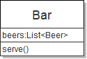
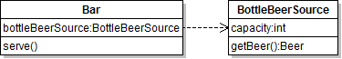
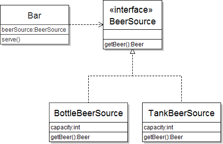
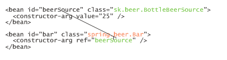
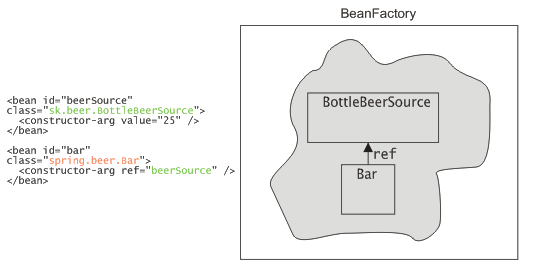

# Úvod
Ak ste niekedy chceli vlastniť svoj vlastný bar, máte príležitosť. V tomto príklade si totiž jeden navrhneme. Na tomto príklade si ukážeme použitie návrhového vzoru **dependency injection** (vkladanie závislostí), filozofie **inversion of control** (prevráteného riadenia) a jeho použitie v aplikačnom rámci Spring.

## Jednoduchý bar
Predstavme si, že na začiatku podnikateľskej kariéry bude bar podávať iba fľaškové pivo. Ak by sme to namodelovali v Jave, vzišla by z toho nasledovné triedy. Pivo `Beer` budeme reprezentovať ako jednoduchú triedu.
```java
package sk.beer;

public class Beer {
  public String toString() {
     return "Pivo";
  }
}
```
Bar bude fungovať primitívne. Bude mať jedinú metódu na získanie piva. Ak v zásobarni piva dostatok fľašiek, vrátime novú inštanciu piva a kapacitu znížime o 1.
```java
package sk.beer;

import java.util.ArrayList;
import java.util.List;

public class Bar {
    private List<Beer> beers = new ArrayList<Beer>();
    
    public Bar(int capacity) {
        for(int i = 0; i < capacity; i++) {
            beers.add(new Beer());
        }
    }
    
    public void serve() {
        if(beers.isEmpty()) {
            System.out.println("Došlo pivo.");
        }
        beers.remove(0);
        System.out.println("Zákazník dostal pivo");
    }
}
```

## Vylepšujeme návrh
Predstavme si ale, že by sme chceli ponúkať nielen pivo z fľašky, ale aj čapované zo sudov. Návrh triedy by sme museli značne prepracovať. Nehovoriac o tom, že časom príde do módy tankové pivo, ktoré si určite budú zákazníci želať.

Je preto dobré oddeliť funkcionalitu baru od funkcionality zdroja piva. Zdrojom piva môže byť zásobáreň fľašiek, sudy alebo tank.

Vytvorme triedu `BottleBeerSource` reprezentujúci chladničku s fľaškami. Kód bude viac než podobný prvotnej implementácii baru.
```java
package sk.beer;

import java.util.ArrayList;
import java.util.List;

public class BottleBeerSource {
    private List<Beer> beers = new ArrayList<Beer>();
    
    public BottleBeerSource(int capacity) {
        for(int i = 0; i < capacity; i++) {
            beers.add(new Beer());
        }
    }
    
    public Beer getBeer() {
        if(beers.isEmpty()) {
            return null;
        }
        return beers.remove(0);
    }
}
```

Bar v tejto chvíli potrebuje mať zdroj piva. Inak povedané, bar bude obsahovať inštanciu typu `BottleBeerSource`, z ktorej bude získavať inštancie pív.

Modifikovaný bar bude vyzerať nasledovne:
```java
public class Bar {
    private BottleBeerSource bottleBeerSource 
      = new BottleBeerSource(25);
    
    public void serve() {
        if(bottleBeerSource.getBeer() != null) {
            System.out.println("Zákazník dostal pivo.");
        }
    }
}
```

Všimnime si, že bar je závislý na zdroji piva. Ak by sme na zakreslenie tried použili škatuľový jazyk UML, medzi `Bar`om a `BottleBeerSource`om je natiahnutá čiara.



Ďalej si všimnime, že bar si inštancie tried, na ktorých závisí, vytvára sám. V našom prípade sme to vykonali pri deklarácii premennej. (Tento prístup je jednoduchý, ale všimnite si napevno zadanú kapacitu chladničky.)

Čo ak by sme chceli zmeniť bar ponúkajúci fľašky na bar čapujúci pivo z tanku? Vytvorme novú triedu `TankBeerSource`:
```java
package sk.beer;

public class TankBeerSource {
    private int capacity;
    
    public TankBeerSource(int capacity) {
        this.capacity = capacity;
    }
    
    public Beer tankBeer() {
        if(capacity == 0) {
            return null;
        }
        capacity--;
        return new Beer();
    }

}
```
Teraz potrebujeme nahradiť *všetky* výskyty `BottleBeerSource` novou triedou `TankBeerSource`. Navyše, všetky výskyty metódy `getBeer()` musíme nahradiť metódou `tankBeer()`.

## Použitie interfejsu v návrhu
Je však zjavné, že `BottleBeerSource` i `TankBeerSource` riešia rovnaký problém: dajú novú inštanciu piva. Na ich základe vieme da nový interfejs `BeerSource`, ktorý budú obidve triedy implementovať.
```java
package sk.beer;

public interface BeerSource {
  public Beer getBeer();
}
```
Pozmeňme teda obe triedy:
```java
public class BottleBeerSource implements BeerSource {
  //...
}
```
A
```java
public class TankBeerSource implements BeerSource {
    private int capacity;
    
    public TankBeerSource(int capacity) {
        this.capacity = capacity;
    }
    
    @Override
    public Beer getBeer() {
        if(capacity == 0) {
            return null;
        }
        capacity--;
        return new Beer();
    }
}
```
Použitie interfejsu zaručuje ľahkú výmenu implementácií. Z toho vyplýva známa zásada *„program to interfaces, not to implementations“*, čiže v dátových typoch by ste do čo najväčšej miery mali používať vhodné rozhrania, namiesto konkrétnych implementácií. Typický príklad sú kolekcie. Namiesto 
```java
private ArrayList<String> zoznam = new ArrayList<String>();
```
je lepšie 
```java
private List<String> zoznam = new ArrayList<String>();
```
Interfejs totiž podporuje abstrakciu a polymorfizmus. To je vidieť aj na našom príklade baru. Bar založený na fľaškách vyzerá nasledovne:
```java
public class Bar {
    // používame interfejs
    private BeerSource beerSource 
      = new BottleBeerSource(25);
   //...
}
```


Migrácia baru na tankové pivo je jednoduchá: stačí zmeniť dátový typ použitý pri vytváraní konkrétneho zdroja piva: teda z `new BottleBeerSource()` na `new TankBeerSource()`. Namiesto predošlého prípadu, kde sme museli nahradiť i dátové typy premenných, i vytvárané inštancie (a dokonca aj metódu), v tomto prípade stačí zmeniť jediný riadok.

## Prevrátené riadenie
Tento postup sa však dá ešte viac vylepšiť. Namiesto toho, aby si bar vytváral závislé triedy sám, môžeme použiť princíp „prevráteného riadenia“ (**inversion of control**). Bar si nebude vytvárať inštancie sám, ale získa ju „zvonku“. Vytvoríme inštanciu baru, nezávisle od toho vytvoríme inštanciu zdroja piva a tieto dve inštancie prepojíme -- pri vytváraní baru mu dodáme zdroj piva. Na to, aby sme to mohli spraviť, potrebujeme dodať príslušný konštruktor.
```java
public class Bar {
  private BeerSource beerSource; 

  public Bar(BeerSource beerSource) {
     this.beerSource = beerSource;
  }
}
```
Použitie v kóde je potom nasledovné:
```java
public static void main(String[] main) {
  // vytvoríme zdroj piva, používame interfejs
  BeerSource beerSource = new BottleBeerSource(25);
  // vytvoríme nový bar postavený na fľaškách 
  Bar javaBar = new Bar(beerSource);
  // obsluhujeme
  javaBar.serve();
}
```
Prevrátené riadenie sa tiež nazýva **dependency injection**, teda „vstreknutie závislostí“. Zdroj piva je závislosťou baru, ktorá bude doň vložená. Stretnúť sa možno tiež s veselou analógiou „hollywoodskeho princípu“: *„nevolajte nám, my vás zavoláme“*. Inak povedané, namiesto toho, aby bar sa sám dožadoval závislostí, niekto iný mu tie závislosti dodá. Tým niekým sme zatiaľ boli my v metóde `main()`.

Všimnime si, že migrácia na tankové pivo je teraz jednoduchá. Nemusíme meniť žiadnu z existujúci tried `Bar`. Stačí zmeniť len implementačnú triedu v kóde, ktorý realizuje prepojenia tried. V našom prípade zmeníme `new BottleBeerSource()` na `new TankBeerSource()`. 

# Kontajnery IoC
V prípade zložitého projektu a mnohých tried vo veľkom počte modulov by takéto prepájanie objektov bolo značne komplikované. To bolo motiváciou pre vznik viacerých aplikačných rámcov, ktoré zjednodušujú prepájanie a konfiguráciu komponentov. Ich často používané pomenovanie je **IoC kontajnery**. Za všetky spomeňme PicoContainer, Google Guice, či Spring. Práve posledný z týchto frameworkov použijeme v ďalších príkladoch.

## Spring a IoC
O Spring Frameworku toho bolo popísané veľa. Súhrnne povedané, je to komplexný aplikačný rámec uľahčujúci mnoho oblastí vývoja v Jave. Princíp **dependency injection** je neoddeliteľnou súčasťou jeho filozofie.

V predošlých príkladoch sme komponenty prepájali ručne a to pomocou Java kódu. Spring pristupuje k prepájaniu s využitím konfiguračných súborov XML.

Základným pojmom v Springu je **bean**, čo je to isté ako Java Bean (teda trieda, ktorá má prázdny konštruktor a ku všetkým jej vlastnostiam či atribútom sa pristupuje cez gettery a settery). Bean je trieda, ktorej Spring spravuje závislosti a prípadne iné ďalšie konfiguračné nastavenia. V našom barovom prípade by bol jedným beanom `Bar` a ďalšie dva beany by zodpovedali implementáciam zdroja piva.

## Konfigurácia IoC pomocou XML
Prejdime k napísaniu XML súboru, kde uvedieme závislosti medzi beanmi. Na začiatku vytvorme bar, ktorý predáva fľaškové pivá.
```xml
<?xml version="1.0" encoding="UTF-8"?>
<!DOCTYPE beans PUBLIC "-//SPRING//DTD BEAN//EN" 
          "http://www.springframework.org/dtd/spring-beans.dtd">

<beans>
  <!-- bean poskytovateľa piva -->
  <bean id="beerSource" class="sk.beer.BottleBeerSource">
    <!-- implicitná kapacita bude 25 fľašiek -->
    <constructor-arg value="25" />
  </bean>
	
  <!-- bean baru -->
  <bean id="bar" class="spring.beer.Bar">
    <constructor-arg ref="beerSource" />
  </bean>

</beans>
```
V súbore sme uviedli dva beany. Každý bean pozostáva:

* z názvu triedy beanu (atribút **class**)
* z jedinečného identifikátora beanu (atribút **id**)

Najjednoduchším spôsobom ako nadeklarovať bean, je 
```xml
<bean id="beerSource" class="sk.beer.BottleBeerSource" />
```
Táto deklarácia zodpovedá vytvoreniu inštancie triedy `BottleBeerSource` pomocou implicitného bezparametrového konštruktora. Fľaškový zdroj piva však implicitný konštruktor nemá (čím narušujeme konvencie pre JavaBean, mali by sme sa hanbiť!). Máme dve možnosti: buď takýto konštruktor do triedy dopracujeme alebo použijeme obchádzku. V deklarácii beanu môžeme použiť element `constructor-arg`, ktorým nastaviť argumenty použité pri vytváraní inštancie beanu.
```xml
<bean id="beerSource" class="sk.beer.BottleBeerSource">
  <!-- implicitná kapacita bude 25 fľašiek -->
  <constructor-arg value="25" />
</bean>
```
Táto deklarácia zodpovedá kódu
```java
... = new BottleBeerSource(25);
```
Bean zodpovedajúci baru vytvoríme analogickým spôsobom. Bar závisí na zdroji piva, ktorý sme mu v kóde dodali pomocou konštruktora. Túto závislosť nastavíme pomocou atribútu `ref` (referencia, čiže odkaz), kde uvedieme identifikátor beanu, ktorého inštancia sa vloží do inštancie baru.

V springovskom slangu sa prepájanie beanov nazýva **wiring** (predrôtovanie...);

## Spustenie IoC kontajnera
Ak už máme nakonfigurované závislosti medzi beanmi, zrejme by sme chceli spustiť samotný IoC kontajner. Základná idea je nasledovná:
1.  vytvoríme inštanciu IoC kontajnera, ktorá načítava beany z XML súboru
1.  IoC kontajner spracuje XML súbor a pre každý `<bean>` vytvorí vo svojich útrobách jednu inštanciu triedy beanu identifikovanú pomocou `id`.
1.  ak je v beane uvedené prepojenie cez `ref`, nastaví sa mu inštancia, ktorej identifikátor je uvedený v `ref`.



IoC kontajner má v Springu viacero reprezentácií. Najjednoduchším je použitie interfejsu `BeanFactory`, teda továrne na beany. Ten umožňuje získať z IoC kontajnera nakonfigurovaný bean na základe identifikátora.



Na to slúži nasledovný kód:
```java
// zdrojom XML konfigurácie je XML súbor beans.xml s deklaráciou
// beanov
Resource xmlConfigFile 
  = new FileSystemResource("D:/projects/spring/beans.xml");
// vytvoríme IoC kontajner
BeanFactory beanFactory = new XmlBeanFactory(xmlConfigFile);

// získame bean z kontajnera
Bar bar = (Bar) beanFactory.getBean("bar");
bar.serve();
```
Inštanciu beanu môžeme z kontajnera získať metódou `getBean()`, do ktorej uvedieme identifikátor beanu. (Keďže táto metóda vracia `Object`, je nutné pretypovanie.)

Inštancia baru má v sebe vloženú inštanciu fľaškového zdroja piva, o čo sa postaral Spring.

XML konfigurácia má množstvo výhod:
1.  ak chceme prejsť z fľaškového piva na tankové, stačí zmeniť jedinú vec: názov implementačnej triedy v beane `beerSource`
1.  zmeny v závislostiach medzi triedami je možné vykonávať zmenou XML, na čo nie je potrebné rekompilácia projektu.

# Rôzne prístupy k dependency injection
Návrhový vzor *dependency injection* má viacero variantov. V príklade sme použili variant nazývaný **constructor injection**. Zdroj piva je do baru vložený pomocou konštruktora. To je prirodzené, pretože konštruktor slúži na inicializáciu triedy a teda sa očakáva, že inštancia baru bude dostupná hneď po jej konštrukcii. Bar, ktorý nemá nastavenú žiadnu inštanciu zdroja piva je v akomsi *medzistave* (mohlo by to zodpovedať baru, ktorý je síce otvorený, ale nedostaneme v ňom žiadne pivo, keďže je práve v hlbokej rekonštrukcii.) Tento prístup je preferovaným prístupom v PicoContaineri.

Spring preferuje inú možnosť: **setter injection**, kde sú závislosti vkladané do beanu pomocou setterov. Ukážka tohto prístupu v kóde je nasledovná:
```java
BottleBeerSource beerSource = new BottleBeerSource();
beerSource.setCapacity(25);

Bar bar = new Bar();
bar.setBeerSource(beerSource);

bar.serve();
```
Vytvorenie inštancie má tak tri fázy:

* vytvorenie inštancie implicitným konštruktorom
* nastavenie závislostí
* zavedenie do kontajnera

To je bližšie filozofii JavaBeanov, kde sa očakáva od beanu prázdny konštruktor a settre a gettre. Hoci sa na prvý pohľad môže stať, že inštancia beanu môže byť v medzistave (už jestvuje, ale nemá ešte vložené závislosti), v praxi sa to nestáva. Továreň na beany totiž vracia beany, ktorých závislosti sú už vyriešené. 

Na to, aby sme tento prístup mohli používať v príklade, potrebujeme do všetkých tried dodať prázdne konštruktory a gettre a settre.

```java
public class BottleBeerSource {
  public static final int DEFAULT_CAPACITY = 25;

  public BottleBeerSource() {
    this(DEFAULT_CAPACITY);
  }    

  public void setCapacity(int capacity) {
    this.capacity = capacity;
  }

  //...
}


public class TankBeerSource {
  public static final int DEFAULT_CAPACITY = 100;

  public TankBeerSource() {
    this(DEFAULT_CAPACITY);
  }    

  public void setCapacity(int capacity) {
    this.capacity = capacity;
  }

  //...
}

public class Bar {
  public Bar() {
    // prázdny konštruktor
  }

  public void setBeerSource(BeerSource beerSource) {
    this.beerSource = beerSource;
  }
}
```
Konfigurácia Springu potom bude vyzerať nasledovne:
```xml
<?xml version="1.0" encoding="UTF-8"?>
<!DOCTYPE beans PUBLIC "-//SPRING//DTD BEAN//EN" 
          "http://www.springframework.org/dtd/spring-beans.dtd">

<beans>
  <!-- bean poskytovateľa piva -->
  <bean id="beerSource" class="sk.beer.BottleBeerSource" />
	
  <!-- bean baru -->
  <bean id="bar" class="spring.beer.Bar">
    <property name="beerSource" ref="beerSource" />
  </bean>
</beans>
```
Kontajner teraz vytvorí inštanciu `BottleBeerSource`u pomocou jej implicitného konštruktora.

Závislosť v bare už nie je dodaná cez konštruktor `Bar(BeerSource)`, ale cez setter `setBeerSource(BeerSource)`, kde v parametri bude inštancia beanu s identifikátorom `beerSource`.
Element 
```xml
<property name="beerSource" ref="beerSource" />
```
špecifikuje, že do settera `setBeerSource` (`name="beerSource"`) vlož bean s identifikátorom `beerSource` (`ref="beerSource"`).

Získanie beanu z továrne na beany je po týchto zmenách rovnaké. Opäť použijeme metódu `getBean()`.

# Konfigurácia beanov v Springu
XML konfigurácia má ďalšiu výhodnú vlastnosť. Pomocou nej môžeme uvádzať nielen závislosti medzi beanmi, ale aj ich ďalšiu konfiguráciu. Chceme vytvoriť fľaškový zdroj piva, ktorý má na začiatku 50 flašiek namiesto štandardných dvadsiatich piatich? Stačí použiť element `<property>`:
```xml
<bean id="beerSource" class="sk.beer.BottleBeerSource">
  <property name="capacity" value="25" />
</bean>
```
Pri vytváraní inštancie beanu v kontajneri sa zavolá setter `setCapacity()` s hodnotou 25. Spring zároveň automaticky vyrieši konverziu medzi dátovými typmi (keďže XML pracuje s reťazcami a kapacita je typu `int`).

# Morálne ponaučenia
Všimnite si, že beany v XML a ich štruktúra sa veľmi podobá na štruktúru v UML diagrame. Každá konkrétna trieda (škatuľa) sa namapuje na bean a každá asociácia (čiara) sa premietne do nejakého atribútu `ref` medzi beanmi.

Nemýľte si XML konfiguráciu Springu s programovacím jazykom! V XML popisovači sa naozaj udávajú len triedy medzi ktorými sa majú ustanoviť závislosti. Navyše, tieto závislosti sú pevne dané a počas behu programu nemenné.

# Odkazy
* [Inversion of Control Containers and the Dependency Injection pattern](http://martinfowler.com/articles/injection.html ). Jeden z fundamentálnych článok od Martina Fowlera
* [Dependency Injection - An Introduction](http://java.dzone.com/articles/dependency-injection-an-introd ). Článok vyšiel na JavaLobby presne v den vyjdenia tohto článku.

