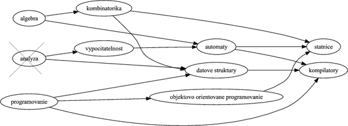
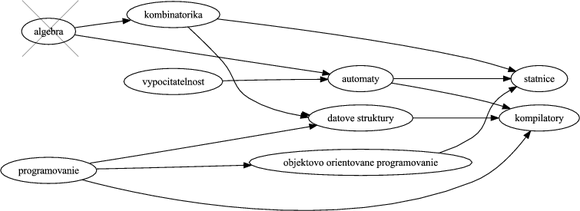
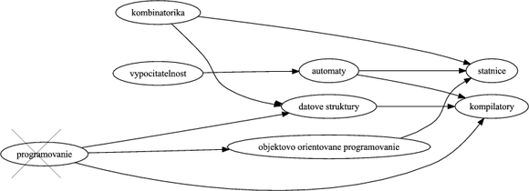
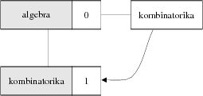
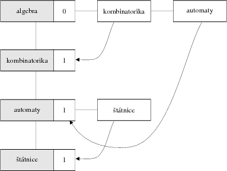
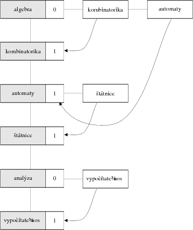
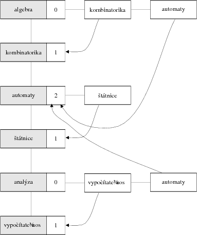
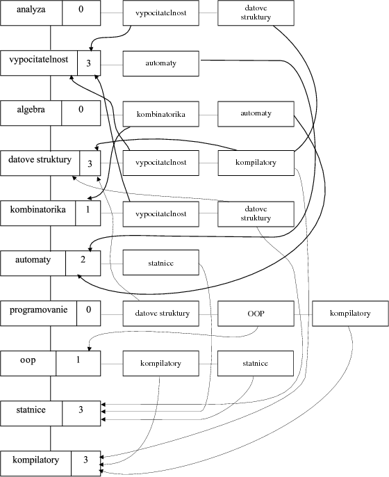

# Úvod
Moderný študent sa musí boriť s mnohými problémami. Kreditný systém používaný na univerzitách je dostatočne flexibilný, ale kladie na úbohého študenta mnohé bremená — napr. potrebu si vybrať predmety tak, aby spĺňali nielen jeho túžby a očakávania, ale aj formálne kritériá systému.

Predstavme si študijný program, čo je množina predmetov, v ktorej má každý predmet množinu „prerekvizít“. **Prerekvizita** predmetu predstavuje sadu predmetov, ktoré musí študent absolvovať predtým, než si zapíše daný predmet. (Aby sa náhodou nestalo, že študent sa objaví na predmete o kompilátoroch bez toho, aby mal základné znalosti z programovanie).

Aký postup má študent zvoliť, aby si zapisoval predmety v správnom poradí? Táto úloha sa dá riešiť veľmi elegantne pomocou algoritmu **topologického triedenia**.

Jej použitie je vhodné vo všetkých prípadoch, keď máme danú nejakú postupnosť úloh, ktoré na sebe závisia a potrebujeme určiť správne poradie ich vykonávania. Inými príkladmi je postupnosť obliekania šiat (ak si zapneme kravatu pred oblečením košele nebudeme vyzerať ktovieako príťažlivo), činnosti potrebné pri stavbe domu, alebo, aby sme spravili radosť aj Java vývojárom, zoznam vykonávania taskov v zostavovacom nástroji Ant.

# Dátová štruktúra

Ak sa vrátime k príkladu s predmetmi, tak každý rozumný program (študijný, nie počítačový...) uvádza prerekvizity predmetu v nasledovnom tvare:

* **Automaty**: Algebra, Teória vypočítateľnosti
* **Objektovo orientované programovanie**: Programovanie
* ...

Základom topologického triedenia je zvolenie vhodnej a efektívnej štruktúry, do ktorej uvedieme dáta týkajúce sa predmetov. Ak by sme si zobrali fiktívny študijný program a nakreslili si ho v podobe obrázku, dostali by sme niečo nasledovné:


Na obrázku sú jednotlivé predmety znázornené v ováloch. Ak má predmet nejakú prerekvizitu, vedie doň z danej prerekvizity šípka.

Znalci dátových štruktúr veľmi rýchlo prídu na to, že obrázok ilustruje **orientovaný graf**, kde jednotlivé predmety zodpovedajú **uzlom** a vzťah „je prerekvizitou“ je reprezentovaný orientovanou hranou. Topologické triedenie teda bude v podstate algoritmom nad orientovaným grafom. Rovnako aj dátová štruktúra nebude ničím iným než vhodnou a efektívnou reprezentáciou orientovaného grafu. Konkrétne detaily si však necháme na potom, teraz prejdeme ku všeobecnému pohľadu na algoritmus.

# Algoritmus

Samotný algoritmus nie je vôbec komplikovaný. V každom kroku odoberieme z grafu uzol, ktorý nemá predchodcov (teda do ktorého nevedú žiadne hrany) a vypíšeme ho. Inak povedané, najprv vezmeme predmety, ktoré nemajú prerekvizity, vybavíme ich a vyhodíme z grafu. Následne to isté urobíme s ďalšími predmetmi (ktoré ostali bez prerekvizít) a týmto spôsobom pokračujeme až do chvíle, kým sa nezbavíme všetkých uzlov. Uzly sú z grafu odoberané presne v topologickom usporiadaní. 

## Krok 1

Vezmime si uzly bez predchodcu: podľa obrázka sú to uzly *Algebra*, *Analýza* a *Programovanie*. Začnime ľubovoľným z nich, povedzme *Analýzou*. Vyhoďme z grafu tento uzol spolu s hranami, ktoré z neho vychádzajú a poznačme si ho.



## Krok 2

Vezmime ďalší uzol bez predchodcu, podľa nového grafu máme *Algebru* a novo uvoľnené *Programovanie* a *Vypočítateľnosť*. Vyhoďme napr. *Algebru*.



## Krok 3

Teraz máme *Programovanie* a *Vypočítateľnosť* a uvoľnenú *Kombinatoriku*. Opäť si môžeme vybrať jeden z uzlov, napr. *Programovanie*.



Takýmto spôsobom vyhadzujeme uzly až do chvíle, kým nevyhodíme posledný uzol grafu. Topologické usporiadanie potom môže byť napríklad

*Analýza*, *Algebra*, *Programovanie*, *Kombinatorika*, *Vypočítateľnosť*, *Automaty*, *Dátové štruktúry*, *Objektovo orientované programovanie*, *Štátnice* a *Kompilátory*.

Je zjavné, že topologických usporiadaní môže byť viacero —  to záleží od toho, v akom poradí vyhadzujeme uzly v prípade, že máme viacero kandidátov bez predchodcov.

Pri vyhadzovaní uzlov môže nastať aj extrémna situácia, keď na konci algoritmu neostane prázdny graf a nemáme žiaden uzol bez predchodcu. To nastáva v prípade, že graf obsahuje cykly, teda že daný predmet má prerekvizitu, ktorá priamo či nepriamo požaduje splnenie jeho samého (uznajme, že to je pre študenta značne nepríjemná situácia a pre zostavovateľov študijného programu nepríliš dobrá vizitka).

# Dátová štruktúra znovu útočí
Vráťme sa opäť k dátovej štruktúre. Podľa toho, čo sme opísali v predošlej časti, by sme mali poskytnúť ľahký a efektívny spôsob používania nasledovných operácií:

* pridanie uzla a hrany do grafu (aby sme mohli vybudovať grafovú reprezentáciu)
* detekciu uzla bez predchodcov
* odobratie uzla a hrán z neho vychádzajúcich

Na reprezentáciu grafov jestvuje množstvo prístupov — pomocou dvojíc polí, alebo maticami. My však ukážeme elegantnú štruktúru, ktorú sme statočne vykradli od pána Wirtha. V pôvodnej verzii je táto štruktúra založená na spojovom zozname, kde každým prvkom je spojový zoznam. V našej implementácii v jazyku Java však ukážeme, že to vôbec nemusí byť také komplikované.

Predovšetkým budeme udržiavať množinu všetkých uzlov v grafe. Ten však nebude len taký jednoduchý. Každý prvok bude obsahovať nielen uzol, ale aj množinu jeho nasledovníkov (v našej analógii sadu predmetov, ku ktorým je daný predmet prerekvizitou). Okrem toho bude prvok množiny obsahovať počet predchodcov (teda prerekvizít), čo nám uľahčí detekciu uzla, ktorý nemá žiadnych predchodcov.

# Algoritmus zas a znova
Samotná implementácia bude potom pozostávať z dvoch fáz: v prvej fáze vybudujeme reprezentáciu grafu a v druhej fáze vykonáme samotné vyhadzovanie uzlov a výpis.

## Budovanie grafu
Predpokladajme, že na vstupe máme dané prerekvizity v podobe dvojíc. Ak má napríklad predmet *Automaty*: prerekvizity *Algebra* a *Teória vypočítateľnosti*, na vstupe budú

```
algebra automaty
vypocitatelnost automaty
```

Budovanie grafu je potom nasledovné:

1. na začiatku majme prázdny graf, teda prázdnu množinu elementov
2. vezmime dvojicu **prerekvizita**→**predmet**
3. vezmime z grafu uzol pre *prerekvizitu*. Ak taký uzol nejestvuje, pridajme ho do grafu.
4. zistime, či existuje v grafe uzol pre *predmet*. Ak taký uzol nejestvuje, pridajme ho do grafu.
5. pridajme *predmet* do množiny nasledovníkov uzla *prerekvizity*
6. zvýšme počet predchodcov *predmet*u o jedna.
7. prejdime na krok 2.

### Príklad

Vezmime prvú dvojicu *Algebra*-*Kombinatorika*. V grafe neexistuje ani uzol pre *Algebru* ani pre *Kombinatoriku*. Vytvoríme ich teda a do množiny nasledovníkov *Algebry* dodáme *Kombinatoriku* a počet predchodcov kombinatoriky nastavíme na 1.

* *Algebra* [nasledovník: **Kombinatorika**, 0 predchodcov]
* *Kombinatorika* [nasledovník: -, **1 predchodca**]



Vezmime ďalšiu dvojicu *Algebra*-*Automaty*. V grafe poľahky nájdeme uzol pre *Algebru* a nejestvujúci uzol *Automatov* hneď vytvoríme. Do množiny nasledovníkov *Algebry* dodáme *Automaty* a počet predchodcov *Automatov* nastavíme na 1.

* *Algebra* [nasledovníci: *Kombinatorika*, **Automaty**, 0 predchodcov]
* *Kombinatorika* [nasledovník: -, 1 predchodca]
* **Automaty** [nasledovník: -, **1 predchodca**]


Ďalšou dvojicou sú *Automaty*-*Štátnice*. *Automatový* uzol existuje, *štátnicový* uzol nie, ale to hneď napravíme. Do množiny nasledovníkov *Automatov* dodáme *Štátnice* a počet predchodcov *Štátnic* nastavíme na 1.

* *Algebra* [nasledovníci: *Kombinatorika*, *Automaty*, 0 predchodcov]
* *Kombinatorika* [nasledovník: -, 1 predchodca]
* *Automaty* [nasledovník: **Štátnice**, 1 predchodca]
* **Štátnice** [nasledovník: -, **1 predchodca**]



Nasleduje pár sú *Analýza*-*Vypočítateľnosť*. Keďže v grafe nemáme ani jeden z týchto uzlov, musíme ich vytvoriť a prepojiť. Nasledovníkom *Analýzy* je *Vypočítateľnosť*, ktorej nastavíme 1 predchodcu.

* *Algebra* [nasledovníci: *Kombinatorika*, *Automaty*, 0 predchodcov]
* *Kombinatorika* [nasledovník: -, 1 predchodca]
* *Automaty* [nasledovník: *Štátnice*, 1 predchodca]
* *Štátnice* [nasledovník: -, 1 predchodca]
* **Analýza** [nasledovník: **Vypočítateľnosť**, 0 predchodcov]
* **Vypočítateľnosť** [nasledovník: -, **1 predchodca**]



Po ňom máme dvojicu *Vypočítateľnosť*-*Automaty*. V tomto prípade netreba vytvárať žiadne uzly, keďže ich už v grafe máme. Do množiny nasledovníkov *Vypočítateľnosti* pridáme *Automaty* a *Automatom* zvýšime počet predchodcov o 1.

* *Algebra* [nasledovníci: *Kombinatorika*, *Automaty*, 0 predchodcov]
* *Kombinatorika* [nasledovník: -, 1 predchodca]
* *Automaty* [nasledovník: *Štátnice*, **2 predchodcovia**]
* *Štátnice* [nasledovník: -, 1 predchodca]
* *Analýza* [nasledovník: *Vypočítateľnosť*, 0 predchodcov]
* *Vypočítateľnosť* [nasledovník: **Automaty**, 1 predchodca]



Takto budujeme graf až do chvíle, kým nespracujeme všetky dvojice na vstupe.

Výsledný graf vyzerá je na nasledovnom obrázku (na seminári z programovania mal tento graf kódové označenie hydra...):



## Topologické triedenie

Po vybudovaní grafovej reprezentácie je samotný algoritmus malina. 

1. nájdime v grafe uzol bez predchodcov, vypíšme ho. Ak uzol nejestvuje, končíme.
2. prejdime množinu jeho nasledovníkov. Každému nasledovníkovi znížme počet predchodcov o 1...
3. ... pretože tento uzol bez predchodcov z grafu vyhodíme.
4. prejdime na krok 1.

To presne zodpovedá idey algoritmu spomenutej vyššie. Všimnime si, že naša štruktúra naozaj ľahko umožňuje realizovať oba kroky — uzol bez predchodcov nájdeme jednoduchým prejdením prvkov množiny a množinu jeho nasledovníkov máme na každom uzle tiež priamo k dispozícii.

# Implementácia v Jave

Implementácia prvku v Jave pozostáva z priamočiareho prepisu vyššie uvedeného algoritmu.

Budeme však potrebovať navrhnúť dátovu štruktúru. Vytvorme si triedu uzla, ``Node``, ktorý obsahuje popisok, množinu nasledovníkov (v podobe triedy ``java.util.Set`` a implementácie ``java.util.HashSet``) a počet predchodcov. Kvôli jednoduchosti si dodáme metódy na zvýšenie a zníženie počtu predchodcov.

```java
public class Uzol {
  // popisok uzla
  private String nazov;
  
  // množina nasledovníkov
  private Set<Uzol> nasledovníci = new HashSet<Uzol>();
  
  // počet predchodcov
  private int početPredchodcov;
  
  // konštruktor
  public Uzol(String nazov) {
    this.nazov = nazov;
  }

  // pridaj medzi nasledovníkov daný uzol
  public void pridajNasledovníka(Uzol uzol) {
    this.nasledovníci.add(uzol);
  }

  // zvýši počet predchodcov o 1
  public void zvýšPočetPredchodcov() {
    this.početPredchodcov++;
  }

  // zníži počet predchodcov o 1
  public void znížPočetPredchodcov() {
    this.početPredchodcov--;    
  }
  
  // .. gettre a settre
}
```

Samotné topologické triedenie bude vykonávať trieda ``TopologicalSort``. Jej základom bude množina uzlov.

```
public class TopologickeTriedenie {
  private Set<Uzol> uzly = new HashSet<Uzol>();
}
```

## Budovanie grafu

Najprv implementujme metódu na pridanie dvojice do grafu:

```java
  public void pridajDvojicu(String prerekvizita, String predmet) {
    // nájdi v grafe prvý uzol
    Uzol uzolPrerekvizity = hľadajPodľaNázvu(prerekvizita);
    // ak prvý uzol nejestvuje, vytvor ho a pridaj do grafu
    if(uzolPrerekvizity == null) {
      uzolPrerekvizity = new Uzol(prerekvizita);
      uzly.add(uzolPrerekvizity);
    }
    // nájdi v grafe druhý uzol
    Uzol uzolPredmetu = hľadajPodľaNázvu(predmet);
    // ak druhý uzol nejestvuje, vytvor a pridaj ho do grafu
    if(uzolPredmetu == null) {
      uzolPredmetu = new Uzol(predmet);
      uzly.add(uzolPredmetu);
    }
    // pridaj prerekvizite nasledovníka
    uzolPrerekvizity.pridajNasledovníka(uzolPredmetu);
    // nasledovníkovi zvýš počet predchodcov o 1
    uzolPredmetu.zvýšPočetPredchodcov();
  }
```

Metóda ``hľadajPodľaNázvu()`` nájde v grafe uzol s daným popiskom. Ak taký uzol nejestvuje, vráti ``null``.

```java
protected Uzol hľadajPodľaNázvu(String nazov) {
  // prechádzame uzly
  for (Uzol uzol : uzly) {
    // ak sme našli uzol, končíme
    if(uzol.getNazov().equals(nazov)) {
      return uzol;
    }
  }
  // uzol sme nenašli, vraciame null
  return null;
}
```

## Topologické triedenie

Metóda pre topologické triedenie je jednoduchá:

```java
public void topologickeTriedenie() {
  Uzol uzolBezPredkov = null;
  while((uzolBezPredkov = hľadajUzolBezPredkov()) != null) {
    System.out.println(uzolBezPredkov);
    odstráňUzol(uzolBezPredkov);     
  }
  if(!uzly.isEmpty()) {
    throw new IllegalStateException("V grafe sú cykly.");
  }
}
```

Metóda ``hľadajUzolBezPredkov()`` slúži na nájdenie uzla bez predchodcov. Ako sme spomínali vyššie, stačí prejsť množinu uzlov a hľadať ten, ktorý má v príslušnej inštančnej premennej 0.

```java
protected Uzol hľadajUzolBezPredkov() {
  for (Uzol uzol : uzly) {
    if(uzol.getPočetPredchodcov() == 0) {
      return uzol;
    }
  }
  return null;
}
```

Ak taký uzol nájdeme, vyhodíme ho metódou ``odstráňUzol()``. Tá sa postará o zrušenie uzlu z grafu (stačí ho vyhodiť z množiny uzlov) a o aktualizáciu počtu predchodcov u nasledovníkov.

```java
protected void odstráňUzol(Uzol node) {
  // vyhoďme uzol z množiny uzlov v grafe
  uzly.remove(node);
  // pre každého nasledovníka zníž počet predchodcov
  for (Uzol nasledovník: uzol.getNasledovníci()) {
    nasledovník.znížPočetPredchodcov();
  }
}
```

Samotné spustenie programu je jednoduché. Dáta môžeme načítavať z textového súboru pomocou triedy ``java.util.Scanner``. Postupne ich pridáme do grafu a na záver zavoláme metódu ``topologicalSort``.

```java
public static void main(String[] args) throws FileNotFoundException {
  TopologickeTriedenie topologickeTriedenie = new TopologickeTriedenie();

  Scanner scanner = new Scanner(new File("vstup.txt"));
  while(scanner.hasNextLine()) {
    String line = scanner.nextLine();
    String[] items = line.split(" ");
    if(items.length != 2) {
      System.err.println("Nedostatok dát na riadku: \n  " + line);
    }
    topologickeTriedenie.pridajDvojicu(items[0], items[1]);
  }
  topologickeTriedenie.topologickeTriedenie();
}
```