# Zavádzame internet

Predstavte si, že ste šéfom spoločnosti, ktorá získala balík peňazí na prepojenie slovenských krajských miest internetom s použitím optickej linky. Jednou z najdôležitejších vecí, ktorá vás bude zaujímať, je celková dĺžka káblov, ktoré budete musieť zaviesť medzi mestami. Asi veľmi rýchlo si všimnete, že káblom netreba prepojiť každé s každým mestom. (Nemusíte teda prepájať Košice s Bratislavou priamo, stačí zaviesť kábel do Banskej Bystrice a z nej do Bratislavy). Aký spôsob zvoliť na nájdenie optimálneho prepojenia?

Od subdodávateľa sme získali mapu Slovenska s krajskými mestami a vzdialenosťami medzi nimi. (Pre jednoduchosť udávame vzdialenosti v desiatkach kilometrov.)

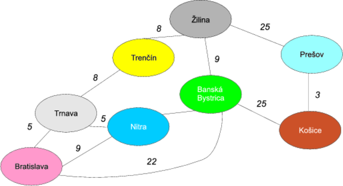

# Grafy na pomoc!
Absolventi diskrétnej matematiky hneď uvidia v obrázku matematickú štruktúru zvanú **graf**. Jednotlivé mestá (ovály) zodpovedajú **uzlom** a čiary natiahnuté medzi nimi **hranám**. Tento graf je ohodnotený (keďže hrany majú váhy zodpovedajúce vzdialenostiam medzi uzlami) a neorientovaný (čiara medzi Bratislavou a Trnavou znamená, že sa vieme dostať aj jedným aj druhým smerom).

Zavádzanie najlacnejšieho internetu znamená, že musíme zabezpečiť, aby do každého mesta viedol kábel a aby celkový súčet dĺžok káblov medzi mestami bol najmenší možný. Jedným z optimálnych riešení je nasledovná možnosť:

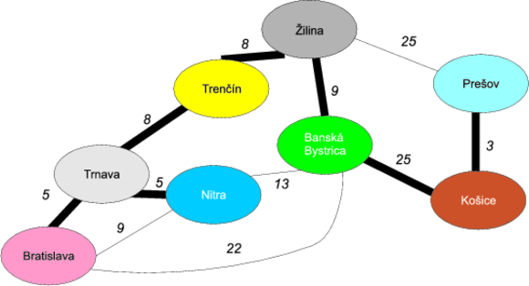

V ňom je celková dĺžka kábla je 5 + 5 + 8 + 8 + 9 + 25 + 3 = 63, teda 630 kilometrov kábla. Ako sme na to prišli?

# Kostry, kostry, kostričky

To, čo sme ukázali na predošlom obrázku, sa nazýva **minimálna kostra grafu**. **Kostra grafu** je tvorená hranami a vrcholmi pôvodného grafu (je teda **podgrafom**), pričom sú v nej zahrnuté všetky vrcholy pôvodného grafu. Dôležitou vlastnosťou kostry je to, že je to **strom**, teda nemôže sa stať, že z jedného uzlu vyjdeme jedným smerom a vieme sa doňho vrátiť po inej hrane (inak povedané v strome nie sú cykly). Ak sa pozrieme na obrázok, je vidieť, že kostier v grafe môže byť viacero. Príklad jednej kostry máme na obrázku. Daľším príkladom, ktorý môžeme nazvať **plánom diaľnicoe D1** je prepojenie Bratislavy s Košicami cez Trnavu, Trenčín, Žilinu a Prešov s odbočkami Trnava-Nitra a Žilina-Banská Bystrica.

**Minimálna kostra** ohodnoteného grafu je taká kostra, ktorá má najmenší možný súčet váh hrán.

Predošlý obrázok ukazuje presne minimálnu kostru. Ako sme ju však vytvorili?

Na nájdenie minimálnej kostry ohodnotené grafu existujú hneď tri algoritmy: Jarníkov-Primov-Dijkstrov, Kruskalov a Borůvkov-Sollinov algoritmus. My si ukážeme použitie Kruskalovho algoritmu.

## Kruskalov algoritmus

Ten je pomerne jednoduchý:

1. Vezmime v grafe hranu s najmenšou váhou a zvýraznime ju. 
2. Hrana však nesmie po zvýraznení tvoriť cyklus (uzavretú cestu) s inými zvýraznenými hranami.
3. Ak hrany zvýraznené hrany spájajú všetky vrcholy, končíme. Inak prejdeme na krok 1.

Ukážme si to na príklade obrázku.

# Príklad
## Iterácia 1
Hrana s najmenšou váhou je cesta medzi Košicami a Prešovom (30 km), teda zvýrazníme ju.

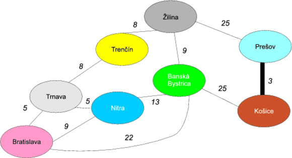

## Iterácia 2
Ďalej máme dve hrany s váhou 5: medzi Bratislavou a Trnavou a Trnavou a Nitrou.
Vyberme si napríklad Bratislavu-Trnavu a zvýraznime ju.

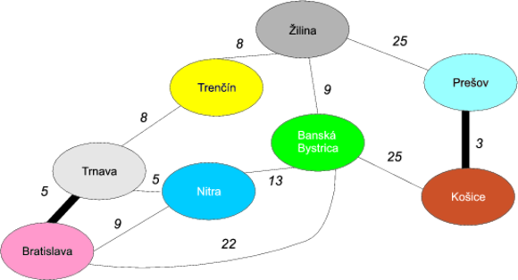

## Iterácia 3
Vezmime ďalšiu hranu s váhou 5 medzi Trnavou a Nitrou a zvýraznime ju.

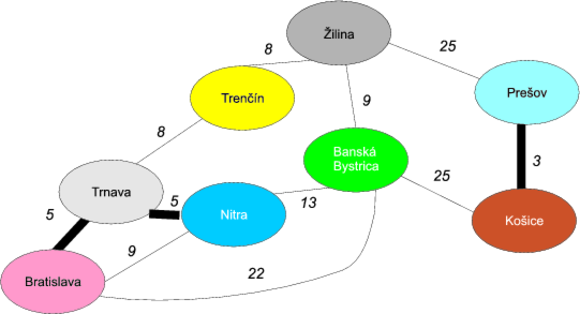

## Iterácia 4
Hrana s najmenšou váhou je osmičková. Máme opäť dve možnosti na výber: medzi Trnavou a Trenčínom a Trenčínom a Žilinou. Vyberme si Trenčín-Žilina.

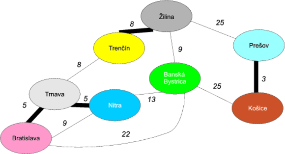

## Iterácia 5
Vezmime ďalšiu hranu váhou 8, medzi Trnavou a Trenčínom.

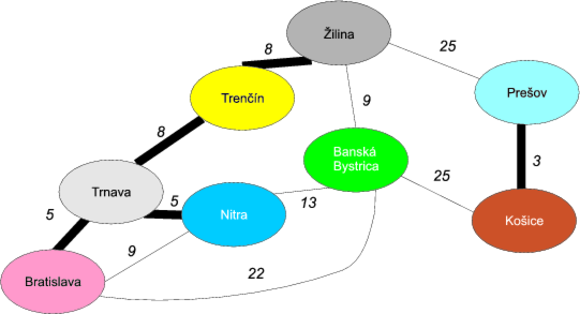

## Iterácia 6
Ďalšia minimálna hrana má váhu 9 a zase máme dve možnosti: Bratislavu-Nitru a Žilinu-Banskú Bystricu. Bratislava-Nitra však nepripadá do úvahy, pretože by sme si vytvorili cyklus Bratislava-Trnava-Nitra-Bratislava, čo by porušilo vlastnosť kostry. Preto nám ostáva len druhá možnosť.


## Iterácia 7
Ďalšia hrana má dĺžku 13. Jej výber však opäť nie je korektný, keďže by sme získali cyklus Trnava-Trenčín-Nitra-Žilina-Bystrica-Nitra. Túto hranu teda preskočíme.

Nasledovnou hranou je Bratislava-Banská Bystrica dĺžky 22. Tá je však opäť ilegálna, keďže by sme mali cyklus Bratislava-Trnava-Trenčín-Žilina-Banská Bystrica-Bratislava.

Ostávajú nám dve hrany dĺžky 25: Žilina-Prešov a Banská Bystrica-Košice.

Vyberme si košickú vetvu:


Posledná nespracovaná hrana Žilina-Prešov už neprichádza do úvahy, keďže by vytvorila cyklus Žilina-Prešov-Košice-Banská Bystrica.

Algoritmus teda končí.

# Ako zisťovať cykly?

Vidíme, že algoritmus je jednoduchý a naprogramovať ho by nebol problém. Otázka ale je, ako detegovať, či skúmaná hrana nevytvorí cyklus. Na detekciu cyklov by sa dalo použiť napríklad jedno z prehľadávaní grafu (do šírky alebo do hĺbky), ale je lepšie použiť trik spomínaný v literatúre.

Na začiatku vytvoríme toľko „zárodkov" stromov, koľko máme vrcholov (pričom každý strom bude na začiatku tvorený jediným vrcholom.) Ak odobratá hrana v algoritme prepojí dva uzly v rôznych stromoch, tieto dva stromy spojíme do jedného. Ak spája dva uzly v rovnakom strome, nerobíme nič, pretože by to znamenalo cyklus. Ukážme si to na príklade, v ktorom jednotlivé stromy budú farebne odlíšené.

# Príklad

## Iterácia 1
Hrana s najmenšou váhou je cesta medzi Košicami a Prešovom (30 km), teda zvýrazníme ju. Keďže hrana prepája dva rôzne stromy, zlúčime ich do jedného.

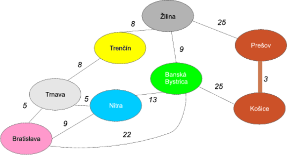

## Iterácia 2
Ďalej vybavíme hranu Bratislava-Trnava, ktorá opäť prepája dva rôzne stromy, ktoré zlúčime.

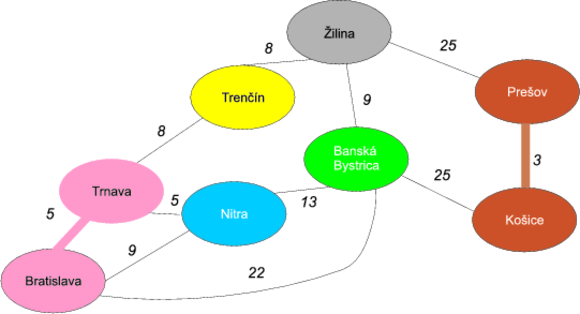

## Iterácia 3
Vezmime ďalšiu hranu s váhou 5 medzi Trnavou a Nitrou a prepojme oba stromy.

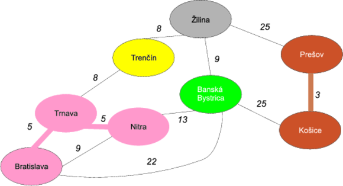

## Iterácia 4
Vezmime osmičkovú hranu Trenčín-Žilina a zlúčme ich do žltého stromu.

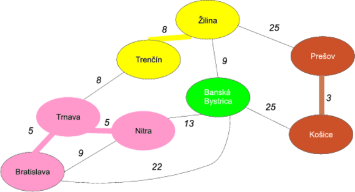

## Iterácia 5
Vezmime ďalšiu hranu váhou 8, medzi Trnavou a Trenčínom. Opäť zlúčime dva stromy: žltý a ružový do jedného ružového.

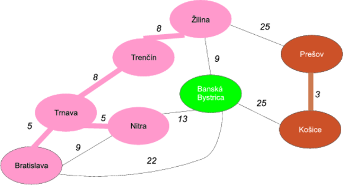

## Iterácia 6
Ďalšia minimálna hrana má váhu 9 a zase máme dve možnosti: Bratislavu-Nitru a Žilinu-Banskú Bystricu. Uzly Bratislava a Nitra však majú rovnakú farbu a teda by vytvorili cyklus. Preto nám ostáva len druhá možnosť.

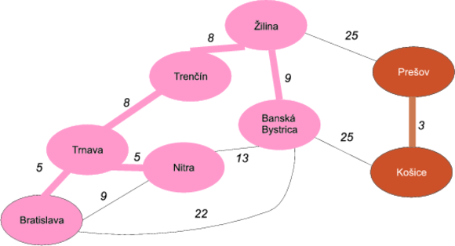

## Iterácia 7
Ďalšia hrana má dĺžku 13 (Nitra-Banská Bystrica). Tá je však opäť medzi uzlami v rovnakom strome (teda rovnakej farby), preto nie je povolená. To isté je prípad Bratislava-Banská Bystrica dĺžky 22.

Ostávajú nám dve hrany dĺžky 25: Žilina-Prešov a Banská Bystrica-Košice.

Vyberme si košickú vetvu a zlúčme oba stromy. Tým sme ukončili algoritmus, keďže sme pokryli všetky uzlami (všetky ostatné hrany vedú medzi uzlami rovnakej farby, teda z rovnakého podstromu.)

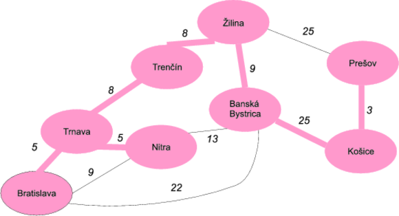

# Poznámky k algoritmu
Tento algoritmus sa nazýva **pažravým** (greedy), keďže sa v každej iterácii snaží zobrať hranu, ktorá je preňho najvýhodnejšia.

Pažravý prístup však vo všeobecnosti nemusí byť ideálny — predstavte si, že vám niekto dá na výber: buď dostanete tento mesiac 100€ a o ďalší mesiac 500€ alebo dostanete teraz 500€ a budúci mesiac 2000€.
Čo by ste si vybrali? Pažravý algoritmus by si vybral samozrejme 100€ hneď teraz (aj keď je to z celkového hľadiska nevýhodné). V prípade Kruskalovho algoritmu sa však dá dokázať, že takýto nevýhodný prípad nikdy nenastane a teda, že pažravý prístup je efektívny.


# Implementácia v Jave
Implementácia v Jave je opäť jednoduchá, dôležité je si ale premyslieť dátové štruktúry, ktoré budú použité.

Predovšetkým definujeme triedu pre hranu `Edge`, ktorá bude obsahovať dva uzly (reprezentované ako reťazce) a váhu.

```java
public class Edge {
  // uzol 1
  private String node1;

  // uzol 2
  private String node2;

  // váha
  private int weight;

  public Edge(String node1, String node2, int weight) {
    super();
    this.node1 = node1;
    this.node2 = node2;
    this.weight = weight;
  }

  // gettre a settre

  @Override
  public String toString() {
    return node1 + "--" + node2 + " [" + weight + " ]";
  }
}
```

Ďalej si vytvoríme triedu `SpanningTree`, ktorá bude obsahovať operácie na pridanie hrán a na nájdenie minimálnej kostry. Predovšetkým vyvstáva otázka, kde budeme uchovávať zoznam hrán. Vystačili by sme si s klasickým zoznamom `java.util.List`, kde by sme hranu s najmenšou váhou našli pomocnou metódou, ktorá by prešla zoznam a vrátila požadovaný prvok.

V jave však môžeme použiť špeciálny prípad zoznamu — **prioritný front** (implementácia `java.util.PriorityQueue`), čo je front, ktorý automaticky usporiadava hrany na základe požadovaného kritéria. Toto kritérium môžeme ustanoviť implementáciou interfejsu `java.util.Comparator`, ktorá umožňuje vzájomne porovnať dve inštancie hrán. V našom prípade platí, že hrana je „menšia“ ako iná hrana, ak má menšiu váhu.

```java
public static class EdgeByWeightComparator implements Comparator<Edge> {

    public int compare(Edge edge1, Edge edge2) {
      // vezmeme obe hrany a porovnáme ich pomocou metódy java.lang.Integer
        return new Integer(edge1.getWeight())
              .compareTo(edge2.getWeight());
    }

}
```

Prioritný front potom deklarujeme v triede `SpanningTree` nasledovne:
```java
private PriorityQueue<Edge> edges 
  = new PriorityQueue<Edge>(10, new EdgeByWeightComparator());
```
Prvý parameter udáva iniciálnu kapacitu fronty a druhý parameter ustanovuje usporiadané určené komparátorom.

Ako budeme reprezentovať naše stromy (v príklade majúce samostatnú farbu?)  Pre každý uzol v grafe si môžeme pamätať množinu uzlov s rovnakou farbou. Vieme si teda urobiť mapovanie z uzlov do množín uzlov, čiže
```java
private Map<String, Set<String>> mapping 
  = new HashMap<String, Set<String>>();
```
Napríklad v treťom kroku algoritmu budeme mať v mape:

```
Bratislava  => {Bratislava, Trnava, Nitra}
Prešov      => {Prešov, Košice}
Trenčín     => {Trenčín}
Žilina      => {Žilina}
B. Bystrica => {B. Bystrica}
```

## Pridávanie hrán
Metóda na pridanie hrany bude pozostávať z troch krokov:
1. pridanie hrany do prioritného frontu
2. vytvorenie stromu pre prvý vrchol. Tento strom obsahuje zatiaľ len prvý vrchol.
3. vytvorenie stromu pre druhý vrchol. Tento strom obsahuje zatiaľ len druhý vrchol.

```java
public void addPair(String node1, String node2, int weight) {
  // vytvor hranu
  Edge edge = new Edge(node1, node2, weight);
  // pridaj ju do prioritného frontu
  edges.add(edge);
  // pridaj dvojicu node1 => {node1}
  mapping.put(node1, 
    new HashSet<String>(Collections.singleton(node1)));
  // pridaj dvojicu node2 => {node2}
  mapping.put(node2, 
    new HashSet<String>(Collections.singleton(node2)));
}
```

## Hľadanie minimálnej kostry
Hľadanie minimálnej kostry potom spočíva v prejdení prvkov prioritnej fronty (tá je usporiadaná podľa váh hrán). Pre každú hranu sa pozrieme do stromu prvého uzla a do stromu druhého uzla. Ak sú množiny uzlov rovnaké, znamená to, že uzly sú v rovnakom strome (podľa nášho príkladu majú rovnakú farbu) a teda hrana medzi nimi by utvorila cyklus. 

V opačnom prípade vezmeme všetky uzly zo stromu druhého uzla a pridáme ich medzi uzly stromu druhého uzla. To je jednoduchá množinová operácia (keďže stromy reprezentujeme ako množiny).

```java
public Set<Edge> getSpanningTree() {
  // výsledná množina hrán kostry
  Set<Edge> spanningTreeEdges = new HashSet<Edge>();
  // hrany získavame v správnom poradí
  for (Edge edge : edges) {
    // množina uzlov v strome prvého uzla
    Set<String> tree1Nodes = mapping.get(edge.getNode1());
    // množina uzlov v strome prvého uzla
    Set<String> tree2Nodes = mapping.get(edge.getNode2());

    if(tree1Nodes.equals(tree2Nodes)) {
      // množina uzlov v prvom strome je rovnaká
      // ako množina uzlov v druhom strome,
      // hranu preskočíme
    } else {
      // vezmeme všetky uzly zo stromu
      // druhého uzla a presunieme ich medzi uzly stromu druhého uzla.
      tree1Nodes.addAll(tree2Nodes);
      tree2Nodes.clear();

      spanningTreeEdges.add(edge);
    }
  }
  return spanningTreeEdges;
}
```

