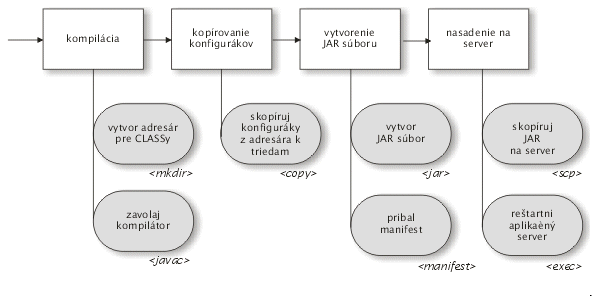

# Čo je Ant?
[Apache Ant](http://ant.apache.org) je zostavovací nástroj založený na technológiách Javy. Jeho filozofia je veľmi podobná ideám z linuxového nástroja
`make`. Na rozdiel od tohto nástroja však Ant používa XML syntax a je platformovo nezávislý.

Ant zjednodušuje nudné a často opakované procesy prebiehajúce pri zostavovaní softvéru.
Typickým komplexným príkladom zostavovacieho procesu je cyklus „uprav – skompiluj – pribaľ serverovské konfiguráky – vyrob JAR – skopíruj na server“, ktorý je v manuálnom vykonávaní náchylný na chyby.

Ant umožňuje definovať rozdeliť zostavovanie na niekoľko (čiastkových) cieľov (**targets**), pričom na dosiahnutie každého cieľa je možné použiť niekoľko
preddefinovaných príkazov (zvaných **tasks** (*úlohy*, budeme však používať paslovenský termín *tasky*). Samotné jednotlivé ciele môžu byť navzájom
poprepájané závislosťami.

Nasledovný obrázok ukazuje štyri ciele, ktoré na sebe závisia. Každý z cieľov používa niekoľko taskov – napr. cieľ *vytvor JAR súbor* používa task
`jar` (pomocou ktorého je možné deklaratívne vytvoriť JAR súbor).



Celá deklarácia cieľov a používaných taskov je realizovaná pomocou XML (príkladov sa dočkáme nižšie). Samotný Ant ponúka značné množstvo preddefinovaných
taskov a mnohé ďalšie tasky sú k dispozícii od tretích strán. V prípade potreby nie je problém si vytvoriť v Jave vlastné tasky.

#  Inštalácia Antu na Windowse
1.  stiahneme inštalačný ZIP súbor zo stránok
1.  rozbalíme ho do vhodného adresára (napr. `C:\java\ant`)
1.  `bin` adresár pridáme do systémovej premennej `PATH` (napr. `C:\java\ant\bin`)
1.  vytvoríme systémovú premennú `ANT_HOME` a nastavíme ju do adresára, kde je nainštalovaný Ant (napr. `C:\java\ant`).
1.  pre istotu skontrolujeme, či je nastavená systémová premenná `JAVA_HOME` ukazujúca do adresára, kde je nainštalovaná JDK

#  Začíname s Antom
Voľne podľa originálu: http://ant.apache.org/manual/index.html

Tento dokument predstavuje sprievodcu, ktorý vás prevedie úvodom
do práce so zostavovacím nástrojom Ant. Nevyžadujú sa žiadne
hlbšie znalosti práce s Javou či Antom. Cieľom tohto tutoriálu
je demonštrovať základné postupy pri práci s Antom.

## Príprava projektu (bez Antu)
Predstavme si, že sme v situácii, keď nemáme po ruke žiadne integrované vývojové prostredie (teda žiadny Eclipse, NetBeans a pod.). Založenie projektu z
príkazového riadku si vyžaduje niekoľko krokov. Predovšetkým by sme chceli mať oddelené zdrojové kódy od skompilovaných `class` súborov. Súbory `.java`
teda uložíme do adresára `src`. Všetky vygenerované súbory budeme ukladať do adresára `build`, ktorý bude ďalej rozdelený na niekoľko podadresárov
určených pre výsledky zostavovania: adresár `classes` bude obsahovať skompilované súbory a `jar` výsledný JAR súbor.

Najprv vytvoríme adresár `src`
```
md src
```
Nasledovná jednoduchá trieda vypíše správu na štandardný výstup. Zdrojový
kód uložíme do adresára `src\oata\AhojSvet.java`

```java
package oata;

public class AhojSvet {
  public static void main(String[] args) {
    System.out.println("Ahoj svet!");
  }
}
```
Triedu sa pokúsime skompilovať a spustiť:
```
md build\classes
javac -sourcepath src -d build\classes src\oata\AhojSvet.java
java -cp build\classes oata.AhojSvet
```
čím získame výpis textu
```
Ahoj svet!
```
Vytvorenie súboru JAR nie je náročné. Ale vytvorenie spustiteľného JAR súboru 
vyžaduje niekoľko krokov navyše:

* vytvorenie *manifestu*, čo je konfiguračný súbor obsahujúci názov hlavnej spustiteľnej triedy
* vytvorenie cieľového adresára pre JAR súbor
* vytvorenie samotného JAR súboru, ktorý bude obsahovať súbory s triedami
```
echo Main-Class: oata.AhojSvet>manifest.txt
md build\jar
jar cfm build\jar\ahojsvet.jar manifest.txt -C build\classes .
java -jar build\jar\ahojsvet.jar
```
*Pozn.* Okolo znaku `>` v príkaze `echo Main-Class` nesmú byť medzery. V opačnom prípade 
sa táto direktíva nezapíše do súboru správne!

## Štyri kroky pre spustenie aplikácie
V predošlom príklade sme vlastne zrealizovali zostavovací proces pozostávajúci zo štyroch krokov.
Naše zdrojáky sme museli *skompilovať*, inak by sme náš program nespustili. *Spustenie*, to
je ďalší krok. Okrem toho je užitočné našu aplikáciu pred uvoľnením do sveta *pripraviť na distribúciu*.
V našom prípade by sme mohli distribuovať len samotný `class` súbor. Ale ak by naša aplikácia
mala množstvo tried, a ešte vyžadovala súbory so závislosťami, užívateľov by nepotešilo, ak
by museli ručne ťahať stovky súborov. (Povedzme, že máme zložitú aplikáciu so swingovským grafickým 
rozhraním - JAR súbor je v tomto prípade priam nutnosťou. A spustiteľný JAR súbor by veci
zjednodušil ešte viac...). Je viac než užitočné, aby sme v našom zostavovacom procese
mali možnosť začať vždy s čistým štítom - teda vymazať všetky skompilované súbory, vygenerované JAR
archívy a pod. 

V Ante sa jednotlivé kroky zostavovacieho procesu (*build process*) nazývajú *cieľmi* (*targets*).
V príklade by sme mali teda štyri kroky:

* `clean` -- vymazanie adresára s výstupmi
* `compile` -- skompilovanie zdrojákov
* `jar` -- vytvorenie JAR súboru
* `run` -- spustenie aplikácie

Ciele sa v Ante definujú v zostavovacom súbore, ktorý sa štandardne volá `build.xml`. Vytvoríme
si teda tento súbor a uložíme ho do `.\build.xml`.
```xml
<project>

  <target name="clean">
    <delete dir="build"/>
  </target>

  <target name="compile">
    <mkdir dir="build/classes"/>
    <javac srcdir="src" destdir="build/classes"/>
  </target>

  <target name="jar">
    <mkdir dir="build/jar"/>
    <jar destfile="build/jar/ahojsvet.jar" basedir="build/classes">
       <manifest>
          <attribute name="Main-Class" value="oata.AhojSvet"/>
          </manifest>
    </jar>
  </target>

  <target name="run">
    <java jar="build/jar/HelloWorld.jar" fork="true"/>
  </target>

</project>
```
Skompilovať, zabaliť a spustiť aplikáciu môžeme pomocou
```
ant compile
ant jar
ant run
```
alebo na jeden riadok
```
ant compile jar run
```

Ak sa pozrieme na zostavovací súbor, hneď uvidíme podobnosť
medzi direktívami Antu a krokmi, ktoré sme vykonávali z príkazového riadku.

### Vytvorenie adresárov

```
md build\classes
```
zodpovedá príkazu
```xml
<mkdir dir="build/classes"/>
```
**Pozn.** Príkazy sa v Ante nazývaju *úlohami* (t*asks*).

### Kompilácia
Proces kompilácie, ktorý z príkazového riadku dosiahneme cez:

```
javac
  -sourcepath src
  -d build\classes
  src\oata\HelloWorld.java
```
(celý príkaz musí byť na jednom riadku!) je možné dosiahnuť taskom `javac`.
```xml
<javac
  srcdir="src"
  destdir="build/classes"/>
```
Všimnime si, že task `javac` automaticky detekuje všetky triedy, ktoré
treba prekompilovať. Nie je nutné explicitne vymenovávať zdrojové súbory tried.

Vytvorenie `manifest`u vyzeralo 
```
echo Main-Class: oata.AhojSvet>mf
```
čo možno nakonfigurovať neskôr vo fáze vytvárania JAR súboru.

### Vytvorenie JAR súboru
To prebiehalo predtým pomocou:

```
md build\jar
jar cfm
    build\jar\HelloWorld.jar
    mf
    -C build\classes
    .
```
(Celý príkaz je na jednom riadku!) V Ante použijeme na to príslušnú dvojicu taskov
```xml
<mkdir dir="build/jar"/>
<jar
  destfile="build/jar/ahojsvet.jar"
  basedir="build/classes">
  <manifest>
    <attribute name="Main-Class" 
               value="oata.AhojSvet"/>
  </manifest>
</jar>
```
Task `jar` uloží do súboru nastaveného v `destfile` všetky súbory v adresári nastavenom v `basedir`.

### Spustenie
Záverečné spustenie, ktoré z príkazového riadku prebehlo cez

```
java -jar build\jar\HelloWorld.jar
```
je možné zrealizovať cez
```xml
<java jar="build/jar/ahojsvet.jar" fork="true"/>
```

## Vylepšenie zostavovacieho súboru
Podarilo sa nám vytvoriť prvý funkčný zostavovací súbor. Ale je tu samozrejme množstvo
priestoru na vylepšenie. Častokrát sa stáva, že je potrebné sa odkazovať
na jeden a ten istý adresár na viacerých miestach, špecifikovať názvy výstupných
adresárov a súborov. Zatiaľ sme ich špecifikovali „natvrdo" ako konštanty, čo však nemusí byť
vždy ideálny stav. 

Ďalším nedostatkom nášho súboru je nutnosť pamätať si správne poradie zostavovacích krokov.

Prvý nedostatok odstránime pomocou tzv. *properties* (*parametrických hodnôt*).
Poradie cieľov je možné vyriešiť pomocou závislostí.

```xml
<project name="ahojsvet" basedir="." default="main">

  <property name="src.dir"     value="src"/>

  <property name="build.dir"   value="build"/>
  <property name="classes.dir" value="${build.dir}/classes"/>
  <property name="jar.dir"     value="${build.dir}/jar"/>

  <property name="main-class"  value="oata.AhojSvet"/>

  <target name="clean">
    <delete dir="${build.dir}"/>
  </target>

  <target name="compile">
    <mkdir dir="${classes.dir}"/>
     <javac srcdir="${src.dir}" destdir="${classes.dir}"/>
  </target>

  <target name="jar" depends="compile">
    <mkdir dir="${jar.dir}"/>
    <jar destfile="${jar.dir}/${ant.project.name}.jar" 
         basedir="${classes.dir}">
         
      <manifest>
        <attribute name="Main-Class" value="${main-class}"/>
      </manifest>
      
    </jar>
  </target>

  <target name="run" depends="jar">
    <java jar="${jar.dir}/${ant.project.name}.jar" fork="true"/>
  </target>

  <target name="clean-build" depends="clean,jar"/>

  <target name="main" depends="clean,run"/>
  
</project>
```

### Premenné

V elemente `project` pribudlo niekoľko elementov:

* `name="ahojsvet"` špecifikuje názov projektu.
* `basedir="."` určuje základný adresár, od ktorého sa budú odvíjať relatívne cesty. V tomto prípade je ním adresár, z ktorého sa spustí zostavovací proces
* `default="main"` uvádza, že implicitným cieľom bude cieľ `main`. Ak 
pri spúšťaní Antu neuvedieme žiadny cieľ, automaticky sa spustí implicitný cieľ.

Ďalej sme špecifikovali niekoľko `properties`, čo je vlastne analógia premenných
```xml
<property name="build.dir"   value="build"/>
<property name="classes.dir" value="${build.dir}/classes"/>
<property name="jar.dir"     value="${build.dir}/jar"/>
```
Všimnime si, že v hodnotách premenných sa môžeme odkazovať na hodnoty
už existujúcich premenných. Premenná `jar.dir` teda bude
obsahovať hodnotu `build/jar`.

V samotnom `build.xml` už existuje niekoľko preddefinovaných premenných.
Napr. `${ant.project.name}` obsahuje názov projektu z atribútu
`name` v elemente `project`.

### Závislosti

Splnenie každého z cieľov môže vyžadovať úspešné splnenie iných cieľov.
Napr. vytvorenie JAR súboru závisí na úspešnom skompilovaní zdrojákov.
Závislosti možno udávať pomocou atribútu `depends` v elemente `target`.

Cieľ `main` závisí na postupnom úspešnom skončení cieľov `clean` a `run`.
```xml
<target name="main" depends="clean,run"/>
```

### Spustenie

Ak teraz spustíme

```
ant
```
získame nasledovný výpis:
```
Buildfile: build.xml

clean:

compile:
    [mkdir] Created dir: C:\...\build\classes
    [javac] Compiling 1 source file to C:\...\build\classes

jar:
    [mkdir] Created dir: C:\...\build\jar
      [jar] Building jar: C:\...\build\jar\ahojsvet.jar

run:
     [java] Ahoj svet!

main:

BUILD SUCCESSFUL
```

## Používanie externých knižníc v projekte
Váš šéf sa jedného dňa rozhodol zakázať používanie `System.out.println()`
a určil, že na ladiace výpisy sa bude používať niektoré z existujúcich
knižníc. (Výhoda takéhoto postupu je napr. možnosť filtrovať výpisy
podľa dôležitosti alebo úplne vypnutie výpisu, čo `System.out` nedovoľuje.)

V príklade budeme používať [Log4j](http://logging.apache.org/log4j/), pretože

* nie je súčasťou JDK a hoci by sme mohli použiť `java.util.logging`, neurobíme to, pretože chceme demonštrovať externé knižnice
* beží aj pod JDK 1.2 (podobne ako Ant)
* má široké možnosti konfigurovania
* je od Apache-a ;-)

V našom projekte budeme ukladať externé knižnice do nového adresára `lib`.
Log4j je možné stiahnuť z [domovskej stránky](http://www.apache.org/dist/logging/log4j/). Vytvoríme teda adresár `lib` a vložíme doň JAR súbor
s log4j (typicky ide o súbor `log4j-1.2.14.jar`). Následne upravíme
našu triedu tak, aby používala na ladiace výpisy túto knižnicu a
modifikujeme zostavovací súbor tak, aby bola knižnica k dispozícii pri kompilácii
a spustení.

Postup práce s log4j je uvedený v príslušnej dokumentácii. My použijeme
minimalistickú verziu triedy, ktorá bude vyzerať nasledovne:

```java
package oata;

import org.apache.log4j.Logger;
import org.apache.log4j.BasicConfigurator;

public class AhojSvet {
    static Logger logger = Logger.getLogger(HelloWorld.class);

    public static void main(String[] args) {
        BasicConfigurator.configure();
        logger.info("Ahoj svet!");  
    }
}
```
Väčšina úprav pozostáva z dodania náležitostí vyžadovaných
ladiacou knižnicou a z inicializácie systému pre výpisy.
Riadok `logger.info()` je analógiou `System.out.println()`.

Ak by ste spustili Ant hneď teraz, získali by ste len hŕbu
kompilačných chýb poukazujúcich na neprítomnosť
tried z Log4j. Ten sa totiž nenachádza v `CLASSPATH`.

Základným riešením *ťažkého kalibru* je pridanie JAR súboru
s `log4j` do systémovej premennej `CLASSPATH`. To však
veľmi neodporúčame, keďže sa tým môže narušiť funkcionalita
iných Java aplikácií. Navyše, táto verzia log4j
má význam len pre náš projekt a bolo by príliš zbytočné
nanucovať ho pre celý systém.

Závislosť na log4j zavedieme do zostavovacieho súboru nasledovne:
```xml
<project name="HelloWorld" basedir="." default="main">
    ...
    <property name="lib.dir"     value="lib"/>

    <path id="lib.classpath">
        <fileset dir="${lib.dir}" includes="**/*.jar"/>
    </path>

    ...

    <target name="compile">
        <mkdir dir="${classes.dir}"/>
        <javac srcdir="${src.dir}" 
               destdir="${classes.dir}" 
               classpathref="lib.classpath"/>
    </target>

    <target name="run" depends="jar">
        <java fork="true" classname="${main-class}">
            <classpath>
                <path refid="lib.classpath"/>
                <path location="${jar.dir}/${ant.project.name}.jar"/>
            </classpath>
        </java>
    </target>

    ...

</project>
```

Predovšetkým sme definovali novú *property* pre adresár s knižnicami.
Direktíva `path` umožňuje definovať a logicky pomenovať množinu súborov a adresárov.
V operačnom systéme by ste `CLASSPATH` zaviedli ako zoznam adresárov/súborov
oddelených čiarkami, v Ante je to možné docieliť definovaným pomocou tejto direktívy.

V našom prípade sme definovali logickú množinu súborov a adresárov pod názvom 
`lib.classpath`, ktorá bude obsahovať všetky JAR súbory v adresári a podadresároch
adresára `lib`.

Knižnicu je potrebné zaviesť pri kompilovaní:
```xml
<javac srcdir="${src.dir}" destdir="${classes.dir}" 
       classpathref="lib.classpath"/>
```
Atribút `classpathref` sa odkazuje na súbory a adresáre špecifikované
v množine s názvom `lib.classpath`.

Pri spustení použijeme element `classpath`, kde uvedieme
jednak súbory a adresáre z cesty `lib.classpath` a jednak
výsledný JAR súbor:
```xml
<java fork="true" classname="${main-class}">
  <classpath>
     <path refid="lib.classpath"/>
     <path location="${jar.dir}/${ant.project.name}.jar"/>
  </classpath>
</java>
```

V tomto prípade by sme nemohli spustiť aplikáciu pomocou atribútu
`Main-Class` z manifestu, pretože Java neumožňuje špecifikovať
pri spustiteľných JAR súboroch CLASSPATH. (Vysvetlenie
viď napr. na http://ics.upjs.sk/~novotnyr/wiki/Java.ClasspathAClassNotFoundException)

Preto potrebujeme pri tasku `java` špecifikovať `CLASSPATH` explicitne.

Spustením Antu získame (okrem iného) výpis
```
[java] 0 [main] INFO oata.AhojSvet - Ahoj Svet!
```

Tento riadok znamená:

* `[java]` -- aktuálny bežiaci task Antu
* `0` -- počet sekúnd od spustenia programu
* `[main]` -- názov vlákna, pod ktorým beží aplikácia
* `INFO` -- priorita ladiaceho hlásenia
* `oata.AhojSvet` -- trieda, v ktorej nastalo hlásenie
* `-` oddeľovač
* `Ahoj svet!` -- text hlásenia

## Konfiguračné súbory
Jedným z dôvodov na použitie Log4j boli „široké možnosti konfigurácie".
Ale v našom príklade sme mali všetky možnosti na formát výpisu uvedené natvrdo!
To však nie je chyba log4j, ale nášho prístupu. Riadok
```java
BasicConfigurator.configure()
```
nastaví pre ladiace výpisy jednoduchý, lež pevne daný formát. Často je však
potrebné prispôsobenie s využitím konfiguračného súboru.

Odstráňme z triedy tento riadok (a príslušné importy). Log4j sa potom
bude pokúšať hľadať nastavenie pre konfiguráciu - štandardným spôsobom
je vyhľadanie súboru `log4j.properties` v `CLASSPATH` a jeho použitie
pre konfiguráciu formátu výpisov. Vytvoríme teda súbor `src\log4j.properties`. 

```
log4j.rootLogger=DEBUG, stdout

log4j.appender.stdout=org.apache.log4j.ConsoleAppender

log4j.appender.stdout.layout=org.apache.log4j.PatternLayout
log4j.appender.stdout.layout.ConversionPattern=%m%n
```

Tento súbor definuje jeden výstupný kanál (*appender*) pre ladiace hlásenia
pod logickým označením `stdout`. Tento kanál bude posielať hlásenia
na štandardný výstup, pričom pre každé hlásenie bude vypísaný text (`%m`)
nasledovaný znakom nového riadku (`%n`). Týmto nasimulujeme chovanie
`System.out.println()`. Okrem toho nastavíme, že všetky hlásenia
priority `DEBUG` a vyššej budú posielané na kanál `stdout`.

To však nie je všetko. Konfiguračný súbor sa totiž musí nachádzať v `CLASSPATH`.
To docielime skopírovaním tohto súboru do adresára, v ktorom sa nachádzajú
skompilované triedy a teda výhodným použitím tasku `copy`.

```xml
...
<target name="compile">
    <mkdir dir="${classes.dir}"/>
    <javac srcdir="${src.dir}" destdir="${classes.dir}" classpathref="lib.classpath"/>
    <copy todir="${classes.dir}">
        <fileset dir="${src.dir}" excludes="**/*.java"/>
    </copy>
</target>
...
```
Task `copy` skopíruje všetky súbory, ktoré nemajú príponu `.java` z adresára
pre zdrojové súbory do adresára pre triedy.

To nám umožní korektne spustiť aplikáciu a rovnako pribaľovať `log4j.properties`
do JAR súboru.

# Ďalší príklad reálneho zostavovacieho súboru
```xml
<?xml version="1.0" encoding="UTF-8"?>
<project name="davano" basedir="." default="build">
  <property name="build"       location="build"/>
  <property name="build.classes" location="build/classes"/>
  <property name="build.src"     location="build/src"/>
  <property name="src"           location="src"/>
  <property name="server.src"    location="etc/server"/>

  <path id="servlet-api.classpath">
    <fileset dir="c:\java\tomcat-6\lib">
      <include name="servlet-api.jar"/>
      <include name="jsp-api.jar"/>
    </fileset>
  </path>

  <path id="project.classpath">
    <fileset dir="web/WEB-INF/lib">
      <include name="*.jar"/>
    </fileset>
  </path>

  <target name="clean">
    <delete dir="${build.classes}" />
    <delete dir="${build.src}" />
  </target>

  <target name="prepare">
    <mkdir dir="${build.classes}" />
    <mkdir dir="${build.src}" />
  </target>

  <target name="prepare-src">
    <copy todir="${build.src}">
      <fileset dir="${src}">
        <include name="**"/>
      </fileset>
    </copy>
  </target>


  <target name="copy-config">
    <copy todir="${build.classes}" overwrite="yes">
      <fileset dir="src">
        <exclude name="*.java"/>
      </fileset>
    </copy>
  </target>

  <target name="copy-server-config">
    <copy todir="${build.classes}" overwrite="yes">
      <fileset dir="${server.src}">
        <include name="**"/>
      </fileset>
    </copy>
  </target>


  <target name="javac" depends="prepare-src, patch-server-config">
    <javac srcdir="${build.src}" 
           destdir="${build.classes}" debug="on">

      <classpath refid="project.classpath" />
      <classpath refid="servlet-api.classpath" />
    </javac>
  </target>

  <target name="patch-server-config">
    <replace dir="${build.src}" 
             includes="**/*.java" 
             token="return Application.DEVELOPMENT;" 
             value="return Application.DEPLOYMENT;">
    </replace>
  </target>

  <target name="jar">
    <tstamp>
      <format property="timestamp" pattern="yyyy-dd-MM"/>
    </tstamp>
    <jar basedir="${build.classes}" 
         destfile="${build}/${ant.project.name}-${timestamp}.jar"
    />
  </target>

  <target name="build" depends="clean,prepare,javac,copy-config,copy-server-config,jar" />
</project>
```

