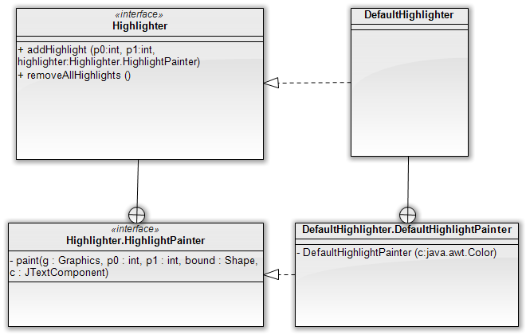

Úvod
====

Na príklade automatickej kontroly pravopisu v swingovskom textovom
políčku sa dá ukázať množstvo zaujímavých vecí: automatické vyhľadávanie
medzier medzi slovami, vlákna v Swingu ba i podporu pre zvýrazňovanie
textu. Vytvorme si teda jednoduchú aplikáciu s textovým políčkom, kde
môže používateľ zadávať text, a v prípade, že je nekorektný, mu ho
aplikácia zvýrazní červenou farbou.

Delenie textu na slová
----------------------

Mnohokrát sa stáva, že pre daný reťazec potrebujeme nájsť pozície
medzier (hraníc) medzi slovami. Samozrejme, jednou z možností by bola
implementácia vlastného algoritmu. Ale načo, keď existuje elegantná
trieda
[`java.text.BreakIterator`](http://java.sun.com/javase/6/docs/api/java/text/BreakIterator.html),
ktorá to umožňuje realizovať bez akýchkoľvek problémov.

Ukážme si príklad jednoduchého kódu, ktorý nájde medzery medzi slovami:

```java
BreakIterator iterator = BreakIterator.getWordInstance();
iterator.setText(" 1  23 4");

int pos = iterator.first();
while(pos != BreakIterator.DONE) {
    System.out.println(iterator.current());
    pos = iterator.next();
}
```

Trieda, ako už naznačuje jej názov, je založená na princípe iterátora.
Inštanciu však nezískavame použitím konštruktora, ale cez statickú
metódu `getWordInstance()`. To je zámer, ktorý zväčšuje jej flexibilitu,
`BreakIterator` totiž umožňuje nachádzať dokonca aj zlomy riadkov, či
iterovať jednotlivé znaky. Iterátor si možno predstaviť ako kurzor,
ktorý je postupne posúvaný v slove zľava doprava. V každej chvíli kurzor
ukazuje na jednu z medzislovných hraníc. Metódou `first()` nájdeme prvý
výskyt hranice, metóda current() vráti index aktuálnej pozície kurzora a
nakoniec metóda `next()` posúva kurzor na ďalšiu hranicu a zároveň vracia
novú pozíciu.

V príklade je prvou hranicou začiatok textu, teda index 0. Po prvom
posune sa kurzor premiestni pred písmeno A, po druhom zase zaňho. Tretie
volanie metódy `next()` preskočí obe medzery a posunie sa pred písmeno B.
Ďalšie volanie sa nastaví za písmeno Y (teda na index 6) a posledné
volania vrátia hranicu pred a za jednoslovným „slovom” tvoreným znakom
výkričníka.

V našom príklade nás však nezaujímajú samotné hranice medzi slovami, ako
skôr indexy udávajúce začiatky a konce slov. V našom príklade
potrebujeme extrahovať indexy pre všetky tri slová:

| Slovo | Počiatočný index | Koncový index |
|-------|------------------|---------------|
| A     | 1                | 2             |
| BY    | 4                | 6             |
| !     | 7                | 8             |

Kód, ktorý získa všetky slová, vyzerá nasledovne:

```java
BreakIterator iterator = BreakIterator.getWordInstance();
iterator.setText(text);

int start = iterator.first();
int end = iterator.next();

while (end != BreakIterator.DONE) {
    writeWord(text, start, end);
    start = end;
    end = iterator.next();
}
// spracujme aj posledné slovo
writeWord(text, start, end);
```

Metóda `writeWord()` vypíšte časť slova medzi danými indexami.
Najdôležitejšie je ignorovať tie slová, ktoré sú buď prázdne (teda
predstavujú medzery či iné biele miesto) alebo zodpovedajú číslam či
interpunkcii. To zaistíme skontrolovaním prvého znaku metódou
[Character.isLetterOrDigit()](http://java.sun.com/j2se/1.5.0/docs/api/java/lang/Character.html).

```java
public void writeWord(String text, int startIndex, int endIndex) {
    String word = text.substring(start, end);
    if (Character.isLetterOrDigit(word.charAt(0))) {
        System.out.println(word);
    
}
```

Kontrola pravopisu
------------------

Vo chvíli, keď vieme deliť text na slová, kontrola pravopisu je
jednoduchá. Stačí si urobiť triedu `KontrolaPravopisu`, ktorá v
jednoduchej verzii skontroluje, či je každé slovo textu v zozname
povolených slov.

```java
package kontrolapravopisu;

import java.text.BreakIterator;
import java.util.*;

public class KontrolaPravopisu {
    /** zoznam korektných slov **/
    private List<String> korektneSlova = new ArrayList<String>();
    
    public KontrolaPravopisu(String... korektneSlova) {
        korektneSlova.addAll(Arrays.asList(korektneSlova));
    }
    
    public List<WordCoordinate> skontroluj(String text) {
        List<WordCoordinate> errors = new ArrayList<WordCoordinate>();
        
        BreakIterator iterator = BreakIterator.getWordInstance();
        iterator.setText(text);

        int start = iterator.first();
        int end = iterator.next();

        while (end != BreakIterator.DONE) {
            skontrolujSlovo(text, start, end, errors);
            
            start = end;
            end = iterator.next();
        }
        skontrolujSlovo(text, start, end, errors);
    
        return errors;
    }
    
    private void skontrolujSlovo(String text, int start, int end, List<WordCoordinate> errors) {
        String word = "";
        if(end == -1) {
            word = text.substring(start);
        } else {
            word = text.substring(start, end);
        }
        if (!word.isEmpty() && Character.isLetterOrDigit(word.charAt(0))) {
            if(!spellCheck(word)) {
                errors.add(new WordCoordinate(start, end));
            }
        }   
        return errors;
    }
}
```

Metóda `skontrolujSlovo()` eviduje nekorektné slová v zozname objektov
typu `WordCoordinate`, čo je jednoduchá dvojica udávajúca začiatočnú a
koncovú pozíciu slova v texte:

```java
public static class WordCoordinate {
    private int start;
    
    private int end;

    public WordCoordinate(int start, int end) {
        this.start = start;
        this.end = end;
    }

    // gettre a settre vynechané    
}
```

Zvýrazňovanie textu v textových políčkach
=========================================

Komponent `JTextArea` podporuje pohodlné zvýrazňovanie textu. V našej
aplikácii budeme chcieť zvýrazniť nekorektné slová, napr. tak, že ich
zobrazíme ako text na červenom pozadí.

Pomocou metódy `getHighlighter()` na inštancii triedy `JTextArea` vieme
získať inštanciu triedy [`java.swing.text.Highlighter`](???), ktorá
dokáže zvýrazňovať konkrétnu časť textu zobrazenú v textovom políčku.
`Highlighter` má základnú metódu

    addHighlight(int počiatočnýOffset, int koncovýOffset, Highlighter.HighlightPainter painter)

Do nej vieme uviesť počiatočný a koncový index do reťazca v textovom
poli, ktorý sa má zvýrazniť. Parameter typu
[`Highlighter.HighlightPainter`](http://java.sun.com/javase/6/docs/api/javax/swing/text/Highlighter.HighlightPainter.html)
(je to interfejs) indikuje objekt, ktorý sa postará o samotný vzhľad
zvýraznenia. Pre jednoduché situácie môžeme použiť objekt
`DefaultHighlighter.DefaultHighlightPainter`, ktorý implementuje
požadovaný interfejs a umožňuje zvýrazniť text konkrétnou farbou.



Nasledovný *highlight painter* zobrazí text na červenom pozadí:

```java
Highlighter.HighlightPainter painter = new DefaultHighlighter.DefaultHighlightPainter(Color.RED);
```

Nasledovný text zvýrazní prvý znak červenou, pričom použije *painter*
definovaný na predošlom riadku.

```java
textArea.getHighlighter().addHighlight(0, 1, painter);
```

Ak chceme zrušiť zvýraznenia, stačí zavolať metódu
`highlighter.removeAllHighlights()`.

Vlákno kontrolujúce pravopis
============================

V aplikácii ďalej budeme mať vlákno, ktoré bude periodicky kontrolovať
korektnosť textu v danom textovom políčku typu `JTextArea`. Namiesto
špinavej práce s vláknami však vieme elegantne využiť triedu
`SwingWorker`.

> **Note**
>
> Podrobnosti o práci so `SwingWorker`om možno nájsť v článku [Swing a
> vláknové
> programovanie](http://ics.upjs.sk/~novotnyr/wiki/Java/SwingThreads).

```java
public class SpellCheckSwingWorker extends SwingWorker<Void, List<WordCoordinate>> {
    
    private KontrolaPravopisu spellCheck = new KontrolaPravopisu();
    private final JTextArea textArea;
    
    public SpellCheckSwingWorker(JTextArea textArea) {
        this.textArea = textArea;

    }
 ...
```

Trieda vytvorí inštanciu kontroly pravopisu a do konštruktora vezme
`JTextArea`, teda inštanciu, ktorú mieni kontrolovať.

Metóda `doInBackground()` je jednoduchá: v nekonečnom cykle vezmeme text z
textového poľa, skontrolujeme ho a uspíme sa na 500 milisekúnd (aby sme
zbytočne nevyťažovali procesor; navyše používateľ mení text tiež s
prestávkami.)

```java
@Override
protected Void doInBackground() throws Exception {
    while(true) {
        String text = textArea.getText();
        
        List<WordCoordinate> kontrola = spellCheck.skontroluj(text);
        
        publish(kontrola);
        TimeUnit.MILLISECONDS.sleep(500);
    }
}
```

Pomocou metódy `publish()` odošleme do vlákna EDT výsledky kontroly.

V rámci metódy `process()` zase vyzdvihneme odoslané výsledky a na ich
základe upravíme stav komponentu `JTextArea`.

```java
@Override
protected void process(List<List<WordCoordinate>> chunks) {
    List<WordCoordinate> errors = chunks.get(chunks.size() - 1);
    textArea.getHighlighter().removeAllHighlights();
    for (WordCoordinate wordCoordinate : errors) {
        try {
            textArea.getHighlighter().addHighlight(wordCoordinate.getStart(), wordCoordinate.getEnd(), HIGHLIGHT_PAINTER);
        } catch (BadLocationException e) {
            e.printStackTrace();
        }
    }
}
```

Podotknime, že `HIGHLIGHT_PAINTER` je inštancia typu
`DefaultHighlighter.DefaultHighlightPainter`.

Záver
=====

Hotová aplikácia vyzerá nasledovne:

Počas písania sa automaticky zvýrazňujú slová, ktoré nie sú v slovníku
korektných slov. Drobným nedostatkom je zvýrazňovanie slov, ktoré neboli
ešte dopísané (napríklad `typo` je nesprávne, ak používateľ nedopíše
zvyšok slova, teda `grafia`), ale v tejto jednoduchej aplikácii sa s tým
musíme zmieriť.

Ukázali sme teda tri vlastnosti:

-   vyhľadávanie hraníc medzi slovami, teda triedu `BreakIterator`
-   zvýrazňovanie slov, teda triedu `Highlighter`
-   a nakoniec vláknové programovanie v Swingu pomocou triedy
`SwingWorker.`
