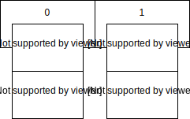
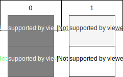
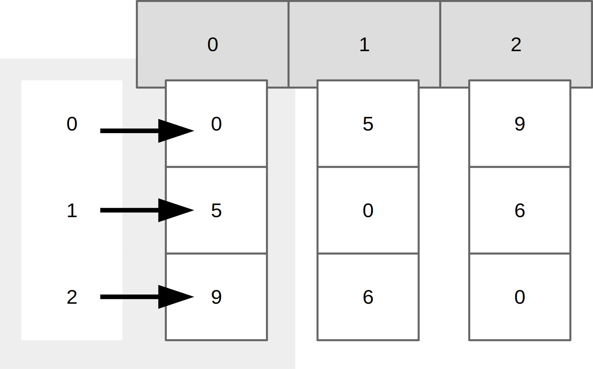
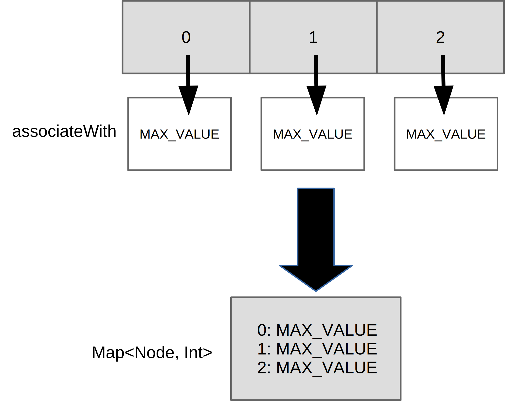
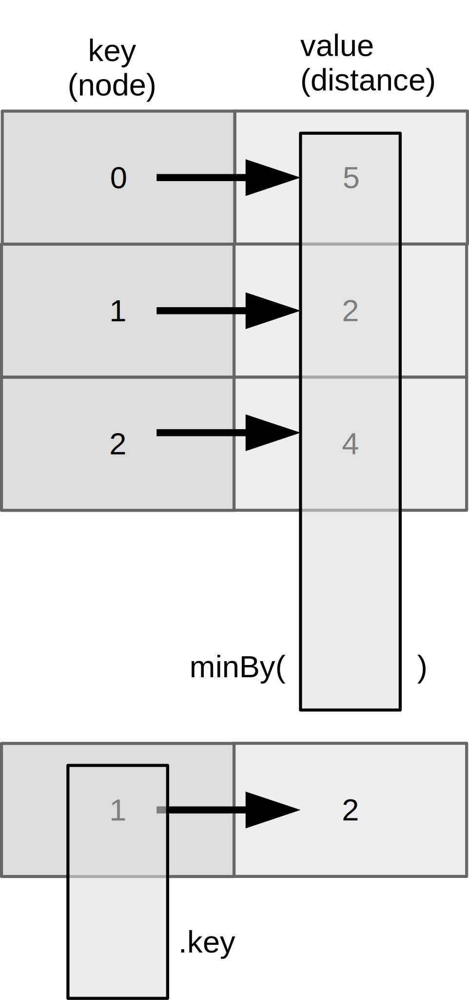

Dijkstrov algoritmus na hľadanie najkratšej cesty v neorientovanom grafe s nezápornými hranami je skvelá možnosť, ako si ukázať učebnicový grafový algoritmus… ale aj krásnu syntax Kotlinu.

Budeme potrebovať:

1. Reprezentáciu grafu: 1ks
2. Funkciu na výpočet najväčšej vzdialenosti
3. A korenie
   1. Reprezentácia uzlov
   2. Prevody medzi uzlami a číslami.

# Reprezentácia grafu

Graf s uzlami a hranami má milión reprezentácií. My si zvolíme tú najhlúpejšiu: **maticu incidencií**. Ak máme dva uzly, *U* a *V*, do tabuľky na *U*-ty riadok a *V*-ty stĺpec uvedieme vzdialenosť medzi nimi. To isté urobíme aj naopak: na *V*-ty riadok a *U*-ty stĺpec dáme tú istú vzdialenosť, pretože či ideme z Košíc do Prešova alebo naopak, vzdialenosť je rovnaká.

Urobíme ešte jedno zjednodušenie: uzly budú čísla! Takto môžeme reprezentovať maticu ako dvojrozmerné pole. Alebo také dačo. Uzly ako čísla budú predstavovať indexy „riadkov“ a „stĺpcov“ a hodnota v políčku bude vzdialenosť medzi nimi.

## Matica incidencií v Kotline

Pole v Kotline je reprezentované triedou `Array`. Tá je skvelá: má dvojparametrový konštruktor, kde vieme uviesť rozmer poľa a dokonca ho aj nainicializovať ľubovoľným prvkom. 

Jednoprvkové pole jednotiek dĺžky 8 môžeme spraviť takto:

```kotlin
val numbers = Array(8) { 1 }
```

Guľaté zátvorky reprezentujú druhý parameter konštruktora. To vznikne nasledovným skracovaním:

```kotlin
val numbers = Array(8, { index -> 1 })
// nepoužívaný index vynecháme
val numbers = Array(8, { 1 })
// ak je posledný argument lambda výraz, môžeme ho vysunúť za zátvorku
val numbers = Array(8) {1}
```

## Dvojrozmerné polia

Dvojrozmerné polia v Kotline neexistujú. Dvojrozmerné pole je v skutočnosti bežné pole, ktorého prvky sú bežné polia. 

Potrebujeme maticu, teda 2D pole veľkosti 8x8 plné núl?

```
val matrix = Array(8) { Array(8) { 0 } }
```

Vo vnútri zátvoriek inicializujeme prvky poľa ako polia, ktoré vnorene inicializujeme nulami. Toto je naša matica incidencií!

## Graf s maticou incidencií

Polia sa nedajú nafukovať a sfukovať. Raz vytvorené pole má danú dĺžku a koniec. (Ak chceme dynamické polia, musíme použiť niečo iné, napríklad `List`.)

To nám nevadí, pretože sa budeme tváriť, že graf vytvoríme s nadrôtovanou veľkosťou.

Môžeme si urobiť kotlinovskú triedu v súbore `StupidDijkstra.kt`:

```kotlin
class StupidGraph(private val size: Int) {
    private val matrix = Array(size) { Array(size) { 0 } }
}
```

V primárnom konštruktore povieme, že parametrom je veľkosť `size`, typu číslo `Int`. Keďže je to interná premenná, vyhlásime ju za `private`.

Vo vnútri pripravíme naše dvojrozmerné pole, pričom rozmery preberieme z konštruktorovej vlastnosti (*property*) `size`. 

Graf si môžeme vytvoriť!

```kotlin
fun main() {
  val graph = StupidGraph(8)
}
```

To je však asi tak všetko, čo s ním môžeme robiť. 

Funkcie pre zábavu s grafmi
===========================

## Pridávanie hrán

Na pridávanie hrán si vytvoríme metódu triedy `StupidGraph`. Zoberie tri parametre:

1. zdrojový uzol
2. cieľový uzol
3. vzdialenosť.

Vzdialenosť nech je celé číslo `Int`. Ale čo s uzlami? Povedali sme si, že uzly budú čísla, pretože takto sa s nimi bude lepšie narábať pri práci s maticou. 

### Vlastné dátové typy `typealias`

Už teraz tušíme, že aj vzdialenosť, aj uzly sú celé čísla `Int`. Aby sa to nepoplietlo, môžeme v Kotline využiť aliasovanie typov. Aha:

```kotlin
typealias Node = Int
```

Práve sme povedali, že dátový typ `Node` bude v skutočnosti `Int`. Úlohou aliasov je sprehľadniť zápis.

### Funkcia pre pridávanie hrán

Takto si môžeme pripraviť funkciu, teda metódu v triede `StupidGraph`:

```
class StupidGraph(private val size: Int) {
		// ...
    fun add(node1: Node, node2: Node, weight: Int) {
    
...
```

Vidíme krásne otypované parametre: uzly sú `Node` a váhy sú čísla!

Implementácia bude jednoduchá, prosto nastavíme obe hodnoty buniek, v jednom i druhom smere.

```
fun add(node1: Node, node2: Node, weight: Int) {
    matrix[node1][node2] = weight
    matrix[node2][node1] = weight
}
```

Vidíme dva aspekty:

- Napriek tomu, že uzol `node1` i `node2` sú typu `Node`, vďaka typovým aliasom ich vieme považovať za čísla.
- Vidíme prístup k dvojrozmernému poľu cez dve hranaté zátvorky.

Teraz si už môžeme pripraviť graf s dvoma uzlami:

```kotlin
val g = StupidGraph(2)
g.add(0, 1, 20)
```

Práve sme povedali, že z uzla `0` do uzla `1` je vzdialenosť 20 merných jednotiek, ale to platí aj naopak: z uzla `1` do uzla `0` je to rovnaké.

Zisťovanie vzdialeností
-----------------------

Teraz sa nám bude hodiť funkcia pre zisťovanie vzdialeností. Dodajme ju ako metódu do našej grafovej triedy:

```kotlin
fun getWeight(node1: Node, node2: Node) = matrix[node1][node2]
```

Táto funkcia berie dva parametre a vracia jedno celé číslo reprezentujúce vzdialenosť. Funkcia nemá telo, pretože reprezentuje jednoduchý výraz, ktorý zistí z matice z daného koordinátu hodnotu z príslušného políčka.

Môžeme si to overiť vo funkcii `main()`:

```kotlin
println(g.getWeight(1, 0)) // výsledok je 20
```

Získanie uzlov
--------------------------

V kóde sa hodí získanie všetkých uzlov z grafu. To môžeme implemenovať:

- cez funkciu `getNodes()`
- alebo využiť *properties* a vytvoriť kotlinovskú vlastnosť, ktorá umožní bodkovú notáciu v duchu `g.nodes`.

```
val nodes: Set<Node> = matrix.indices.toSet()
```

Deklarácia mapuje vlastnosť `nodes` na volanie inej vlastnosti `indices` na našom 2D poli `matrix`.

Keďže sme zvolili umnú implementáciu, dva uzly v grafe znamenajú maticu s dvoma riadkami a dvoma stĺpcami, a indexy týchto uzlov sú `0` a `1`. Dostupnú uzly sú takto vtipne namapované na indexy poľa, čo vieme získať presne cez `indices`.

Na to, aby to fungovalo, potrebujeme ešte jeden prevod: indexy `indices` majú dátový typ`IntRange` (rozsah integerov), ale to radšej prevedieme na množinu, s ktorou sa robí omnoho lepšie. Prevod z rozsahu integerov na množinu uzlov je jednoduchý, pretože aliasing typov zabezpečí, že `Int` sa tvári ako `Node`.



Ako vidno na obrázku, `indices` vrátia indexy z „vodorovného“ poľa.

Odstraňovanie uzlov
-------------------------------

Pri Dijkstrovom algoritme budeme potrebovať aj odstraňovanie uzlov. Budeme to robiť hlúpym spôsobom, pretože nemáme možnosť odstraňovať položky z poľa. Namiesto toho zmazanému uzlu jednoducho nastavíme nulovú vzdialenosť do ostatných uzlov i naopak, do zmazaného uzla nastavíme 0 zo všetkých odchádzajúcich uzlov.



Prvý krok je na obrázku znázornený tmavosivým pozadím, a druhý krok nastaví svetlosivému políčku na indexe `0` vzdialenosť nula.

Kód vyjadríme krásnou funkciou:

```kotlin
fun remove(node: Node) {
    matrix[node].fill(0)
    matrix.forEach { it[node] = 0 }
}
```

## Zisťovanie susedov

Budeme potrebovať funkciu pre zisťovanie susedov. To dosiahneme jednoducho:

1. Získame „stĺpec“ z matice incidencií.
2. Preiterujeme jeho prvky a vrátime tie indexy zodpovedajúce uzlom, ktorých vzdialenosti sú väčšie ako nula. Nulové indexy totiž znamenajú neexistujúcu hranu.

Na obrázku tak vidíme, že pre uzol `0` zistíme susedné uzly `1` a `2`.



```kotlin
fun getAdjacentNodes(node: Node): List<Node> {
    return matrix[node].mapIndexedNotNull { index, distance ->
        if (distance > 0) index else null
    }
}
```

Funkcia `mapIndexedNotNull()` prechádza poľom a zavolá lambda výraz s dvoma parametrami, v podobnom duchu, ako by to robil bežný cyklus `for`:

- `index` predstavuje index prvku, čo je zhodou okolností názov uzla
- `distance` znamená dĺžku hrany, teda vzdialenosť.

Každý prvok sa namapuje na iný prvok, ale tie prvky, ktoré sa mapujú na `null`, sa z výsledku vynechajú. V našom prípade mapujeme nulu na `null`, jednotku na `1`, a dvojku na `2`, čo po vynechaní vráti uzly/indexy `1` a `2`.

Metóda dokonca vráti elegantný zoznam čísiel, ktoré transparentne prevedieme na zoznam uzlov `Node`.

## Použitie grafu

Ak by sme chceli vytvoriť komplexný graf, napr. so vzdialenosťami medzi slovenskými krajskými mestami, došli by sme k niečomu takémuto:

```
val g = StupidGraph(8)
g.add(0, 1, 5)
g.add(1, 2, 5)
g.add(0, 2, 9)
g.add(1, 3, 8)
g.add(3, 4, 8)
g.add(4, 5, 9)
g.add(4, 6, 25)
g.add(2, 5, 13)
g.add(6, 7, 3)
g.add(5, 7, 25)
g.add(0, 5, 22)
```

Toto vyzerá dosť šialene a ľahko sa v tom dá stratiť. Kde sme spravili chybu? V tom, že naše uzly môžu byť len čísla. Ale to sa dá ľahko napraviť!

### Pomocné triky na skrátenie (“DSL”)

Urobme si pomocnú triedu!

```kotlin
enum class City {
    BRATISLAVA, TRNAVA, NITRA, TRENCIN, ZILINA, BANSKA_BYSTRICA, PRESOV, KOSICE
}
```

Tento `enum` má výhodu: elementy majú jednoznačné poradie, pretože taký Trenčín má index 3, čo vieme získať cez `City.TRENCIN.ordinal`.

Môžeme to prepísať!:

```
val g = StupidGraph(8)
g.add(City.BRATISLAVA.ordinal, City.TRNAVA.ordinal, 5)
...
```

To tiež nie je ktoviečo! Vieme to vylepšiť dvoma vecami:

- pomocnou funkciou, ktorá prevedie prvok na číslo uzla
- a importom, ktorý skráti zápis.

Na začiatok súboru môžeme dodať import všetkých položiek `enum`-u:

```
import com.github.novotnyr.graph.kt.stupid.City.*
```

Teraz už veselo môžeme písať:

```
g.add(BRATISLAVA.ordinal, TRNAVA.ordinal, 5)
```

### Extension funkcia na krajšie pridávanie

Kotlin umožňuje používanie *extension functions*, akýchsi rozširujúcich funkcií, ktoré umožňujú pridávať nové metódy existujúcim triedam, na ktoré nemáme dosah alebo ktoré nechceme zaburiniť zbytočnými pomocnými metódami.

Ak chceme triede `StupidGraph` pridať pomocnú funkciu na pridávanie vzdialenosti, vieme to dosiahnuť nasledovným spôsobom:

```kotlin
fun StupidGraph.distance(source: City, destination: City, distance: Int) {
    add(source.ordinal, destination.ordinal, distance)
}
```

Všimnime si:

- **receiver**, teda triedu objektu, ktorá vyfasuje novú metódu. V našom prípade ide o `StupidGraph`.
- názov funkcie uvedený za bodkou, teda `distance`.
- dva parametre: pre zdrojové a cieľové mesto, plus tretí parameter pre vzdialenosť
- Objekt, ktorý prijme novú metódu, je k dispozícii pod premennou `this`. V našom prípade sme `this` vynechali a teda metódu `add()` voláme priamo.

Zápis je teraz ešte krajší:

```kotlin
val g = StupidGraph(8)
g.distance(BRATISLAVA, TRNAVA, 5)
g.distance(TRNAVA, NITRA, 5)
//...
```

### Konštrukcia `with`

Konštrukcia `with` , jedna zo [*scope functions*](https://kotlinlang.org/docs/reference/scope-functions.html), teda funkcií pre prácu s rozsahom platnosti, uľahčuje situácie, keď dokola voláme metódy na jednom objekte.

Napríklad na našej premennej `g`. Skúsme to prepísať:

```kotlin
with(StupidGraph(8)) {
    distance(BRATISLAVA, TRNAVA, 5)
    distance(TRNAVA, NITRA, 5)
    distance(BRATISLAVA, NITRA, 9)
    distance(TRNAVA, TRENCIN, 8)
    distance(TRENCIN, ZILINA, 8)
    distance(ZILINA, BANSKA_BYSTRICA, 9)
    distance(ZILINA, PRESOV, 25)
    distance(NITRA, BANSKA_BYSTRICA, 13)
    distance(PRESOV, KOSICE, 3)
    distance(BANSKA_BYSTRICA, KOSICE, 25)
    distance(BRATISLAVA, BANSKA_BYSTRICA, 22)
}
```

Premenná `g` sa stratila, resp. transformovala na `this` dostupnú vo vnútri sekcie `with`.

To už vyzerá elegantne!

Implementácia Dijkstru
======================

Na implementáciu Dijkstru použijeme inšpiráciu z [Java kódu](https://novotnyr.github.io/scrolls/ako-naplanovat-cestu-autom-dijkstra-algoritmus/). Budeme potrebovať:

- jeden graf
- jedno mapovanie medzi uzlami a dosiaľ nájdenými vzdialenosťami
- jedno mapovanie medzi uzlami a ich predchodcami
- jednu funkciu na nájdenie najbližšieho uzla
- a jednu funkciu 

## Graf

Vyrobme si funkciu na výpočet podľa algoritmu. Funkciu urobme ako *extension*, aby sme nepleveli triedu grafu:

```kotlin
fun StupidGraph.findShortestPath(sourceNode: Node, destinationNode: Node): List<Node>
```

V iných jazykoch by sme vyrobili statickú funkciu, ktorá berie ako prvý parameter graf. V Kotline nič také nie je potrebné, keďže *extension function* bude fungovať presne tak, ako keby išlo o metódu triedy `StupidGraph`.

## Mapovanie medzi uzlami a vzdialenosťami

Vytvorme si mapu medzi uzlami a vzdialenosťami. Ako základ využime zoznam uzlov grafu, ktorý pomocou metódy `associateWith` vieme namapovať na **mapu**, kde indexy uzlov budú kľúčom a konštantna `Int.MAX_VALUE` bude nekonečná vzdialenosť. 

```kotlin
val distances = nodes
        .associateWith { Int.MAX_VALUE }
        .toMutableMap()
distances[sourceNode] = 0
```

Metóda `associateWith` prevádza zoznam na mapu. Zoberie lambdu, ktorá povie, aká hodnota sa má namapovať na kľúč reprezentovaný prvkom zoznamu.



Výsledok prevedieme na *mutable* (meniteľnú) mapu, a zdrojovému prvku nastavíme nulovú vzdialenosť, aby sme algoritmus začali.

Mapovanie medzi uzlami a ich predchodcami
-----------------------------------------

To bude jednoduché:

```kotlin
val predecessors = mutableMapOf<Node, Node>()
```

Zabudovaná funkcia `mutableMapOf()` vytvára *meniteľnú* mapu. V našom prípade z uzlov do uzlov.

Hľadanie cesty
--------------

Hľadanie cesty pôjde v zdanlivo nekonečnom cykle, ktorý však rozhodne skončí. V každom kole totiž vyhodíme jeden uzol, ktorý sme už vybavili.

```kotlin
do {
    val currentNode = distances.findNearestNode() ?: break
    for (adjacentNode in getAdjacentNodes(currentNode)) {
        val distance = distances.getOrDefault(currentNode, Int.MAX_VALUE)
        val possiblyBetterDistance = if (distance == Int.MAX_VALUE) {
            Int.MAX_VALUE
        } else {
            distance + getWeight(currentNode, adjacentNode)
        }
        if (possiblyBetterDistance < distances[adjacentNode]!!) {
            distances[adjacentNode] = possiblyBetterDistance
            predecessors[adjacentNode] = currentNode
        }
    }
    distances -= currentNode
    remove(currentNode)
} while (true)

```

1. Najprv nájdeme najbližší uzol, čo je funkcia `findNearestNode()`, ktorú nemáme, ale hneď ju dopracujeme. Všimnime si operátor `?:`, ktorý predstavuje overenie ne-`null`-ovosti. Ak by náhodou bol výsledok funkcie `null`, zavolá sa `break`, ktorý ukončí cyklus `do/while`. (Stane sa to na konci behu algoritmu).
2. Následne prechádzame všetkými susedmi najbližšieho uzla a skúsime zistiť aktuálny odhad vzdialenosti do konkrétneho suseda.
3. Následne skúsime odhadnúť lepšiu vzdialenosť:
   1. Ak je predošlý odhad vzdialenosti nekonečno, tak pripočítaním vzdialenosti do suseda tomu nepomôžeme, vždy to bude len nekonečno.
   2. Inak vyrátame nový odhad vzdialenosti a poznačíme si ho, a to vrátane výpočtu predchodcu.

Všimnime si, ako používame **if** ako výraz. Kotlin nepodporuje ternárny operátor, ale to nevadí, pretože výsledok `if` sa dá priradiť do premennej.

Zároveň si všimnime, ako pristupujeme k prvom mapy cez hranaté zátvorky`[…]`, ktoré sa mapujú na volanie metódy `get()`. Jedine pri porovnávaní vzdialeností sa môže kompilátoru zdať, že výsledok môže vracať `null`, čo mu vysvetlíme cez dva výkričníky reprezentujúce **non-null assertion**, teda oznam, že toto `null` nikdy nebude.

Na záver algoritmu vyhodíme zo zoznamu vzdialeností aktuálny uzol, na čo použijeme operátor `-=` mapovaný na metódu `remove()` na mape. Okrem toho vyhodíme spracovaný uzol aj zo samotného grafu, na čo využijeme jeho metódu `remove()`. (Keďže ide o *extension function*, metóda `remove()` sa volá na *receiveri* funkcie, teda na objekte typu `StupidGraph`.)

### Hľadanie najbližšieho uzla

Ak máme mapu medzi uzlami a vzdialenosťami, ako nájdeme uzol s najmenšou vzdialenosťou?

Pripravíme si ďalšiu *extension* funkciu:

```kotlin
private fun Map<Node, Int>.findNearestNode(): Node? {
    return minBy { it.value }?.key
}
```

Funkcia v tomto prípade vracia typ `Node?`, teda buď uzol alebo `null` a receiverom je mapa medzi uzlami a vzdialenosťami.

Na mape môžeme zavolať funkciu `minBy()`, ktorá namapuje každú dvojicu *kľúč-hodnota* na nejaké číslo a z tohto nájde najmenší prvok.



Táto dvojica je reprezentovaná objektom `Entry`, s vlastnosťami `key` (kľúč) a `value` (hodnota). Z objektu, reprezentovaného v lambde implicitnou premennou `it`, vytiahneme hodnotu a z nej sa nájde najmenší objekt `Entry`. 

Na záver z objektu vytiahneme kľúč (teda uzol). Keďže funkcia `minBy()` môže vracať `null` (ak sa náhodou mapa stane prázdnou), použijeme operátor **bezpečnej navigácie** `?.`, ktorý pre `null` hodnoty zabráni navigácii do vlastnosti `key` a tým nás ochráni pred `NullPointerException`.

### Budovanie cesty

Posledný krok bude budovanie cesty. Algoritmus nám vybuduje mapu medzi uzlami a ich predchodcami. Cestu ako zozna vybudujeme nasledovne:

```kotlin
private fun buildPath(destinationNode: Node, predecessors: Map<Node, Node>): List<Node> {
    val path = mutableListOf(destinationNode)
    var predecessor = predecessors[destinationNode]
    while (predecessor != null) {
        path += predecessor
        predecessor = predecessors[predecessor]
    }
    return path.reversed()
}
```

Začneme vytvorením meniteľného zoznamu cez funkciu `mutableListOf()`. Následne veselo prejdeme mapu s využitím operátora `[…]` a každého predchodcu pridáme do zoznamu pomocou operátora `+=`, ktorá je mapovaný na metódu `add()` v zozname `List`.

A veľké finále: zoznam bude usporiadaný od konca do predu, ale vďaka funkcii `reversed()` si ho môžeme otočiť!

# Megazhrnutie: kompletný program

Ak si to dáme dohromady, máme nasledovný program v súbore `StupidDijkstra.kt`

```kotlin
package com.github.novotnyr.graph.kt.stupid

import com.github.novotnyr.graph.kt.stupid.City.*

typealias Node = Int

class StupidGraph(private val size: Int) {
    private val matrix = Array(size) { Array(size) { 0 } }

    fun add(node1: Node, node2: Node, weight: Int) {
        matrix[node1][node2] = weight
        matrix[node2][node1] = weight
    }

    fun remove(node: Node) {
        matrix[node].fill(0)
        matrix.forEach { it[node] = 0 }
    }

    val nodes: Set<Node> = matrix.indices.toSet()

    fun getAdjacentNodes(node: Node): List<Node> {
        return matrix[node].mapIndexedNotNull { index, distance ->
            if (distance > 0) index else null
        }
    }

    fun getWeight(node1: Node, node2: Node) = matrix[node1][node2]
}

fun StupidGraph.findShortestPath(sourceNode: Node, destinationNode: Node): List<Node> {
    val distances = nodes
        .associateWith { Int.MAX_VALUE }
        .toMutableMap()
    distances[sourceNode] = 0
  
    val predecessors = mutableMapOf<Node, Node>()
    do {
        val currentNode = distances.findNearestNode() ?: break
        for (adjacentNode in getAdjacentNodes(currentNode)) {
            val distance = distances.getOrDefault(currentNode, Int.MAX_VALUE)
            val possiblyBetterDistance = if (distance == Int.MAX_VALUE) {
                Int.MAX_VALUE
            } else {
                distance + getWeight(currentNode, adjacentNode)
            }
            if (possiblyBetterDistance < distances[adjacentNode]!!) {
                distances[adjacentNode] = possiblyBetterDistance
                predecessors[adjacentNode] = currentNode
            }
        }
        distances -= currentNode
        remove(currentNode)
    } while (true)
    return buildPath(destinationNode, predecessors)
}

private fun Map<Node, Int>.findNearestNode(): Node? {
    return minBy { it.value }?.key
}

private fun buildPath(destinationNode: Node, predecessors: Map<Node, Node>): List<Node> {
    val path = mutableListOf(destinationNode)
    var predecessor = predecessors[destinationNode]
    while (predecessor != null) {
        path += predecessor
        predecessor = predecessors[predecessor]
    }
    return path.reversed()
}

enum class City {
    BRATISLAVA, TRNAVA, NITRA, TRENCIN, ZILINA, BANSKA_BYSTRICA, PRESOV, KOSICE
}

fun StupidGraph.distance(source: City, destination: City, distance: Int) {
    add(source.ordinal, destination.ordinal, distance)
}

fun main() {
    with(StupidGraph(8)) {
        distance(BRATISLAVA, TRNAVA, 5)
        distance(TRNAVA, NITRA, 5)
        distance(BRATISLAVA, NITRA, 9)
        distance(TRNAVA, TRENCIN, 8)
        distance(TRENCIN, ZILINA, 8)
        distance(ZILINA, BANSKA_BYSTRICA, 9)
        distance(ZILINA, PRESOV, 25)
        distance(NITRA, BANSKA_BYSTRICA, 13)
        distance(PRESOV, KOSICE, 3)
        distance(BANSKA_BYSTRICA, KOSICE, 25)
        distance(BRATISLAVA, BANSKA_BYSTRICA, 22)

        val shortestPath = findShortestPath(BRATISLAVA.ordinal, KOSICE.ordinal)
        shortestPath.forEach {
            println(City.values()[it])
        }
    }
}
```

