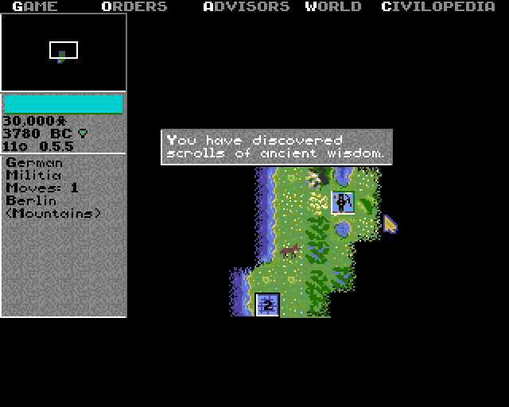
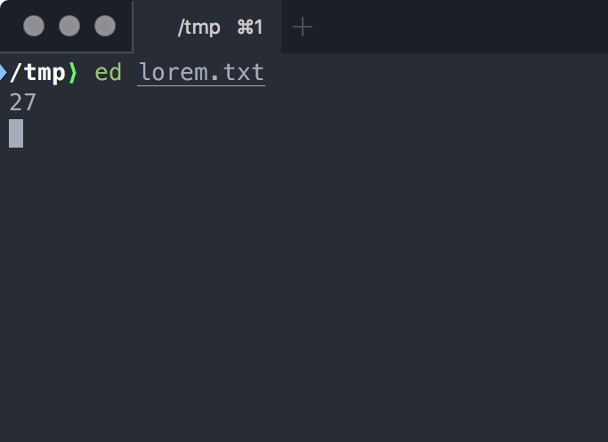

Ako píše @Bodil:

<blockquote class="twitter-tweet" data-lang="en"><p lang="und" dir="ltr"><a href="https://t.co/Ut1KV7mx39">pic.twitter.com/Ut1KV7mx39</a></p>&mdash; 🌯 Bodil 🌯 (@bodil) <a href="https://twitter.com/bodil/status/999714110303588353?ref_src=twsrc%5Etfw">May 24, 2018</a></blockquote> <script async src="https://platform.twitter.com/widgets.js" charset="utf-8"></script> 

Dajme si teda `ed`.


# Introitus

Najprv ukážkový fajl:

```bash
printf "%s\n" Lorem ipsum dolor sit amet > lorem.txt
```

Pome na to!

```
ed lorem.txt
```

Uvidíme tretie najlepšie UI *ever*:



```
/tmp⟩ ed lorem.txt
27
```

`ed` je REPL. Akurát neni čas na blbosti ako *prompt*. Jediné, čo vidno, je `27`, čo nie je zmysel života, ale počet znakov v súbore. Vrátane finálneho lomeno n na konci

Ako z toho preboha vybehnem?

`ed` je REPL. (Hej, to už bolo, ale treba si to pripomenúť). Základný príkaz je

## `q`: qonči editor

Príkaz `q` (**quit**) skončí editor a vráti sa do shellu.

Ale hybajme naspäť! 

## REPL, to neni príkaz

`ed` je REPL (neviem, či sa spomenulo). A ako REPL má kopec príkazov. Výpis, úpravy, otvoriť, uložiť, uložiť ako, všetko sú to:

- jednopísmenkové príkazy
- kde niektoré berú **rozsah** (range) riadkov, na ktorých zbehnú.

Pre motiváciu si dajme ukážkový sešn:

```
$
amet
-2,$s/m/n/g
,p
Lorem
ipsum
dolor
sit
anet
```

Sranda, hej? Toto je pre úplných profesionalof, ako vravel klasik UPJŠ. 

Smrteľníci si najprv customizujú UI/UX.

## `P` : zapni `P`promt

Veľké `P` zlepší UX o 200%. Odlíši prompt pre príkazy od samotných riadkov. Štandardný **prompt** začína hviezdičkou a vypnúť pre extra level zábavy je možné druhým `P`.

Jo, a každý príkaz treba odenterovať, toto nie je MS Word!

## `p`: potlač a rozsahy

Malé `p` ako potlač tlačí riadky. Ako vravel Knuth v sedemdesiatom piatom, „tí z vás, čo majú šťastie a majú aj monitor“, sa potešia.

Príkaz `p` potrebuje pár parametrov. (Päť p! Teda sedem „p“!) Chceme vedieť, *odkiaľ*-*pokiaľ* tlačíme. Editor `janosik` tlačil od buka-do buka, my tlačíme od prvého (`1`) po posledný `$` riadok. Posledný riadok je `$`, lebo ako vravel Knuth v sedemdesiatom piatom, tlač celého súboru je drahá.

```
1,$p
```

Rozsah „všetko“ sa dá skrátiť na… čiarku:

```
,p
```

Rozsahy môžu byť šelijaké. Napríklad emulácia `head`-u:

```
1,3p
```

## ` `: žiadny príkaz, dobrý príkaz

Keď uvedieme len rozsah, berie sa do ako **null** príkaz. Ten hýbe kurzorom po súbore. Akurát ten kurzor nie je vidno. Akurát, že kurzor behá po riadkoch, lebo znakový kurzor je pre klikačov.

Výpis tretieho riadku?

```
3
```

Výpis bude:

```
dolor
```

Kurzora sme presunuli na tretí riadok. Je z neho **aktuálny riadok**. A aktuálny riadok zistíme krásnym rozsahom: bodkou. A žiadnym príkazom. Teda príkaz tam je, len sa volá prázdny string.

```
.
```

Výpis bude, nu pagadi:

```
dolor
```

# Prvé dejstvo: pohyby a orientácia

## `n` : numberuj riadky

Keď chceme mať `vi`sual studio code, vz. 1969, môžeme tlačiť riadky aj s číslami:

```
,n
```

Aha:

```
1     Lorem
2     ipsum
3     dolor
4     sit
5     amet
```

## `i`: insertuj, t. j. vkladaj riadok pred

Príkaz `i` vkladá riadky. **Pred** daný riadok. Pred prvý riadok? `1i`. (Jedna í).

```
*1i
Some latin
.
```

Text sa končí bodkou (a Enterom), aby `ed` vedel, že dosť bolo. Kontrola je klasicky cez `,p`. (Teraz už vidno, že hviezdička v prompte oddeľuje lamy od hardcore userov).

## `a`: appenduj riadok *za*

Protipól `i` je `a`, čo vkladá riadok **za** uvedený riadok.

```
*4a
hic sunt leones
.
```

Samozrejme, vkladať môžeme aj za aktuálny riadok. Jaky komplet prepis!

```
*$
amet
*a
EOF
.
*,p
Some latin
Lorem
ipsum
dolor
hic sunt leones
sit
amet
EOF
*
```

1. Najprv presun na koniec `$`
2. Potom pridanie riadku cez `a`. (Rozsah sa domyslí, že za aktuálny riadok. Teda to isté ako `.a`)
3. Dopísali sme `EOF`. 
4. Ukončili bodkou, lebo dosť bolo.
5. Vyprintovali všetko cez `,p`.

To sa jasne dalo spraviť aj kratšie: `$a`. Ale pre srandu dokola.

## `d`: deletuj a maž

Mazanie je cez `d`. Skúsme výpis:

```
*,n
1	Some latin
2	Lorem
3	ipsum
4	dolor
5	hic sunt leones
6	sit
7	amet
8	EOF
```

Vymažme piaty riadok:

```
5d
```

Uvidíme po `,p`:

```
Some latin
Lorem
ipsum
dolor
sit
amet
EOF
```

## `u`: undo, vráť späť

Až mi je to divnô, ale `ed` má **undo**. Jedno `u` zvráti poslednú zmenu. Napr. päťboj:

1. zmaž všetko: `,d`
2. vytlač všetko: `,p`
3. panikár, lebo nič sa nevypíše, okrem otáznika, teda WTF `?`
4. zvráť: `u`
5. oddychuj, lebo vidno celý súbor.

## `w`: ulož zmeny, teda kontrol a s

`w` ako vrajt ukladá zmeny. Uvidíme počet znakov, ktoré sa writeli:

```
*w
58
```

## `f` : fde som?

`f` má len dva zmysly:

1. `fde` som, teda jak sa volá súbor, čo editujem?
2. `fuložiť ako`, teda zmeniť názov súboru

Prvé:

```
*f
lorem.txt
```

Druhé, tzv. **save as**:

```
*f loremipsum.txt
loremipsum.txt
*w
58
```

# Intermezzo

Asi je jasné, že súbor vyzerá rozdrbane. Dajme ho do pôvodného stavu. Quitnime `ed` (`q`) a dajme si pragit:

```
rm lorem.txt loremipsum.txt
printf "%s\n" Lorem ipsum dolor sit amet > lorem.txt
```

Dajme si ešte raz `ed lorem.txt` a nezabudnime zapnúť `prompt` !

# Druhé dejstvo: presuny a klipbórd

Vypíšme si, nech vieme, kde sme:

```
*,n
1	Lorem
2	ipsum
3	dolor
4	sit
5	amet
```

Treba nám presunúť piaty riadok na začiatok? 

## `m` ako presuM / *move*

Treba nám presunúť piaty riadok na začiatok? Čítame to “zober rozsah a presuň ho pred Xtý riadok.” A hej, začiatok je, ako matematici nakázali, nula.

```
5m0
```

Aha, výsledok:

```
amet
Lorem
ipsum
dolor
sit
```

## `t` ako topíruj / *copy*

Kopíruj beží presne ako presun, akurát kopíruje. Zoberieme rozsah riadkov, `t`opírujeme ho za konkrétny riadok. Napríklad, že duplikácia súboru:

```
,t$
```

- Rozsah je šicko: `,`
- Topírovanie je `t`.
- Za posledný riadok: `$`.

Chceli sme klipbórd? Ten tu nie je.

# Tretie dejstvo: hľadanie, nahrádzanie, masovky

Resetnime si súbor a dajme si výpis:

```
*,p
Lorem
ipsum
dolor
sit
amet
```

## Hľadanie (nie príkaz)

Rozsahy môžu byť aj také, ktoré vyhľadávajú. Uvádzajú sa do lomítok. 

Dajme si všetky riadky, čo obsahujú `m`, teda `/m`

```
*/m
Lorem
```

Hľadá sa od aktuálneho riadku (kurzora), kým sa nenájde riadok s `m`. 

Toto môžeme točiť do bludu:

```
*/m
ipsum
*/m
amet
*/m
Lorem
```

Kurzor sa vždy nastaví od aktuálneho riadka do najbližšieho výskytu.

### Hľadanie s regexpami

Hľadanie podporuje regexy. Netreba vysvetľovať, čo to je, lebo kto došiel až sem, vie, čo sú regexy.

Dajme si riadky, čo končia na `m`. Teda `/m$`:

```
*/m$
Lorem
```

Toto môžeme zase točiť dokola. Ale samotné lomítko opakuje predošlý search. Takže:

```
*/m$
Lorem
*/
ipsum
*/
Lorem
*/
ipsum
*/
```

## `c`: ch-čendžuj riadky za riadky (change)

Riadok kus za kus meníme cez `c`. Keď sme tuto:

```
*,p
Lorem
ipsum
dolor
sit
amet
```

A vymeníme prvý riadok za `lorem` s malým `r` cez `1c`:

```
*1c
lorem
.
```

Končí sa klasicky bodkou, lebo môžeme meniť riadok za viac riadkov, ow wow!

```
*,p
lorem
ipsum
dolor
sit
amet
```

## `s`: substitučné nahrádzatko ()

Príkaz `s` je jeden z naj mazecov. Nahrádza reťazce inými reťazcami, takže ako Ctrl-H vo Worde(tm):

Syntax je trochu divná. Ale mocná! Chceme nahradiť všetky `m` znakmi `n`? Takže `Lorem` => `Loren`?

```
,s/m/n/g
```

- prvá čiarka je *rozsah*. Teda nahrádzaj jak šaleny po všetkých riadkoch. To je to isté ako `1,$s/m/n/g`. Rozsah môžeme aj vynechať. Takže to je to isté ako `s/m/n/g`.
- potom ide `s` ako príkaz substitutovania.
- potom ide `/` ako oddeľovač parametrov
- potom ide `m`, akože hľadať emká.
- potom ide `/` ako oddeľovač parametrov
- potom ide `n` akože najhrádzaj enkami.
- potom ide `/` ako oddeľovač parametrov
- a nakoniec ide `g` ako globálne nahrádzanie na riadku. Keby bolo na riadku viacero `m`, nahradia sa všetky.

Výsledok:

```
Loren
ipsun
dolor
sit
anet
```

Všade môžu byť regexy, takže:

```
s/[aeiou]//g
```

Regexp “hocijaká samohláska” je `[aeiou]` a nahradíme ho ničím. A keďže `g`, tak `dolor` => `dlr`. 

## Masovky

Ak chceme urobiť masovku, máme na to príkazy:

## `g`: globálny príkaz

Chceme čísla riadkov, kde je `m`? Buď sa zbláznime, alebo vybavíme masovkou. Šaleni toto:

```
*/m/n
1	Lorem
*/m/n
2	ipsum
*/m/n
5	amet
*/m/n
1	Lorem
```

Na toto ale existuje `g`lobálny command.

Chceme očíslovať všetky riadky s `m`?

```
g/m/n
```

- `g` ako globálny príkaz
- lomítko `/` ako oddeľovač
- `m` ako hľadaný text
- lomítko `/` ako oddeľovač
- `n` ako príkaz „očísluj riadky“

Výsledok:

```
*g/m/n
1	Lorem
2	ipsum
5	amet
```

Môžeme použiť aj rozsah, pre hardcore. Hľadaj na prvých troch riadkoch:

```
1,3g/m/n
```

# Grand Finále, trúby a všetko

Všetko to môžeme skombinovať, rozsahy, substitúcie, všetko. Nahraďme `m` za `n` na posledných troch riadkoch!

```
*$
amet
*-2,$s/m/n/g
*,p
Lorem
ipsum
dolor
sit
anet
```

- Prvý príkaz `$` nás presunie na posledný riadok.
- Druhý príkaz `-2,$s/m/n/g`
  - Rozsah hovorí, že od aktuálneho riadka (posledného) začnime o dva riadky skôr (`-2`) do konca `$`
  - `s` nahrádza
  - Hľadáme `m`,
  - Nahrádzame za `n`.
  - Globálne `g` na celom riadku.

To by aj stačilo. A zrazu `vi` *vizerá* veľmi dobre, nie?

# Titulky

**Hrali:**  `ed` ako `ed` . Skratka od _editor_ .

**Napísal:** *Ken Thompson*, (C) 1969

**Stabilizácia:** *Dennis Ritchie*

# Pro tipy

Prepínač `-p` nastavuje reťazec pre prompt. Takže:

```shell
/tmp⟩ ed -p"> " lorem.txt
27
> ,p
Lorem
ipsum
dolor
sit
amet
```

