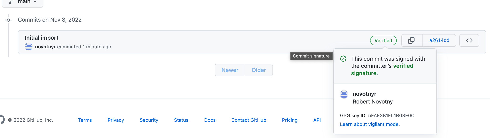
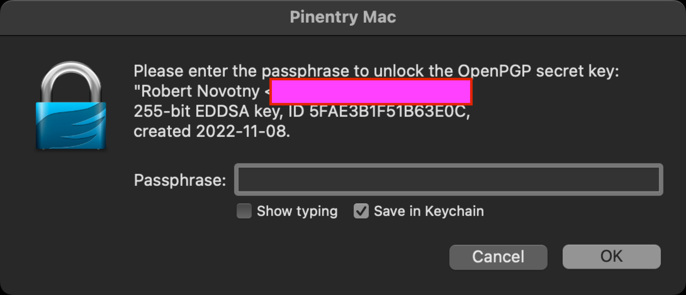
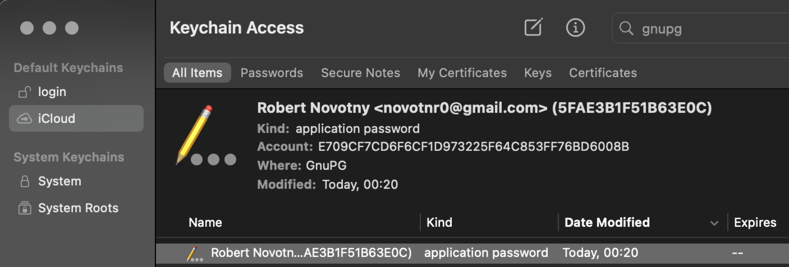
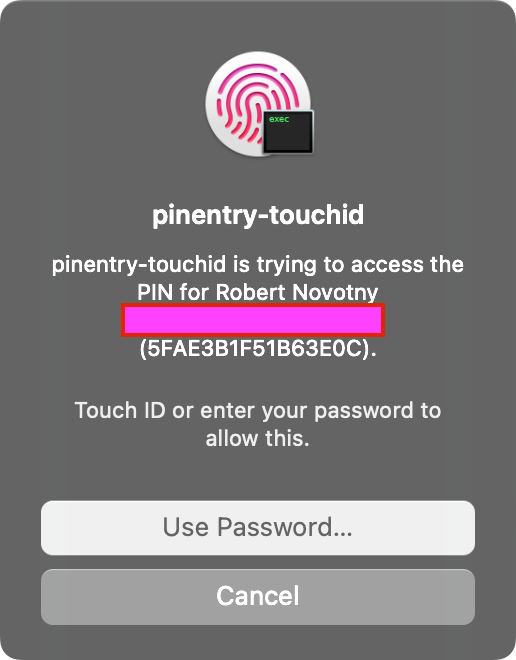

Nainštalujme `gpg`:

[source,bash]
----
brew install gpg
----

Nagenerujeme pár kľúčov:

[source,bash]

----
gpg --full-generate-key
----

Vznikne adresár v domovskom priečinku `~/.gnupg`.
Pozrime jeho výpis.

----
ls ~/.gnupg
----

Vypíšme kľúče:

[source,bash]
----
gpg --list-secret-keys --keyid-format=long
----

Uvidíme:
--------------------------------------
/Users/novotnyr/.gnupg/pubring.kbx
----------------------------------
sec   ed25519/5FAE3B1F51B63E0C 2022-11-08 [SC]
      15E5B5BA00311CEF2DD287D55FAE3B1F51B63E0C
uid                 [ultimate] Robert Novotny <redacted@gmail.com>
ssb   cv25519/3631AF913E983143 2022-11-08 [E]
--------------------------------------

Identifikátor je *5FAE3B1F51B63E0C*.

Exportnime do súboru

----
gpg --armor --export 5FAE3B1F51B63E0C
----

Export pridáme do UI GItHubu: https://github.com/settings/keys[GitHub Settings > Keys]

Overme, že podpisovanie funguje v základe:

----
echo "test" | gpg --clearsign
----

`gpg` si poprosí heslo k privátnemu kľúču cez dialóg v termináli a následne vypíše napr.

----
-----BEGIN PGP SIGNED MESSAGE-----
Hash: SHA512

test
-----BEGIN PGP SIGNATURE-----

iHUEARYKAB0WIQQV5bW6ADEc7y3Sh9VfrjsfUbY+DAUCY2wpmgAKCRBfrjsfUbY+
DLPXAPwN14IsjXqdvYbLVkTE50iwFNtRa5dLiVSHBW0jEftHQAD/W32zK7mORXjw
G9XM7aQmy1aw03bQ0gF58ZsGoorE3wg=
=ysBj
-----END PGP SIGNATURE------
----

Možno uvidíme chybu s `ioctl`:

----
gpg: signing failed: Inappropriate ioctl for device
gpg: [stdin]: clear-sign failed: Inappropriate ioctl for device
----

Tá istá chyba nastáva, ak spustíme `git` s podpisovaní:

----
error: gpg failed to sign the data
fatal: failed to write commit object
----

Exportnime terminál pre `gpg`.

----
export GPG_TTY=$(tty)
----

Zopakujme test.
Ak uspeje, komitnime:

----
git commit -S -m "Initial import"
----
Prepínač `-S` zapne podpisovanie komitov.

Pushnime komity:

----
git push
----

Uvidím verifikovaný komit:

TIP: Exportovanie `GPG_TTY` dodajme do profilu v shelli, napr. do `.zshrc`.

== Bonusové príkazy

=== Reštart agenta

Reštart agenta, aby si pýtal heslo:

----
gpgconf --kill gpg-agent
----

=== Pinentry pre Mac

Príkaz `pinentry` si dokáže pýtať heslo v grafickom okne.

Pre MacOS:

    brew install pinentry-mac

Konfigurácia:

    echo 'use-agent' > ~/.gnupg/gpg.conf
    echo "pinentry-program $(brew --prefix)/bin/pinentry-mac" >> ~/.gnupg/gpg-agent.conf

Pre istotu reštartnime:

    gpgconf --kill gpg-agent

Následne opakujme šifrovanie.
Namiesto textového políčka uvidíme:

V Keychaine uvidíme záznamy po vyhľadaní `GnuPG`:

=== Pinentry pre odtlačok prsta

Doinštalujme:

    brew tap jorgelbg/tap
    brew install pinentry-touchid

Zariaďme sa podľa inštrukcií `homebrew`:

- Založenie symlinku:

    /usr/local/opt/pinentry-touchid/bin/pinentry-touchid -fix

- Úprava ~/.gnupg/gpg-agent.conf:

    pinentry-program /usr/local/opt/pinentry-touchid/bin/pinentry-touchid

- Reload agenta

    gpg-connect-agent reloadagent /bye

- Zákaz „Save in Keychain“

    defaults write org.gpgtools.common DisableKeychain -bool yes

- Skusmo podpíšme.
Ak sa systém spýta na povolenie ku keychainu, tak „Always Allow“.

== Ďalšie zdroje

- https://gist.github.com/paolocarrasco/18ca8fe6e63490ae1be23e84a7039374[github.com/paolocarrasco Gist]
- https://docs.github.com/en/authentication/managing-commit-signature-verification[GitHub: Managing commit signature verification]
- https://docs.gitlab.com/ee/user/project/repository/gpg_signed_commits/[GitLab: GPG-signed commits]
- https://github.com/jorgelbg/pinentry-touchid[`jorgelbg/pinentry-touchid`]