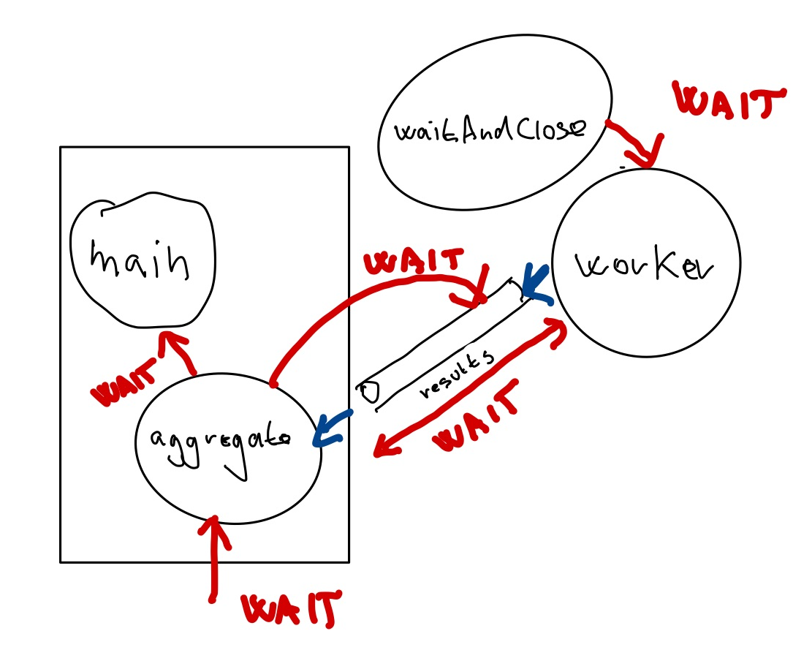

:icons: font

== Tisíc zlatých, tisíc zlatých gorutín

V minulom dieli sme spúšťali jedinú gorutinu, ale je čas pridať plyn.

Spustime tisíc gorutín, ktoré si sekundu pospia a potom vypíšu bodku.

Ukážme si zároveň, ako je možné spustiť anonymnú funkciu v gorutine.

[source,go]
----
package main

import (
	"log"
	"time"
)

func main() {
	for i := 0; i < 1000; i++ {
		go func() { //<1>
			time.Sleep(1 * time.Second)
			log.Printf(".\n")
		}()
	}
}
----
<1> Spúšťame anonymnú funkciu ako gorutinu.

Ak to však spustíme, neuvidíme nič.

Dôvodom je opäť príliš rýchla gorutina `main`, ktorá vypáli salvu, ale skončí skôr než korutiny, ktoré potrebujú zhruba sekundu.

== Čakanie cez `WaitGroup`

Na jednu gorutinu sme čakali pomocou nebufferovaného kanála.

Na vyčkávanie dobehnutia viacerých gorutín sa používa **WaitGroup**.

NOTE: V Jave je ekvivalentom `CountdownLatch`.

_WaitGroup_ je závora s počítadlom.

Na začiatku nastavíme počítadlo na počet gorutín, ktoré očakávame.
Spustíme jednotlivé gorutiny a čakáme pri závore obdivujúc počítadlo.
Každá dobehnutá gorutina ho zníži o jedna a kk je počítadlo na nule, závora sa dvihne a pokračujeme v behu programu.

_WaitGroup_ má nasledovné schopnosti:

- `Add`: zvýši interné počítadlo.
Používané pri spustení novej gorutiny.
- `Done`: gorutina po dobehnutí zníži počítadlo.
- `Wait`: v hlavnej gorutine čakáme, kým sa počítadlo nezníži na nulu.

[source,go]
----
package main

import (
	"log"
	"sync"
	"time"
)

func main() {
	var wg sync.WaitGroup //<1>
	for i := 0; i < 10000; i++ {
		wg.Add(1) //<2>
		go func() {
			time.Sleep(1 * time.Second)
			log.Printf(".\n")
			wg.Done() //<3>
		}()
	}
	wg.Wait() //<4>
}
----
<1> Pripravíme si premennú typu `WaitGroup`.
<2> Pred každým spustením gorutiny navýšime počítadlo.
<3> V rámci gorutiny indikujeme, že gorutina dobehla, čím znížime počítadlo.
<4> Čakáme -- blokujeme hlavnú gorutinu -- kým všetkých desaťtisíc gorutín nedobehne.

Ak to spustíme, uvidíme desaťtisíc logovacích záznamov s bodkami.

Ak chceme vidieť podrobnosti, upravme logovacie záznamy.

[source,go]
----
package main

import (
	"log"
	"sync"
	"time"
)

func main() {
	log.SetFlags(log.Ltime | log.Lmicroseconds) //<1>
	var wg sync.WaitGroup
	for i := 0; i < 10000; i++ {
		wg.Add(1)
		go func() {
			time.Sleep(1 * time.Second)
			log.Printf("%d\n", i) //<2>
			wg.Done()
		}()
	}
	wg.Wait()
}
----
<1> Vypisujme mikrosekundy pri logovacích záznamoch.
<2> Vypíšme identifikátor gorutiny pomocou indexu, ktorý spôsobil jej spustenie.

[IMPORTANT]
.Premenné v iterácii a premenné v gorutinách
====
Prostredie nás upozorní, že použitie premennej `i`, ktorá sa iteruje v cykle, nie je korektné.

    Loop variables captured by 'func' literals in 'go' statements might have unexpected values

Opravme to!
====

[source,go]
----
log.SetFlags(log.Ltime | log.Lmicroseconds)
var wg sync.WaitGroup
for i := 0; i < 10000; i++ {
    wg.Add(1)
    i := i //<1>
    go func() {
        time.Sleep(1 * time.Second)
        log.Printf("%d\n", i) //<2>
        wg.Done()
    }()
}
wg.Wait()
----
<1> Vytvorme lokálnu premennú, ktorý vyrieši problém s použitím iteračnej premennej vo vnútri gorutiny.
+
Toto síce vyzerá zvláštne, ale je to https://go.dev/doc/faq#closures_and_goroutines[obvyklý trik] spomínaný v oficiálnom FAQ.
<2> Použijeme lokálnu premennú namiesto iteračnej z cyklu `for`.

Teraz uvidíme štrúdlik výpisov:

----
00:11:36.038469 9988
00:11:36.038472 9990
00:11:36.038474 9994
00:11:36.038483 9998
00:11:36.038482 9996
----
Vidíme, že poradie výpisu sa nemusí dodržať -- hodnoty sa vypisujú paralelne!

== Gorutiny s výsledkom

Poďme vážiť zvieratá paralelne.

Najprv si pripravme dáta:

[source,go]
----
type Animal struct {
	species string
	weight  int
}

var animals = []Animal{
	Animal{"slon", 12},
	Animal{"hroch", 4},
	Animal{"nosorožec", 4},
	Animal{"žirafa", 2},
	Animal{"bizón", 2},
	Animal{"veľryba", 190},
}
----

Pre každé zviera pustíme gorutinu a výsledok -- hmotnosť každého zvieraťa -- pošleme do spoločného kanála.

Ak vieme ich presný počet, situáciu to zjednodušuje, pretože sa vieme zbaviť čakania medzi producentami a konzumentom.

[IMPORTANT]
====
Bufferovaný kanál (_buffered channel_) je kanál s konkrétnou kapacitou.

Zápis do kanála blokuje len vtedy, ak je kanál plný -- teda kapacita by sa prekročila.

Čítanie blokuje len vtedy, ak je kanál prázdny.
====

Ak vytvoríme kanál s takou kapacitou, koľko máme zvierat -- napríklad 6 -- šesť gorutín dokáže zapísať 6 výsledkov bez čakania na konzumenta.

Plán je teda nasledovný:

. Vytvoríme bufferovaný kanál s kapacitou.
. Spustíme gorutiny -- pre každé zviera jednu.
Každý gorutina zapíše výsledok do bufferovaného kanála.
. Počkáme na dobehnutie všetkých gorutín cez _WaitGroup_.
. Uzavrieme kanál s výsledkami.
. Načítame jednotlivé hmotnosti zvierat a získame celkový súčet.

=== Vytváranie bufferovaného kanála

Bufferovaný kanál má kapacitu uvedenú v druhom argumente:

[source,go]
----
results := make(chan int, len(animals)) //<1>
----
<1> Pre 6 zvierat máme kapacitu kanála nastavenú na 6 prvkov.

Potom jadro:

[source,go]
----
func main() {
	results := make(chan int, len(animals))

	var wg sync.WaitGroup
	for _, a := range animals {
		wg.Add(1)

		a := a //<3>
		go func() { //<1>
			time.Sleep(1 * time.Second)
			log.Printf("%s\n", a.species)
			results <- a.weight //<2>
			wg.Done()
		}()
	}
	wg.Wait() //<4>
	close(results) //<5>
	aggregateResults(results) //<6>
}
----
<1> Spustíme gorutinu pre každé zviera.
<2> Do spoločného kanála zapíšeme výsledok.
<3> Nezabudneme použiť trik s premennou cyklu používanej v gorutine.
<4> Čakáme na gorutiny cez _waitgroup_.
<5> Uzatvoríme kanál s výsledkami.
<6> Začneme čítať výsledky v samostatnej funkcii.

Agregácia výsledkov znamená čítanie z kanála.

[source,go]
----
func aggregateResults(results <-chan int) {
	total := 0
	for result := range results {
		log.Printf("%d\tPartial\n", result)
		total = total + result
	}
	log.Printf("Total: %d\n", total)
}
----

TIP: Nezabudnime zistiť, či čítame znižovaním počítadla s výsledkami alebo explicitným uzavretím kanála.
V príklade zatvárame kanál explicitne a používame kombináciu `range` a `for`.

[IMPORTANT]
====
Kanál slúži ako zdieľaný _slice_ (pole) pre spoločné výsledky.
Na rozdiel od bežného poľa či _slice_ je zápis do tejto štruktúry bezpečný a nenastávajú konkurentné problémy.

Na rozdiel od iných jazykov nemusíme používať mutexy či iné zámky.
====

== Gorutiny s neznámym počtom vstupov

Čo keď nepoznáme počet riadkov? Bufferovaný kanál nepomôže, keďže nevieme nastaviť jeho kapacitu.

Dajme si prvý nefunkčný nástrel.

[source,go]
----
func main() {
	results := make(chan int) //<1>
	var wg sync.WaitGroup
	for _, animal := range animals {
		wg.Add(1)
		a := animal //<3>
		go func() {
			time.Sleep(1 * time.Second)
			log.Printf("%s\n", a)
			results <- a.weight //<2>
			wg.Done()
		}()
	}
	wg.Wait()
}
----
<1> Vytvorme komunikačný _kanál_, ktorým budú tiecť celé čísla `int`.
<2> Pre každé zviera zistíme jeho hmotnosť a zapíšeme do kanála.
<3> Nezabudnime na trik s premennou iterácie, ktorá sa používa v gorutine.

Ak spustíme kód, uvidíme 6 riadkov a nakoniec pád:

[source]
----
fatal error: all goroutines are asleep - deadlock!

goroutine 6 [chan send]:
main.main.func1()
----

V programe sa deje viacero vecí.

. Gorutiny zapisujú do spoločného kanála paralelne -- predstavujú producentov.
. Kanál, ktorý používame, je nebufferovaný (_unbuffered_), a teda každý _producent_ čaká (_blokuje_) na zápis dovtedy, kým sa z kanála nečíta.

Z kanála `results` však nikto nečíta -- keďže sme nič také nenaprogramovali -- a teda nastáva _deadlock_, pretože _producenti_ (_gorutiny_) čakajú so zápisom na *Go*-dotov, ktorí nikdy neprídu.

Tento fenomén Go dokázal identifikovať počas behu, a teda ukončil program s fatálnou chybou.

== Konzument výsledkov

Pripravme si funkciu, ktorá bude konzumovať výsledky čítaním z kanála.

Čítanie však musíme vedieť ukončiť, a to:

. buď počítaním výsledkov,
. alebo uzatvorením kanála.

=== Počítanie výsledkov

Začnime počítaním výsledkov.
Ak vieme koľko riadkov pošleme do gorutiny, vieme tiež, koľko výsledkov očakávame.

[source,go]
----
func aggregateResults(results <-chan int, expectedResults int) { //<1>
	for i := expectedResults; i > 0; i-- { //<2>
		log.Printf("%d\tPartial\n", <-results) //<3>
	}
}
----
<1> Berieme kanál, z ktorého čítame a počet výsledkov, ktoré prídu.
<2> Načítame toľko výsledkov, koľko treba.
<3> Čítame z kanála (s blokovaním) a vypisujeme.

Hlavná funkcia potom navyšuje počítadlo úloh a po spustení gorutín zavolá agregáciu:

[source,go]
----
func main() {
	results := make(chan int)
	animalCount := 0 //<1>
	var wg sync.WaitGroup
	for _, animal := range animals {
		wg.Add(1)
		a := animal
		animalCount++ //<2>
		go func() {
			time.Sleep(1 * time.Second)
			log.Printf("%s\n", a)
			results <- a.weight
			wg.Done()
		}()
	}
	aggregateResults(results, animalCount) //<3>
	wg.Wait()
}
----
<1> Inicializujeme počítadlo riadkov.
<2> S každým načítaným riadkom zvýšime počítadlo.
<3> Agregujeme výsledky.

[IMPORTANT]
====
Agregáciu výsledkov musíme urobiť *pred* čakaním na gorutiny.

Ak by sme najprv čakali a potom agregovali, mali by sme _deadlock_:

. Hlavná gorutina (`main`) by čakala na dobehnutie gorutín s úlohami a až potom začala čítať z kanála výsledkov.
. Gorutiny s úlohami by počas behu čakali so zápisom do kanála výsledov na čítanie z hlavnej gorutiny.
====

=== Konzument výsledkov s uzatváraním kanála

Ukážme si variant, ktorý využíva uzatváranie kanála.

Pripravme si funkciu, ktorá bude konzumovať výsledky:

[source,go]
----
func aggregateResults(results <-chan int) {
	for result := range results { //<1>
		log.Printf("%d\tPartial\n", result)
	}
}
----
<1> Pomocou cyklu vieme postupne čítať hodnoty z kanála.

IMPORTANT: Je veľmi dôležité, kde ju použijeme a ako ju použijeme.
Veľmi ľahko si vieme vyrobiť deadlock!

Tento kód niekedy fungovať bude, niekedy nie.

[source,go]
----
func main() {
	results := make(chan int)
	var wg sync.WaitGroup
	for _, animal := range animals {
		wg.Add(1)
		a := animal
		go func() {
			time.Sleep(1 * time.Second)
			log.Printf("%s\n", a)
			results <- a.weight
			wg.Done()
		}()
	}
	aggregateResults(results) //<1>
	wg.Wait()
}
----
<1> Funkciu spustíme klasicky po spracovaní výsledkov.

Uvedený kód sa správa nepredvídateľne, napríklad:

[source]
----
09:28:52.615693 slon: 12 tony
09:28:52.615791 12      Partial
09:28:52.615723 nosorožec: 4 tony
09:28:52.615806 4       Partial
09:28:52.615728 veľryba: 190 tony
09:28:52.615810 190     Partial
09:28:52.615729 bizón: 2 tony
09:28:52.615813 2       Partial
09:28:52.615726 hroch: 4 tony
09:28:52.615738 žirafa: 2 tony
09:28:52.615829 4       Partial
09:28:52.615832 2       Partial
fatal error: all goroutines are asleep - deadlock!
----

Vidíme šesť podvýsledkov a potom deadlock.

Funkcia `aggregateResult` číta 6 čiastočných výsledkov z kanála a potom deadlockne -- začne čakať na siedmy výsledok, ktorý nikdy nepríde, pretože program sa ukončí.
Nezabúdajme, že `for` a `range` nad kanálom čaká na uzatvorenie kanála!

[IMPORTANT]
====
Aj tu je dôležité najprv agregovať výsledky a potom čakať na dobehnutie korutín.
====

=== Patlanie s kódom

Ak by sme začaliť bezducho patlať a napríklad vymenili `aggregateResult` a `Wait`, nepomohli by sme si.
Nastal by deadlock iného typu -- producenti by čakali na konzumenta, ktorý by sa spustil až po `Wait`-e, a do toho by ešte čakal aj `Wait` (má to v popise práce).

=== Uvoľnenie deadlockov

V kóde máme v skutočnosti tri druhy aktériek: hlavnú gorutinu (`main`), sadu gorutín a funkciu `aggregateResult`.
Každá čaká na každého, čo musíme rozseknúť.

. Hlavná gorutina čaká vo `Wait` na dobehnutie vážiacich gorutín.
. Vážiace gorutiny čakajú na konzumovanie z `aggregateResult` (cez nebufferovaný kanál).
. Funkcia `aggregateResult` v hlavnej gorutine čaká na výsledky z gorutín a ešte na uzatvorenie kanála.

NOTE: Riešenie je spustiť ešte jednu aktérku v gorutine.

==== Čakanie na gorutiny v gorutine

Jeden z trikov použije čakanie na _WaitGroup_ a následné uzavretie kanála v samostatnej gorutine.

[source,go]
----
func main() {
	log.SetFlags(log.Ltime | log.Lmicroseconds)

	results := make(chan int)
	var wg sync.WaitGroup
	for _, animal := range animals {
		wg.Add(1)
		a := animal
		go func() {
			time.Sleep(1 * time.Second)
			log.Printf("%s: %d tony\n", a.species, a.weight)
			results <- a.weight
			wg.Done()
		}()
	}
	go func() { //<1>
		wg.Wait()
		close(results) //<2>
	}()
	aggregateResults(results)
}
----
<1> Čakanie na dobehnutie _WaitGroup_ uskutočníme v gorutine.
<2> Ak gorutiny dobehnú, máme garantovane všetky výsledky zapísané do výstupného kanála a môžeme ho zatvoriť.

Stav je nasledovný:

. Gorutiny vážiace zvieratá blokujú pri zápise, kým  `aggregateResult` nezačne čítať z kanála a naopak.
To je v poriadku.
. Čakanie na dobehnutie gorutín cez `WaitGroup` sa deje v samostatnej gorutine, ktorá neblokuje čítanie výsledkov z `aggregateResult`.
Slovom, `main` naposiela salvu údajov a obratom začne čakať na výsledky v `aggregateResult`.
. Ak všetky vážiace gorutiny dobehli, zatvoríme kanál a tým odblokujeme čakanie na koniec vo funkcii `aggregateResults`.
. Funkcia `aggregateResult` pri čakaní na koniec kanála zároveň zabraňuje predčasnému ukončeniu programu.

[IMPORTANT]
====
Čítanie a zápis do kanála z rovnakej gorutiny vedie k deadlocku.

Uzavretie kanála cez `close` je druh zápisu.
====

=== Upratovanie v kóde

Upracme ešte v kóde. Predovšetkým, kódy v korutinách odsuňme do samostatných funkcií.

Založme funkciu pre gorutinu:

[source,go]
----
func worker(a Animal, results chan<- int, wg *sync.WaitGroup) { //<1>
	time.Sleep(1 * time.Second)
	log.Printf("%s: %d tony\n", a.species, a.weight)
	results <- a.weight
	wg.Done()
}
----
<1> Nezabudnime posielať `WaitGroup` ako pointer.

Funkcia `aggregateResult` bude naozaj agregovať:

[source,go]
----
func aggregateResults(results <-chan int) {
	total := 0
	for result := range results {
		log.Printf("%d\tPartial\n", result)
		total += result
	}
	log.Printf("%d\tTotal Weight\n", total) //<1>
}
----
<1> Vypíšeme celkový výsledok.

Čakanie na `WaitGroup` bude v samostatnej grupe.

[source,go]
----
func waitAndClose(wg *sync.WaitGroup, results chan<- int) {
	wg.Wait()
	close(results)
}
----

Hlavná funkcia sa sprehľadní.

[source]
----
func main() {
	log.SetFlags(log.Ltime | log.Lmicroseconds)

	results := make(chan int)
	wg := new(sync.WaitGroup) //<1>
	for _, animal := range animals {
		wg.Add(1)
		a := animal
		go worker(a, results, wg) //<2>
	}
	go waitAndClose(wg, results) //<3>
	aggregateResults(results) //<4>
}
----
<1> `WaitGroup` inicializujeme rovno ako pointer.
<2> Funkciu pre váženie zavoláme ako gorutinu.
<3> Čakanie na výsledky tiež pôjde v gorutine
<4> Agregácia na výsledky nemusí ísť v gorutine, tá blokuje pri čakaní na zápis z gorutiny pre `worker`-ov.

Všimnime si, ako sme sa zbavili cyklov; nestane sa, že aktér čaká na iného aktéra, ktorý naňho nepriamo tiež čaká.