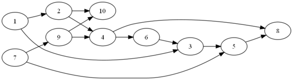
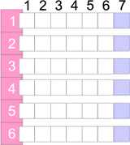
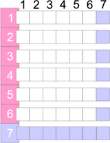

# Matica incidencií
V minulom príklade pre topologické triedenie sme používali vlastnú dátovú štruktúru,
ktorá umožňovala jednoduché a efektívne vykonávanie operácií nad grafom (hľadanie
uzla bez predchodcov, hľadanie nasledovníkov). *Graf* ako matematická
štruktúra má ešte niekoľko ďalších spôsobov reprezentácie v programovacích jazykoch.

Jednou z možností je použitie *matice incidencie*, čo je tabuľka s *n* riadkami
a stĺpcami (kde *n* je počet uzlov v grafe). Prvok v *r*-tom riadku a *s*-tom
stĺpci má hodnotu 1, ak v grafe existuje *hrana* (teda prepojenie) medzi
*r*-tým a *s*-tým uzlom.



Matica incidencie pre graf na obrázku má 10 riadkov a 10 stĺpcov.

|      | 1    | 2    | 3    | 4    | 5    | 6    | 7    | 8    | 9    | 10   |
| ---- | ---- | ---- | ---- | ---- | ---- | ---- | ---- | ---- | ---- | ---- |
| 1    |      | X    |      |      |      |      |      |      |      |      |
| 2    |      |      |      |      |      |      |      |      |      |      |
| 3    |      |      |      |      |      |      |      |      |      |      |
| 4    |      |      |      |      |      |      |      |      |      |      |
| 5    |      |      |      |      |      |      |      |      |      |      |
| 6    |      |      |      |      |      |      |      |      |      |      |
| 7    |      |      |      |      |      |      |      |      |      |      |
| 8    |      |      |      |      |      |      |      |      |      |      |
| 9    |      |      |      |      |      |      |      |      |      |      |
| 10   |      |      |      |      |      |      |      |      |      |      |

Na obrázku máme napr. hranu z uzla 1 do uzla 2, preto v matici incidencie
dáme na 1. riadok a 2. stĺpec značku (napr. *X*).
Ďalšia hrana je medzi uzlom 2. a 4., čiže v 2. riadku a 4. stĺpci je 
značka. 
Týmto spôsobom pokračujeme až kým nevyplníme celú maticu:

|      | 1    | 2    | 3    | 4    | 5    | 6    | 7    | 8    | 9    | 10   |
| ---- | ---- | ---- | ---- | ---- | ---- | ---- | ---- | ---- | ---- | ---- |
| 1    |      | X    | X    |      |      |      |      |      |      |      |
| 2    |      |      |      | X    |      |      |      |      |      | X    |
| 3    |      |      |      |      | X    |      |      |      |      |      |
| 4    |      |      |      |      |      | X    |      |      |      |      |
| 5    |      |      |      |      |      |      |      | X    |      |      |
| 6    |      |      | X    |      |      |      |      |      |      |      |
| 7    |      |      |      |      | X    |      |      |      | X    |      |
| 8    |      |      |      |      |      |      |      |      |      |      |
| 9    |      |      |      | X    |      |      |      |      |      | X    |
| 10   |      |      |      |      |      |      |      |      |      |      |

Na tejto matici vieme potom vykonávať rôzne operácie zodpovedajúce
veciam, ktoré chceme z grafu zistiť, či ukázať.

## Nasledovníci uzla

*Počet nasledovníkov uzla* vieme zistiť podľa počtu značiek v riadku zodpovedajúcom
danému uzlu.

*Konkrétnych nasledovníkov uzla* zistíme tak, že sa pozrieme do riadku
zodpovedajúcemu danému uzlu a tie stĺpce, v ktorých je značka, zodpovedajú
uzlom nasledovníkov. Potom je jasné, že *uzol bez nasledovníkov* má zodpovedajúci riadok prázdny.

V nasledovnej tabuľke nemajú uzly 8 a 10 žiadnych nasledovníkov, uzol
s 1 má dvoch nasledovníkov (2 a 3).

## Predchodcovia uzla

Ak chceme zistiť *počet predchodcov uzla*, pozrieme sa na počet značiek v stĺpci zodpovedajúcom
danému uzlu. *Konkrétnych predchodcov uzla* zistíme pohľadom do stĺpca
zodpovedajúcemu danému uzlu a riadky, v ktorých je značka, zodpovedajú 
predchodcom. *Uzol bez predchodcov* má zodpovedajúci stĺpec prázdny.

V nasledovnej tabuľke nemajú uzly 1 a 7 žiadnych nasledovníkov, uzol
3 má dvoch predchodcov (1 a 6).

## Pridanie uzla do grafu
Ak chceme pridať uzol grafu, znamená to pridanie nového
riadka a stĺpca do matice.

|      | 1    | 2    | 3    | 4    | 5    | 6    | 7    | 8    | 9    | 10   | 11   |
| ---- | ---- | ---- | ---- | ---- | ---- | ---- | ---- | ---- | ---- | ---- | ---- |
| 1    |      | X    | X    |      |      |      |      |      |      |      | .    |
| 2    |      |      |      | X    |      |      |      |      |      | X    | .    |
| 3    |      |      |      |      | X    |      |      |      |      |      | .    |
| 4    |      |      |      |      |      | X    |      |      |      |      | .    |
| 5    |      |      |      |      |      |      |      | X    |      |      | .    |
| 6    |      |      | X    |      |      |      |      |      |      |      | .    |
| 7    |      |      |      |      | X    |      |      |      | X    |      | .    |
| 8    |      |      |      |      |      |      |      |      |      |      | .    |
| 9    |      |      |      | X    |      |      |      |      |      | X    | .    |
| 10   |      |      |      |      | X    |      |      |      | X    |      | .    |
| 11   | .    | .    | .    | .    | .    | .    | .    | .    | .    | .    | .    |

## Odobratie uzla z grafu
Odobratie uzla z grafu znamená odstránenie príslušného
riadka a stĺpca z matice. S odstránením uzla sa
samozrejme odstránia aj hrany vychádzajúce a vchádzajúce
do uzla. 

Ak odstránime uzol 6, matica sa nám zmenší o jeden riadok
a jeden stĺpec.

|      | 1    | 2    | 3    | 4    | 5    |  6   | 7    | 8    | 9    | 10   |
| ---- | ---- | ---- | ---- | ---- | ---- | :--: | ---- | ---- | ---- | ---- |
| 1    |      | X    | X    |      |      |  \|  |      |      |      |      |
| 2    |      |      |      | X    |      |  \|  |      |      |      |      |
| 3    |      |      |      |      | X    |  \|  |      |      |      |      |
| 4    |      |      |      |      |      |  \|  |      |      |      |      |
| 5    |      |      |      |      |      |  \|  |      |      | X    |      |
| 6    | ---  | ---  | ---  | ---  | ---  |  +   | ---  | ---  | ---  | ---  |
| 7    |      |      |      |      | X    |  \|  |      |      |      | X    |
| 8    |      |      |      |      |      |  \|  |      |      |      |      |
| 9    |      |      |      | X    |      |  \|  |      |      |      |      |
| 10   |      |      |      |      | X    |  \|  |      |      |      | X    |

## Pridanie hrany do grafu
Pridanie hrany medzi dvoma uzlami *X* a *Y*
znamená nastavenie značky v *X*-tom riadku a *Y*-tom
stĺpci.

## Odobratie hrany z grafu
Odobratie hrany medzi dvoma uzlami *X* a *Y*
znamená zrušenie značky v *X*-tom riadku a *Y*-tom
stĺpci.

# Implementácia v Jave
Implementácia grafu založeného na matici incidencií v Jave
je založená na dvoch triedach: uzle a grafe.

Uzol `Uzol` je jednoduchá trieda - uzol je charakterizovaný
svojim popiskom.
```java

public class Uzol {
  private String label;

  public Uzol(String label) {
    super();
    this.label = label;
  }

  public String getLabel() {
    return label;
  }

  public void setLabel(String label) {
    this.label = label;
  }
}
```
Samotný graf, v tomto prípade s názvom `IncidenceMatrix`,
triedou obaľujúcou maticu incidencií a poskytujúcou metódy na prácu s ňou.

Maticu môžeme reprezentovať ako zoznamom zoznamov, inak povedané
ako objektom typu `List<List<Boolean>`. Tento zoznam si možno
predstaviť ako zoznam riadkov v matici, kde každý riadok predstavuje
samostatný zoznam booleovských položiek. 

Okrem toho budeme v triede udržiavať samostatný zoznam objektov `Uzol`.
Objekt typu `Uzol` v tomto zozname sa nachádza na nejakom indexe.
Napr. desiaty uzol má index 9 a v matici incidencií mu zodpovedá 
zoznam s indexom 9, resp. prvky v zoznamoch s indexom 9.

```java
public class IncidenceMatrix {
  private List<List<Boolean>> matica = new ArrayList<List<Integer>>();

  private List<Uzol> uzly = new ArrayList<Uzol>();
```

## Pridanie uzla do grafu
Ako sme spomínali vyššie, pridanie uzla do grafu zodpovedá pridaniu
nového riadka a nového stĺpca. Ako sa to prejaví v prípade zoznamu zoznamov?
Rozdeľme si túto operáciu na dva (plus jeden) kroky:

1.  každý z existujúcich zoznamov predĺžime o jeden prvok - tým pridáme do matice jeden „stĺpec".



1.  do zoznamu zoznamov pridáme nový zoznam (zodpovedajúci novému riadku), ktorý má dĺžku rovnú aktuálnemu počtu uzlov + 1. (Ak pridávame do matice desiaty uzol, nový zoznam musí mať dĺžku 9 + 1, teda 10.) V každom prvku bude `false`.



1.  do zoznamu uzlov pridajme nový prvok zodpovedajúci aktuálne pridávanému uzlu.

Tomu zodpovedá metóda `pridajUzol()`, ktorou pridáme uzol do grafu.
```java
public void pridajUzol(Uzol uzol) {
  // na koniec kazdeho zoznamu prida *false*
  for(List<Boolean> matica : matica) {
    matica.add(false);
  }

  // prida novy zoznam dlzky pocetUzlov + 1 naplneny *false*
  List<Boolean> riadok = new ArrayList<Boolean>();
  for(int i = 0; i < uzly.size() + 1; i++) {
    riadok.add(false);
  }   
  matica.add(riadok);
  // prida uzol do zoznamu uzlov
  uzly.add(uzol);
}
```
## Odstránenie uzla z grafu
Odstránenie uzla je opačnou operáciou aj v zmysle vykonaných činností.
Pre daný uzol si zistíme jeho index (na to použijeme metódu `indexOf()`
na zozname `java.util.List`, ktorá vráti index prvého výskytu daného
objektu v ňom) *k*. Z matice potom odstránime *k*-ty zoznam
a z každého zoznamu odstránime *k*-ty prvok.
```java
protected void odstráňUzol(Uzol node) {
  // zisti index daného uzla
  int index = uzly.indexOf(node);
  if(index == -1) {
    // taký uzol nejestvuje, nerobíme nič
    return;
  }
  // z matice odstránime príslušný zoznam  
  matica.remove(index);
  // z každého riadka v matici odstránime príslušnú bunku
  for (List<Integer> matica : matica) {
    matica.remove(index);
  }
  // zo zoznamu uzlov vyhodíme daný uzol
  uzly.remove(node);
}
```
## Pridanie hrany do grafu
Ďalšou užitočnou operáciou je pridanie hrany medzi dvoma uzlami. V grafickom
znázornení to zodpovedá natiahnutiu čiary medzi dvoma „guličkami". Ak
máme v grafe dva existujúce uzly *C* a *F*, stačí nájsť
v zozname uzlov ich zodpovedajúce indexy. Ak má uzol *C*
index 5 a uzol *F* index 8, hrana medzi uzlami znamená
nastavenie značky v riadku s indexom 5 na pozícii osem. To je samozrejme
v prípade, že hrany sú orientované - čiže môžeme prejsť z *C*
do *F*, ale nie naopak. Ak máme neorientované hrany,
musíme ju nastaviť aj v opačnom smere, teda aj na riadku s indexom
osem na prvku s pozíciou 5.


|      | 0    | 1    | 2    | 3    | 4    | 5    | 6    | 7    | 8    | 9    |
| ---- | ---- | ---- | ---- | ---- | ---- | ---- | ---- | ---- | ---- | ---- |
| 0    |      | X    | X    |      |      |      |      |      |      |      |
| 1    |      | X    | X    |      |      |      |      |      |      |      |
| 2    |      |      |      | X    |      |      |      |      |      | X    |
| 3    |      |      |      |      | X    |      |      |      |      |      |
| 4    |      |      |      |      |      | X    |      |      |      |      |
| 5    |      |      |      |      |      |      | X    |      | X    |      |
| 6    |      |      | X    |      |      |      |      |      |      |      |
| 7    |      |      |      |      | X    |      |      |      | X    |      |
| 8    |      |      |      |      |      |      |      |      |      |      |
| 9    |      |      |      | X    |      |      |      |      |      | X    |


Metóda vyzerá nasledovne:
```java
public void pridajHranu(Uzol node1, Uzol node2) {
  // zistíme index prvého uzla
  int index1 = uzly.indexOf(node1);
  if(index1 == -1) {
    // taký uzol neexistuje!
    throw new IllegalArgumentException("Uzol v grafe neexistuje! " + node1);
  }
  // zistíme index druhého uzla
  int index2 = uzly.indexOf(node2);
  if(index2 == -1) {
    // taký uzol neexistuje!
    throw new IllegalArgumentException("Uzol v grafe neexistuje! " + node2);
  }   
  // na index1-tom zozname nastavíme hodnotu na pozícii index2 na true
  matica.get(index1).set(index2, true);
  // pre neorientovane hrany tiez matica.get(index2).set(index1, true);
}
```

# Algoritmus topologického triedenia na matici incidencií
## Topologické triedenie
V predošlom článku sme spomínali pekný algoritmus riešiaci problém
správneho poradia pri zápise predmetov v študijnom programe
nazývaný *topologické triedenie*.

Algoritmus bol jednoduchý:

1.  nájdime v grafe uzol bez predchodcov, vypíšme ho. Ak uzol nejestvuje, končíme.
1.  prejdime zoznam jeho nasledovníkov. Každému nasledovníkovi znížme počet predchodcov o 1...
1.  ... pretože tento uzol bez predchodcov z grafu vyhodíme.
1.  prejdime na krok 1.

Samotná implementácia v Jave zodpovedá priamo algoritmu:
```java
public void topologickeTriedenie() {
  Uzol uzolBezPredchodcov = null;
  while((uzolBezPredchodcov = hľadajUzolBezPredchodcov()) != null) {
    System.out.println(uzolBezPredchodcov);
    odstráňUzol(uzolBezPredchodcov);     
  }
  if(!uzly.isEmpty()) {
    throw new IllegalStateException("V grafe sú cykly.");
  }
}
```
Metóda `hľadajUzolBezPredchodcov()` nájde v grafe uzol, ktorý nemá predchodcov,
teda v matici incidencie má príslušný stĺpec bez značiek (teda sú v ňom samé
hodnoty `false`). V predošlej ukážkovej tabuľke máme dva uzly bez predchodcov: ich indexy
sú 0 a 7.
```java
// ideme "po stlpcoch" v matici. Pre kazdy stlpec pozrieme,
// ci v nom je *true* prvok. Ak ano, znamena
// vchadzajucu hranu a teda predka. Ak nie,
// mame uzol bez predchodcov, ktory vratime.
for (int i = 0; i < uzly.size(); i++) {
  boolean máPredchodcov = false;
  for (List<Boolean> riadok : matica) {
    if(riadok.get(i) == true) {
      // staci napisat if(riadok.get(i)) {
      máPredchodcov = true;
      break;
    }
  }
  if(!máPredchodcov) {
    // v i-tom stlpci je uzol bez predka, 
    // dohladame v zozname uzlov prislusny objekt 
    // Uzol a vratime ho
    return uzly.get(i);
  }
}
return null;
```
Metóda `odstráňUzol()`, ktorá odstraňuje uzol z grafu, už bola popísaná
vyššie. 

## Budovanie štruktúry
Vybudovanie grafu pre topologické triedenie je tiež veľmi podobné klasickému
prístupu popísanému minule. Ak načítavame dvojice *prerekvizita* -*predmet*
zo súboru, metóda `pridajDvojicu()` vyzerá nasledovne:
```java
public void pridajDvojicu(String prerekvizita, String predmet) {
  // nájdi v grafe prvý uzol
  Uzol uzolPrerekvizity = hľadajPodľaNázvu(prerekvizita);
  // ak prvý uzol nejestvuje, vytvor ho a pridaj do grafu
  if(uzolPrerekvizity == null) {
    uzolPrerekvizity = new Uzol(prerekvizita);
    pridajUzol(uzolPrerekvizity);
  }
  // nájdi v grafe druhý uzol
  Uzol uzolPredmetu = hľadajPodľaNázvu(predmet);
  // ak druhý uzol nejestvuje, vytvor a pridaj ho do grafu
  if(uzolPredmetu == null) {
    uzolPredmetu = new Uzol(predmet);
    pridajUzol(uzolPredmetu);
  }

  pridajHranu(uzolPrerekvizity, uzolPredmetu);
}
```

Metóda na hľadanie uzla podľa názvu je úplne rovnaká
ako v prípade vlastnej štruktúry - stačí prejsť zoznam
uzlov a nájsť ten požadovaný.
```java
protected Uzol hľadajPodľaNázvu(String nazov) {
  // prechádzame zoznam uzlov
  for (Uzol uzol : uzly) {
    // ak sme našli uzol, končíme
    if(uzol.getNazov().equals(nazov)) {
      return uzol;
    }
  }
  // uzol sme nenašli, vraciame null
  return null;
}
```


