# Stiahnutie inštalačného súboru
## Návšteva `java.sun.com`
Navštívime stránku Sun-u (http://java.sun.com) a klikneme na odkaz *Java SE* v sekcii *Popular Downloads*:

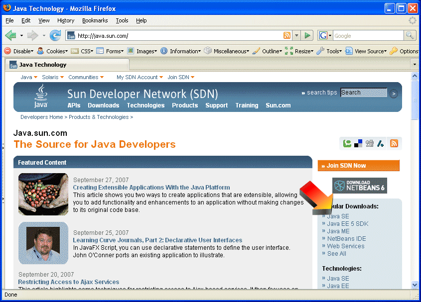

## Výber správnej verzie
Nájdeme odkaz na JDK 6 a klikneme na *Download*

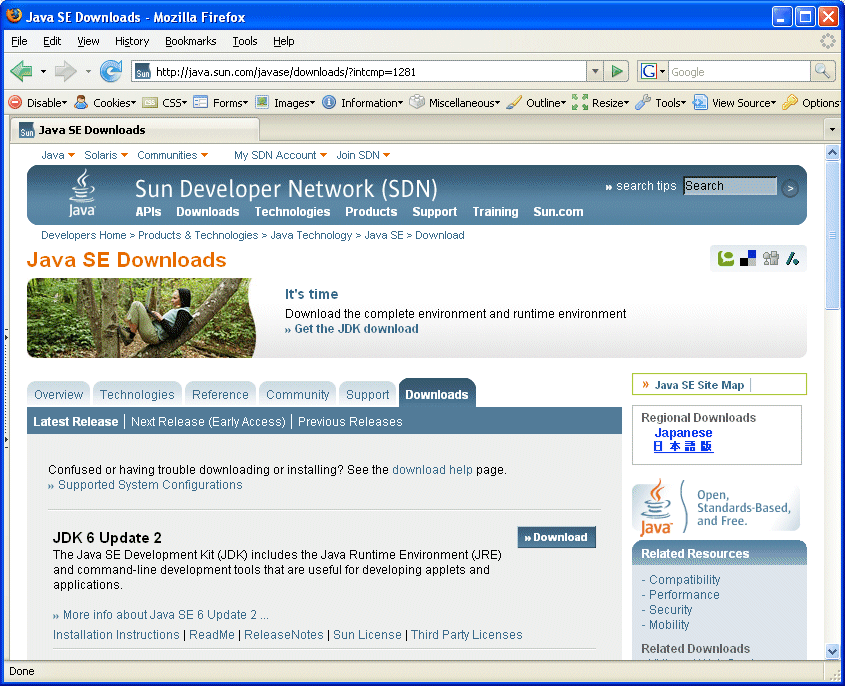

## Odsúhlasenie licencie
Licenciu odsúhlasime kliknutím na *Accept*

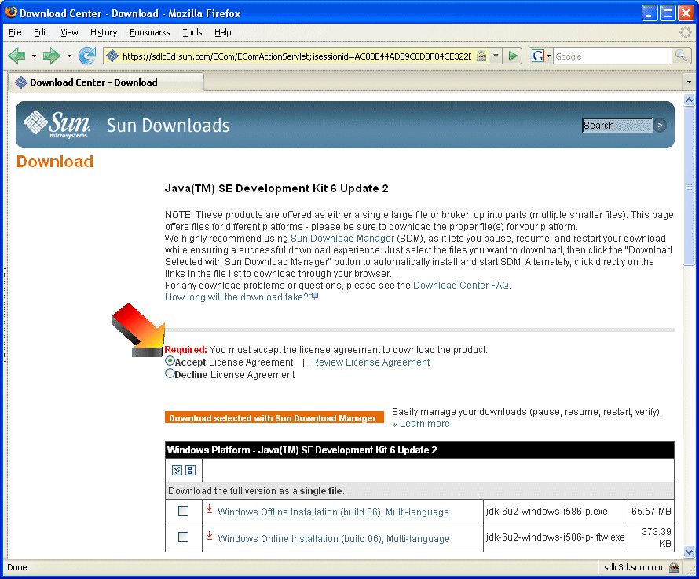

## Výber operačného systému a typu inštalačného balíčka
V prípade Windowsu klikneme na odkaz *Windows Offline Installation* (alternatívnou možnosťou je minibalíček pre inštaláciu z Internetu)

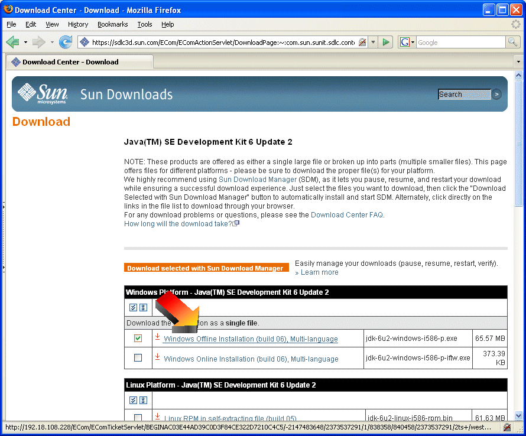

## Uloženie inštalačného súboru
Ponúknutý inštalačný súbor stiahneme do vhodného adresára.
a následne ho spustíme.

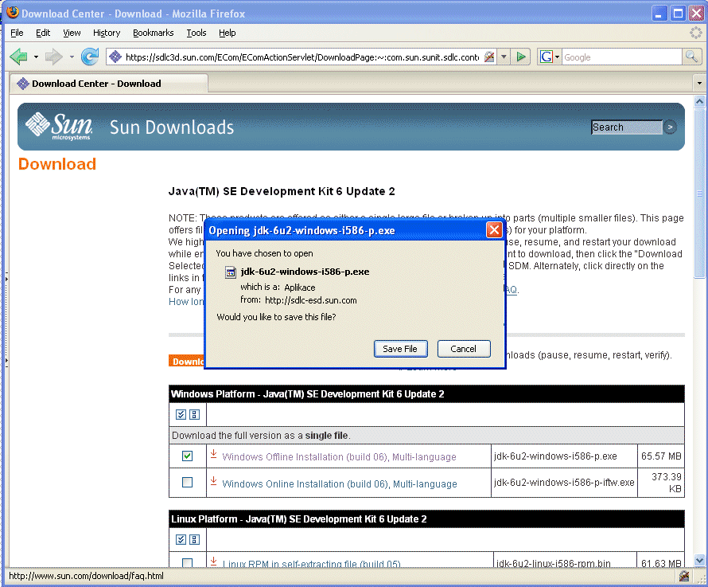

# Spustenie a priebeh inštalácie
## Najprv odsúhlasime licenčnú dohodu


## Výber komponentov pre inštaláciu
Zrejme budeme chcieť nainštalovať všetky súčasti inštalácie. Implicitne sa Java Development Kit nainštaluje do adresára `C:\Program Files\Java\jdk*poradovéČísloVerzie*`. Ak chceme zmeniť cieľový adresár, použijeme na to tlačidlo *Change*.

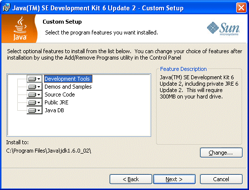

## Priebeh inštalácie
Inštalátor začne kopírovať súbory

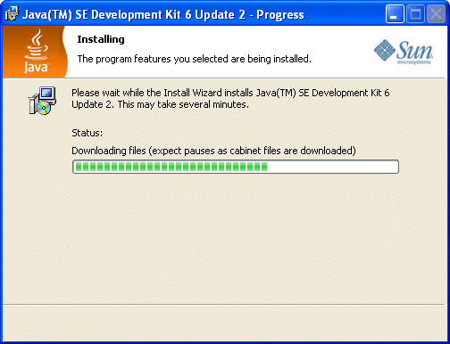

## Koniec inštalácie
Po skončení kopírovania súborov si môžeme zobraziť informácie o vydaní (ak chceme). Inštaláciu ukončíme pomocou *Finish*.

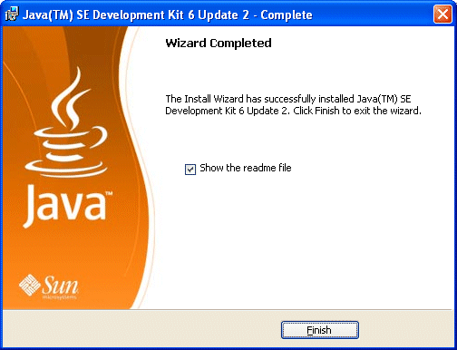

# Kroky po inštalácii
Na uľahčenie práce s Javou z príkazového riadku si môžeme pridať príkazy `javac.exe` a `java.exe` do premennej prostredia `PATH`. Rovnako je vhodné definovať premennú prostredia `JAVA_HOME`, ktorá ukazuje do adresára, v ktorom je nainštalovaná Java.

## Zobrazenie ovládacieho panelu
Zobrazíme si ovládací panel pre systém:

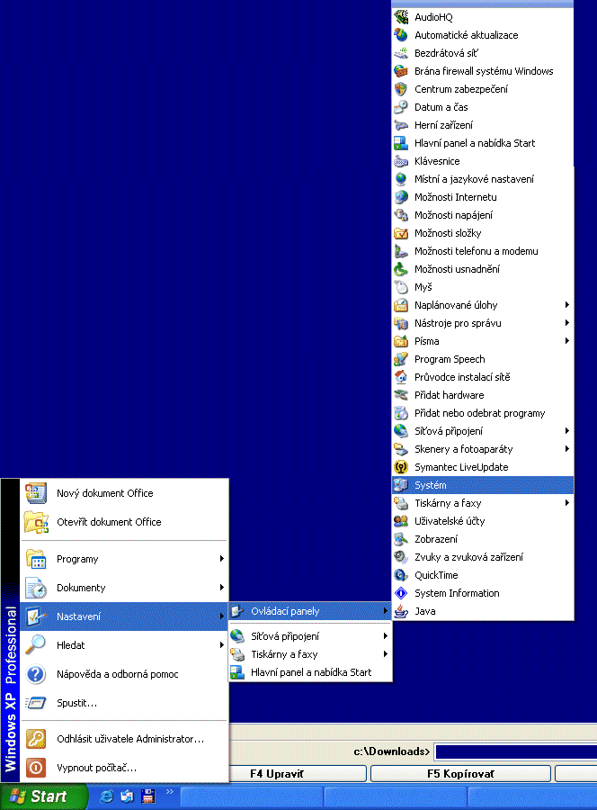

## Vyberieme kartu *Upresniť*
Vyberieme kartu *Upresniť* a klikneme na tlačidlo *Premenné prostredia*

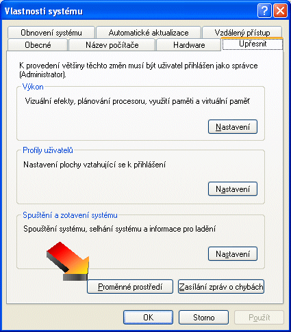

## Pridanie premennej `JAVA_HOME`
V sekcii *Systémové premenné* klikneme na tlačidlo *Nová*.

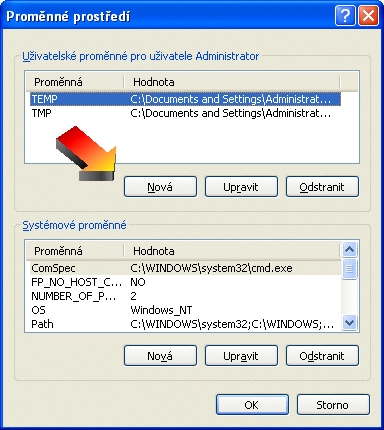

Názov premennej je `JAVA_HOME` a hodnotou je adresár, do ktorého bola nainštalovaná Java (napr. `C:\Program Files\Java\jdk1.6.0_03`).

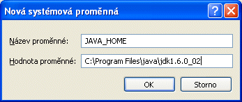

## Úprava premennej `PATH`
V sekcii *Systémové premenné* vyberieme zo zoznamu premennú `PATH` a klikneme na tlačidlo *Upraviť*.

Na koniec hodnoty dodáme cestu k adresáru `bin` v adresári, v ktorom je nainštalovaná Java (napr. `C:\Program Files\Java\jdk1.6.0_03\bin`).

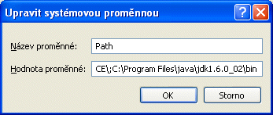

## Otestovanie inštalácie
Pomocou *Štart | Spustiť | cmd.exe* si zobrazíme príkazový riadok. V ňom spustíme príkaz `java`. 
```
C:\Documents and Settings\Administrator>java
```
Mal by sa nám zobraziť dlhší výpis
```
Usage: java [-options] class [args...]
           (to execute a class)
   or  java [-options] -jar jarfile [args...]
           (to execute a jar file)
...
```
V prípade, že získame hlásenie, že `java` nie je názvom spustiteľného súboru, prekontrolujeme nastavenie systémovej premennej `PATH`.