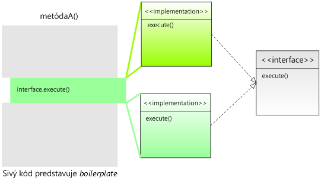

Súbory v Jave sú zložité!
=========================

Ak ste niekedy programovali v Pascale, iste ste si pamätali veľmi
jednoduchý spôsob, ako načítavať riadky z textového súboru. Jedným
volaním procedúry ste asociovali premennú so súborom, druhým ho otvorili
na čítanie a vo while-cykle načítavali dáta pomocou starej známej
funkcie `readln()`. Hja, procedurálne programovanie malo niekedy svoje
výhody. V Jave je práca so súbormi o niečo komplikovanejšia – veď len
triviálny príklad vyzerá nasledovne:

```java
package sk.test;

import java.io.File;
import java.io.FileNotFoundException;
import java.util.Scanner;

public class Subory {
    public static void main(String[] args) throws FileNotFoundException {
        File file = new File("data.txt");
        Scanner scanner = new Scanner(file);
        while(scanner.hasNextLine()) {
            String line = scanner.nextLine();
            System.out.println(line);
        }
        scanner.close();
    }
}
```

V tomto príklade sme dokonca ani neriešili výnimky, čo je
poľutovaniahodné – správny program by vyžadoval jeden `try-catch`-blok,
kde vo finally sekcii uzavrieme inštanciu `Scanner`a. Aká to „hrôza“
oproti Pascalu, nehovoriac o skriptovacích jazykoch typu Groovy, kde
ekvivalentný kód vyzerá nasledovne:

```
def f = new File("data.txt")
f.eachLine{
  println it
}
```

Ak by sme v príklade chceli namiesto všetkých riadkov vypísať len tie,
ktoré začínajú veľkým písmenom, Java kód by vyzeral takmer identicky:
rozdiel by spočíval v odlišnom kóde vo vnútri `while`-cyklu. Ak
vyextrahujeme kód z metódy `main()` do metódy novozaloženej triedy
`FileUtils`, situácia bude nasledovná:

```java
package sk.test;

import java.io.File;
import java.io.FileNotFoundException;
import java.util.Scanner;

public class FileUtils {
    public void printAllLines(File file) throws FileNotFoundException {
        Scanner scanner = null;
        try {
            scanner = new Scanner(file);
            while(scanner.hasNextLine()) {
                String line = scanner.nextLine();
                System.out.println(line);
            }
            scanner.close();
        } finally {
            if(scanner != null) {
                scanner.close();
            }
        }       
    }
}
```

Metóda na výpis riadkov začínajúcich veľkým písmenom
`printAllLinesStartingWithUpperCase()` bude úplne identická, vo vnútri
však pribudne jeden if.

Čo je na tom najhoršie? Z trinástich riadkov metódy je dôležitý len
jeden (resp. dva, či tri) riadok, a ostatné predstavujú obslužný kód,
slangovo nazývaný **boilerplate code**. Nedôležité veci sa dookola
kopírujú a tie dôležité sa strácajú v záplave nepodstatností.

Existuje však možnosť, ako si túto úlohu uľahčiť: a spočíva **v použití
interfejsov**.

> *Boilerplate* je pôvodne pomenovanie pevného oceľového plechu, z ktorého
> sa vyrábali kotly (koniec-koncov, pojem bojler je známy aj u nás). Tento
> plech mal však aj inú funkciu – razili sa doň texty, ktoré sa dali
> používať pri mnohých príležitostiach, napr. univerzálne upozornenia, či
> oznamy. Namiesto komplikovanej sadzby stačilo odtlačiť text vyrazený na
> plechu a bolo. Súčasnou analógiou *boilerplate* textov sú niekoľkovetné
> popisky opisujúce firmu spätú s konkrétnym produktom alebo stručné
> charakteristiky autora umiestňované pod články. *Boilerplate* kód má
> teda vlastnosti opakovateľnosti, pravidelného používania pri tých istých
> situáciách. Píše sa len raz a pri ostatných použitiach sa doslova
> kopíruje.


Interfejsy ako cesta k zmenšeniu boilerplate kódu
=================================================

Začiatočníci považujú interfejsy za ťažko uchopiteľné (zrejme je
príčinou zložité vysvetlenie), a dokonca málo používané. V Jave však bez
nich ďaleko nezájdeme – nehovoriac o tom, že i vo všeobecnom objektovo
orientovanom programovaní na nich stojí nejeden návrhový vzor.

Návrhom interfejsu predovšetkým určíme sadu chovania, teda **čo** (akú
funkcionalitu) od neho klient bude očakávať. To, **ako** sa interfejs
bude v danej situácii správať, je ponechané na triedy, ktoré budú tento
interfejs implementovať. Vezmime si náš príklad, presnejšie algoritmus,
ktorý v ňom používame. Ten sa dá slovne popísať nasledovne:

1. otvor súbor
2. postupne prechádzaj všetky riadky
3. s každým riadkom **niečo** urob
4. uprac po sebe

Rozdiel medzi našimi dvoma metódami (vypíš všetky riadky, vs. vypíš
riadky začínajúce veľkými písmenami) spočíva v odlišnom správaní v kroku 3. V našom obrázku sú prvé dva kroky opticky v hornej sivej ploche, krok 3. je zelená plocha a štvrtý krok je obsiahnutý v spodnom sivom
obdĺžniku. Všimnime si, že v treťom kroku máme len všeobecné tvrdenie „s
každým riadkom **niečo** urob“. To sa podobá na očakávania, ktoré by sme
vedeli špecifikovať v interfejsi. Ako konkrétne sa s daným riadkom
vysporiadame, záleží od triedy, ktorá bude náš interfejs implementovať.
Prepíšme si to do kódu, tentokrát do metódy handleLines(File):

```java
public class FileUtils {
    public void handleLines(File file) throws FileNotFoundException {
        Scanner scanner = null;
        try {
            scanner = new Scanner(file);
            while(scanner.hasNextLine()) {
                String line = scanner.nextLine();

                // urob niečo s riadkom

            }
            scanner.close();
        } finally {
            if(scanner != null) {
                scanner.close();
            }
        }       
    }
}
```

Vágny popis „urob niečo s riadkom“ vieme nahradiť volaním nejakej
fiktívnej metódy inštancie `lineHandler` zatiaľ nenavrhnutej triedy
`LineHandler`. Táto metóda si vystačí s jediným parametrom typu
`String`, v ktorom príde aktuálne spracovávaný riadok.

Máme teda potenciálneho kandidáta na triedu, pri ktorom vieme, čo od
neho chceme. Naše želanie je „chcem triedu, ktorá mi spracuje riadok”.
To bohate stačí na to, aby sme vedeli vytvoriť interfejs LineHandler,
ktorý naše želanie špecifikuje v programovacom jazyku:

```java
public interface LineHandler {
    public void String handle(String line);
}
```

Naozaj tam nie je nič zložité – máme predpis pre triedu, ktorá spracuje
riadok. Nevieme síce ako sa to spraví, ale v rámci triedy `FileUtils`,
ktorá obsahuje metódy pre prácu so súbormi, to nie je dôležité. V metóde
`handleLines()` triedy `FileUtils` len povieme, **čo** chceme a **ako**
sa to spraví, záleží od implementácie interfejsu. V kóde tento interfejs
použijeme nasledovne:

```
while(scanner.hasNextLine()) {
    String line = scanner.nextLine();
    // urob niečo s riadkom
    lineHandler.handle(line);
}
```

V kóde je ešte jedna nejasnosť: odkiaľ sa zjavila premenná
`lineHandler`? Prirodzené miesto, kde ju môžeme uviesť, je parameter
metódy handleLines() v triede `FileUtils`.

```java
public class FileUtils {
    public void handleLines(File file, LineHandler lineHandler)
        throws FileNotFoundException 
    {
    ... 
    }
}
```

Dva parametre sú v tomto prípade úplne prirodzené: prvý hovorí, ktorý
súbor sa má spracovať, a druhý vraví, čo sa má stať s každým riadkom.

Výpis riadkov cez interfejs
---------------------------

Dosiaľ sme stále vraveli, **čo** chceme s každým riadkom spraviť, ale
nikde sme neuviedli **ako** sa s riadkami vysporiadame. Teraz je na to
správna chvíľa. Konkrétny spôsob bude záležať od implementácií, teda od
konkrétnych tried, ktoré budú implementovať interfejs `LineHandler`.

Dajme si triviálny príklad, ktorý spraví presne to, čo kód na úplnom
začiatku článku, čiže vypíše riadky na konzolu.

```java
public class SysoutLineHandler implements LineHandler {
    public void handleLine(String line) {
        System.out.println(line);
    }
}
```

Máme triedu, ktorá implementuje interfejs (`implements
      LineHandler`) a v metóde handleLine() jasne uvádza, čo sa s
riadkom stane: vypíše sa na konzolu. Trieda `SysoutLineHandler` teda
hovorí, **ako** sa s riadkom vysporiadame.

Použitie v kóde je zjavné: stačí si vytvoriť testovaciu triedu s metódou
main() a v nej zavolať:

```java
public static void main(String... args) {
    FileUtils fileUtils = new FileUtils();
    LineHandler lineHandler = new SysoutLineHandler();
    File file = new File("data.txt");

    fileUtils.handleLines(file, lineHandler);
}
```

Inštancii triedy `FileUtils` sme podhodili dva parametre: jednak súbor
`file` a jednak inštanciu triedy `SysoutHandler`, ktorá implementuje
interfejs `LineHandler`. Priradenie na druhom riadku je správne, keďže
implementácia interfejsu nie je nič iné než dedičnosť, a teda pokojne
môžeme priradiť „potomka” typu `SysoutHandler` do predka typu
`LineHandler`.

Dva parametre hovoria **na akých dátach** budeme pracovať (teda na
dátach zo súboru) a **čo** s nimi budeme robiť (vypisovať ich do
súboru).

Výpis riadkov začínajúcich veľkými písmenami
--------------------------------------------

Výpis riadkov, ktoré začínajú veľkými písmenami, je už hračka. Stačí
vytvoriť samostatnú triedu `UpperCaseStartingLineHandler`, ktorá
implementuje interfejs `LineHandler`, vytvoriť jej inštanciu, ktorú
použijeme ako argument v metóde FileUtils\#handleLines():

```java
public class UpperCaseStartingLineHandler implements LineHandler {
    public void handleLine(String line) {
        if(line.length() > 1 
            && Character.isUpperCase(line.charAt(0))) 
        {
            System.out.println(line);
        }
    }
}
```

Prepojenie inštancií je analogické ako v predošlej stati, rozdiel
spočíva vo vytvorení inej inštancie `LineHandlera`.

```java
public static void main(String... args) {
    FileUtils fileUtils = new FileUtils();
    LineHandler lineHandler = new UpperCaseStartingLineHandler();
    File file = new File("data.txt");

    fileUtils.handleLines(file, lineHandler);
}
```

Počítanie riadkov v súbore
--------------------------

Na základe dvoch predlôh vieme vytvoriť aj tretí vzorový príklad, ktorý
zistí počet riadkov v súbore.

```java
public class LineCountingHandler implements LineHandler {
    private int lines;

    public void handleLine(String line) {
        lines++;
    }

    public int getLines() {
        return lines;
    }
}

```

V tomto prípade sme dodali navyše jeden *getter*, ktorým získame počet
riadkov v súbore. Použitie je v tomto prípade opäť analogické:

```java
public static void main(String... args) {
    FileUtils fileUtils = new FileUtils();
    LineCountingHandler lineHandler = new LineCountingHandler();
    File file = new File("data.txt");
    fileUtils.handleLines(file, lineHandler);
    
    System.out.println(lineHandler.getLines());
}

```

Rozdiel spočíva v tom, že pri vytváraní inštancie `lineHandlera` už
nemôžeme na ľavej strane použiť interfejs, pretože by sme nemali prístup
k metóde `getLines()` (nezabúdajme, že inštancia interfejsového typu má
len tie metódy, ktoré sú uvedené v interfejse).

Vystrihovanie a lepenie kódu
============================

Odsun kódu do interfejsu si vieme predstaviť ako vystrihnutie kódu
nožničkami.



Pôvodný kód v tmavozelenom obdĺžniku v metóde A vieme „vystrihnúť“ a
samotný vystrižok považovať za implementáciu interfejsu.

Do prázdnej medzery potom vieme vlepovať buď jednu alebo druhú
implementáciu. „Vlepovaním” rôznych implementácii vieme dosahovať
rozličnú funkcionalitu.

Kde inde sa to používa
======================

Tento trik s kódom v interfejsi je často používaný i v základnom API
Javy. Bežným príkladom je výpis súborov a adresárov, ktoré sa nachádzajú
v adresári, ktorý je možné dosiahnuť pomocou metódy
`java.io.File\#listFiles()`. Chcete všetky súbory končiace sa na .mp3?

```java
File file = new File("C:/Windows");
for(File child : file.listFiles()) {
    if(child.getPath().endsWith(".mp3")) {
        System.out.println(child);
    }
}

```

Toto však možno získať aj alternatívnym spôsobom, ktorý je založený na
vyššieuvedenej filozofii interfejsu.

Metóda `listFiles()` má aj preťaženú verziu s parametrom typu FileFilter,
ktorý nie je ničím iným než interfejsom s jedinou metódou. Tá pre každý
jednotlivý súbor či podadresár vráti true v prípade, že sa má zahrnúť do
výsledného poľa súborov. Vieme si teda nadefinovať viacero filtrov,
ktoré potom dynamicky používame podľa toho, ako chceme vyfiltrovať
súbory či podadresáre daného adresára.

Ten istý príklad vieme napísať aj takto:

```java
public class Mp3Filter implements java.io.FileFilter {
    public boolean accept(File pathname) {
        return pathname.getPath().endsWith(".mp3");
    }
}
// ...
File file = new File("C:/Windows");
FileFilter mp3Filter = new Mp3Filter();
File[] mp3Files = file.listFiles(mp3Filter);

```

Vo výslednom poli `mp3Files` budeme mať len tie súbory, ktoré spĺňajú
podmienku v metóde `Mp3Filter#accept()`.

Filozofia interfejsov z funkcionálneho programovania
====================================================

Príklady o súboroch možno zovšeobecniť pre ľubovoľnú situáciu. Z
matematického hľadiska ide totiž o situáciu, keď máme dáta (v podobe
kolekcie), ktoré vyfiltrujeme pomocou predikátu (funkcie, ktorá vráti
`true`/`false`). Interfejs `FileFilter` zodpovedá predikátu, ktorý pre každý
súbor vráti true, ak ho treba ponechať vo výslednej kolekcii.

Z matematického hľadiska ide o zápis , kde `Vstup` je vstupná množina a
`Výsledok` výsledná filtrovaná množina. (V zápise pre ignorujeme
rozličné druhy kolekcie.)

Pomocou interfejsu by sme to zapísali nasledovne:

```java
public interface Predicate<T> {
    public boolean evaluate(T variable);
}

```

Filtrujúca metóda, ktorá odstráni z kolekcie tie prvky, ktoré nespĺňajú
pravdivostnú funkciu, by potom vyzerala nasledovne:

```java
public <T> Collection<T> filter(Collection<T> collection, Predicate<T> predicate) {
    Iterator<T> iterator = collection.iterator();
    while(iterator.hasNext()) {
        T element = iterator.next();
        // ak prvok nespĺňa pravdivostnú funkciu, vyhodíme ho
        if(!predicate.evaluate(element)) {
            iterator.remove();
        }
    }
    return collection;
}

```

Všimnime si, že metóda berie dve hodnoty: dáta (`collection`) a funkciu,
ktorá sa má aplikovať na každý element v dátach.

Ukážme si to na príklade – z danej množiny vráťme len párne čísla.
Najprv si definujme triedu pre pravdivostnú podmienku „číslo je párne”:

```java
public class EvenNumberPredicate implements Predicate<Integer>() {
    public boolean evaluate(Integer variable) {
        return variable % 2 == 0;
    }
}

```

Následne definujme vstupné dáta, na ktoré aplikujeme filter:

```java
Set<Integer> čísla = new HashSet<Integer>();
Collections.addAll(čísla, 1, 2, 3, 4, 5, 6, 7, 8, 9, 10);

Predicate<Integer> filter = new EvenNumberPredicate();

Collection<Integer> párneČísla = CollectionUtils.filter(čísla, filter);

```

Výmenou triedy, ktorá implementuje `Predicate`, môžeme dynamicky meniť
filtračnú podmienku.