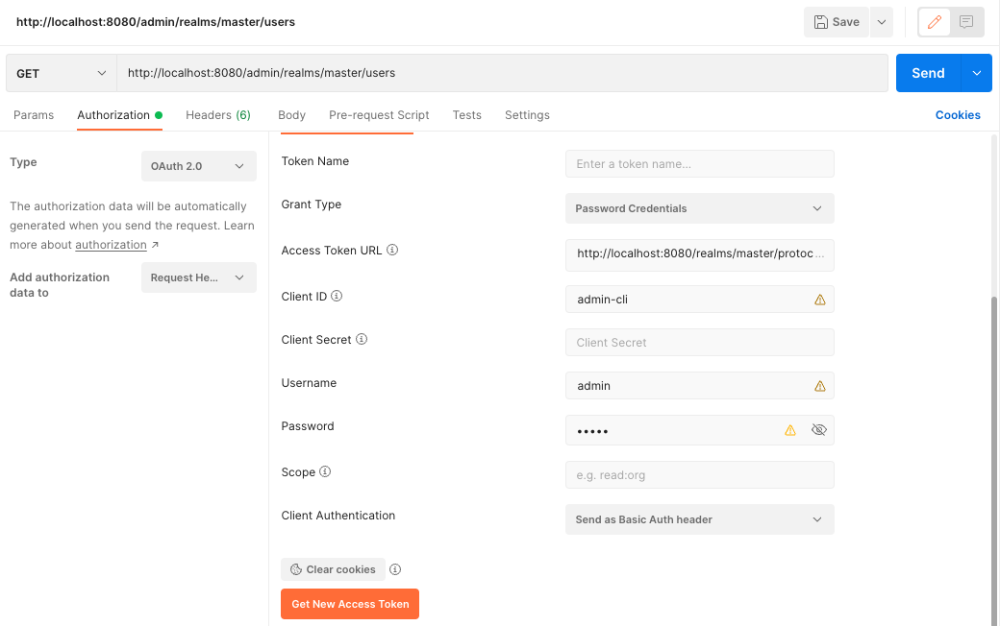

:icons: font

====
Ako pristupovať k administrátorskému REST API v Keycloaku? Ako sa voči nemu autorizovať, a ako je možné napríklad vytvárať používateľov inak než cez administrátorskú konzolu?
====

== Administrátorské REST API Keycloaku

Keycloak má k dispozícii administrátorské REST API, ktorým možno pristupovať k jednotlivým entitám pomocou programátorských nástrojov.

[IMPORTANT]
====
REST API je dostupné na URL s predponou http://localhost:8080/admin/

Dokumentácia entít a volaní https://www.keycloak.org/docs-api/15.0/rest-api/index.html[je k dispozícii na portáli Keycloaku]
====

== Autorizácia

REST API je implementované ako štandardný _OAuth Resource Server_ ochránený bežnými flowmi OAuthu.

Ak sme si istí, že k REST API pristupujeme z uzavretého klienta, ktorému vieme zdôveriť login a heslo, môžeme použiť na autorizáciu flow ROPC.

[source,httprequest]
----
###
POST http://localhost:8080/realms/master/protocol/openid-connect/token
Content-Type: application/x-www-form-urlencoded

client_id=admin-cli&username=admin&password=admin&grant_type=password <1>

> 
###
----
<1> Identifikátor klienta OAuth je `admin-cli`.
+
Posielame login (`username`) a heslo (`password`).
+
Keďže používame flow ROPC, typ grantu je `password`.
<2> Výsledok z odpovede typu JSON vyberá atribút `access_token`, ktorý obsahuje token JWT s autorizačnými údajmi.

Konfigurácia pre Postman-a je analogická.

== Volanie API

Volanie API využíva klasické priloženie tokenu JWT do hlavičky `Authorization` ku hodnote `Bearer`.

=== Vytváranie používateľa

Používateľa vytvoríme podľa dokumentácie: stačí vhodne pripraviť JSON do požiadavky a odhaliť adresu URL.

Ukážka pre klienta v HTTP IntelliJ IDEA:
[source,httprequest]
----
### Create user
POST http://localhost:8080/admin/realms/master/users/
Authorization: Bearer {{jwt}}
Content-Type: application/json

{ <1>
  "username": "janedoe",
  "enabled": true,
  "credentials": [
     { <2>
       "type": "password",
       "value": "eolooRup7pahngief5Fe",
       "temporary": false
     }
   ]
}

> 
----
<1> Vytvárame používateľské konto, čo je entita typu https://www.keycloak.org/docs-api/15.0/rest-api/index.html#_userrepresentation[UserRepresentation].
<2> Pripravíme mu aj heslo `eolooRup7pahngief5Fe`, ktoré _nie je_ dočasné, aby sa ním používateľ mohol okamžite prihlásiť.
<3> Odpoveďou bude stavový kód 201 (_Created_) a hlavička `Location` s identifikátorom nového používateľského konta v podobe URL, napríklad http://localhost:8080/admin/realms/master/users/212aa1c7-667e-4c2b-a99b-4c050ea94644

=== Informácie o používateľovi

Informácie o používateľovi vieme získať z príslušnej URL, ak máme identifikátor používateľa vo formáte UUID.

Napríklad:

    http://localhost:8080/admin/realms/master/users/212aa1c7-667e-4c2b-a99b-4c050ea94644

Odpoveďou je JSON:

[source,json]
----
{
   "id":"212aa1c7-667e-4c2b-a99b-4c050ea94644",
   "createdTimestamp":1680364471327,
   "username":"janedoe",
   "enabled":true,
   "totp":false,
   "emailVerified":false,
   "disableableCredentialTypes":[],
   "requiredActions":[],
   "notBefore":0,
   "access":{
      "manageGroupMembership":true,
      "view":true,
      "mapRoles":true,
      "impersonate":true,
      "manage":true
   }
}
----

== REST API

Celý skript pre HTTP klienta pre IntelliJ IDEA.

[source]
.keycloak-admin.http
----
include::keycloak-admin.http[]
----

