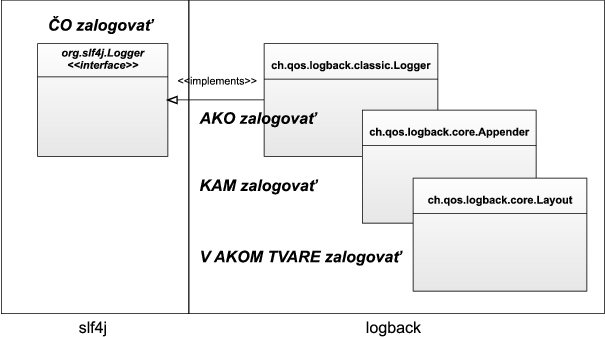
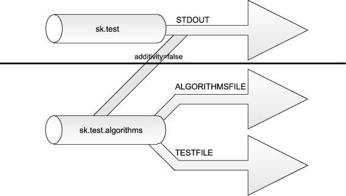

Úvod
====

Logovanie je neodbytnou súčasťou každej aplikácie, hoci si to autori ani
neuvedomujú. Je takmer nevyhnutné priebežne sledovať stav behu
aplikácie, či evidovať chybové hlásenia. Ladiace (logovacie) výpisy sú
spôsob, ktorým je možné to dosiahnuť. Za takýto výpis možno považovať už
každý výpis smerujúci na konzolu (teda využívajúci `System.out` alebo
`System.err`). V prípade zložitých systémov však `System.out` veľmi
rýchlo prestane vyhovovať.

> **Note**
>
> Logovanie (*logging*) má svoj pôvod v moreplavbe, presnejšie v spôsobe
> určovania rýchlosti lode. Využívalo sa pri tom lano, na ktorom boli
> zaviazané uzly v pevne danej vzdialenosti (cca 14 metrov), a kolík
> (*log*) umiestnený na konci. Námorník vyhodil log z kormy lode,
> postupne odvíjal lano, a rátal uzly, ktoré mu pri odvíjaní prešli
> pomedzi ruky počas doby tridsiatich sekúnd. (Túto dobu odmeriaval
> ďalší námorník presýpacími hodinami.) Dokázal tak získať vzdialenosť
> prejdenú za čas, z ktorej vedel vyrátať rýchlosť. Získané údaje sa
> zapisovali do *log book*u, doslova „knihy kolíka“, z ktorej sa neskôr
> vyvinul kapitánov denník, teda *log*. Podľa tejto techniky merania
> tiež získala svoj názov námorná jednotka rýchlosti uzol.

Logovacie knižnice predstavujú spôsob, ktorým je možné získať väčšiu
kontrolu nad výpismi – umožňujú ich filtrovať, zapínať či vypínať podľa
dôležitosti a presmerovávať do rôznych výstupov a to všetko možno
nastavovať individuálne pre každú triedu či balíček. V Jave, ako to už
býva, neexistuje jediný pravý spôsob pre logovanie. Napriek tomu, že v
JDK máme dostupný balíček `java.util.logging`, de facto štandardom sa stal
log4j.

> **Note**
>
> Log4j má pôvod v IBM a existoval už dávno predtým, než nastali úvahy o
> zaradení logovacieho balíčka do jadra Javy. Dizajnéri zo Sunu z
> rôznych dôvodov odignorovali log4j a logovaciu knižnicu navrhli
> nanovo. Ich úsilie však do istej miery vyšlo nazmar --
> java.util.logging vyžadovalo JDK 1.4 (naproti log4j, ktoré si ešte i
> teraz vystačí s JDK 1.3) a poskytovalo oveľa menej funkcionality.
> Situáciu vystihuje tvrdenie z diskusných fór TheServerSide.com:
> “Balíček java.util.logging je len indigovou kópiou log4j. A všetci
> vieme, že takéto kópie sú vždy nekvalitnejšie ako originál.”

Samozrejme, mnoho autorov projektov sa nevedelo rozhodnúť medzi
*java.util.logging* a *log4j*. Dilemu sčasti vyriešilo zavedenie abstraktnej
knižnice *commons-logging* z dielne Apache, ktorá predstavovala tenkú
medzivrstvu v podobe interfejsov, ktorá umožňovala dynamicky zvoliť
použitú logovaciu knižnicu. Táto „metalogovacia“ knižnica však v sebe
niesla množstvo fatálnych problémov súvisiacich s classloadingom (čiže
vedúcich k nanajvýš obskúrnym problémom).

Ceki Gülcü, duchovný otec *log4j*, navrhol vlastný variant
*commons-logging*, ktorý odstraňuje tajomné chyby, prináša možnosť voľby
konkrétnej implementácie a navyše umožňuje zmigrovať i tie aplikácie,
ktoré sú napevno spojené s jednou konkrétnou implementáciou. Táto
knižnica sa nazýva **slf4j** a budeme sa jej venovať i v tomto článku.

Akú to má výhodu? V rámci aplikácie môžete v prípade dynamicky zameniť
použitú implementáciu logovania, a nemusíte zmeniť ani riadok kódu. Ak
by vaša aplikácia napevno používala *log4j*, a nasadí sa do servera
založeného na *java.util.logging*, prídete napr. o možnosť centralizovane
spracovávať všetky logy.

Do roly konkrétnej implementácie logovania sme v článku zvolili **logback**,
ktorý predstavuje „ďalšiu generáciu“ starého známeho *log4j*, ktorého
vývoj sa považuje za ukončený (hlavne preto, že podpora nových
vlastností a oprava niektorých chýb by vyžadovala kompletný prepis).
Dôležité je, že oba projekty majú rovnakého duchovného otca i rovnaké
princípy. Ak vám je i napriek tomu ľúto za *log4j*, vzhľadom na
abstraktnosť *slf4j* je výmena *log4j* za logback len otázkou výmeny JAR
súborov v projekte.

Stiahnutie a inštalácia slf4j a logback
=======================================

[Zo stránok projektu](http://www.slf4j.org/download.html) *slf4j* si
stiahneme archív a do projektu pridáme `slf4j-api-1.5.8.jar`. [Zo
stránok projektu logback](http://logback.qos.ch/download.html) si
stiahneme archív a do projektu pridáme dva JARy:
`logback-core-0.9.17.jar` a `logback-classic-0.9.17.jar`.

JAR pre *slf4j* reprezentuje interfejsy, ktoré pristupujú ku konkrétnej
implementácii reprezentovanej zvyšnými dvoma JARmi.

Použitie slf4j
==============

Logovanie si môžeme ukázať na príklade neužitočného, ale didaktického
príkladu:

    package sk.test.arrays;
    
    public class Arrays {
        public void countElements(int... elements) {
            System.out.println("Spočítavam " + elements.length + " prvkov.");
            int sum = 0;
            for(int i = 0; i < elements.length; i++) {
                sum = sum + elements[i];
                System.out.println("Spracovávam " + i + ". prvok: " + elements[i]);
            }
            System.out.println("Výsledok: " + sum);
        }
    
        public static void main(String[] args) {
            Arrays a = new Arrays();
            a.countElements(2, 3, 5, 2);
        }
    }

Po spustení dostaneme šesť hlášok – štyri vo vnútri cyklu, jednu na
úvod a jednu na záver. Problém je, že bežného používateľa asi nechceme
zaťažovať všetkými možnými ladiacimi informáciami. V tomto príklade by
bol možno spokojný, keby dostal maximálne jednu úvodnú hlášku, a možno
dokonca by ho nebolo treba otravovať žiadnymi „zbytočnosťami“.
`System.out` nám však nedáva veľa možností na zmenu správania --
prinajlepšom je možné úplne potlačiť výstup, alebo ho presmerovať cez
`System.setOut()`, ale toto riešenie ovplyvní celú aplikáciu.

Príklad by sme však mohli prerobiť pre použitie slf4j.

    package sk.test.arrays;
    import org.slf4j.Logger; 
    import org.slf4j.LoggerFactory; 
    
    public class Arrays {
        private static final Logger logger = LoggerFactory.getLogger(Arrays.class);
    
        public void countElements(int... elements) {
            logger.info("Spočítavam " + elements.length + " prvkov.");
            int sum = 0;
            for(int i = 0; i < elements.length; i++) {
                sum = sum + elements[i];
                logger.info("Spracovávam " + i + ". prvok: " + elements[i]);
            }
            logger.info("Výsledok: " + sum);
        }
    
        public static void main(String[] args) {
            Arrays a = new Arrays();
            a.countElements(2, 3, 5, 2);
        }
    }

Po spustení triedy získame výstup:

    18:41:25.021 [main] INFO sk.test.Arrays - Spočítavam 4 prvkov.
    18:41:25.030 [main] INFO sk.test.Arrays - Spracovávam 0. prvok: 2
    18:41:25.030 [main] INFO sk.test.Arrays - Spracovávam 1. prvok: 3
    18:41:25.030 [main] INFO sk.test.Arrays - Spracovávam 2. prvok: 5
    18:41:25.031 [main] INFO sk.test.Arrays - Spracovávam 3. prvok: 2
    18:41:25.031 [main] INFO sk.test.Arrays - Výsledok: 12

Vypísalo sa teda všetkých šesť hlášok. Rozdiel oproti klasickému
`System.out` spočíva vo formáte správ – logback dodal ku každej
chybovej hláške časovú pečiatku a ďalšie pomocné identifikačné
záležitosti súvisiace so správou. Na rozdiel od `System.out` používame
na logovanie inštanciu triedy `org.slf4j.Logger`, ktorú môžeme získať z
továrne na loggery `org.slf4j.LoggerFactory`.

    private static final Logger logger = LoggerFactory.getLogger(Arrays.class);

Logger si môžeme predstaviť ako kanál, do ktorého posielame ladiace
hlášky. V typickom prostredí má každá inštancia triedy vlastnú inštanciu
loggera – hoci nie je výnimočné, keď všetky inštancie konkrétnej triedy
využívajú jedinú, spoločnú, inštanciu loggera. (To môžeme docieliť
použitím modifikátora static).

Bez ohľadu na zvolený spôsob platí, že každá inštancia loggera má svoj
vlastný reťazcový identifikátor – v uvedenom príklade sme logger
pomenovali podľa názvu triedy, v ktorej sa nachádza – máme teda logger
`sk.test.Arrays`. Vypisovať ladiacu hlášku možno volaním metód, ktorých
mená závisia od priority (viď ďalšia sekcia); štandardným spôsobom je
výpis informačnej hlášky (s prioritou, resp. levelom INFO), teda
zavolaním metódy `logger.info()`.

Konfigurácia slf4j a logbacku
=============================

Level (priorita) ladiacej hlášky
--------------------------------

Najčastejšie využívanou charakteristikou ladiacej hlášky je **level**
(priorita), ktorá určuje jej význačnosť a dôležitosť. *slf4j* podporuje
päť levelov, v tabuľke ich uvádzame podľa dôležitosti.

| Level hlášky | Typický účel                                                  |
|--------------|---------------------------------------------------------------|
| TRACE        | trasovacie hlášky, typicky pre jednotlivé kroky algoritmov    |
| DEBUG        | ladiace hlášky, ktoré sú pri ostrom behu vypnuté              |
| INFO         | informačné hlášky, ktoré informujú bežného používateľa        |
| WARN         | upozornenia a varovania pre chyby, z ktorých sa možno zotaviť |
| ERROR        | závažné chyby, ktoré bránia behu programu                     |

V príklade sme logovali hlášky na úrovniach INFO. Otázkou je, či bežného
používateľa zaujímajú podrobné ladiace výpisy spracovávania jednotlivých
prvkov poľa. Podľa nás nie – výpis by sa mal vykonávať len v prípade
testovacieho/ladiaceho behu. Prerobme teda program nasledovne:

    public void countElements(kint... elements) {
        logger.debug("Spočítavam " + elements.length + " prvkov.");
        int sum = 0;
        for(int i = 0; i < elements.length; i++) {
            sum = sum + elements[i];
            logger.trace("Spracovávam " + i + ". prvok: " + elements[i]);
        }
        logger.trace("Výsledok: " + sum);
    }

Spracovávanie prvkov a výpis výsledku budeme považovať za
nízkoprioritné, a výpis spracovávania prvkov budeme považovať za
`DEBUG`-ovaciu hlášku. Použijeme teda metódy `logger.debug()` a
`logger.trace()`.

Po spustení programu získame jedinú hlášku:

    10:09:10.701 [main] DEBUG sk.test.Arrays - Spočítavam 4 prvkov.

Kam sa stratili hlášky na úrovni `TRACE`? Boli odfiltrované, pretože v
štandardnej konfigurácii vypisuje logback len logovacie hlášky na úrovni
`DEBUG` alebo vyššie. Hneď to však napravíme.

Zmena levelu vypisovaných hlášok
--------------------------------

Až samotná implementácia logovania (u nás `logback`) určí, či sa hláška
nakoniec objaví vo výpise, alebo bude potlačená. Ak chceme vypisovať
hlášky na úrovni `TRACE`, už si nevystačíme s implicitnou konfiguráciou
logbacku. Musíme uviesť vlastnú konfiguráciu, čo dosiahneme vytvorením
súboru `logback.xml` a jeho umiestnením do `CLASSPATH`.

    <?xml version="1.0" encoding="UTF-8" ?>
    <configuration>
        <appender name="STDOUT" class="ch.qos.logback.core.ConsoleAppender">
            <layout class="ch.qos.logback.core.layout.EchoLayout" />
        </appender>
      
        <logger name="sk.test.Arrays" level="TRACE">
            <appender-ref ref="STDOUT" />
        </logger>
    </configuration>

Po spustení aplikácie uvidíme všetkých šesť hlások, v tomto prípade však
bez akýchkoľvek časových značek. Dôvody si ihneď vysvetlíme po
objasnení architektúry logbacku. Zatiaľ povieme len to, že level hlášok
pre logger s identifikátorom „`sk.test.Arrays`“ bol nastavený v elemente
`<logger>` na `TRACE`. Ak by sme chceli nakonfigurovať loggery pre
ďalšie triedy, pre každý z nich zavedieme samostatný element
`<logger>` uvedieme atribút name rovný názvu triedy a v atribúte
level nastavíme požadovanú prioritu hlášky, ktorá sa má ešte spracovať.
Nezabudnime, že levely sú usporiadané podľa priority, teda logger, ktorý
má nastavený level na `INFO`, prepúšťa hlášky `INFO`, `WARN` a `ERROR`.

Formátovanie hlášok
-------------------

V prípade `System.out` sme pri výpise používali spájanie reťazcov, ale
to nie je veľmi efektívny spôsob. Samotné logovanie by totiž malo byť čo
najrýchlejšie a nemalo by zdržiavať beh programu. Ďalšou možnosťou
zrýchlenia logovania je vloženie podmienky, ktorá zistí, či má daný
logger spracovávať hlášku daného levelu – ak nie, volanie logovacej
metódy sa preskočí a ušetrí zbytočné spracovávanie.

```java
if(logger.isTraceEnabled()) {
    logger.trace("Počítam dáta...");
}
```

Dva dodatočné riadky však môžu opticky prekážať v kóde. Našťastie
existuje spôsob, ktorý zabije dve muchy jednou ranou:

```java
logger.trace("Spracovávam " + i + ". prvok: " + elements[i]);
logger.trace("Spracovávam {}. prvok {}", new Object[] {i, elements[i]});
```

Uvedené dva riadky vypíšu to isté – druhý riadok však automaticky
skontroluje, či logger podporuje `TRACE` level, a ak nie, rovno preskočí
typovú konverziu a spájanie reťazcov. Podľa autorov je v prípade
vypnutého `TRACE` levelu druhý riadok až tridsaťnásobne rýchlejší.

Parametrizované logovanie teda ušetrí prácu so spájaním reťazcov a
navyše odbremeňuje od nutnosti testovať, či logovanie má zmysel vykonať.

V prípade jednoparametrových hlášok stačí rovno používať príslušné
dvojparametrové metody:

    logger.debug("Spočítavam {} prvkov.", elements.length);

Architektúra
============

Architektúra logbacku pomôže objasniť, čo všetko sa udeje s ladiacou
hláškou od chvíle, keď ju odošleme do inštancie loggera až do momentu,
keď sa zjaví na konzole (v súbore, databáze, či inom cieľovom úložisku).



* `org.slf4j.Logger`: je trieda, ktorú sme už používali. Predstavuje inštanciu loggera a jej hlavnou úlohou je poskytovať spôsob na zalogovanie hlášky s
danou prioritou. Zopakujme, že každý logger má svoj jedinečný
identifikátor, ktorý sa typicky odvodí z názvu triedy, ktorá daný
logger používa. Logger je nástroj, ktorému vie inštancia povedať
„zaloguj TOTO“.
* `ch.qos.logback.classic.Logger` predstavuje konkrétnu implementáciu loggera, v tomto prípade z
projektu logback. Vie, čo presne s logovacou hláškou spraviť, a v
závislosti od jej levelu ju môže zverejniť alebo ignorovať. Cieľ,
kam sa hláška zapíše fyzicky, je záležitosťou použitých appenderov.
* **Appender**: predstavuje objekt, ktorý fyzicky zapisuje hlášky do nejakého výstupného kanála (inak povedané, určuje *kam* sa má hláška
zapísať). V logbacku sú k dispozícii hotové appendéry pre zápis do
konzoly (`ConsoleAppender`), súboru (`FileAppender`), databázy
(`DBAppender`) a do mnohých ďalších kanálov. Appendér však nerieši
formát hlášky – spoľahne sa pri tom na *layout*.
* **Layout**: odpovedá za formát hlášky (teda *ako* má hláška vyzerať). Primitívny layout len vezme ladiacu hlášku a vráti ju bez akéhokoľvek
formátovania. Zložitejší layout môže prilepovať časové pečiatky,
level, názov triedy, ktorá hlášku zalogovala a pod. Tie
najkomplexnejšie layouty vedia formátovať hlášky do XML či HTML.

Architektúra na príklade
------------------------

Vráťme sa k predošlému uvedému príkladu XML súboru. V ňom konfigurujeme
logback, teda nastavujeme triedy, ktoré sú uvedené v „pravej“ časti
obrázka. (Projekt *slf4j* nemá žiadnu konfiguráciu.) V elemente
`<appender>` sme nakonfigurovali konzolový appender (teda hlášky
pôjdu do `System.out`)) a dali sme mu názov „STDOUT“.

```xml
<appender name="STDOUT" class="ch.qos.logback.core.ConsoleAppender">
    <layout class="ch.qos.logback.core.layout.EchoLayout" />
</appender>
```

Tento *appender* bude využívať layout `EchoLayout`, ktorý funguje naozaj
primitívne: pred ladiacu hlášku vloží reťazec s jej prioritou.

V elemente `<logger>` nakonfigurujeme logger a pridelíme mu minimálny
level hlášky, ktorý sa má posielať do appenderov uvedených v
`<appender-ref>`. Všimnime si, že jeden logger môže posielať hlášky
do viacerých appenderov: na jeden „šup“ teda vieme zapísať hlášku napr.
na konzolu i do súboru – stačí uviesť viacero elementov
`<appender-ref>`.

Hierarchia loggerov
===================

Veľmi často sa stáva, že chceme meniť vlastnosti loggerov pre celé
moduly, balíčky alebo skupiny tried. Ak by sme napríklad chceli zmeniť
level loggerov v balíčku sk.test.Arrays na TRACE, museli by sme upraviť
atribút level vo všetkých elementoch `<logger>`. To však našťastie
nie je potrebné, pretože vieme s výhodou využiť hierarchiu loggerov.

Všetky inštancie loggerov sú usporiadané v hierarchii predkov a
potomkov. Logger `X` je predkom iného loggeru `Y`, ak má identifikátor,
ktorý po ukončení bodkou tvorí prefix identifikátora loggera `Y`.
Napríklad logger s identifikátorom `sk.test` je predkom loggera
`sk.test.Arrays`, ale zase potomkom identifikátora `sk`. Všetky
loggery majú jedného spoločného predka, tzv. koreňový logger, ktorý
môžeme získať cez

```java
Logger rootLogger = LoggerFactory.getLogger(org.slf4j.Logger.ROOT_LOGGER_NAME);
```

Hierarchia sa najčastejšie využíva pre dedenie levelu loggerov. Ak máme
logger a chceme zistiť jeho level, postupujeme smerom nahor v hierarchii
a hľadáme prvú nenullovú špecifikáciu levelu. V našom príklade je
situácia jednoduchá: level loggeru `sk.test.Arrays` je zjavne TRACE,
lebo to sme explicitne uviedli v jeho konfigurácii.

Zoberme si ďalší situáciu. Zadefinujme si v XML súbore jedinú
špecifikáciu loggera:

```xml
<logger name="sk.test" level="INFO">
    <appender-ref ref="STDOUT" />
</logger>
```

Ak by sme mali triedu, ktorá loguje do loggera s
menom`sk.test.algorithms.ComplexAlgorithm`, tak jeho level bude `INFO`.
Postupne sa totiž prechádza cez hierarchiu smerom nahor a hľadá sa prvá
explicitná špecifikácia loggera. Logger `sk.test.algorithms` nemá žiadnu
špecifikáciu, ale jeho „starý otec“ `sk.test` už áno – čiže efektívny
level sa prevezme práve odtiaľto. Inými slovami, platí zásada podobná
objektovo-orientovanému programovaniu – levely sa dedia od rodičov a
potomkovia ich môžu prekryť.

Nastavenie koreňového loggera
-----------------------------

Koreňový logger je predkom každého loggera, má pevne určený (a nemenný)
identifikátor a preddefinovaný level DEBUG. Na rozdiel od bežných
loggerov, ktoré sa v XML súbore konfigurujú pomocou elementu
`<logger>`, koreňovému elementu zodpovedá element `<root>`, v
ktorom môžeme nastaviť appendery a prípadne zmeniť jeho implicitný
level. Zmenou levelu koreňového loggera vieme hromadne nastaviť level
všetkých potomkov (okrem tých, ktorý ho prekryjú).

```xml
<?xml version="1.0" encoding="UTF-8" ?>
<configuration>
    <appender name="STDOUT" class="ch.qos.logback.core.ConsoleAppender">
        <layout class="ch.qos.logback.core.layout.EchoLayout" />
    </appender>
    
    <root level="INFO">
        <appender-ref ref="STDOUT" />
    </root>
</configuration>
```

V tomto prípade sme nastavili koreňovému loggeru level `INFO`, ktorý sa
automaticky „prepadne“ nadol do všetkých potomkov. Inak povedané, všetky
potomkovské loggery budú mať level `INFO`, pokiaľ si ho nepredefinujú
sami. Iný príklad dedičnosti je v nasledovnej tabuľke:

| Identifikátor loggera  | Explicitný level | Efektívny level               |
|------------------------|------------------|-------------------------------|
| koreň                  | \-               | DEBUG (automaticky priradený) |
| sk.novotnyr            | \-               | DEBUG (zdedený)               |
| sk.novotnyr.davano     | INFO             | INFO                          |
| sk.novotnyr.davano.dao | DEBUG            | DEBUG                         |

Dedičnosť appenderov
====================

V predošlej stati sme videli, že loggery dedia a prekrývajú levely. Týka
sa dedičnosť aj appenderov? Istým spôsobom áno. V príklade z predošlej
state máme koreňový logger, ktorý používa appender s
názvom `STDOUT`. Dodajme konfiguráciu ďalšieho loggera:

```xml
    <?xml version="1.0" encoding="UTF-8" ?>
    <configuration>
        <appender name="STDOUT" class="ch.qos.logback.core.ConsoleAppender">
            <layout class="ch.qos.logback.core.layout.EchoLayout" />
        </appender>
      
        <root level="INFO">
            <appender-ref ref="STDOUT" />     
        </root>
    
        <logger name="sk.test.Arrays" />
    </configuration>
```

Logger `sk.test.Arrays` zdedí nielen level (teda získa efektívny level
`INFO`), ale aj appender `STDOUT`. Dodajme do príkladu druhý appender, ktorý
bude posielať na konzolu správy v tvare XML a asociujme ho s loggerom
`sk.test.Arrays`.

```xml
    <appender name="STDOUTXML" class="ch.qos.logback.core.ConsoleAppender">
        <layout class="ch.qos.logback.classic.log4j.XMLLayout" />
    </appender>
    ...
    <logger name="sk.test.Arrays">
        <appender-ref ref="STDOUTXML" />
    </logger>
```

Po spustení Java triedy sa každá správa vypíše dvakrát: raz v bežnom
jednoduchom formáte a raz v tvare XML:

    <log4j:event logger="sk.test.Arrays"
                timestamp="1257172284059" level="DEBUG" thread="main">
      <log4j:message><![CDATA[Spočítavam 4 prvkov.]]></log4j:message>
    </log4j:event>
    [DEBUG] Spočítavam 4 prvkov.
    <log4j:event logger="sk.test.Arrays"
                 timestamp="1257172284066" level="TRACE" thread="main">
      <log4j:message><![CDATA[Spracovávam 0. prvok: 2]]></log4j:message>
    </log4j:event>
    [TRACE] Spracovávam 0. prvok: 2
    ...

Tento príklad demonštruje, že loggery zdedia appendery od rodičovských
loggerov, a dodajú k nim každý appender, s ktorým sa asociujú
explicitne. Inak povedané, logger pošle hlášku nielen do appenderov,
ktoré pri ňom boli definované, ale aj do appenderov definovaných v
rodičovských loggeroch. Táto vlastnosť sa nazýva **aditivita appenderov**.

Aditivita appenderov
--------------------

Šírenie správ do rodičovských appenderov možno zaraziť vypnutím
aditivity na konkrétnom loggeri. Predstavme si situáciu, kde máme logger
`sk.test.algorithms` s explicitne uvedenými appendérmi, ktoré zapisujú
jednak do konzoly a jednak do súboru `algorithms.txt`. Zároveň majme
logger `sk.test`, ktorý zapisuje hlášky do centrálneho aplikačného log
súboru `test.log`. Aditivita zabezpečí, že logovacie hlášky z loggera
sk.test.algorithms sa zjavia v oboch súboroch i na konzole.

```xml
<appender name="ALGORITHMSFILE" ...
<appender name="TESTFILE" ...
<appender name="STDOUT" ...
    
<logger name="sk.test">
    <appender-ref ref="TESTFILE" />
</logger>
    
<logger name="sk.test.algorithms">
    <appender-ref ref="ALGORITHMSFILE" />
    <appender-ref ref="STDOUT" />
</logger>
```

Čo ak chceme zabrániť tomu, aby „ladiace hlásenia modulu“ putovali do
centrálneho aplikačného log súboru? Stačí vypnúť aditivitu na loggeri
`sk.test`:

```xml
<logger name="sk.test" additivity="false">
    <appender-ref ref="TESTFILE" />   
</logger>
```

Ladiace hlášky z potomkov loggera `sk.test` (teda v našom prípade z
loggera `sk.test.algorithms`) už nebudú zasielané do appenderov loggera
`sk.test`, ani do jeho rodičov. Zakázanie aditivity v podstate zabráni
potomkom posielať hlášky do appendérov rodičovskej triedy.



Dostupné appendéry
==================

V rámci projektu *slf4j* je k dispozícii viacero zabudovaných appendérov.
Niektoré ukážky:

* `ch.qos.logback.core.ConsoleAppender`: appendér zapisujúci do konzoly, teda typicky do `System.out`.
* `ch.qos.logback.core.FileAppender`: appendér zapisujúci do súboru na disku. Najdôležitejšie vlastnosti,
ktoré možno nastaviť, sú `File` udávajúci meno súboru s logom, a
`Append`, ktorý určuje, či pred začiatkom súboru existujúci log
súbor nadviaže alebo nie. Podrobnejšie informácie možno nájsť [v
dokumentácii](http://logback.qos.ch/manual/appenders.html#FileAppender).

        <appender name="FILE" class="ch.qos.logback.core.FileAppender">
            <File>d:/logs/testFile.log</File>
            <Append>true</Append>
        
            <layout class="ch.qos.logback.core.layout.EchoLayout" />
        </appender> 

* `RollingFileAppender`: poskytuje možnosť zápisu do súboru s cyklickou obmenou súborov. Po
naplnení logu sa automaticky založí nový súbor, a starý log sa
archivuje, pričom podmienky obmeny je možné špecifikovať rozličnými
spôsobmi (po dosiahnutí danej veľkosti, po uplynutí časového
intervalu...)
* `DBAppender`: umožňuje zapisovať udalosti do databázových tabuliek. Podrobnosti [viď dokumentácia](http://logback.qos.ch/manual/appenders.html#DBAppender).
* `SMTPAppender`: odosiela ladiace hlášky cez mail.

Dostupné layouty
================

Podobne ako prípade appendérov možno využiť viacero layoutov. Opäť
niekoľko ukážok:

EchoLayout
----------

`EchoLayout` je naozaj primitívny layout, ktorý predhodí pred správu
reťazec s prioritou, a samotnú správu ukončí znakom konca riadka.
Typická správa vyzerá nasledovne:

    [DEBUG] Spočítavam 4 prvkov.

PatternLayout
-------------

`PatternLayout` (layout založený na predpise) je veľmi flexibilný
layout, ktorý umožňuje využívať pri správe premenné a pokročilé
formátovanie.

```xml
<appender name="FILE" class="ch.qos.logback.core.ConsoleAppender">
    <layout class="ch.qos.logback.core.ConsoleAppender">
        <Pattern>%-5level: %message%n</Pattern>
    </layout>
</appender> 
```

Hlášky sformátované uvedeným predpisom vyzerajú nasledovne: level hlášky
v päťznakovej šírke oddelený dvojbodkou, za ktorou nasleduje text správy
a koniec riadka.

    WARN : This universe is not safe!
    ERROR: Cannot continue!

Predpis je uvedený v elemente `<Pattern>`, kde sú použité
špeciálne premenné (začínajúce znakom percenta `%`). Vybrané užitočné
premenné sú nasledovné:

| Premenná | Popis |
| ---------|-------|
| `%logger` | Identifikátor loggera, do ktorého bola zaslaná logovacia hláška. (Napr. `sk.test.Arrays`). |
| `%date` | Aktuálny dátum a čas. Formát možno dokonfigurovať podľa špecifikácie uvedenej v triede `java.text.SimpleDateFormat`, napríklad`%date{HH:mm:ss.SSS}` vypíše hodiny, minúty a sekundy. |
| `%method` | Názov metódy, z ktorej bola vypustená ladiaca hláška. Získanie tejto informácie môže byť pomalé, treba ho používať len vo výnimočných prípadoch. |
| `%thread` | meno vlákna, z ktorého bolo vypustená ladiaca hláška |
| `%n` |  platformovo nezávislý koniec riadku. |

K dispozícii je samozrejme oveľa viac premenných, podrobný popis možno
nájsť v
[dokumentácii](http://logback.qos.ch/manual/layouts.html#PatternLayout).

Vzťahy medzi jednotlivými API
=============================

Typická otázka sa týka vzťahov medzi najpoužívanejšími API a knižnicami
pre logovanie.

slf4j vs commons-logging
------------------------

Obe knižnice – *slf4j* i *commons-logging* – sú tenké medzivrstvy s
interfejsmi, ktoré delegujú logovanie na niektorú konkrétnu logovaciu
knižnicu. *Commons-logging* je používaná v mnohých projektoch (Spring,
Hibernate, Tomcat) i napriek zjavným implementačným nevýhodám. *slf4j*
namiesto dynamického vyhľadávania dostupnej logovacej implementácie volí
spôsob, kde vývojar do projektu zahrnie JAR, ktorý obsahuje statické
prepojenie *slf4j* s pevne danou implementáciou.

*Slf4j* navyš ponúka JAR súbor, ktorý premosťuje *commons-logging*, a bez
akýchkoľvek ďalších zmien umožňuje premigrovať projekt.

logback vs log4j
----------------

Logback možno nazvať „log4j 2.0“. Implementácia je síce odlišná, ale
základné pojmy a filozofia je principiálne identická a migrácia z *log4j*
je priamočiara. (K dispozícii je dokonca JAR, ktorý umožní migráciu i v
prípade projektov, ktoré sú natvrdo spojené s *log4j*).

logback vs java.util.logging
----------------------------

Vzťah je podobný ako v prípade *log4j* a *java.util.logging*. Filozofie
týchto projektov sú v jadre rovnaké, líšia sa však terminológiou
(*appender* sa nazýva *handler*, *layout* je *formatter*),
implementačnými detailami a obšírnosťou. *logback* totiž ponúka oveľa
širšie možnosti i pohodlnejšiu konfiguráciu.

slf4j vs java.util.logging
--------------------------

Z predošlých odsekov je zrejmé, že *java.util.logging* je implementácia
logovacej knižnice, a *slf4j* len medzivrstva. V prípade aplikácií, ktoré
sú napevno zviazané s touto implementáciou, je k dispozícii migračný
JAR, ktorý premostí konkrétnu implementáciu a medzivrstvu.

Referencie
==========

-   Rostislav Behan: Log4j - Logovací API pro aplikační programátory,
    <http://nb.vse.cz/~ZELENYJ/it380/eseje/xbehr02/index.htm>

-   LOGBack – The Generic, Reliable, Fast & Flexible Logging Framework,
    <http://logback.qos.ch/>

-   SLF4J – Simple Logging Facade for Java,
    http://www.slf4j.org/legacy.html

-   Ceki Gülcü: Think again before adopting the commons-logging API.
    <http://articles.qos.ch/thinkAgain.html>. Poukázanie na základné
    fatálne chyby v commons-logging.

