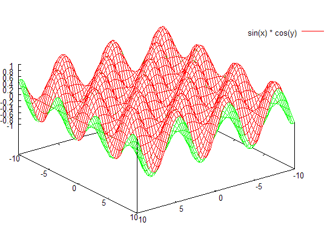
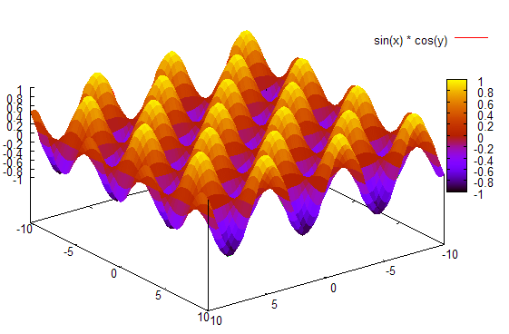
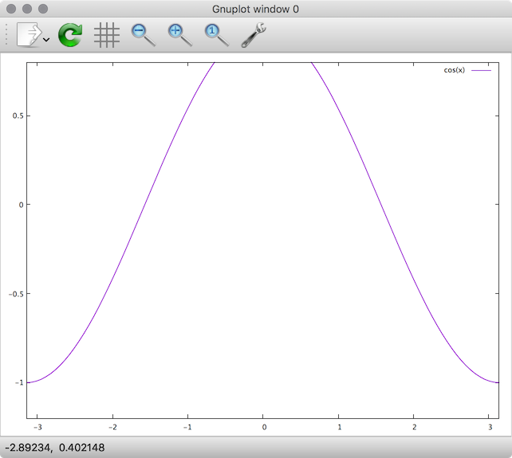
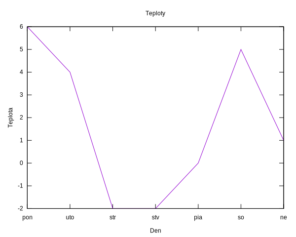

# Čo je `gnuplot`?

Ako uvádza FAQ (často kladené otázky), `gnuplot` je multiplatformový nástroj, ktorý umožňuje:

* kreslenie dvoj- a viacrozmerných funkcií a bodov v rôznych štýloch
* výpočty nad celými, reálnymi a komplexnými číslami
* podporu veľkého množstva operačných systémov (Linux, Win32, Atari(!)...)
* možnosť definícií vlastných funkcií a konštánt

`gnuplot` je primárne nástrojom určeným pre príkazový riadok, ale existujú aj grafické užívateľské rozhrania (napr. pre X11, Win32, MacOS) 

Stiahnutie pre platformy
========================

Windows
-------

Binárky pre `gnuplot` sú k dispozícii v podobe inštalátora z oficiálneho portálu na [SourceForge.net](https://sourceforge.net/projects/gnuplot/files/gnuplot/).

### Nastavenie písma

`gnuplot` používa vo Windowse pomerne neštandardné písmo. Zmeniť ho môžeme pravým kliknutím do okna, zvolením `Choose Font` a vybratím obľúbeného písma (napr. `Fixedsys` alebo `Courier New`). Nastavenie uložíme opäť pravým kliknutím a vybratím `Update setting...`

MacOS
-----

Najľahší spôsob je inštalácia cez *Homebrew*. MacOS fungujú najlepšie s terminálom `qt`:

```shell
brew install gnuplot --with-qt
```

# Práca s `gnuplot`om

Vykresľovanie a výpočty sú riadené príkazmi, ktoré zvyknú mať parametre. Príkaz zadáme a potvrdíme Enterom.

## Vykreslenie grafu funkcie jednej premennej
Jednoduché vykreslenie grafu funkcie *sin(x)*: 
```
plot sin(x)
```
Vykreslenie funkcie na intervale (-π, π): 
```
plot [x=-pi:pi] sin(x)
```
`pi` je užívateľská premenná, je definovaná ako 3.14159265358979. 

Vykreslenie funkcia na intervale s obmedzením intervalu pre funkčných hodnôt: 
```
plot [x=-pi:pi] [0:1] sin(x)
```
Vykreslí sa funkcia sínus, budú zobrazované len hodnoty nad osou. 

##  Funkcie dvoch premenných
Na kreslenie funkcií viacerých premenných slúži príkaz splot 
```
splot sin(x) * cos(y)
```
Mätež možno napraviť zakázaním vykresľovania skrytých povrchov: 
```
set hidden3d
```
Nezabudnite po zadaní tohto príkazu vykonať 
```
replot
```
Tento príkaz znovu vykoná posledný zadaný príkaz `plot` alebo `splot`. 

Tip: posledný zadaný príkaz zobrazíte stlačením klávesu šípka hore.

Niekedy sa môže stať, že vykreslená funkcia bude vyzerať príliš „hranato“ (napr. uvedená funkcia by mala mať „ladné krivky“). V takom prípade treba zvýšiť presnosť používanú pri vykresľovaní.
```
set isosamples 40
```
Podotknime, že čím vyššia presnosť, tým bude vykresľovanie trvať dlhšie.



Ak chceme vykresľovať plochy ako vyplnené (nielen pomocou čiar), môžeme použiť zapnúť vyplňovací režim:
```
set pm3d
```



Vykresľovanie skrytých povrchov môžete zas zakázať pomocou:
```
unset hidden3d
```
Opäť môžeme obmedziť intervaly premenných: 
```
splot [x=0:10] [y=0:10] sin(x) * cos(y)
```
Do jedného grafu môžeme vykresliť viacero funkcií: 
```
plot [x=-pi:pi] [0:1] sin(x), cos(x), cos(2*x)
```
Ak používame skript (zoznam súborov obsahujúci príkazy), a potrebujeme rozdeliť jeden príkazový riadok `gnuplot`-u na viacero riadkov v textovom editore, použijeme znak spätnej lomky `'\'`. 
```
plot [x=-pi:pi] [0:1] \
sin(x), \
cos(x), \
cos(2*x)
```
## Užívateľské premenné a funkcie
`gnuplot` umožňuje definíciu užívateľských funkcií a premenných: 
```
f(x) = sin(x)
```
definuje užívateľskú funkciu ''f(x)''. Potom môžeme používať túto funkciu nasledovne: 
```
plot f(x)
```
čím sa vykreslí sínus. 

Podobne možno definovať aj vlastné premenné: 
```
a = 0.5
```
Potom môžeme písať: 
```
plot a * f(x)
```
Pozor pri definícii premenných na rozdiel medzi celočíselnými a reálnymi premennými. Ak zadáte 
```
lambda = 3
print 5 / lambda
```
tak výsledkom bude 1 a nie 1.666..., pretože sa delí celočíselnou premennou! Píšte radšej 
```
lambda = 3.0
print 5.0 / lambda
```

Zoznam užívateľsky definovaných premenných resp. funkcií vypíšeme pomocou `show variables` resp. `show functions`.

## Najdôležitejšie možnosti grafu

* Nastavenie vykresľovania okrajov grafu: `set border`, resp. `set noborder`
* Nastavenie vykresľovania mriežky: `set grid`, resp. `set nogrid`
* Nastavenie nadpisu: `set title "Nádherný graf funkcie sínus"`
* Nastavenie titulkov čiar: `plot sin(x) title "sínus"`
* Nastavenie titulkov osí: `set xlabel "názov osi"`, resp. `set ylabel "názov osi"`
* Zmena veľkosti -- príkaz `set size`
** nastavenie normálnej veľkosti: `set size 1,1`
** nastavenie veľkosti so zachovaním pomerov: 
```
set size ratio pomer x-veľkosť, y-veľkosť
```
kde je zadaný pomer ako číslo reprezentujúce osi y-ovej ku x-ovej `gnuplot` sa snaží vytvoriť graf so zadaným pomerom osí na ploche vymedzenej veľkosťami x-veľkosť, y-veľkosť. Napr. 
```
set size ratio 2 0.7, 0.7
```
zabezpečí, že výška grafu bude dvojnásobok šírky. Namiesto `ratio 1` možno písať `square`. Vrátiť nastavenia na implicitné hodnoty terminálu možno pomocou `nosquare`, `noratio`. 
Ďalšie možnosti sa týkajú skupiny príkazov set, informácie sú v dokumentácii. 

## Terminály
`gnuplot` podporuje výstup do rôznych formátov – hovorí sa tu o výstupných zariadeniach, či termináloch. Zoznam dostupných terminálov možno zobraziť pomocou 

```
show terminal
```
Implicitným terminálom býva typicky `windows` (na platforme Windows), či X11 (na *ixoch). Terminál možno zmeniť pomocou 
```
set term názov_terminálu
```
Terminál `windows` vykresľuje graf do ďalšieho okna, ostatné terminály sú vhodné na zápis do súboru. 
### Hlúpy terminál do terminálu

Na niektorých platformách je k dispozícii **hlúpy** terminál `dumb`, ktorý vykresľuje dáta do konzoly. Vykreslenie sínusu potom vyzerá nasledovne:

```
       1 +-----------------------------------------------------------------+
         |               *+ *             +   * **         +      *   *    |
     0.8 |-+            *    *               *    *         sin(x)********-|
     0.6 |-+            *     *             *     *              *     * +-|
         |             *      *             *     *              *      *  |
     0.4 |*+           *      *             *      *            *       *+-|
         |*           *        *           *        *           *       *  |
     0.2 |*+          *        *           *        *           *       *+-|
       0 |-*          *         *         *         *          *         *-|
         | *         *          *         *          *         *          *|
    -0.2 |-+*        *          *         *          *        *          +*|
         |  *       *            *       *            *       *           *|
    -0.4 |-+*       *            *       *            *       *          +*|
         |   *      *             *     *             *      *             |
    -0.6 |-+ *     *              *     *              *    *            +-|
    -0.8 |-+  *   *               *    *               *    *            +-|
         |    *   *       +        ** *   +             *  *               |
      -1 +-----------------------------------------------------------------+
        -10              -5               0                5               10
```

### Terminál `qt` pre MacOS

Štandardný terminál pre MacOS od Yosemite a vyššej je `qt`.



### Výstup do formátu pre LaTeX

Ak chceme vytvoriť obrázok vo formáte prostredia picture pre LaTeX, musíme po zmene terminálu nastaviť aj výstupný súbor, inak sa údaje zobrazia na štandardnom výstupe. 
```
set term latex
set output 'D:\obrazok.tex'
replot
```
Po vykonaní týchto príkazov môžeme vykonať zase `set term windows`. 
### Výstup do formátu JPG
JPG obrázok môžeme vytvoriť jednoducho. Stačí nastaviť správny terminál a vykresliť graf.
```
set term jpeg
set output 'D:\obrazok.jpg'
plot sin(x)
# alebo replot, ak chceme obrázok len vykresliť znovu
set term windows
```
V danom adresári sa vytvorí súbor s obrázkom.

Každý terminál môže mať ďalšie možnosti (veľkosť písma, zapnutie podpory farieb...). Bližšie informácie sú v dokumentácii. 

Dáta zo súboru
--------------

`gnuplot` vie vykresľovať aj statické dáta, a to dokonca zo súboru. Namerajme si teploty a uložme do súboru `D:\teploty.txt`.

```
den teplota
pon 6
uto 4
str -2
stv -2
pia 0
so 5
ne 1
```

Príkaz `plot` dokáže kresliť dáta zo súboru:

```
plot "D:\teploty.txt" using 2:xticlabels(1) with lines notitle
```

Takto sa vykreslia jednotlivé teploty, pričom

-  `2` indikuje druhý stĺpec nesúci teploty
- `xticlabels(1)` vyhlási prvý stĺpec (s dňami) za nositeľa popiskov pre *x*-ovú os
- `with lines` nakreslí úsečky medzi bodmi, čím zvýrazní priebeh teplôt. Bez tohto nastavenia uvidíme len samotné body (aj to nie veľmi výrazne.)
- `notitle` vypne ničnehovoriaci popisok dátovej čiary

### Plný príklad s popiskami

V úplnom príklade môžeme ešte nastaviť titulok grafu (`title`), prispôsobiť *x*-ovú a *y*-ovú popisku osi:

```
set title "Teploty"
set xlabel "Den"
set ylabel "Teplota"
plot "D:\teploty.txt" using 2:xticlabels(1) with lines notitle
```



# Zložitejší príklad

```
cd 'D:\test\prasta2'
# vypise aktualnu cestu
pwd
# vymaze terminal
clear
set size 0.6,0.6
set term latex

e = exp(1)
#-----------------------------------------------------------------
set output 'pic_rozdelenie_ex.tex'
set title ''
exdelta(x) = (1/delta)*(e**(-x/delta))
plot [x=1:150] [0:0.15] \ 
delta = 5., exdelta(x) title '$\delta = 5$', \
delta = 10., exdelta(x) title '$\delta = 10$', \ 
delta = 25., exdelta(x) title '$\delta = 25$'

set output 'pic_df_ex.tex'
exdeltadf(x) = (1-e**(-x/delta))
plot [x=0:50] [0:1] \ 
delta = 5., exdeltadf(x) title '$\delta = 5$',\ 
delta = 10., exdeltadf(x) title '$\delta = 10$', \
delta = 25., exdeltadf(x) title '$\delta = 25$'
#----------------------------------------------

set term win
print 'Jobs done'
```