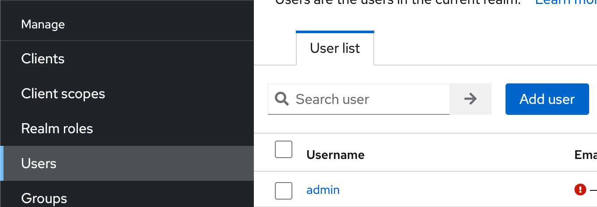
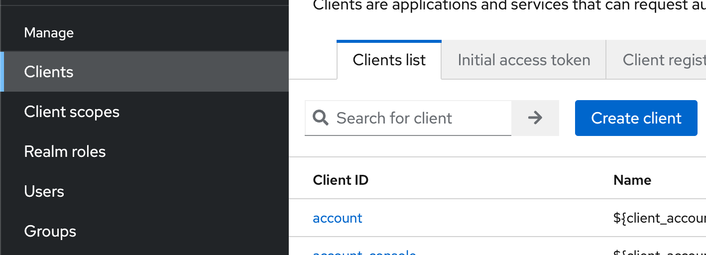
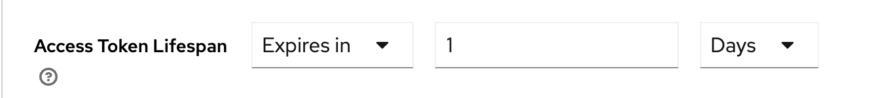

:icons: font

== O Keycloak-u
**Keycloak** je open source riešenie pre:

- jednotné prihlasovanie (_single sign on_) do viacerých aplikácií, či microservisov
- správu identít používateľov (_identity management_) a správu prístupov (_access management_), sumárne systém typu IAM
- poskytovateľa identít (_identity provider_) pre protokol OpenID Connect či SAML
- autorizačný server (_Authorization Server_) pre protokol OAuth 2.0

== Typické prípady použitia bez Keycloaku

HTTP Basic:: do HTTP požiadavky priložíme hlavičku `Authorization`, kde uvedieme hashovaný login a heslo, čím realizujeme autorizovaný prístup.
Bežný backend:: používateľ sa prihlási cez formulár, server odpovie s _cookie_ v hlavičke, a každá ďalšia požiadavka bude obsahovať _cookie_ indikujúcu úspešné prihlásenie

== Načo Keycloak?

Keycloak je:

- databáza používateľov, ich osobných údajov
- evidencia hesiel či iných _credentials_, teda autentifikačných možností
- príslušnosti k skupinám
- priradenie rolí
- nástroj na realizáciu prihlasovacieho formulára
- s unifikovanými protokolmi, ktorým rozumejú rozličné jazyky

== Typické prípady použitia s Keycloak-om

. Používateľ sa prihlási cez prihlasovací formulár v Keycloaku a tým je automaticky autentifikovaný pre náš webový portál.
. Používateľ pomocou loginu a hesla získa _token_, teda dôkaz o úspešnom prihlásení_ a prikladá ho ku každému volaniu REST API
. Používateľ sa prihlási v SPA (_Single Page App_) a jeho prihlasovanie sa automaticky propaguje na _backendovú_ aplikáciu.

== Plán práce

. Stiahneme Keycloak, rozbalíme.
. Spustíme Keycloak na lokálnom stroji.
. Pridáme vzorových používateľov vrátane loginu a hesla
. Využijeme _flow_, teda postupnosť krokov, kde vymeníme login a heslo za token typu JWT.
. Pozrieme sa, čo je vo vnútri tokenu.

=== Stiahnutie a spustenie

Na spustenie je potrebná Java aspoň verzie 11, predpokladáme, že je nainštalovaná.

Keycloak stiahneme z https://www.keycloak.org/downloads[domovskej stránky na Keycloak.org].

Rozbalíme ho:

```
cp ~/Downloads/keycloak*.zip ~/Applications
cd ~/Applications
unzip keycloak*.zip
cp ~/Applications/keycloak-21.0.1
```

Keycloak spustíme na lokálnom stroji vo vývojárskom režíme:

----
bin/kc.bat --start-dev
----

TIP: Keycloak beží na porte 8080.

=== Pridanie administrátorskeho konta

Navštívme http://localhost:8080.

Vytvorme administrátorku:

- Username: `admin`
- Password i Password Confirmation: `Igieciehou1Mie`

Prihlásme sa do administrátorskej konzoly na adrese http://localhost:8080/admin/.

=== Realm

Realm je niečo ako _projekt_, či _menný priestor_, alebo _workspace_, či _tenant_ v ktorom možno v rámci inštancie nezávisle udržiavať konfiguračné nastavenia.

Štandardný realm je `master`.

=== Nový používateľ

Pridajme používateľa i s heslom.



. V ľavom paneli zvoľme `Users`.
. Pridajme nového používateľa cez tlačidlo *Add user*.
. Vyplňme najmenej login, napr `harald`.
. Overme, že používateľ je povolený (_Enabled_), obvykle prepínačom vpravo hore.
. Na karte *Credentials* nastavme heslo cez *Set Password*.
    .. Vyplňme heslo a potvrdenie, napr. `Yei8eejaiJeith`.
    .. Zakážme dočasné heslo, inak by si ho používateľ po prvom prihlásení musel zmeniť: *Temporary* je vypnuté.

== Klienti a aplikácie

IMPORTANT: Client (_klient_) sú aplikácie či služby, ktoré vyžadujú prihláseného používateľa.

Príkladom klienta môže byť backendová aplikácia s REST API, ktorá vyžaduje prihláseného používateľa; iným príkladom je aplikácia, ktorá dokáže získavať zabezpečené údaje _v mene_ konkrétneho používateľa.

Pripravme si klienta reprezentujúceho REST API backend.



. V ľavom paneli zvoľme *Client Scopes*.
. Pridajme nového klienta cez tlačidlo *Create client*.
. Ponechajme protokol *OpenID Connect*.
. Vyplňme identifikátor klienta -- `megabank`.
. Voliteľne dodajme popis a názov.
. V bloku *Capability Config* sa uistime, že máme povolený _Standard Flow_ a _Direct access grants_.
. V bloku *Login Settings* ponechajme všetko prázdne.

== Prihlásenie cez flows: ROPC

Keycloak rozumie viacerým prístupom k prihlasovaniu -- tzv. *flow*.
Najjednoduchší flow je ROPC (*Resource Owner Password Flow*), definovaný v štandardne OAuth 2.0, ktorý dokáže vymeniť login a heslo za autentifikačný _token_ reprezentujúci úspešné prihlásenie.

NOTE: Tento _flow_ je azda najjednoduchší a slúži pre aplikácie, ktoré len chcú migrovať na OAuth 2.0.
Treba absolútne dôverovať aplikácii, ktorá prevezme prihlasovacie údaje, a nechce ich zneužiť.

S použitím nástroja `curl` dokážeme získať token:

----
curl -X POST --location "http://localhost:8080/realms/master/protocol/openid-connect/token" \
    -H "Content-Type: application/x-www-form-urlencoded" \
    -d "grant_type=password" \ //<1>
    -d "client_id=megabank" \ //<2>
    -d "scope=openid" \ //<3>
    -d "username=harald" \ //<4>
    -d "password=Yei8eejaiJeith"
----
<1> Používame flow ROPC indikovaný typom `grant_type`.
<2> Uvedieme identifikátor klienta.
<3> Dodáme špeciálny atribút, ktorý v Keycloaku indikuje použitie protokolu OIDC (OpenID Connect). V ňom vieme získavaať pokročilé informácie o prihlásení cez token.
<4> Dodáme login a heslo.

Odpoveďou bude JSON s viacerými atribútmi:

[source,json]
----
{
  "access_token":"eyJh....",
  "expires_in":60,
  ...
}
----

Odpoveďou bude token v atribúte `access_token`.
Tento token reprezentuje informáciu o úspešnom prihlásení, s ktorou teraz vieme pristúpiť k autorizovanému REST API v našej službe, ktorú si potrebujeme vytvoriť.

=== Overenie tokenu

Celý token vieme zobrať a overiť pomocou keycloakovej služby na _endpointe_ `userinfo`.

    http://localhost:8080/realms/master/protocol/openid-connect/userinfo
    Authorization: Bearer eyJh....

Výsledkom bude JSON s informáciami o prihlásení.

----
{
  "sub": "0f0d7fe9-9293-4ef4-a476-9e2aba73028c", //<1>
  "email_verified": false,
  "preferred_username": "harald", //<2>
  "given_name": "",
  "family_name": ""
}
----
<1> Identifikátor používateľa v Keycloaku vo formáte UUID.
<2> Ľudsky čitateľný _login_ používateľa.

== Tokeny

Ak používame flow ROPC a požiadame si protokol OIDC, dostaneme token vo formáte JWT.

Ide o digitálne podpísanú nemennú informáciu najmä o:

- identifikátore používateľa
- jeho logine
- klientovi, ktorého sa dotýka

Okrem toho token obsahuje:

- časovú pečiatku vydania
- dátum expirácie
- algoritmus, ktorý sa použil na digitálny podpis

TIP: Tokeny majú obmedzenú platnosť.
Každý token je totiž „kľúčom“, ktorým vieme pristúpiť k autorizačnej službe!
Tokeny treba chrániť podobne ako heslá.


Tento token pozostáva z troch zložiek oddelených bodkou, pričom každá je reprezentovaná kódovaním Base64.

----
ey[___].eyJleH[___]VZGO6-Aa7q_Sjygf21BYrm6bVAXnBGeJrOOCxyTUs9nmZ9wKP64I2O7NaJwPtdAhbeZVlh2MkxqWe9HtxBhgHXSNQ1DRs43ergRKbEpObV
----

Token vieme zobrať a vložiť buď:

- do online služby https://jwt.io/
- prípadne https://plugins.jetbrains.com/plugin/9831-jwt-json-web-token-analyzer/[JWT plug-in pre platformu IntelliJ]

Po dekódovaní uvidíme tri zložky, každá vo formáte JSON.

- najprv hlavičku: s algoritmom a typom tokenu
- na konci digitálny podpis indikujúci neporušiteľnosť a autenticitu tokenu.
Token je obvykle podpísaný privátnym kľúčom Keycloaku, a overiť ho môžeme verejným kľúčom.
- telo: reprezentujúce _claims_, teda tvrdenia o príslušnom prihlásení.

Príklad tela:
----
{
  "exp": 1679693901, <1>
  "iat": 1679693841, <2>
  "sub": "0f0d7fe9-9293-4ef4-a476-9e2aba73028c", <3>
  "preferred_username": "harald" <4>
}
----
<1> Dátum expirácie tokenu ako unixová časová pečiatka.
<2> Dátum vydania tokenu, tiež ako pečiatka
<3> Subjekt, teda jednoznačný identifikátor používateľa z Keycloaku.
<4> Ľudsky čitateľné meno.

IMPORTANT: Pokusy upravovať token narušujú jeho digitálny podpis! Služba tak vie okamžite zistiť, či sa útočník nepokúša predstierať, že je niekto ný.

=== Platnosť tokenov

Štandardný token platí minútu.
Ak máme testovacie prostredie a nechceme dokola získavať nové tokeny, môžeme pre konkrétneho klienta predĺžiť platnosť.

V *Clients* > _Megabank_ na karte *Advanced* sa posunieme do spodných častí obrazovky.
Nájdeme sekciu *Access Token Lifespan* a nastavíme expiráciu napríklad na 1 deň.



Nastavenia nezabudnime uložiť!

Po získaní nového tokenu uvidíme v atribúte `expires_in` platnosť jedného dňa.

----
"expires_in": 36000,
----

== Ako ďalej?

V ďalšom kroku je čas na vlastnú službu, ktorú ochránime autorizáciu s protokolom OAuth 2.0/OIDC, a preukážeme sa JWT tokenom.