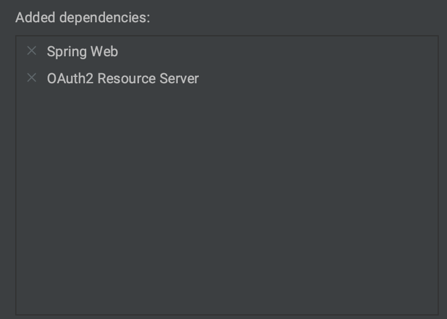

:icons: font

V predošlom dieli sme si ukázali, ako je možné rozbehať Keycloak v jednoduchej podobe „databázy pre používateľov a kontá“.

Teraz si ukážme, ako je možné zobrať backendovú aplikáciu s REST API, a ochrániť ju tak, aby bola dostupné len po prihlásení používateľa cez Keycloak.

Plán práce bude:

- Pripravíme si REST API cez Spring Boot.
- Zabezpečíme ho cez knižnicu Spring Security, ktorá sa postará o autorizáciu.
- Dodáme integráciu s Keycloakom pomocou štandardu OAuth 2.0 / OpenID Connect 1.0.
- Ukážeme si, ako je možné zobrať token JWT a použiť ho v REST API na informáciu o prihlásení.

== REST API a Spring Boot

Pripravme si aplikáciu v Spring Boote.
Najlepšie na to použiť _Spring Initializr_, či už cez portál https://start.spring.io alebo cez IntelliJ IDEA.

Dôležité je naklikať dva komponenty:

Spring Web:: pre REST API
OAuth 2 Resource Server:: pre integráciu s Keycloakom.

NOTE: Náš backend v Spring Boote bude figurovať v role _Resource Servera_, čo je v terminológii OAuth 2.0 súčiastka, ktorá obsahuje používateľské dáta a zverejňuje ich autentifikovaným používateľom

=== Kontrolér pre REST API

Pripravme si metódu pre REST API, ktorá zverejní stav účtu:

[source,java]
.BankApplication.java
----
@GetMapping("/accounts/{accountId}/balance")
public BigDecimal getBalance(@PathVariable String accountId) {
    return BigDecimal.TEN;
}
----

Dodajme nad triedu `BankApplication` anotáciu `RestController`:

[source,java]
.BankApplication.java
----
@SpringBootApplication
@RestController
public class BankApplication {
    ///...
}
----

Zmeňme tiež port pre HTTP na 8888 -- nechceme kolidovať s portom 8080 pre Keycloak.

[source,java]
.application.properties
----
server.port=8888
----

Spusťme teraz celý backend!

=== HTTP požiadavky na backend

Na požiadavky budeme používať HTTP klienta zabudovaného v IntelliJ IDEA.

Založme súbor `src/test/resources/requests.http` s jediným riadkom:

[source]
.src/test/resources/requests.http
----
http://localhost:8888/accounts/1
----

[TIP]
====
Súbor je ekvivalentom príkazu pre `curl`:

    curl -X GET --location "http://localhost:8888/accounts/1"
====

Ak tento súbor spustíme, uvidíme odpoveď, ktorá vyžaduje autorizáciu:

[source]
----
HTTP/1.1 401 <1>
WWW-Authenticate: Basic realm="Realm" <2>
...
----
<1> Stavový kód 401 znamená, že sa vyžaduje autorizácia.
<2> Podľa tejto hlavičky zistíme, že sa postupuje podľa filozofie _HTTP Basic_.

IMPORTANT: Toto všetko sa deje vďaka modulu _Spring Security_, ktorý sa automaticky objavil v projekte ako závislosť na knižnici `spring-boot-starter-oauth2-resource-server`.
Toto zatiaľ nemá nič spoločné s OAuth 2.0/OIDC -- je to štandardné správanie _Spring Security_ v _Spring Boot_-e.

== Integrácia s Keycloakom

=== Metadáta pre OpenID Connect 1.0

Keycloak ako autorizačný server nad protokolom _Open ID Connect_ zverejňuje metadáta o svojej konfigurácii vo formáte JSON.
Takto vieme zistiť napríklad:

- adresy URL pre jednotlivé _endpointy_ podľa príslušného flowu,
- informácie o šifrovacích metódach pre tokeny JWT,
- flowy OAuth 2.0, ktoré tento server podporuje,

Formát sa riadi normou https://openid.net/specs/openid-connect-discovery-1_0[OpenID Connect Discovery 1.0].

[TIP]
====
Keycloak zverejňuje informácie na dohodnutej adrese, ktorá pre _realm_ `master` je dostupná na http://localhost:8080/realms/master/.well-known/openid-configuration.

Pokojne ju navštívme z prehliadača!
====

Spring Boot a modul OAuth 2.0 Resource Server dokáže z tejto adresy zistiť všetko podstatné pre integráciu!

=== Integrácia medzi Spring Boot a Keycloak

Do `application.properties` v Spring Boote stačí dodať jedinú vlastnosť: cestu, z ktorej sa dajú odvodiť metadáta pre OIDC 1.0.

[source]
.application.properties
----
spring.security.oauth2.resourceserver.jwt.issuer-uri=http://localhost:8080/realms/master
----

IMPORTANT: Príponu `/.well-known/openid-configuration.` si Spring Boot domyslí.

Po reštarte aplikácie môžeme zopakovať požiadavku HTTP.
Uvidíme stavový kód 401, hoci s inou hlavičkou.

[source]
----
GET http://localhost:8888/accounts/1/balance

HTTP/1.1 401
WWW-Authenticate: Bearer <1>
----
<1> Vyžaduje sa hlavička `Bearer`, teda sa očakáva token JWT.

== ROPC flow a REST API

Na to, aby REST API fungovalo, potrebujeme získať token JWT.
Najjednoduchší spôsob je využiť flow ROPC.

- Z Keycloaku vymeníme login a heslo za JWT token
- JWT token priložíme ku požiadavke na springové REST API.

Ak používame IntelliJ IDEA, tak dvojicu požiadaviek vieme prepojiť cez premenné a vyhodnocovače odpovedí.

[source,httprequest]
----
### Get JWT Token
POST http://localhost:8080/realms/master/protocol/openid-connect/token
Content-Type: application/x-www-form-urlencoded

grant_type=password&client_id=megabank&scope=openid&username=harald&password=Yei8eejaiJeith

> 

### Retrieve bank balance
http://localhost:8888/accounts/1/balance
Authorization: Bearer {{jwt}}
----

Odpoveďou bude stav na účte.

[TIP]
====
Ak by sme používali `curl`, vyzeralo by to nasledovne:

[source]
----
curl 'http://localhost:8888/accounts/1/balance' \
>     -H "Authorization: Bearer eyJh...WI-Q"
----
====

=== Pozor na ROPC flow

ROPC flow je síce extrémne jednoduchý, ale:

. Každá aplikácia si musí implementovať svoju vlastnú prihlasovaciu stránku. Teraz síce získavame JWT token cez REST API, ale v reálnom nasadení (napr. cez SPA) musíme _odniekiaľ_ zasielať login a heslo.
. ROPC vyžaduje extrémnu dôveru v klienta: musíme si byť istí, že login a heslo odovzdané do prihlasovacej stránky v prehliadači či mobilnej appke neunikne nikam bokom, alebo sa neodcudzí po ceste.
. Klient sa musí bezpečne starať o náš login a heslo a musí ho ukladať na citlivé miesto.

IMPORTANT: ROPC flow sa už neodporúča používať a v OAuth 2.1 zrejme ani nebude použiteľný.
Ak je to možné, systém treba migrovať na lepší flow.

=== Sprístupnenie prihlasovacích údajov v REST API

Knižnica _Spring OAuth 2 Resource Server_ sa priamo integruje s možnosťami Spring Security.

Ak chceme zistiť, aký používateľ prišiel do REST API, použime anotáciu https://docs.spring.io/spring-security/site/docs/current/api/org/springframework/security/core/annotation/AuthenticationPrincipal.html[`AuthenticationPrincipal`] nad parametrom typu `org.springframework.security.oauth2.jwt.Jwt`.

IMPORTANT: Pozor, v Spring Boote existuje viacero tried `Jwt`.
Treba vybrať tú správnu!

[source,java]
----
@GetMapping("/accounts/{accountId}/balance")
public BigDecimal getBalance(@PathVariable String accountId,                                                @AuthenticationPrincipal Jwt jwt) //<1>
{
    String userId = (String) jwt.getClaims().getOrDefault("sub", ""); //<2>
    //...
}
----
<1> Informácie o prihlásenom používateľovi vo formáte JWT.
<2> Objekt `Jwt` obsahuje všetky _claims_, teda údaje o používateľovi v podobe mapy.
Claim `sub` obsahuje identifikátor `UUID` používateľa z Keycloaku.

===

== Práca s rolami z tokenu JWT

Keycloak umožní priradiť každému používateľovi aj zoznam rolí.
Aj náš používateľ `harald` má implicitné roly, schované v claime `realm_access` v podobe zanoreného JSONu.

[source,json]
----
{"roles":[
  "default-roles-master",
  "offline_access",
  "uma_authorization"]
}
----

Tieto roly môžeme namapovať na roly v Spring Security.

IMPORTANT: Do aplikačného kontextu v Springu dodáme objekt typu `Converter<Jwt, Collection<GrantedAuthority>>`, ktorý zmení token `JWT` na zoznam autorít (rolí) v Spring Security.

[source,java]
.KeycloakAuthoritiesConverter.java
----
package com.github.novotnyr.bank;

import org.springframework.core.convert.converter.Converter;
import org.springframework.security.core.GrantedAuthority;
import org.springframework.security.core.authority.SimpleGrantedAuthority;
import org.springframework.security.oauth2.jwt.Jwt;

import java.util.ArrayList;
import java.util.Collection;
import java.util.Collections;
import java.util.List;
import java.util.Map;

/**
 * Extracts Keycloak roles to authorities.
 * 

 *     Source:
 *     <pre>
 *         "realm_access : { "roles":["visitor"] }
 *     </pre>
 * 

 */
public class KeycloakAuthoritiesConverter implements Converter<Jwt, Collection<GrantedAuthority>> {

    public static final String REALM_ACCESS_CLAIM = "realm_access";

    public static final String ROLES_CLAIM = "roles";

    @SuppressWarnings("unchecked")
    @Override
    public Collection<GrantedAuthority> convert(Jwt source) {
        if (!source.hasClaim(REALM_ACCESS_CLAIM)) {
            return Collections.emptyList();
        }
        Object claim = source.getClaim(REALM_ACCESS_CLAIM);
        if (!(claim instanceof Map)) {
            return Collections.emptyList();
        }
        Map<String, Object> realmAccess = (Map<String, Object>) claim;
        if (!realmAccess.containsKey(ROLES_CLAIM)) {
            return Collections.emptyList();
        }
        Object rolesClaimObject = realmAccess.get(ROLES_CLAIM);
        if (!(rolesClaimObject instanceof Collection<?> roleObjects)) {
            return Collections.emptyList();
        }
        List<GrantedAuthority> authorities = new ArrayList<>();
        for (Object roleObject : roleObjects) {
            String role = roleObject.toString();
            SimpleGrantedAuthority simpleGrantedAuthority = new SimpleGrantedAuthority(role);
            authorities.add(simpleGrantedAuthority);
        }
        return authorities;
    }
}
----

Do kontextu potom pridáme _bean_:

[source,java]
----
@Bean
JwtAuthenticationConverter jwtAuthenticationConverter() {
    var authenticationConverter = new JwtAuthenticationConverter();
    authenticationConverter.setJwtGrantedAuthoritiesConverter(new KeycloakAuthoritiesConverter()); //<1>
    authenticationConverter.setPrincipalClaimName("preferred_username"); //<2>
    return authenticationConverter;
}
----
<1> Autority v Spring Security budeme prevádzať pomocou nášho konvertéra.
<2> Ako bonus vieme nastaviť meno _principala_ z claimu, ktorý obsahuje meno používateľa namiesto jeho identifikátora UUID.

[TIP]
====
Po tejto zmene dokážeme zapojiť mechanizmus pre `@Secured` na overenie rolí, či overovania pomocou `hasRole` v anotáciách `@PreAuthorize` nad metódami, napríklad:

[source,java]
----
@PreAuthorize("hasAnyAuthority('visitor')")
----
====

== Roly a autorizácie

Toto všetko môžeme skombinovať aj do overovania rolí pri volaní metód.

- Zapneme podporu pre autorizáciu volania metód.
- Dodáme nad metódu overovanie role.

=== Podpora pre autorizáciu volania metód

Od Spring Security 6.0 používame anotáciu `@EnableMethodSecurity`.

[source,java]
----
@EnableMethodSecurity
public class BankApplication {
    //...
}
----

NOTE: V starších Spring Security bola štandardom anotácia `@EnableGlobalMethodSecurity`.

Teraz dodáme anotáciu `@PreAuthorize`, ktorá sa spustí iba ak má používateľ rolu `withdrawer` nastavenú v Keycloaku.
V opačnom prípade získame stavový kód _503 (Forbidden)_.

[source,java]
----
@PostMapping("/accounts/{accountId}/withdrawals")
@PreAuthorize("hasAuthority('withdrawer')")
public BigDecimal withdrawTenCrowns(@PathVariable String accountId,
                                    @CurrentSecurityContext(expression = "authentication.name") String userName) {
    logger.info("Withdrawing 10 SKK: account: {}, user {}", accountId, userName);
    return BigDecimal.ZERO;
}
----

== Repozitár

TIP: Zdrojové kódy pre celý repozitár sú na GitHube, v repozitári https://github.com/novotnyr/bank-restapi-oidc[`novotnyr/bank-restapi-oidc`].