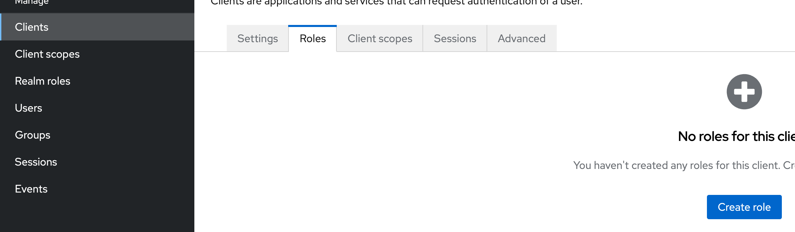
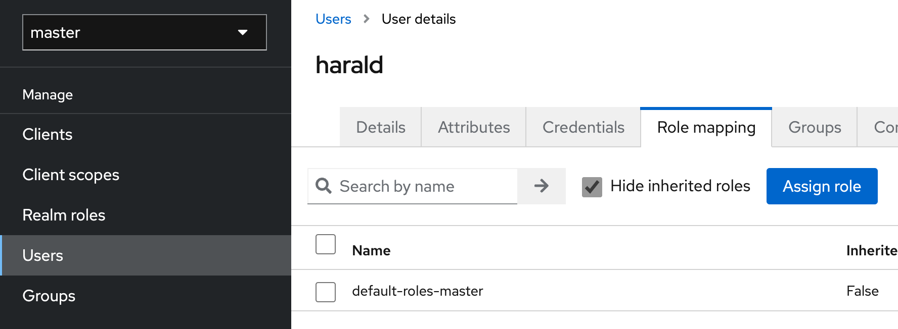
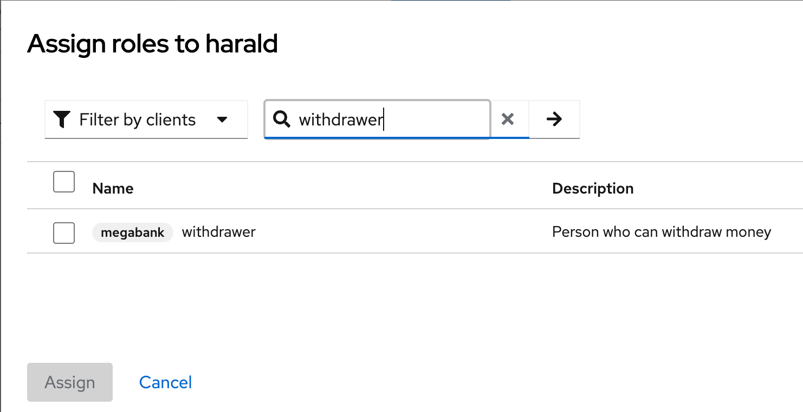
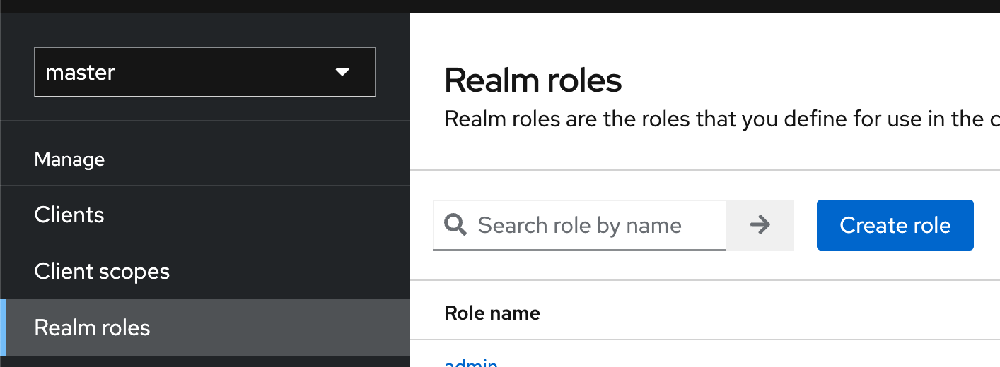
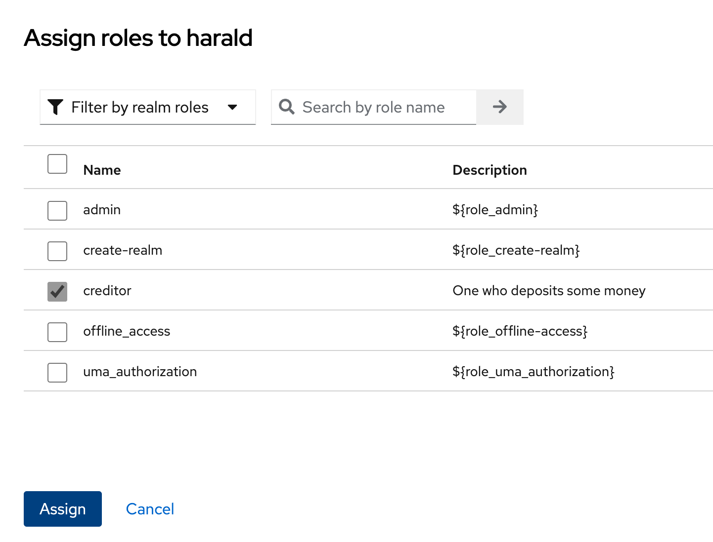

:icons: font

*Roly* (_roles_) umožňujú v Keycloaku pridávať používateľom ľubovoľné „nálepky“, z ktorých je potom možné odvodzovať rozličné druhy oprávnení (_permissions_).
Rolou je `admin`, `guest`, `teller`, čokoľvek.

Ukážeme si:

. Ako možno pridať rolu používateľovi v rámci _clienta_.
. Ako v REST API (Spring Boot) vytiahnuť rolu.
. Ako v REST API určiť autorizáciu: teda prístup k niektorému volaniu len pre vybrané roly.

== Pridávanie roly

=== Vytváranie roly pre klienta `megabank`

Prihlásme sa do http://localhost:8080/admin/master/console/[administrátorskej konzoly] Keycloaku ako administrátorky (obvykle konto `admin`).

Rolu môžeme vytvoriť buď pre celý _realm_ alebo len pre konkrétneho klienta.
Skúsme vytvoriť pre našu _megabanku_ z predošlých dielov rolu `withdrawer` pre človeka, ktorý si dokáže vybrať peniaze.

V bloku *Clients* na karte *Roles* vytvorme novú rolu tlačidlom *Create Role*.

Použime názov roly (`withdrawer`) a prípadný popis.

Rola je tým vytvorená a môžeme ju pridať používateľovi!

=== Pridanie roly používateľovi

V bočnej lište v sekcii `Users` kliknime na používateľa `harald` a pridajme mu rolu.

Na karte *Role Mapping* priraďme rolu tlačidlom *Assign Role*.

Uvidíme zoznam rolí -- ale keďže ide o zoznam rolí celého _realmu_ a nie klienta, musíme rolu vyhľadať cez textové pole -- ale predtým ešte prepnime vo filtri možnosť na _Filter by clients_.

Vyberme rolu a priraďme ju používateľovi -- a to je všetko!

== Rola a tokeny JWT

Rola klienta sa automaticky objaví v tokene JWT.
Skúsme spustiť klasické prihlásenie cez flow ROPC:

[source,bash]
----
curl -X POST --location "http://localhost:8080/realms/master/protocol/openid-connect/token" \
-H "Content-Type: application/x-www-form-urlencoded" \
-d "grant_type=password" \
-d "client_id=megabank" \
-d "scope=openid" \
-d "username=harald" \
-d "password=Yei8eejaiJeith"
----

Po dekódovaní tokenu JWT uvidíme _claim_ `resource_access`:

[source,json]
----
{
	"megabank": {
		"roles": ["withdrawer"]
	},
	"account": {
		"roles": ["manage-account", "manage-account-links", "view-profile"]
	}
}
----

== Roly a Spring Security

Roly z tokenu JWT môžeme namapovať na roly v Spring Security.

IMPORTANT: Do aplikačného kontextu v Springu dodáme objekt typu `Converter<Jwt, Collection<GrantedAuthority>>`, ktorý zmení token `JWT` na zoznam autorít (rolí) v Spring Security.

[source,java]
.KeycloakClaimRoleAuthoritiesConverter.java
----
public class KeycloakClaimRoleAuthoritiesConverter implements Converter<Jwt, Collection<GrantedAuthority>> {
    public static final String RESOURCE_ACCESS_CLAIM = "resource_access";

    public static final String ROLES_CLAIM = "roles";

    private final String oAuth2ClientId;

    public KeycloakClaimRoleAuthoritiesConverter(String oAuth2ClientId) {
        this.oAuth2ClientId = oAuth2ClientId;
    }

    @SuppressWarnings("unchecked")
    @Override
    public Collection<GrantedAuthority> convert(Jwt jwt) {
        Map<String, Object> resourceAccessValues = jwt.getClaimAsMap(RESOURCE_ACCESS_CLAIM);
        if (resourceAccessValues == null) {
            return Collections.emptyList();
        }
        Object clientRolesObject = resourceAccessValues.get(this.oAuth2ClientId);
        if (!(clientRolesObject instanceof Map<?, ?>)) {
            return Collections.emptyList();
        }
        Map<String, ?> clientRoles = (Map<String, ?>) clientRolesObject;
        Object rolesObject = clientRoles.get(ROLES_CLAIM);
        if (!(rolesObject instanceof Collection<?>)) {
            return Collections.emptyList();
        }
        Collection<Object> rolesList = (Collection<Object>) rolesObject;
        List<GrantedAuthority> authorities = new ArrayList<>();
        for (Object roleObject : rolesList) {
            SimpleGrantedAuthority authority = new SimpleGrantedAuthority(roleObject.toString());
            authorities.add(authority);
        }
        return authorities;
    }
}
----

Dodajme potom _bean_ v podobne metódy:

[source,java]
----
@Bean
JwtAuthenticationConverter jwtAuthenticationConverter() {
    var authenticationConverter = new JwtAuthenticationConverter();
    authenticationConverter.setJwtGrantedAuthoritiesConverter(new KeycloakClaimRoleAuthoritiesConverter("megabank"));  //<1>
    authenticationConverter.setPrincipalClaimName("preferred_username"); /<2>
    return authenticationConverter;
}
----
<1> Autority v Spring Security budeme prevádzať pomocou nášho konvertéra.
<2> Ako bonus vieme nastaviť meno _principala_ z claimu, ktorý obsahuje meno používateľa namiesto jeho identifikátora UUID.

== Roly a autorizácie

Toto všetko môžeme skombinovať aj do overovania rolí pri volaní metód.

- Zapneme podporu pre autorizáciu volania metód.
- Dodáme nad metódu overovanie role.

=== Podpora pre autorizáciu volania metód

Od Spring Security 6.0 používame anotáciu `@EnableMethodSecurity`.

[source,java]
----
@EnableMethodSecurity
public class BankApplication {
    //...
}
----

NOTE: V starších Spring Security bola štandardom anotácia `@EnableGlobalMethodSecurity`.

Teraz dodáme anotáciu `@PreAuthorize`, ktorá sa spustí iba ak má používateľ rolu `withdrawer` nastavenú v Keycloaku.
V opačnom prípade získame stavový kód _503 (Forbidden)_.

[source,java]
----
@PostMapping("/accounts/{accountId}/withdrawals")
@PreAuthorize("hasAuthority('withdrawer')")
public BigDecimal withdrawTenCrowns(@PathVariable String accountId,
                                    @CurrentSecurityContext(expression = "authentication.name") String userName) {
    logger.info("Withdrawing 10 SKK: account: {}, user {}", accountId, userName);
    return BigDecimal.ZERO;
}
----

== Roly v rámci _realmu_

Používateľovi môžeme priradiť aj globálnu rolu platnú pre celý _realm_, teda pre všetkých klientov.

Rolu potom pridáme v administrátorskej konzole v sekcii _Realm Roles_.

Tlačidlom _Create Role_ vytvoríme rolu takým istým spôsobom ako v prípade roly pre konkrétneho klienta.
Vytvorme teda rolu `creditor`

Rolu priradíme používateľovi podobne ako v prípade roly klienta, ba dokonca ju automaticky uvidíme v zozname rolí a nemusíme ju vyhľadávať.

=== Roly _realmu_ a JWT

Roly realmu sa objavia v tokene JWT na inom mieste, budú schované v claime `realm_access` v podobe zanoreného JSONu.

[source,json]
----
{
  "roles": [
    "default-roles-master",
    "offline_access",
    "creditor",
    "uma_authorization"
  ]
}
----
Vidíme rolu `creditor` a niekoľko implicitných systémových rolí.

Aj tieto roly vieme namapovať na roly / autority v Spring Security.
Konverter bude vyzerať trochu inak:

[source,java]
.KeycloakAuthoritiesConverter.java
----
package com.github.novotnyr.bank;

import org.springframework.core.convert.converter.Converter;
import org.springframework.security.core.GrantedAuthority;
import org.springframework.security.core.authority.SimpleGrantedAuthority;
import org.springframework.security.oauth2.jwt.Jwt;

import java.util.ArrayList;
import java.util.Collection;
import java.util.Collections;
import java.util.List;
import java.util.Map;

/**
 * Extracts Keycloak roles to authorities.
 * 

 *     Source:
 *     <pre>
 *         "realm_access : { "roles":["visitor"] }
 *     </pre>
 * 

 */
public class KeycloakAuthoritiesConverter implements Converter<Jwt, Collection<GrantedAuthority>> {

    public static final String REALM_ACCESS_CLAIM = "realm_access";

    public static final String ROLES_CLAIM = "roles";

    @SuppressWarnings("unchecked")
    @Override
    public Collection<GrantedAuthority> convert(Jwt source) {
        if (!source.hasClaim(REALM_ACCESS_CLAIM)) {
            return Collections.emptyList();
        }
        Object claim = source.getClaim(REALM_ACCESS_CLAIM);
        if (!(claim instanceof Map)) {
            return Collections.emptyList();
        }
        Map<String, Object> realmAccess = (Map<String, Object>) claim;
        if (!realmAccess.containsKey(ROLES_CLAIM)) {
            return Collections.emptyList();
        }
        Object rolesClaimObject = realmAccess.get(ROLES_CLAIM);
        if (!(rolesClaimObject instanceof Collection<?> roleObjects)) {
            return Collections.emptyList();
        }
        List<GrantedAuthority> authorities = new ArrayList<>();
        for (Object roleObject : roleObjects) {
            String role = roleObject.toString();
            SimpleGrantedAuthority simpleGrantedAuthority = new SimpleGrantedAuthority(role);
            authorities.add(simpleGrantedAuthority);
        }
        return authorities;
    }
}
----

Samozrejme, musíme sa rozhodnúť, ktorý konverter použijeme ako _bean_ -- či ten, ktorý vyťahuje roly z realmu alebo klienta.

TIP: Na domácu úlohu si môžeme implementovať kompozitný konverter, ktorý zlúči roly _realmu_ s rolami _klienta.

Všetko ostatné sa zachová: automaticky máme k dispozícii roly dostupné v `@Secured` či `@PreAuthorize`.

== Repozitár

TIP: Zdrojové kódy pre celý repozitár sú na GitHube, v repozitári https://github.com/novotnyr/bank-restapi-oidc[`novotnyr/bank-restapi-oidc`].
