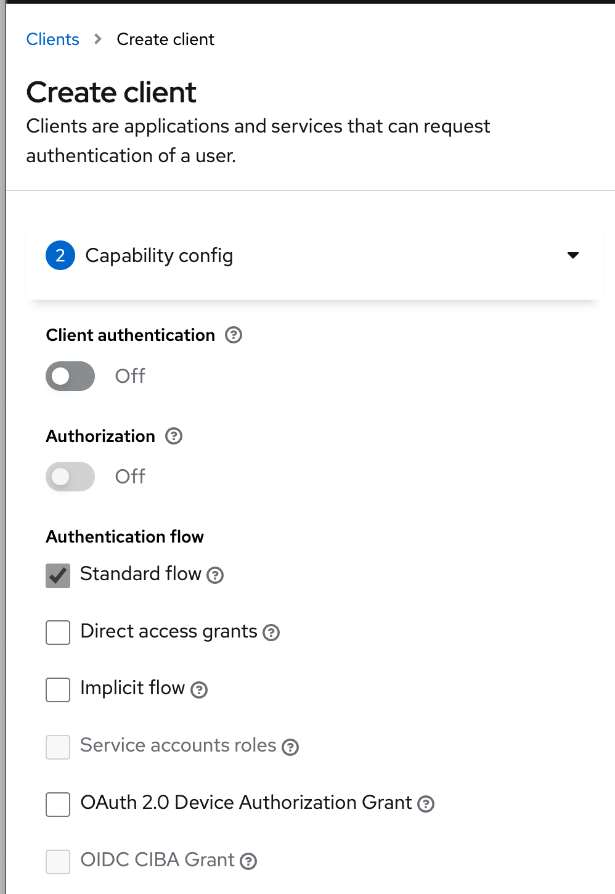
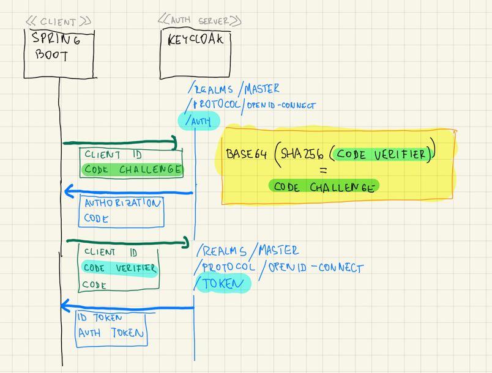
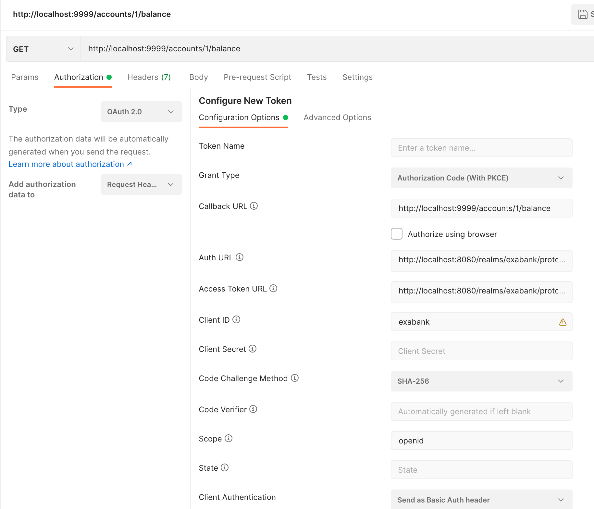

:icons: font

====
Ukážeme si, ako zabezpečiť springovú backendovú webovú aplikáciu pomocou OAuth 2.0 a OpenID Connect, kde klientom je aplikácia s otvoreným kódom -- frontend typu SPA alebo mobilná appka.
====

Ak používame OAuth 2.0/OIDC 1.0 a:

- klient obsahuje otvorený zdrojový kód -- napríklad JavaScript vo webovom prehliadači
- alebo klient obsahuje hackovateľný zdrojový kód -- napr. dekompilovateľná mobilná appka

\... je čas na flow *Authorization Code with Proof Key for Code Exchange* (PKCE).

Plán práce:

- v Keycloaku zaregistrujeme ukážkového klienta `exabank` s podporou pre flow PKCE
- pripravíme Spring Boot aplikáciu s modulom *OAuth 2 Client*, ktorá bude spracovávať tokeny JWT s prihlásením.
- nezávisle od toho novú Spring Boot aplikáciu s modulom *OAuth 2 Resource Server*, ktorá bude reprezentovať iný spôsob poskytovania dát.

== Registrácia klienta v Keycloaku

V Keycloaku vytvorme nového klienta (_OAuth Client_).

Client Authentication:: ponechajme vypnutú, keďže chceme demonštrovať verejného klienta (_Public Client_ v zmysle OAuth).
Authentication flow:: ponechajme len _Standard Flow_, čo je keycloaková terminológia pre _Authorization Code_.
+
V ďalšom kroku sprievodcu doplníme:
+
Root URL:: http://localhost:9999, keďže tam pobeží naša aplikácia.

Klient je teda pripravený.

IMPORTANT: Na rozdiel od štandardného flowu _Authorization Code_, kde zdrojový kód je na serveri a klient si s autentifikačným serverom (Keycloak) vymieňa tajomstvo _Client Secret_, tuto sa na to nemôžeme spoliehať.
_Client Secret_ by tak mohol niekto ukradnúť zo zdrojového kódu, čím by sa stal vektorom útoku.

== Tvorba klienta v Spring Boote

Pripravme klienta v Spring Boote.

Cez _Spring Initializer_ vytvorme klienta so štartérmi pre

- Spring OAuth 2 Client
- Spring Web

Do `src/main/resources/static` dodajme nejakú statickú stránku `index.html`, na ktorej sa ocitneme po úspešnom prihlásení.

Do `application.properties` dodajme konfiguráciu:

[source]
----
server.port=9999 //<1>

spring.security.oauth2.client.registration.keycloak.client-id=exabank
spring.security.oauth2.client.registration.keycloak.scope=openid
spring.security.oauth2.client.registration.keycloak.client-authentication-method=none //<2>
spring.security.oauth2.client.provider.keycloak.issuer-uri=http://localhost:8080/realms/master

logging.level.sun.net.www.protocol.http.HttpURLConnection=DEBUG //<3>
logging.level.org.springframework.web.client.RestTemplate=DEBUG
logging.level.org.springframework.security=DEBUG
----
<1> Webovú aplikáciu budeme spúšťať na porte 9999.
<2> Nakonfigurujme klienta. Ak nepoužívame „žiadnu“ autentifikačnú metódu klienta, ide o verejného klienta, pri ktorom Spring Security zapne podporu PKCE.
<3> Nastavíme logovanie.

Aplikáciu spusťme! Navštívme jej URL: http://localhost:9999/index.html.

Backend nás rovno presmeruje na prihlasovací formulár Keycloaku.
Po vyplnení údajov sa ocitneme na úvodnej stránke `index.html`.

== Interakcia medzi klientom a Keycloakom

Ak si pozrieme logy Spring Bootu, uvidíme zapnutie PKCE.

----
Redirecting to http://localhost:8080/realms/master/protocol/openid-connect/auth?response_type=code&client_id=exabank&scope=openid&state=u0W-_351UDxvhi9H-TXKQnBotcgYAJwCqDZIgEKwX-c%3D&redirect_uri=http://localhost:9999/login/oauth2/code/keycloak&nonce=S0DilI5RQ5G4egozrYaGgxNqc6F1qvCJEKPxB1Ac98Y&code_challenge=YRyN1lEilHOZM5vyxnjbf6y3lKauBEFqa19jmfCtiqg&code_challenge_method=S256
----

Ak si to rozoberieme, tak Spring presmeroval prehliadač na autorizačný endpoint v Keycloaku:

[source]
----
http://localhost:8080/realms/master/protocol/openid-connect/auth?
    response_type=code
    &client_id=exabank
    &scope=openid
    &state=u0W-_351UDxvhi9H-TXKQnBotcgYAJwCqDZIgEKwX-c%3D
    &redirect_uri=http://localhost:9999/login/oauth2/code/keycloak
    &nonce=S0DilI5RQ5G4egozrYaGgxNqc6F1qvCJEKPxB1Ac98Y
    &code_challenge=YRyN1lEilHOZM5vyxnjbf6y3lKauBEFqa19jmfCtiqg //<1>
    &code_challenge_method=S256 //<2>
----
<1> Prehliadač posiela na autentifikačný _endpoint_ tzv. _code challenge_, čo je zahešovaná verzia špeciálneho kódu vygenerovaného klientom.
<2> Na hešovanie sa používa algoritmus SHA256.

Keycloak (na porte 8080) autorizuje používateľa a zapamäta si heš k príslušne session.

V súlade s flowom _Authentication Code_ si používateľ vymenil svoj login a heslo za autorizačný kód (_Authorization Code_).

Prakticky v nasledovnej výmene zoberie klient (Spring Boot):

. autorizačný kód (_authorization code_)
. verifikátor kódu (_code verifier_)

a získa na výmenou sadu tokenov: zväčša identifikačný token (_ID token_) a autentifikačný token (_Authentication Token_).

V logu uvidíme:

[source]
----
2023-03-29T21:03:38.182+02:00 DEBUG 79846 --- [nio-9999-exec-3] o.s.web.client.RestTemplate              : Writing [{grant_type=[authorization_code], code=[1e65897eb], redirect_uri=[http://localhost:9999/login/oauth2/code/keycloak], client_id=[exabank], code_verifier=[iUOwf3wF59Agnn8OX7sh5hWEVJJFRrAyggBrVbA0JEFwPU9YsClsmarNc-fpFmxxK_54YEQwvvdLguTVAj8-QlV3UdYou940dIltjegAXsVXZZiEiawOXlNcxfuZ2bHC]}] as "application/x-www-form-urlencoded;charset=UTF-8"
----

Ak si to rozoberieme, tak do endpointu `http://localhost:8080/realms/master/protocol/openid-connect/token` pošleme cez HTTP POST nasledovné dvojice parametrov:

[source]
----
grant_type=authorization_code //<1>
&code=1e65897eb //<2>
&code_verifier=iUOwf3wF59Agnn8OX7sh5hWEVJJFRrAyggBrVbA0JEFwPU9YsClsmarNc-fpFmxxK_54YEQwvvdLguTVAj8-QlV3UdYou940dIltjegAXsVXZZiEiawOXlNcxfuZ2bHC //<3>
&redirect_uri=[http://localhost:9999/login/oauth2/code/keycloak
&client_id=exabank
----
<1> Posielame autorizačný kód.
<2> Obsah príslušného autorizačného kódu.
<3> Verifikátor kódu.
Keycloak vezme tento reťazec, vytvorí heš, následne naň použije _Base64_ a overí, či sa zhoduje s hodnotou _code challenge_ z predošlej výmeny.

IMPORTANT: PKCE a dvojica _code verifier_ (verifikátor kódu) s _code challenge_ (výzva) je prakticky náhrada klientskych tajomstiev.

Zjednodušený flow je na nasledovnom obrázku:

]

== _Resource Server_ a flow s PKCE

====
Vytvorme serverovú aplikáciu, ktorá bude figurovať v role _OAuth 2.0 Resource Server_, čiže bude obsahovať napr. REST API vyžadujúce prihláseného používateľa.
====

=== Inicializácia aplikácie

S pomocou _Spring Initializr_ vytvorme aplikáciu, ktorá využíva nasledovné štartéry:

- _Web_ (`org.springframework.boot:spring-boot-starter-web`)
- _OAuth Resource Server_ (`spring-boot-starter-oauth2-resource-server`)

=== REST API kontrolér

V aplikácii vytvorme kontrolér pre REST API:

[source,java]
----
@SpringBootApplication
@RestController //<1>
public class BankApplication {
    public static final Logger logger = LoggerFactory.getLogger(BankApplication.class);

    @GetMapping("/accounts/{accountId}/balance")
    public BigDecimal getBalance(@PathVariable String accountId, @AuthenticationPrincipal Jwt token) { //<2>
        logger.info("Getting balance on {} (token: {})", accountId, token);
        return BigDecimal.TEN;
    }

    public static void main(String[] args) {
        SpringApplication.run(BankApplication.class, args);
    }
}

----
<1> Aplikácia je zároveň kontrolérom pre REST.
<2> Metóda získa stav účtu a získa prístup k tokenu JWT po prihlásení.

=== Integrácia s Keycloakom

Integrácia s Keycloakom je podobná ako v prvom dieli -- stačí pridať adresu URL ku Keycloaku.

[source]
.application.properties
----
spring.security.oauth2.resourceserver.jwt.issuer-uri=http://localhost:8080/realms/master
----

Po spustení dokáže tento _resource server_ prijímať tokeny JWT a poskytovať autorizované údaje.

=== Odskúšanie flowu

Na odskúšanie flowu už potrebujeme nejaký lepší nástroj -- napríklad Postman.

. Uvedieme adresu http://localhost:9999/accounts/1/balance, ku ktorej chceme pristúpiť na resource serveri.
. Na karte _Authorization_ prispôsobíme autorizačné nastavenia.
. Vyberieme typ *OAuth 2.0*.
. _Grant Type_ reprezentuje používaný flow -- vyberáme _Authorization Code (With PKCE)_.
. Adresa _Callback URL_ reprezentuje adresu, kam sa prehliadač presmeruje po úspešnom prihlásení.
Táto adresa musí zodpovedať nastaveniam v Keycloaku (_Root URL_ a _Valid Redirect URIs_ v nastaveniach klienta v administrátorskej konzole.)
. _Auth URL_: obsahuje cestu k autorizačnému endpointu v Keycloaku.
+
Je to adresa http://localhost:8080/realms/master/protocol/openid-connect/auth
. _Access Token URL_ je cesta k endpointu, ktorý vymení autorizačný kód a verifikátor kódu za tokeny JWT.
+
Ide o adresu http://localhost:8080/realms/master/protocol/openid-connect/auth
. Ďalej nastavme _Client ID_: teda identifikátor klienta v autorizačnom serveri.
. _Client Secret_ ponechávame prázdne, keďže v tomto flowe sa nepoužíva.
. _Code Challenge Method_ je algoritmus, ktorým sa vytvára heš z verifikátora kódu, čo povedie ku reťazcu _code challenge_.
. _Code Verifier_ ponecháme prázdny, keďže si ho Postman ako klient vytvorí náhodne sám.
. _Scope_ je `openid`, aby sme sa riadili špecifikáciou OpenID Connect 1.0.
. _State_ nebudeme používať.
. _Client Authentication_ ponecháme bez zmeny.
Keďže v tomto flowe sa nepoužíva, je to irelevantné.

Cez tlačidlo *Get Access Token* začne celý flow.

Najprv sa zobrazí prihlasovací formulár Keycloaku, kde vyplňme login a heslo.
Po úspešnom prihlásení získame token, ktorý môžeme použiť (*Use Token*) a následne už volať REST API štandardným spôsobom.

