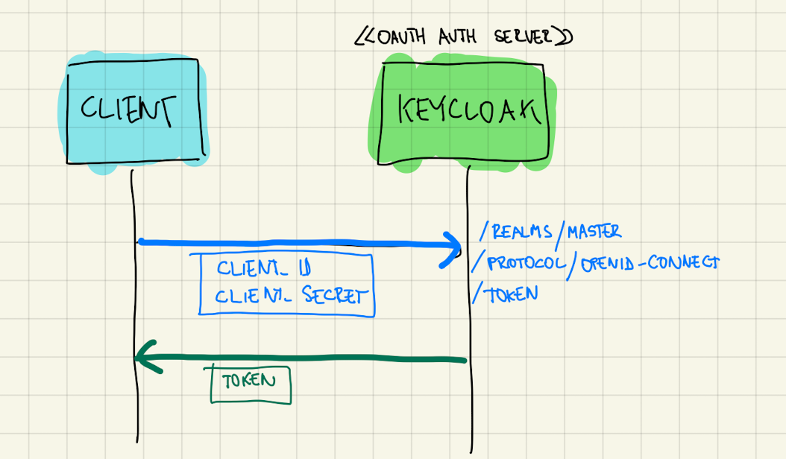
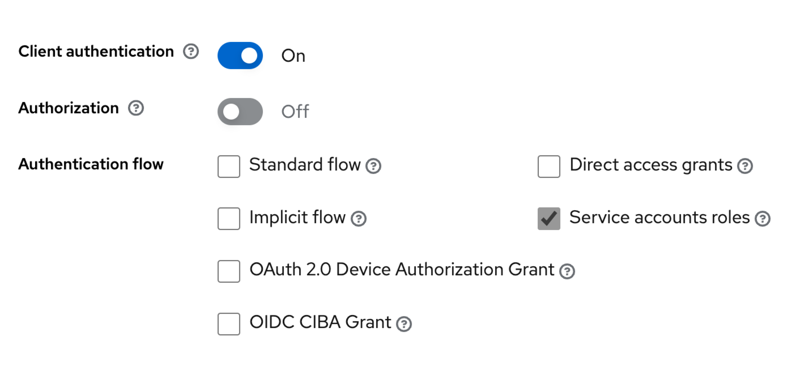
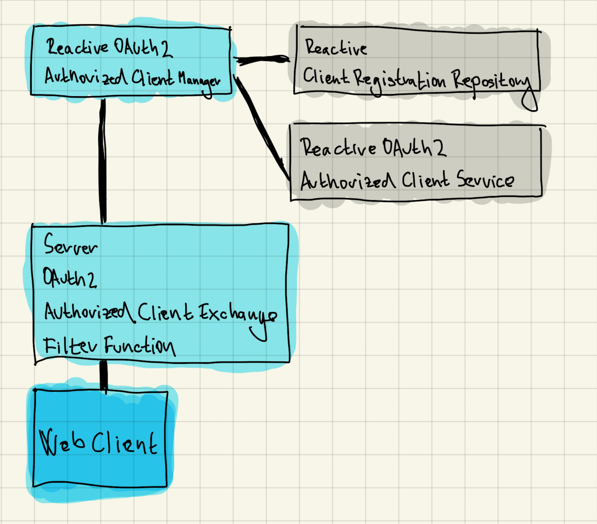

:icons: font

====
Ukážeme si ako použiť aplikáciu v Spring Boote ako OAuth klientku, ktorá sa autorizuje ako servisná aplikácia.
====

OAuth podporuje aj situácie, kde sa prístup k údajom udeľuje aplikáciám, ktoré nemajú používateľa.
Obvykle ide o servisné aplikácie, démonov, monitoringy a podobne. V týchto aplikáciách neexistuje používateľ, ktorý by schvaľoval prístup k zdrojom -- sama aplikácia sa považuje za _vlastníka zdrojov_.

IMPORTANT: Grant (flow) typu `client_credentials` slúži pre aplikácie, ktoré figurujú v dvojrole klienta (_OAuth Client_) i vlastníka zdrojov (_OAuth Resource Owner_).

== Flow _Client Credentials_

Vo flowe figurujú len tri súčiastky:

- _Authorization Server_: napríklad Keycloak
- _Client_: je ním „servisná“ aplikácia.
- _Resource Server_: napríklad REST API

NOTE: Klient je vždy dôverný (_confidential_), čiže má obvykle uzavretý kód, a dokáže starostlivo ochrániť tajomstvo _Client Secret_, ktoré sa považuje za citlivý údaj medzi ním a autorizačným serverom.

. Klient sa prezentuje svojim identifikátorom (_Client ID_) a klientskym tajomstvom (_Client Secret_).
. Autorizačný server vráti token.
. Klient sa pomocou tokenu autorizuje voči _Resource Serveru_.

IMPORTANT: Klient kontaktuje priamo endpoint pre _token_.
Kroky s endpointom pre autorizáciu sa v tomto flowe ignorujú.

=== Registrácia klienta

Klienta zaregistrujeme v Keycloaku (autorizačnom serveri).

. Vytvoríme nového klienta s identifikátorom `techbank`.
. Zapneme autentifikáciu klienta (_Client Authentication_), pretože ide o dôverného klienta (_confidential client_).
. Vypneme všetky flowy a ponecháme len _Service accounts roles_, čo zodpovedá grantu _Client Credentials_ z OAuth 2.0.

=== Skúška správnosti

Ak je klient registrovanný, môžeme overiť flow.

Ukážka dopytu:

[source,sh]
----
curl -X POST --location "http://localhost:8080/realms/master/protocol/openid-connect/token" \ //<1>
    -H "Content-Type: application/x-www-form-urlencoded" \ //<2>
    -d "grant_type=client_credentials" \ //<3>
    --basic --user techbank:E5wzwZqbFiH1Gwh2qou8O332yzJ5mj5g //<4>
----
<1> Požiadavku typu `POST` posielame na endpoint Keycloaku, ktorý vydá token.
<2> Telo požiadavky sú formulárové údaje.
<3> Používame _flow_ typu _Client Credentials_.
<4> Klient sa autentifikuje dvojicou _Client ID_ a  _Client Secret_, ktorá zodpovedá zaregistrovaným údajom v autorizačnom serveri Keycloak

Odpoveďou bude prístupový token (_access token_).
Ak používame OpenID Connect, token bude vo formáte JWT.

[source]
----
{
  "access_token": "eyJh...",
  "expires_in": 60,
  "refresh_expires_in": 0,
  "token_type": "Bearer",
  "not-before-policy": 0,
  "scope": "profile email"
}
----

Token následne vieme priložiť ku volaniu _resource servera_, teda nejakého REST API.

[source]
----
http://localhost:9999/accounts/1/balance
Authorization: Bearer {{jwt}}
----

****
Pre Keycloak bude vyzerať JWT token nasledovne:

[source]
----
{
  "exp": 1680819148,
  "iat": 1680819088,
  "jti": "9f28ee20-7631-43f3-b3d8-5ca6d5c5222a",
  "iss": "http://localhost:8080/realms/master",
  "aud": "account",
  "sub": "2ee74099-6f39-42e0-a3c4-f73b5fe03874", //<1>
  "typ": "Bearer",
  "azp": "techbank",
  "acr": "1",
  "allowed-origins": [
    "http://localhost:9991"
  ],
  "realm_access": {
    "roles": [
      "default-roles-master",
      "offline_access",
      "uma_authorization"
    ]
  },
  "resource_access": {
    "account": {
      "roles": [
        "manage-account",
        "manage-account-links",
        "view-profile"
      ]
    }
  },
  "scope": "profile email",
  "email_verified": false,
  "clientId": "techbank",
  "clientHost": "127.0.0.1",
  "preferred_username": "service-account-techbank",
  "clientAddress": "127.0.0.1"
}
----
<1> Reprezentuje identifikátor technického používateľa.
V Keycloaku vznikne používateľ `service-account-techbank`, ktorému je možné nastaviť roly a ďalšie oprávnenia.
****

== Klient v Spring Boote

Klienta, ktorý sa bude pripájať k _resource serveru_ postavíme na základe triedy `WebClient`, teda reaktívnom HTTP klientovi.

Použijeme závislosti:

- _Spring OAuth 2 Client_: `spring-boot-starter-oauth2-client`
- _Spring WebFlux_: `spring-boot-starter-webflux` s podporou pre reaktívne aplikácie

=== Konfigurácia aplikácie

Klient pre OAuth potrebuje konfiguráciu -- identifikátor klienta, jeho tajomstvo, explicitne uvedený _flow_ a adresu, kde je k dispozícii Keycloak.

[source]
----
spring.security.oauth2.client.registration.keycloak.client-id=techbank
spring.security.oauth2.client.registration.keycloak.client-secret=E5wzwZqbFiH1Gwh2qou8O332yzJ5mj5g
spring.security.oauth2.client.registration.keycloak.authorization-grant-type=client_credentials
spring.security.oauth2.client.provider.keycloak.issuer-uri=http://localhost:8080/realms/master
----

=== Konfigurácia klienta pre HTTP

Naša servisná aplikácia bude každých pár sekúnd _pingať_ REST API na vzdialenom serveri -- teda bude posielať jednoduchú požiadavku v HTTP.

Aby dokázala bežať dlho, priamo ju spustíme ako službu bežiacu nad reaktívnym serverom Netty, o čo sa postará Spring WebFlux.

Budeme potrebovať:

. bean, ktorý bude udržiavať autorizovaný stav
. HTTP klienta `WebClient`
. funkciu, ktorá prepojí klienta s autorizačnými mechanizmami OAuth a bude automaticky posielať prihlasovacie požiadavky na Keycloak.

=== Bean pre autorizovaný stav

Trieda `ReactiveOAuth2AuthorizedClientManager` berie klientov, ktorí sú nakonfigurovaní v `application.properties`, dokáže ich autorizovať voči autorizačnému serveru, po úspešnej autentifikácii ich vyhlásiť za _autorizovaných klientov_ a tento zoznam ukladať (_perzistovať_) do vhodného úložiska.

Keďže náš klient nepobeží v rámci webovej aplikácie -- požiadavky cez HTTP budú vyvolávané autonómne, použijeme implementáciu `AuthorizedClientServiceReactiveOAuth2AuthorizedClientManager`.

Trieda má dve závislosti, ktoré nám _Spring Boot WebFlux_ dodá automaticky:

- zoznam klientov spravovaný  `ReactiveClientRegistrationRepository`.
- manažment autorizovaných klientov `ReactiveOAuth2AuthorizedClientService`, ktorý dokáže na základe identifikátora klienta a autentifikácie `Authentication` poskytnúť autorizovaného klienta, a zároveň ich udržiavať v príslušnom úložisku.

[source]
----
@Bean
ReactiveOAuth2AuthorizedClientManager authorizedClientManager(
        ReactiveClientRegistrationRepository clientRegistrations,
        ReactiveOAuth2AuthorizedClientService authorizedClientService) {

    return new AuthorizedClientServiceReactiveOAuth2AuthorizedClientManager(clientRegistrations, authorizedClientService);
}
----

=== WebClient

Klienta pre HTTP prepojíme s autorizáciou.

Trieda `ServerOAuth2AuthorizedClientExchangeFilterFunction` integruje klienta pre HTTP (`WebClient`) s mechanizmami OAuth.

Spolupracuje s `ReactiveOAuth2AuthorizedClientManager`, ktorý rieši nízkoúrovňové technikálie.

Ak tieto tri triedy prepojíme, získame klienta `WebClient`, ktorý vie automaticky kontaktovať Keycloak, získať token, a priložiť ho k požiadavkam smerovaným na REST API.

[source,java]
.filename.java
----
@Bean
public WebClient webClientSecurityCustomizer(
        ReactiveOAuth2AuthorizedClientManager authorizedClients) {//<1>
    var oAuthFilter
        = new ServerOAuth2AuthorizedClientExchangeFilterFunction(
                authorizedClients);//<2>
    oAuthFilter.setDefaultClientRegistrationId("keycloak");//<3>

    return WebClient.builder()
            .filter(oAuthFilter) //<4>
            .build();
}
----
<1> Ako závislosť si vyžiadame správcu autorizovaných klientov pre OAuth.
Tú dostaneme v podobe _beanu_ nakonfigurovaného v predošlom kroku.
<2> Vytvoríme filter, ktorý sa postará o integráciu s OAuth.
<3> Keďže filter beží autonómne, mimo požiadavky HTTP, musíme explicitne povedať, na ktorého klienta z `application.properties` sa táto konfigurácia vzťahuje.
<4> Filter zapojíme do klienta `WebClient`.

=== Integrácie

Od tejto chvíle môžeme automaticky používať klienta `WebClient`.

Ak chceme napríklad periodicky posielať dopyty na server:

. zapneme anotáciu `@EnableScheduling`,
. vyrobíme metódu s anotáciou `@Scheduled`,
. automaticky nadrôtujeme klienta `WebClient`,
. voláme požiadavky na _resource server_.

[source,java]
----
@Component
public class ScheduledBalanceChecker {
    @Autowired
    private WebClient webClient; //<1>

    @Scheduled(fixedDelay = 5, timeUnit = TimeUnit.SECONDS) //<3>
    public void checkBalance() {
        int accountId = 1;
        BigDecimal balance = webClient.get()
                .uri("http://localhost:9999/accounts/{accountId}/balance", accountId)
                .retrieve() //<2>
                .bodyToMono(BigDecimal.class)
                .block();
        logger.info("Account {} has balance {}", accountId, balance);
    }
}
----
<1> Necháme si automaticky nadrôtovať klienta pre HTTP požiadavky vrátane integrácie s OAuth.
<2> Voláme klienta.
<3> Periodicky zapneme volanie metódy.

IMPORTANT: V tomto prípade sa s každým volaním klienta získa nový token z autorizačného servera.
V každej iterácii sa tak v skutočnosti vykonajú dva dopyty: jeden na autorizačný server a druhý na príslušné REST API v _resource serveri_.

== Záver

TIP: Repozitár s kódom pre Spring Boot je k dispozícii na GitHube, v repozitáru https://github.com/novotnyr/bank-oidc-client-credentials[novotnyr/bank-oidc-client-credentials].