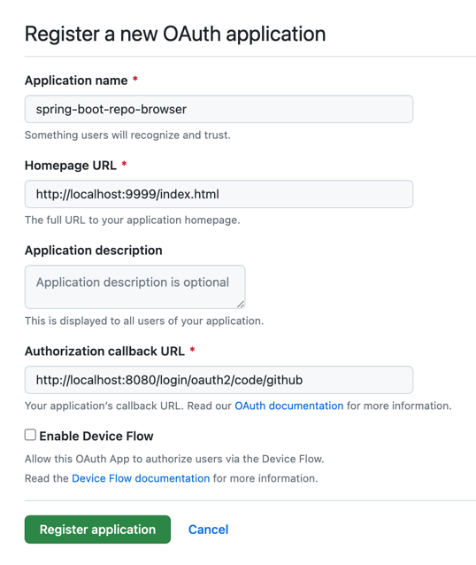
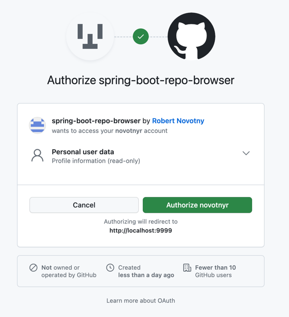

:icons: font

====
Ako zobraziť svoje vlastné repozitáre na GitHube cez REST API?
====

Ukážeme si:

- ako pristúpiť k REST API Githubu
- ako sa autentifikovať v aplikácii pomocou OAuth 2.0
- ako vytvoriť na GitHube aplikáciu, ktorá vie získať používateľove údaje v jeho mene a to kontrolovaným spôsobom
- ako implementovať klienta k REST API Githubu v Sprint Boote

== REST API GitHubu

GitHub ponúka bohaté https://docs.github.com/en/rest/repos/repos?apiVersion=2022-11-28#list-repositories-for-the-authenticated-user[REST API] a to vrátane dokumentácie.

To umožňuje budovať aplikácie, ktoré získavajú údaje o dôležitých entitách, napríklad:

- repozitároch
- organizáciách
- tímoch
- používateľoch

== Autentifikácia

Ak chceme vytvoriť aplikáciu, ktorá dokáže získať repozitáre _v mene používateľa_ (_On Behalf Of_), môžeme použiť OAuth.

GitHub ako platforma dokáže vystupovať:

- v role _autorizačného servera_ dostupného na https://github.com/
- v role _resource servera_ dostupného na https://api.github.com.

Naša aplikácia v Spring Boote bude v role _klienta OAuth_.

== Registrácia aplikácie

Klienta zaregistrujme v autorizačnom serveri GitHub.

. Navštívme https://github.com/settings/developers
. Zvoľme _Register a new application_.
. Vyplňme údaje.
+

.. Application name: názov aplikácie, ktorý sa objaví v UI pre používateľov
.. Homepage URL: cesta k domovskej stránke. Použijeme port 9999.
.. Authorization Callback URL: cesta, na ktorú presmeruje autorizačný server používateľov prehliadač po úspešnom prihlásení.
Túto URL zabezpečí modul Springu. Rovnako použijeme port 9999.

. Na prehľadovom okne získame:
.. Client ID: identifikátor klienta v OAuth
.. Client Secret: ten si nechajme jednorazovo vygenerovať.

Máme všetko, čo potrebujeme pre integráciu.

== Tvorba aplikácie

Cez _Spring Initializr_ vytvorme aplikáciu reprezentujúcu klienta OAuth 2, ktorá bude v mene prihláseného používateľa získavať informácie z _resource servera_ (GitHub REST API) o repozitároch.

Použime:

- OAuth 2 Client: `spring-boot-starter-oauth2-client`
- Web: `spring-boot-starter-web` pre naše vlastné REST API
- WebFlux: `spring-webflux` v ktorom sa nachádza klientská strana pre prístup k REST API GitHubu.

=== Konfiguračný súbor `application.properties`.

[source]
.application.properties
----
server.port=9999 //<1>
spring.security.oauth2.client.registration.github.client-id=a7923a1ba2a762dc5c6e //<2>
spring.security.oauth2.client.registration.github.client-secret=eesuughu4Nahfogh4ahcietha //<3>
----
<1> Port, na ktorom pobeží naša aplikácia.
Port sa objavil v registrácii aplikácie na GitHube!
<2> Identifikátor klienta OAuth.
<3> Tajomstvo medzi klientom a autorizačným serverom.

IMPORTANT: _Spring OAuth 2 Client_ obsahuje automatické nastavenie pre známe autorizačné servery (GitHub, Facebook, Okta, Google).

=== Volanie REST API GitHubu

Naša aplikácia bude prakticky proxy -- zverejní REST API, ktoré zavolá REST API GitHubu.

_Spring OAuth Client_ poskytuje podporu pre triedu `WebClient` a jej priamu integráciu s OAuth.
Takýto `WebClient` sa postará o správne získanie tokenov, ich aktualizáciu cez obnovovacie tokeny (_refresh tokens_).

IMPORTANT: `WebClient` je neblokujúca alternatíva k triede `RestTemplate`, ktorá bude v budúcich verziách Springu preferovanou možnosťou pre prístup k REST API.

[source,java]
----
@Bean
@Qualifier("github") //<1>
WebClient webClient(ClientRegistrationRepository clientRegistrations,
                    OAuth2AuthorizedClientRepository authorizedClients) { //<2>
    var oauth = new ServletOAuth2AuthorizedClientExchangeFilterFunction(clientRegistrations, authorizedClients); //<3>
    oauth.setDefaultClientRegistrationId(CommonOAuth2Provider.GITHUB.name().toLowerCase()); //<4>
    return WebClient.builder()
                    .apply(oauth.oauth2Configuration()) //<5>
                    .build();
}
----
<1> Deklarujeme bean pre klienta.
Aby sme ho obmedzili len na volania pre GitHub a neurobili ho globálny, dodáme mu kvalifikátor.
Toto nie je povinná časť, ak máme v projekte len jedinú singleton inštanciu.
<2> Budeme potrebovať:
. `ClientRegistrationRepository`: repozitár konfiguračných nastavení klientov.
U nás máme jediného klienta -- pre GitHub -- nakonfigurovaného implicitne a zároveň pomocou `application.properties`.
. `OAuth2AuthorizedClientRepository`, ktorý udržiava autentifikačné údaje počas prihlasovacieho sedenia medzi prehliadačom a touto aplikáciou.
<3> Vyrobíme funkciu, ktorá sa postará o technikálie OAuth2: získavanie tokenov, obnovu tokenov a asociovanie správnych hlavičiek.
<4> Explicitne povieme, že táto funkcia sa vzťahuje len na klienta pre `GitHub`.
<5> Nakonfigurujeme webklienta tak, aby sa riadil možnosťami OAuth.

Teraz nastavme naše REST API.

Vytvorme klasický kontrolér pre REST API, ktorý bude „proxy“ovať volania na GitHub.

[source,java]
.ApiController.java
----

@RestController
@RequestMapping("/api")
public class ApiController { //<1>
    private final WebClient webClient;

    public ApiController(@Qualifier("github") WebClient webClient) { //<2>
        this.webClient = webClient;
    }

    @GetMapping("/repositories")
    public List<Repository> getRepositories() {
        String url = "https://api.github.com/user/repos?type=owner&since=2023-01-01T00:00:00Z";
        return webClient.get()
                .uri(url) //<3>
                .retrieve()
                .bodyToFlux(Repository.class) //<4>
                .collectList()
                .block(); //<5>
    }
}
----
<1> Bežný kontrolér pre REST API.
<2> Nechajme si cez autowiring dodať inštanciu webklienta pre GitHub.
Nezabudnime na kvalifikátor!
<3> Webklient použije HTTP GET a adresu URL pre REST API GitHubu. Táto adresa získa všetky repozitáre prihláseného používateľa.
<4> Výsledok príde ako JSON, v podobe zoznamu objektov, ktoré namapujeme na náš vlastný záznam `Repository` (`record`)
<5> Webklient je neblokujúci a reaktívny, ale my budeme blokovať, aby sme vrátili štandardný zoznam objektov.

IMPORTANT: Práca s _webklientom_ je mimo záberu tohto článku.

Záznam pre repozitár je jednoduchý -- slúži len na to, aby sme odfiltrovali nepotrebné vlastnosti z JSONu.

[source,java]
.Repository.java
----
public record Repository(String name, URL url) {
    // empty body
}
----

== Otestovanie aplikácie

Navštívme cez prehliadač naše REST API na http://localhost:9999/api/repositories.

Spring Boot zistí, že ako používateľ nie som autentifikovaný, a ako vlastník zdrojov (_OAuth Resource Owner_) som neudelil súhlas klientskej aplikácii na prístup k údajom.

Presmeruje ma na adresu GitHubu, kde tento súhlas udelím:

Následne sa vykoná séria presmerovaní podľa grantu _Authorization Code_ až sa prehliadač ocitne na pôvodnej adrese, ktorá zobrazí odfiltrovaný JSON.

[source]
----
[
  {
    "name": "akka-iot-2022",
    "url": "https://api.github.com/repos/novotnyr/akka-iot-2022"
  },
  {
    "name": "akka-wordfrequencies-2017",
    "url": "https://api.github.com/repos/novotnyr/akka-wordfrequencies-2017"
  },
  ...
]
----

IMPORTANT: Vidíme, ako sa o autorizáciu postaral _Spring OAuth Client_.
V tejto chvíli náš klient pristupuje k údajom prihláseného používateľa _v jeho mene_.

IMPORTANT: Ak by sme neboli prihlásení na GitHube, uvidíme ešte prihlasovací formulár GitHubu. Ako používateľ totiž musím byť autentifikovaný oproti autorizačnému serveru.

== Zdroje

IMPORTANT: Zdrojový projekt je na GitHube v repozitári https://github.com/novotnyr/github-oauth-client-spring-boot[`novotnyr/github-oauth-client-spring-boot`].