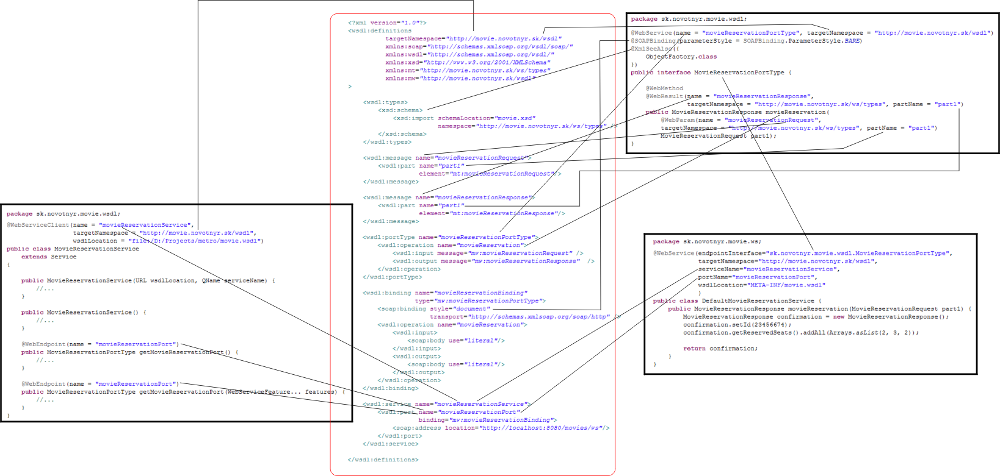

V predošlom dieli sme si ukázali príklad popisovača webovej služby v podobe WSDL súboru. Ak máme tento súbor, môžeme použiť niektoré z existujúcich nástrojov na vygenerovanie zdrojového kódu pre serverovskú časť služby i pre klienta, ktorý k nej bude pristupovať.

Tento spôsob je k dispozícii vo všetkých významných Java frameworkoch pre webové služby - teda aj v [Glassfish Metro](http://cxf.apache.org/ | Apache CXF]], [[http://ws.apache.org/axis/ | Axis1]] / [[http://ws.apache.org/axis/ | Axis2]], [[https://metro.dev.java.net/ ). 

Samotná Java poskytuje na prístup k webovým službám viacero API združených pod rôznymi špecifikáciami. Najnovšou je v súčasnosti [JAX-WS 2.0](http://jcp.org/en/jsr/detail?id=224 ) (JSR-224), ktorá je už súčasťou JEE 5 a pri návrhu a implementácii webových služieb používa všetky vymoženosti Javy 5. Aplikačný rámec Glassfish Metro, ktorá bude pracovať nad triedami a interfejsmi JAX-WS budeme demonštrovať práve v tejto časti.

# Inštalácia
Z [domovskej stránky Metra](https://metro.dev.java.net/ ) si stiahneme príslušný JAR, rozbalíme na vhodné miesto, vytvoríme systémovú premennú `METRO_HOME` ukazujúcu na adresár inštalácie a voliteľne si dodáme cestu k skriptom do `PATH`u.

# Generovanie serverovskej časti
Predpokladajme, že máme k dispozícii WSDL súbor z predošlej časti seriálu. Java triedy vygenerujeme nasledovným spôsobom:
```
SET METRO_HOME=C:/java/metro
SET PATH=%PATH%;%METRO_HOME%/bin
wsimport -keep -s src -d bin movie.wsdl
```
Ak by sme vynechali všetky parametre, vygenerovali by sa priamo `CLASS` súbory do aktuálneho adresára. `-keep` ponechá po generovaní zdrojové súbory, `-s` určí adresár pre vygenerované zdrojové súbory a `-d` určí, kam pôjdu skompilované `CLASS`y.

Vygenerujú sa nasledovné súbory:

* `sk\novotnyr\movie\ws\types`
    * `MovieReservationRequest.java`
    * `MovieReservationResponse.java`
    * `ObjectFactory.java`
    * `package-info.java` 
* `sk\novotnyr\movie\wsdl`
    * `MovieReservationPortType.java`
    * `MovieReservationService.java`

Balíček `sk.novotnyr.movie.ws.types` obsahuje triedy, ktoré zodpovedajú elementom a typom definovaným v XML schéme. Názov tohto balíčka je odvodený od cieľového menného priestoru (targetNamespace) v schéme. V schéme sme mali `http://movie.novotnyr.sk/ws/]`, čo  sa priamo namapuje na názov balíčka.

Na mapovanie medzi inštanciami XML schémy a objektami v Jave sa v Metre používa technológia JAXB 2.0. Vygenerované triedy presne zodpovedajú tomu, čo by sme získali použitím kompilátora `xjc` z implementácie JAXB. Príkladom triedy je:
```java
package sk.novotnyr.movie.ws.types;

import java.util.*;
import java.util.List;
import javax.xml.bind.annotation.*;

@XmlAccessorType(XmlAccessType.FIELD)
@XmlType(name = "", propOrder = {
    "id",
    "reservedSeats"
})
@XmlRootElement(name = "movieReservationResponse")
public class MovieReservationResponse {

    protected int id;
    @XmlElement(type = Integer.class)
    protected List<Integer> reservedSeats;

    public int getId() {
        return id;
    }

    public void setId(int value) {
        this.id = value;
    }

    public List<Integer> getReservedSeats() {
        if (reservedSeats == null) {
            reservedSeats = new ArrayList<Integer>();
        }
        return this.reservedSeats;
    }

}
```
Všimnite si, že je to klasické POJO, kde atribúty elementu zodpovedajú inštančným premenným a anotácie určujú prepis na XML.

V balíčku `sk.novotnyr.movie.wsdl` sa nachádzajú interfejsy a triedy, ktoré súvisia s elementom `service`, resp. `portType` vo WSDL. Každý `service` sa namapuje na samostatnú triedu a každý `portType` tiež. Názov balíčka sa odvodí od cieľového menného priestoru WSDL súboru.

Ako sme spomínali, abstraktný port vo WSDL predstavuje množinu operácií, ktoré je možné volať. Jeho analógiou je interfejs v Jave. `wsimport` vygeneruje nasledovnú triedu:
```java
package sk.novotnyr.movie.wsdl;

import javax.jws.*;
import javax.jws.soap.´*;
import javax.xml.bind.annotation.*;
import sk.novotnyr.movie.ws.types.*;

@WebService(name = "movieReservationPortType", 
            targetNamespace = "http://movie.novotnyr.sk/wsdl")
@SOAPBinding(parameterStyle = SOAPBinding.ParameterStyle.BARE)
@XmlSeeAlso({
    ObjectFactory.class
})
public interface MovieReservationPortType {
  @WebMethod
  @WebResult(name = "movieReservationResponse", 
             targetNamespace = "http://movie.novotnyr.sk/ws/types", 
             partName = "part1")
  public MovieReservationResponse movieReservation(
        @WebParam(name = "movieReservationRequest", 
                  targetNamespace = "http://movie.novotnyr.sk/ws/types", 
                  partName = "part1")
        MovieReservationRequest part1);

}
```
Máme teda interfejs webovej služby, potrebujeme však aj jeho implementáciu. V princípe máme dve možnosti: 

1.  vytvoriť triedu, ktorá implementuje interfejs `MovieReservationType` a dopísať príslušný kód
1.  vytvoriť triedu s príslušnými metódami a anotovať tu tak, aby ukazovala na interfej, ktorá má anotáciu `@WebService`.

Zvolíme si druhú možnosť:
```java
package sk.novotnyr.movie.ws;

import java.util.Arrays;

import javax.jws.WebService;

import sk.novotnyr.movie.ws.types.MovieReservationRequest;
import sk.novotnyr.movie.ws.types.MovieReservationResponse;

@WebService(
  endpointInterface="sk.novotnyr.movie.wsdl.MovieReservationPortType",
)
public class DefaultMovieReservationService {
  public MovieReservationResponse movieReservation
    (MovieReservationRequest part1) 
  {
    MovieReservationResponse confirmation 
      = new MovieReservationResponse();
    confirmation.setId(23456674);
    confirmation.getReservedSeats().addAll(Arrays.asList(2, 3, 2));
    
    return confirmation;
  }
}
```
Týmto máme všetky potrebné komponenty na to, aby sme mohli spustiť a naštartovať webovú službu. V Metre je k dispozícii trieda `Endpoint`, ktorá dokáže naštartovať interný HTTP server a spustiť v ňom príslušnú triedu tak, že na to postačí jediný riadok:
```java
package sk.novotnyr.movie;

import javax.xml.ws.Endpoint;

import sk.novotnyr.movie.ws.DefaultMovieReservationService;

public class Server {
  public static void main(String[] args) {
    Endpoint.publish("http://localhost:8080/movies/ws", 
                     new DefaultMovieReservationService());
   }
}
```
Navštívením adresy `http://localhost:8080/movies/ws?wsdl` môžeme vidieť WSDL súbor tejto služby. Tu si však všimneme jednu dôležitú vec - WSDL nie je identický s tým, z ktorého sme generovali službu! Metro totiž k publikovanej službe poskytne automaticky generované WSDL, ktorého parametre sa odvodia na základe anotácií portu, tried, metód a parametrov.

Výsek z WSDL vyzerá potom nasledovne:
```xml
<binding xmlns:ns1="http://movie.novotnyr.sk/wsdl" 
         name="DefaultMovieReservationServicePortBinding" 
         type="ns1:movieReservationPortType">
  <soap:binding transport="http://schemas.xmlsoap.org/soap/http" 
                style="document" /> 
  <operation name="movieReservation">
  <soap:operation soapAction="" /> 
  <input>
    <soap:body use="literal" /> 
  </input>
  <output>
    <soap:body use="literal" /> 
  </output>
  </operation>
</binding>
<service name="DefaultMovieReservationServiceService">
  <port name="DefaultMovieReservationServicePort" 
        binding="tns:DefaultMovieReservationServicePortBinding">
    <soap:address location="http://localhost:8080/movies/ws" /> 
  </port>
</service>
```
Všimnime si automaticky odvodené pomenovania:

* služba sa volá `DefaultMovieReservationServiceService`
* port `DefaultMovieReservationServicePort`
* binding `DefaultMovieReservationServicePortBinding`
* abstraktný port `movieReservationPortType`

To by za normálnych okolností stačilo, ale keďže by sme chceli klientom zverejniť to WSDL, ktoré sme si ručne navrhli, automatické WSDL nie je to správne.

Špecifikovať zverejnené WSDL môžeme v anotácii `@WebService` na implementačnej triede. Použijeme na to atribút `wsdlLocation`. Popri tom však musíme uviesť ďalšie veci:

* presný názov služby, ktorý sa musí zhodovať s tým, ktorý je uvedený vo WSDL (inak sa použije vygenerovaný názov, a dostaneme výnimku o nekonzistencii WSDL a implementačnej triedy)
* cieľový menný priestor (inak sa odvodí z názvu balíčka implementačnej triedy)
* názov portu (inak sa odvodí z názvu interfejsu)
V tomto prípade budeme doťahovať WSDL súbor z `CLASSPATH`.
```java
@WebService(
 endpointInterface="sk.novotnyr.movie.wsdl.MovieReservationPortType",
 targetNamespace="http://movie.novotnyr.sk/wsdl",
 serviceName="movieReservationService",
 portName="movieReservationPort",
 wsdlLocation="META-INF/movie.wsdl"
)
public class DefaultMovieReservationService {
//...
```
# Generovanie klientskej časti
Generovanie klientskej časti je jednoduché. Použitím `wsimport` na WSDL dostaneme nielen serverovské triedy, ale aj klientské. Klientská časť je predstavovaná triedou `MovieReservationService` (tá dedí od `javax.xml.Service`), ktorá je okorenená mnohými anotáciami.
```java

package sk.novotnyr.movie.wsdl;

import java.net.MalformedURLException;
import java.net.URL;
import java.util.logging.Logger;
import javax.xml.namespace.QName;
import javax.xml.ws.*;

@WebServiceClient(name = "movieReservationService", 
                  targetNamespace = "http://movie.novotnyr.sk/wsdl", 
                  wsdlLocation = "file:/D:/Projects/metro/movie.wsdl")
public class MovieReservationService extends Service
{

    // .. vygenerovaný kód vynechaný
    
    public MovieReservationService(URL wsdlLocation,
                                   QName serviceName) {
        // .. vygenerovaný kód vynechaný
    }

    public MovieReservationService() {
        // .. vygenerovaný kód vynechaný
    }

    @WebEndpoint(name = "movieReservationPort")
    public MovieReservationPortType getMovieReservationPort() {
        // .. vygenerovaný kód vynechaný
    }

    @WebEndpoint(name = "movieReservationPort")
    public MovieReservationPortType getMovieReservationPort(
                WebServiceFeature... features) {
       // .. vygenerovaný kód vynechaný
    }
}
```
Možno nám udrie do očí atribút `wsdlLocation`, ktorý uvádza cestu k WSDL v súborovom systéme. To nie je ktoviečo. Napraviť to môžeme troma spôsobmi:

* buď budeme používať `wsimport` nad internetovou URL adresou
* alebo použijeme pri `wsimport`e parameter `-wsdllocation`, kde nastavíme URL používanú u klienta. 

        wsimport -keep -wsdllocation http://ics.upjs.sk/~novotnyr/java/web-services/movies/movie.wsdl movie.wsdl

* alebo sa zmierime s týmto faktom, ale budeme musieť URL k WSDL zadávať pri konštruovaní tejto triedy

## Použitie klienta
Použitie klienta webovej služby je potom priamočiare. Jediným problémom je šaškovanie s dátumom. V tomto prípade `wsimport` nevygeneroval inštančné premenné s klasickými `java.util.Date`, ale s triedami zodpovedajúcimi XML typom. (Dôvodom je to, že XML typy pre prácu s dátumom a časom môžu niekedy reprezentovať väčší rozsah hodnôt než `java.util.Date`).
```java
package sk.novotnyr.movie;

import javax.xml.datatype.DatatypeConfigurationException;
import javax.xml.datatype.DatatypeConstants;
import javax.xml.datatype.DatatypeFactory;
import javax.xml.datatype.XMLGregorianCalendar;

import sk.novotnyr.movie.ws.types.MovieReservationRequest;
import sk.novotnyr.movie.ws.types.MovieReservationResponse;
import sk.novotnyr.movie.wsdl.MovieReservationPortType;
import sk.novotnyr.movie.wsdl.MovieReservationService;

public class Client {
  public static void main(String[] args) 
    throws DatatypeConfigurationException 
  {
    MovieReservationService service = new MovieReservationService();
    MovieReservationPortType port = service.getMovieReservationPort();
    
    MovieReservationRequest request = new MovieReservationRequest();
    request.setTitle("Godzilla");
    request.setNumberOfTickets(2);
    
    XMLGregorianCalendar date 
      = DatatypeFactory
        .newInstance()
        .newXMLGregorianCalendarDate(
            2008, 12, 12, 
            DatatypeConstants.FIELD_UNDEFINED);
    request.setDate(date);
    
    MovieReservationResponse response
      = port.movieReservation(request);
    System.out.println(
      response.getId() 
      + " " 
      + response.getReservedSeats());
  }
}
```

# Mapovanie WSDL elementov na Java elementy

## `wsdl:service`
* mapovaný na implementačnú triedu (`DefaultMovieService`)
* anotácia `@WebService`
* `name` namapovaný na `serviceName`
* menný priestor namapovaný cez `targetNamespace` má vplyv na balíček triedy

## `wsdl:port`
* `name` namapovaný na `portName` vo `@WebService` na implementačnej triede
* referencia na abstraktný port cez atribút `endpointInterface`

## `wsdl:portType`
* mapovaný na interfejs (`MovieReservationPortType`)
* anotácia `WebService`
* `name` namapovaný na `name` v anotácii
* menný priestor namapovaný cez `targetNamespace` má vplyv na balíček

## `wsdl:operation`
* mapovaný na metódu interfejsu
* anotácia `@WebMethod`

## `wsdl:binding`
* mapovaný na interfejsi
* anotácia `SOAPBinding`
* možnosť špecifikovať štýl (document/rpc, literal/encoded, wrapped/bare)

## `wsdl:message`
* mapovaný na návratové hodnoty, resp. parametre metód v interfejse
* anotácia `@WebResult` (pre návratové hodnoty)
* anotácia `@WebParam` (pre parametre metód)
* `name` mapovaný na parameter `name` v anotácii
* menný priestor namapovaný cez `targetNamespace` 

## `wsdl:part`
* možnosť pomenovať parametre v metódach interfejsu
* `name` mapovaný na atribút `partName` v anotácii `@WebResult` / `@WebParam`

## `wsdl:types`
* anotácia `XmlSeeAlso` na interfejsi
* elementy XML schémy mapované cez anotácie JAXB 2.0

## Prehľadová schéma:
Nasledovná schéma zobrazuje prepojenie medzi WSDL elementami a triedami grafickým spôsobom:



