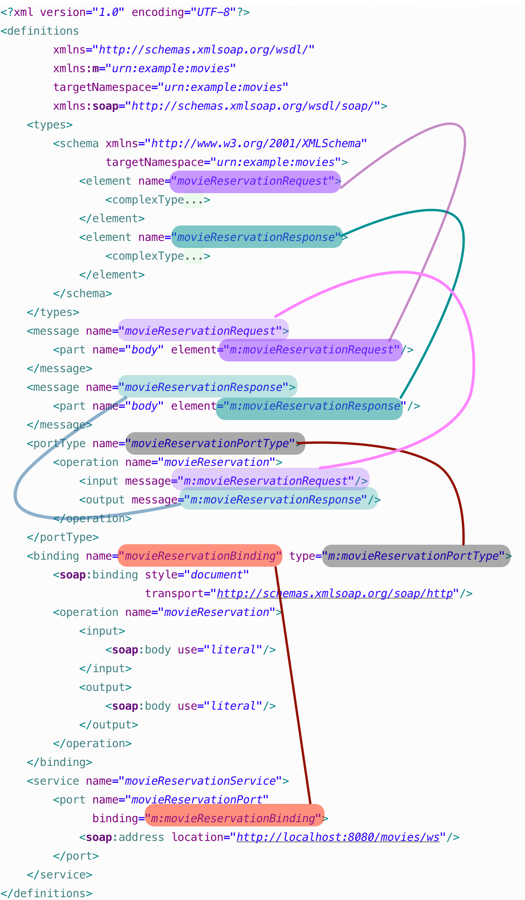

:icons: font
:link-spring-ws: https://docs.spring.io/spring-ws/docs/3.0.7.RELEASE/reference/#_object_xml_impedance_mismatch

== Úvod

Pri návrhu webových služieb nad protokolom SOAP sa môžeme vydať dvoma rozličnými
cestami. Pri tom jednoduchšom postavíme webovú službu vo vhodnej
technológii (JAX-WS, či https://github.com/jk/php-wsdl-creator[PHP-WSDL
Creator], a WSDL si necháme vygenerovať automaticky, čím dosiahneme tzv.
*contract-last* spôsob.

Opačný spôsob, *contract-first* spočíva v nadefinovaní WSDL, na základe
ktorého si necháme vygenerovať jednak kostru pre server, a neskôr i
klienta.

Postup od WSDL k triedam má mnohé výhody. Ota 'tapik' Buchta napr.
http://tapikuv.blogspot.com/2008/06/kdy-zat-s-wsdl-kdy-s-kdem.html[uvádza]:

____
* tvůrce se musí nejdříve zamyslet nad strukturou dat, což nebývá tak
úplně zvykem
* to zabrání nutnosti neustále měnit rozhraní (a tím i WSDL) při změně
datového modelu
* tvůrce uvažuje v intencích dokumentů a operací nad nimi, což mu umožní
přehoupnout se přes onen RPC XORBA zlozvyk
* WSDL je čitelné a „hezké“ a interoperabilní (pokud je navrženo jako
document-wrapped (.NET nic jiného neumí))
* celý návrh systému je pak mnohem lépe udržovatelný, modularizovatelný,
rozšiřitelný, znovupoužitelný, lépe odladitelný
____

{link-spring-ws}[Dokumentácia k Spring Web Services], čo je štandardná knižnica pre _contract-first_ spôsob, podporuje tento prístup ďalšími významnými bodmi, ktoré môžu spôsobovať problémy:

* neprenositeľné dátové typy (za všetky spomeňme napr. mapy/slovníky) a
cyklické objektové grafy
* so zmenou dát či modelu sa môže zmeniť WSDL, čo má vplyv na robustnosť

V článku si ukážeme, ako je možné vybudovať službu práve týmto
zložitejším spôsobom. Ukážeme si, ako možno pochopiť jednotlivé stavebné
bloky WSDL, ako ich možno vytvárať ručne, a necháme si tiež vygenerovať
zdrojový kód pre JAX-WS server.

=== Predpokladané znalosti

* Veľmi vám uľahčí život, ak budete poznať zásady XML a menných
priestorov, napr. z
https://novotnyr.github.io/scrolls/menne-priestory-v-xml-namespaces/[krátkeho
tutoriálu].
* Oplatí sa tiež poznať XML schému a zásady jej tvorby, napr. z
tutoriálu
https://novotnyr.github.io/tomes/xml-schema-tutorial-nielen-pre-tvorcov-soap-sluzieb/[XML
Schema: Tutoriál nielen pre tvorcov SOAP služieb]

== Príklad a štruktúra dát

V našom príklade budeme chcieť vybudovať SOAPovú službu pre rezerváciu lístkov v kine. Klient zašle požiadavku, v ktorej špecifikuje názov filmu, dátum jeho premietania a počet lístkov, ktoré si chce rezervovať. Odpoveďou bude rezervácia s identifikátorom a zoznamom rezervovaných miest.

=== Požiadavka
Požiadavka by mohla vyzerať nasledovne:

[source,xml]
----
<movieReservationRequest xmlns="urn:example:movies"><!--1-->
  <title>Krv, črevá a lietajúce hlavy</title>
  <date>2008-12-24</date>
  <numberOfTickets>4</numberOfTickets>
</movieReservationRequest>
----
<1> V dokumentoch, ktoré tvoria jadro správy SOAP sa silne odporúča používať
menné priestory (_namespaces_), všetky elementy požiadavky sme priradili
do implicitného menného priestoru `urn:example:movies`.

=== Odpoveď
Odpoveďou na uvedenú požiadavku by mohol byť dokument obsahujúci číslo
rezervácie a zoznam miest na sedenie, ktoré boli zarezervované:

[source,xml]
----
<movieReservationResponse xmlns="urn:example:movies"><!--1-->
  <id>2323241</id>
  <reservedSeats>23</reservedSeats>
  <reservedSeats>12</reservedSeats>
  <reservedSeats>12</reservedSeats>
</movieReservationResponse>
----
<1> Dokument s odpoveďou tiež priradíme do menného priestoru, a pre poriadok
ním bude rovnaký menný priestor ako majú dokumenty s požiadavkami.

=== XML schéma pre dokumenty

Na základe týchto XML dokumentov si môžeme napísať XML schému, ktorá
bude definovať štruktúru pre dáta na vstupe (požiadavky) a na výstupe
(odpovede). Bez definície XML schémy nevieme špecifikovať formát
vstupných a výstupných dokumentov vo WSDL.

Vzťah XML schéma-dokument je podobný vzťahu trieda-objekt z OOP. XML
schéma („trieda“) definuje predpis, teda štruktúru, hierarchiu a dátové
typy jednotlivých elementov, a konkrétny XML dokument („objekt“)
predstavuje inštanciu tejto XML schémy.

XML schému možno navrhovať viacerými spôsobmi, ale pre nás je
najvhodnejší štýl „matrioška” (_russian doll_). Pre každý z elementov
priamo určíme jeho štruktúru.

[source,xml]
----
<?xml version="1.0" encoding="UTF-8"?>
<schema xmlns="http://www.w3.org/2001/XMLSchema"
        targetNamespace="urn:example:movies"> <!--8-->

    <element name="movieReservationRequest"> <!--1-->
        <complexType>
            <sequence>
                <element name="title" type="string" /> <!--2-->
                <element name="date" type="date" /> <!--3-->
                <element name="numberOfTickets" type="int" /> <!--4-->
            </sequence>
        </complexType>
    </element>

    <element name="movieReservationResponse"> <!--5-->
        <complexType>
            <sequence>
                <element name="id" type="int" /> <!--6-->
                <element name="reservedSeats"
                         type="int"
                         maxOccurs="unbounded" /> <!--7-->
            </sequence>
        </complexType>
    </element>
</schema>
----
<1> Element `movieReservationRequest` predstavuje jeden z dvoch možných koreňových elementov, v tomto prípade pre požiadavku.
<2> Názov filmu je reprezentovaný podelementom `<title>`. Jeho dátový typ je `string` (reťazec).
<3> Dátum premietania, t. j. element `<date>` má dátový typ `date` (dátumový typ XML schémy)
<4> Počet lístkov, číslo typu `int` je reprezentované elementom `<numberOfTickets>`.
<5> Element `movieReservationResponse` predstavuje druhý koreňový element pre odpoveď, teda dokument s potvrdenou rezerváciou.
<6> Element `<id>` predstavuje číselné (_int_) číslo rezervácie.
<7> Element `<reservedSeats> obsahuje čísla sedadiel. Nastavenie `maxOccurs` vraví, že tento element sa môže opakovať mnohokrát.
<8> Všetky deklarované elementy budú spadať do _cieľového menného priestoru_  (_target namespace_) `urn:example:movies`.

Schému môžeme dokonca publikovať na konkrétnej webovej adrese, dostupnej
cez webový prehliadač. Ak by sa schéma ocitla na adrese
`http://movie.novotnyr.sk/schema.xsd`, môžeme mať dokument, ktorý vieme
priamo _validovať_ oproti schéme.

[source,xml]
----
<movieReservationRequest
      xmlns="urn:example:movies"
      xmlns:xsi="http://www.w3.org/2001/XMLSchema-instance" <!--1-->
      xsi:schemaLocation="urn:example:movies http://movie.novotnyr.sk/schema.xsd"> <!--2-->

    <title>Krv, črevá a lietajúce hlavy</title>
    <date>2008-12-24</date>
    <numberOfTickets>4</numberOfTickets>
</movieReservationRequest>
----
<1> Deklarovali sme menný priestor pre inštanciu schémy.
<2> V atribúte `schemaLocation` namapujeme menný priestor na príslušnú schému: v tomto prípade elementy z menného priestoru `urn:example:movies` možno
validovať oproti schéme zverejnenej na adrese
`http://movie.novotnyr.sk/schema.xsd`.

== WSDL súbor

Minimalistický WSDL súbor bez akýchkoľvek deklarácii vyzerá nasledovne:

[source,xml]
----
<?xml version="1.0" encoding="UTF-8" ?>
<definitions
        xmlns="http://schemas.xmlsoap.org/wsdl/" <!--1-->
        targetNamespace="urn:example:movies" <!--2-->
        xmlns:m="urn:example:movies" <!--3-->
        xmlns:soap="http://schemas.xmlsoap.org/wsdl/soap/"> <!--4-->

</definitions>
----
<1> implicitný menný priestor `http://schemas.xmlsoap.org/wsdl/` zodpovedá http://www.w3.org/TR/wsdl[norme WSDL 1.1]. V niektorých WSDL je tento priestor uvedený explicitne, s prefixom `wsdl`.
<2> atribút `targetNamespace` obsahuje _cieľový
menný priestor_ pre elementy deklarované v rámci tohto WSDL súboru.
<3> Prefix `m` budeme využívať v prepojeniach medzi elementami WSDL. Pre jednoduchosť volíme rovnaký cieľový menný priestor ako v prípade XML schémy.
<4> Prefix `soap` sa vzťahuje na menný priestor
`http://schemas.xmlsoap.org/wsdl/soap/` a použije sa pri definovaní
formátu správ v sekcii _binding_.

=== Schéma a dátové typy

V prvom kroku potrebujeme zadefinovať štruktúru vstupných a výstupných
dát, čo zabezpečíme sekciou `<types>`. Máme dve možnosti:

* buď sa odkážeme na externú XML schému prítomnú v samostatnom súbore.
* alebo uvedieme XML schému priamo vo WSDL súbore.

V oboch prípadoch deklarujeme v sekcii `types` vnorený element `schema`
z menného priestoru prináležiaceho špecifikácii _XML Schema_.

[source,xml]
----
<types>
    <schema xmlns="http://www.w3.org/2001/XMLSchema" 
            targetNamespace="urn:example:movies">
        <!-- explicitná XML schéma alebo odkaz na externú XML schému -->
    </schema>
</types>
----

Schéma XML bude mať rovnaký cieľový priestor (`targetNamespace`) ako má
WSDL.

==== Externá XML schéma

Ak máme XML schému definovanú v externom súbore, môžeme sa na ňu
odkázať. Vyššie sme definovali vlastnú schému `schema.xsd` s cieľovým
menným priestorom `urn:example:movies`, ktorý je rovnaký ako cieľový
menný priestor WSDL súboru.

[source,xml]
----
<?xml version="1.0" encoding="UTF-8"?>
<definitions
        xmlns="http://schemas.xmlsoap.org/wsdl/"
        xmlns:m="urn:example:movies"
        targetNamespace="urn:example:movies"
        xmlns:soap="http://schemas.xmlsoap.org/wsdl/soap/">

    <types>
        <schema xmlns="http://www.w3.org/2001/XMLSchema
                targetNamespace="urn:example:movies">
            <include schemaLocation="schema.xsd" />
        </schema>
    </types>
</definitions>
----

Keďže menný priestor našej schémy XML je rovnaký ako cieľový menný
priestor WSDL súboru, môžeme použiť deklaráciu `include`. Ak by sa menné
priestory líšili, musíme schému vložiť pomocou elementu `import`.

Umiestnenie XML schémy v atribúte `schemaLocation` môže byť dvojaké:

* _relatívne_, kde sa súbor so schémou nachádza relatívne vzhľadom na
„adresár“, v ktorom je súbor WSDL.
* _absolútne_, kde uvedieme kompletnú adresu URL, z ktorej si môžeme
stiahnuť schému, napríklad `http://movie.novotnyr.sk/schema.xsd`.

V oboch prípadoch sa na uvedenej lokácii musí nachádzať verejne dostupný
súbor so schémou XML.

Všetky elementy zo schémy sa po _include_ ocitnú v mennom priestore
`urn:example:movies`.

==== Priamo uvedená schéma

[source,xml]
----
<?xml version="1.0" encoding="UTF-8"?>
<definitions xmlns="http://schemas.xmlsoap.org/wsdl/"
             xmlns:m="urn:example:movies" 
             targetNamespace="urn:example:movies"
             xmlns:soap="http://schemas.xmlsoap.org/wsdl/soap/">

    <types>
        <schema xmlns="http://www.w3.org/2001/XMLSchema"
                targetNamespace="urn:example:movies">
            <element name="movieReservationRequest">
                <complexType>
                    <sequence>
                        <element name="title" type="string" />
                        <element name="date" type="date" />
                        <element name="numberOfTickets" type="int" />
                    </sequence>
                </complexType>
            </element>

            <element name="movieReservationResponse">
                <complexType>
                    <sequence>
                        <element name="id" type="int" />
                        <element name="reservedSeats" 
                                 type="int" 
                                 maxOccurs="unbounded" />
                    </sequence>
                </complexType>
            </element>
        </schema>
    </types>
</definitions>
----

Všimnime si, ako sme medzi elementy `<types>`...`</types>` bez zmeny
vložili celú deklaráciu XML schémy, ktorú sme definovali v predošlej
sekcii, čím sme doslova nasimulovali deklaráciu _include_.

=== Správy

Ďalej potrebujeme definovať abstraktné správy, ktoré budú putovať medzi
klientom a serverom. Je zjavné, že správy budú dve: požiadavka
`movieReservationRequest` a odpoveď `movieReservationResponse`. Každá
bude mať jednu časť `part` tvorenú príslušným koreňovým elementom.

==== Požiadavka

Požiadavka bude pozostávať z koreňového elementu
`movieReservationRequest` z menného priestoru `urn:example:movies`,
ktorému sme priradili prefix `m`.

[source,xml]
----
<message name="movieReservationRequest">
    <part name="body" element="m:movieReservationRequest"/>
</message>
----

Požiadavka má jedinú časť, ktorú sme pomenovali _body_, ktorej obsah
bude vyzerať presne tak, ako element `movieReservationRequest`.

==== Odpoveď

Odpoveď na požiadavku pozostáva z koreňového elementu `movieReservationResponse`, ktorý sa nachádza tiež v mennom priestore s prefixom `m`.

[source,xml]
----
<message name="movieReservationResponse">
    <part name="body" element="m:movieReservationResponse"/>
</message>
----

I odpoveď má jedinú časť – pomenovanú _body_, ktorej obsah zodpovedá
elementu `movieReservationResponse` z menného priestoru
`urn:example:movies`.

=== Typy pre port s operácie v ňom

Teraz definujeme *typ pre port*, ktorý predstavuje popis dostupných
operácii a výzor vstupných a výstupných dokumentov. Môžeme sa naň dívať
ako na analógiu _interface_ z objektovo-orientovaných jazykov, kde
operáciám zodpovedajú metódy.

Zatiaľ nie je nič povedané o konkrétnom protokole (HTTP, Jabber, a
podobne), čiže inými slovami definujeme len syntax správ a sadu operácií
nad nimi.

V ukážke definujeme typ pre port s názvom `movieReservationPortType` s
jedinou operáciou `movieReservation`. V operácii definujeme odkaz na
vstupnú správu (`m:movieReservationRequest`) a tiež na výstupnú správu
(`m:movieReservationRequest`). Oba odkazy v atribútoch `message` musia
obsahovať kvalifikované meno vstupnej, resp. výstupnej správy, kde menný
priestor nahradíme kratším prefixom.

[source,xml]
----
<portType name="movieReservationPortType">
    <operation name="movieReservation">
        <input message="m:movieReservationRequest" />
        <output message="m:movieReservationResponse"  />
    </operation>
</portType>
----

=== Binding

Až v tejto chvíli sa posunieme od abstraktnej syntaxe správ ku
konkrétnemu tvaru odchádzajúcich a prichádzajúcich správ. Ten definujeme
pomocou *bindingu*, ktorého úloha je:

* definovať _transportný protokol_: napr. HTTP, Mail, či Jabber
* určiť _štýl správ_, teda konkrétny tvar volaní operácií.

Každý typ portu môže definovať svoj vlastný binding, čo znamená, že
môžeme definovať rozličné komunikačné protokoly pre rozličné operácie v
porte. Konkrétny binding môže byť bližšie špecifikovaný pre každú
operáciu zvlášť.

V príklade definujeme binding `movieReservationBinding`, ktorý
asociujeme s typom portu `tns:movieReservationPort`, ktorý sme
definovali pred chvíľou. Ďalej definujeme transportný protokol: bude ním
SOAP nad HTTP v štýle _document_.

[source,xml]
----
<soap:binding style="document"
              transport="http://schemas.xmlsoap.org/soap/http" />
----

Následne musíme pre každú operáciu definovanú v type portu určiť
konkrétny fyzický formát jednotlivých správ. Pre operáciu
`movieReservation` budeme pre vstup i výstup používať správy v štýle
_literal_.

[NOTE]
Jednotlivé štýly správ sú v tomto momente nepodstatné. Štýl, ktorý má najväčšiu podporu medzi klientmi, je `document/literal`. Podrobnosti možno nájsť v článku http://www.ibm.com/developerworks/webservices/library/ws-whichwsdl/[Which
style of WSDL should I use?])

Celý _binding_ vyzerá nasledovne. Všimnime si, ako sa v atribúte `type`
odkazujeme na typ portu (pomocou kvalifikovaného mena s prefixom).

[source,xml]
----
<binding name="movieReservationBinding"     
         type="m:movieReservationPortType">

    <soap:binding style="document"
                  transport="http://schemas.xmlsoap.org/soap/http" />
    <operation name="movieReservation">
        <input>
            <soap:body use="literal"/>
        </input>
        <output>
            <soap:body use="literal"/>
        </output>
    </operation>
</binding>
----

=== Služba

Ako poslednú náležitosť nastavíme službu _service_, ktorá definuje
konkrétnu adresu, na ktorej sú fyzicky dostupné jednotlivé porty a
operácie. Služba logicky zoskupuje viacero _portov_, pričom každý port
predstavuje kombináciu _typu pre port_ s konkrétnym _bindingom_.

Odlíšenie _portu_ (typ portu zviazaný s konkrétnym transportným
protokolom a štýlom správ) od _typu portu_ (zoznam operácií) sa v
novších verziách WSDL vyjasnilo. Port v službe sa nazýva _endpoint_ a
_typ portu_ je jednoducho _port_.

V našom prípade definujeme službu `movieReservationService` obsahujúcu
port `movieReservationPort`, ktorý sa vzťahuje k bindingu
`m:movieReservationBinding` a zároveň nastavíme URL adresu, na ktorej
bude port fyzicky dostupný prostredníctvom sieťového protokolu HTTP.

[source,xml]
----
<service name="movieReservationService">
    <port name="movieReservationPort"
          binding="m:movieReservationBinding">
        <soap:address location="http://localhost:8080/movies/ws"/>
    </port>
</service>
----

=== Sumár

Ak si zosumarizujeme veci definované vo WSDL, tak máme:

* _typy_ – definujú syntax (štruktúru + dátové typy) prenášaných dát vo
vnútri správ
* _správy_ – definujú abstraktnú štruktúru prenášaných zásielok
(požiadaviek a odpovedí).
* _typ pre portu_ – definuje množinu operácií spolu so správami, ktoré
sú v nich používané
* _binding_ – predstavuje konkrétny protokol a konkrétnu reprezentáciu
správ
* typ pre port + binding = _port_. Inak povedané, port získame dodaním
protokolu k abstraktnej definícii typu portu.
* _služba_ – zhromažďuje viacero portov

image:wsdl-schema.png[image]

== Kompletné WSDL

WSDL si môžeme ilustrovať na obrázku:

Kompletné WSDL, v tvare explicitne uvedenej schémy, vyzerá nasledovne:

[source,xml]
----
<?xml version="1.0" encoding="UTF-8"?>
<definitions
        xmlns="http://schemas.xmlsoap.org/wsdl/"
        xmlns:m="urn:example:movies"
        targetNamespace="urn:example:movies"
        xmlns:soap="http://schemas.xmlsoap.org/wsdl/soap/">

    <types>
        <schema xmlns="http://www.w3.org/2001/XMLSchema"
                targetNamespace="urn:example:movies">

            <element name="movieReservationRequest">
                <complexType>
                    <sequence>
                        <element name="title" type="string"/>
                        <element name="date" type="date"/>
                        <element name="numberOfTickets" type="int"/>
                    </sequence>
                </complexType>
            </element>

            <element name="movieReservationResponse">
                <complexType>
                    <sequence>
                        <element name="id" type="int"/>
                        <element name="reservedSeats"
                                 type="int"
                                 maxOccurs="unbounded"/>
                    </sequence>
                </complexType>
            </element>
        </schema>
    </types>

    <message name="movieReservationRequest">
        <part name="body" element="m:movieReservationRequest"/>
    </message>

    <message name="movieReservationResponse">
        <part name="body" element="m:movieReservationResponse"/>
    </message>

    <portType name="movieReservationPortType">
        <operation name="movieReservation">
            <input message="m:movieReservationRequest"/>
            <output message="m:movieReservationResponse"/>
        </operation>
    </portType>

    <binding name="movieReservationBinding" type="m:movieReservationPortType">
        <soap:binding style="document"
                      transport="http://schemas.xmlsoap.org/soap/http"/>
        <operation name="movieReservation">
            <input>
                <soap:body use="literal"/>
            </input>
            <output>
                <soap:body use="literal"/>
            </output>
        </operation>
    </binding>

    <service name="movieReservationService">
        <port name="movieReservationPort"
              binding="m:movieReservationBinding">
            <soap:address location="http://localhost:8080/movies/ws"/>
        </port>
    </service>
</definitions>
----

== Literatúra

* http://www.w3schools.com/webservices/ws_wsdl_intro.asp[WSDL Tutorial],
W3Schools.org
* http://msdn.microsoft.com/en-us/library/ms996486.aspx[Understanding
WSDL], Aaron Skonnard, Northface University, Microsoft 2003
* http://www.w3.org/TR/wsdl[WSDL 1.1] - W3C Recommendation
* https://www.oracle.com/technetwork/java/design-patterns-142138.html[Introducing
Design Patterns in XML Schema]: popis XML schémy a návrhových vzorov
(matrioška)
* http://www.ibm.com/developerworks/webservices/library/ws-whichwsdl/[Which
style of WSDL should I use?], IBM DeveloperWorks.
* http://www.ibm.com/developerworks/library/j-jws20/[Java web services:
Understanding and modeling WSDL 1.1], IBM DeveloperWorks

== Revízie

* 2004/dec/03: prvá verzia zverejnená na
http://ics.upjs.sk/~novotnyr/blog/1988/od-wsdl-k-webovej-sluzbe-pitveme-a-tvorime-vlastne-wsdl
* 2019/okt/07: schémy a WSDL používajú implicitné menné priestory.
Prekreslený obrázok, zrevidované odkazy, pridaný odkaz na tutoriál ku
XSD:
