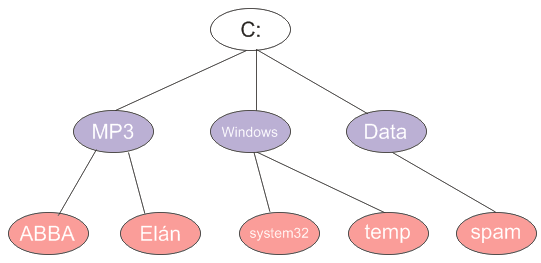

Úvod
====

V predošlom článku sme spomínali algoritmus prehľadávania do šírky, ktorý prechádzal strom ,,po vrstvách". Okrem neho jestvuje ešte analogický algoritmus prehľadávania do hĺbky. Jeho základnou ideou je preskúmavanie ciest vedúcich k čo najhlbšiemu potomkovi daného uzla.

Pekným príkladom prehľadávania do hĺbky je traverzovanie súborového systému. Ak chceme prejsť všetky súbory v danom adresári a jeho podadresároch (a v podadresároch jeho podadresárov), takéto prehľadávanie sa nám veľmi hodí.

Zjednodušený súborový systém môže vyzerať nasledovne:



Výpis na konzolu by znamenal, že chceme vypísať niečo takéto:
```
C:
MP3
ABBA
Elán
Windows
System32
temp
Data
spam
```

Dátové štruktúry
================

V tomto prípade nebudeme definovať žiadnu špeciálnu triedu pre uzol, ale budeme pracovať rovno s objektami ``java.io.File``. Tie totiž poskytujú možnosť vrátiť svoje deti (teda súbory a podadresáre), čo presne zodpovedá stromovej štruktúre.

Príklad použitia je nasledovný:
```
File fileC = new File("C:");
// vypíše súbory a adresáre v C:
File[] children = fileC.listFiles();
```

# Algoritmy
Na vyriešenie tohto problému môžeme použiť dva varianty algoritmu: rekurzívnu verziu alebo klasickú verziu, v ktorej použijeme zásobník.

## Rekurzívna verzia
Rekurzívna verzia algoritmu je založená na jednoduchom pozorovaní: na prezretie potomkov ľubovoľného uzla potrebujeme prejsť každé dieťa a prezrieť jeho potomkov. Každého potomka prezrieme tak, že vezmeme jeho priame deti a prezrieme ich atď atď. Takto sa vnárame až dovtedy, kým nedôjdeme na ,,spodok" stromu, teda k uzlom, ktoré už nemajú deti.

`prejdi(U)`:
1. Vezmi uzol *U* a spracuj ho
2. Ak uzol nemá deti, skonči.
3. Inak na každom dieťati *D* zavolaj (rekurzívne) metódu `prejdi(D)`

Ukážme si to na príklade nášho stromu:

- Vezmime teda uzol `C:`. Tento uzol spracujeme a postupne prejdeme jeho deti: `MP3`, `Windows` a `Data`.
	- Prvým dieťaťom je `MP3`. Ten spracujeme a vezmeme jeho deti: `ABBA` a `Elán`.
		- Na rade je `ABBA`. Tá už nemá deti, čiže ju len vypíšeme.
		- Ďalším kandidátom je `Elán`. Ten rovnako nemá deti a vypisujeme ho.
	- Ďalším čakajúcim je `Windows`. Jeho deti sú `system32` a `temp`.
		- Uzol `system32` je bezdetný, čiže ho len vypíšeme.
		- Rovnakým prípadom je `temp`, ktorý tiež len vypíšeme.
	- Tretím dieťaťom `C:` je uzol `Data` s jediným dieťaťom.
		- ``spam`` vypíšeme a končíme, keďže sa už nemáme kam ,,vynoriť" - všetky uzly sú spracované.

Rekurzívna verzia v Jave je potom priamym prepisom idey:
```
public static void traverse(File file) {
    // spracujeme súbor
    System.out.println(file);
    if(file.isDirectory()) {
        // prejdeme deti a spracujeme ich
        for (File child : file.listFiles()) {
            traverse(child);
        }
    }
}
```
Jediným vylepšením je overenie toho, či uzol má nejaké deti. Keďže v súborovom systéme majú deti len adresáre, do úvahy pri získavaní detí budeme brať len tie.

Pri návrhu rekurzívnych algoritmov je treba dať dôraz na to, aby sa rekurzia zastavila: teda aby sa volania metód, ktorá volajú samú seba „neodtrhli z reťaze“ a nevydali sa na nekonečný beh. Naša rekurzia je však korektná a zastaví sa ak narazíme na spodok stromu — teda buď na súbory (tie potomkov nemajú) alebo na prázdne adresáre. To je zahrnuté v podmienke, že či súbor je adresárom (``isDirectory()``).

## Nerekurzívna verzia
Ak vás rekurzia straší, možno vám pomôže nerekurzívny variant. Spomeňme si na príklad prehľadávania do šírky. V ňom sme zobrali daný uzol, všetkých jeho potomkov zaradili do fronty a následne odbavovali ďalšie uzly čakajúce vo fronte. Prehľadávanie do hĺbky môžeme postaviť analogickým spôsobom, ibaže namiesto fronty (*queue*) použijeme **zásobník** (**stack**).

Zásobník možno vnímať ako obyčajný zoznam prvkov, kde pridávanie a odoberanie prvkov do zoznamu funguje tzv. „LIFO“ spôsobom — „last-in first-out“, čiže „posledný dnu-prvý von“. Predstaviť si ho môžeme ako štós tanierov, kde tanier možno položiť buď na vrchol kopy alebo ho z vrchu kopy odobrať. (Odoberať tanier z prostriedka nie je možné, lebo by sa taniere mohli rozbiť.) Typický zásobník má tieto operácie:

* `boolean empty()` — zistí, či zásobník je prázdny
* `pop()` — odstráni objekt z vrchu zásobníka a vráti ho.
* `push(Object item)` — vloží objekt na vrchol zásobníka.

Podobne ako v prípade prehľadávania do šírky budeme prechádzať strom po jednotlivých uzloch. Pre každý uzol však môžeme vybaviť jeho súrodencov až vtedy, čo sú vybavení všetci jeho potomkovia (priami i nepriami). Potomkov uzla budeme ukladať na zásobník, z ktorého budeme zároveň vyberať uzly súce na vybavenie. Algoritmus sa skončí vo chvíli, keď je zásobník prázdny, teda že už nie je čo spracovávať.

### Príklad algoritmu

Vezmime teda uzol ``C:``. Tento uzol spracujeme a jeho deti ``MP3``, ``Windows`` a ``Data`` vkladajme postupne na vrchol zásobníka. Pre poriadok budeme deti prechádzať v prevrátenom poradí (aby sa na vrchol zásobníka ukladali tie uzly, ktoré budeme spracovávať ako prvé).

```
+-----------------------
| Data | Windows | MP3
+-----------------------
```

Ďalej vezmeme prvok z vrcholu zásobníka, `MP3`, vybavíme ho (vypíšeme na konzolu) a všetky jeho deti vložíme na vrchol zásobníka.

```
+------------------------------
| Data | Windows | Elán | ABBA
+------------------------------
```

Z vrchola zásobníka vezmeme `Abbu`. Tá už nemá deti, čiže ju len spracujeme a pokračujeme ďalej.

```
+-----------------------
| Data | Windows | Elán
+-----------------------
```

Teraz vezmeme z vrchola zásobníka `Elán`. Ten tiež rovnako nemá deti, čiže ho spracujeme a pokračujeme ďalej.

```
+----------------
| Data | Windows 
+----------------
```

Na vrchole zásobníka je `Windows`, ktorý má dvoch potomkov (`system32` a `temp`). Hodíme ich postupne na vrchol zásobníka.

```
+------------------------
| Data | temp | system32
+------------------------ 
```

Oba uzly, ``system32`` aj ``temp` sú bezdetné, teda ich len spracujeme. 

```
+------
| Data 
+------
```


Na rade je ``Data`` s jediným potomkom, ``spam``, ktorý hodíme do (zhodou okolností prázdneho) zásobníka.

```
+------
| spam
+------
```

Spracovaním uzla ``spam`` končíme algoritmus, keďže zásobník je už prázdny.

### Idea algoritmu

Idea algoritmu je potom nasledovná:

1. vložme na vrchol zásobníka koreň stromu
2. ak je zásobník prázdny, končíme
3. inak vezmime z vrcholu zásobníka uzol a spracuj ho. 
4. vezmime jeho deti a dajme ho na vrchol zásobníka (v obrátenom poradí).
5. pokračujme krokom 2.

### Zásobník `java.util.Stack`
Zásobník je v Jave k dispozícii v podobe triedy `java.util.Stack`. Najdôležitejšie metódy boli zmienené vyššie.

### Algoritmus v Jave s použitím zásobníka

```java
// vytvoríme zásobník
Stack<File> zásobník = new Stack<File>();
// pridáme koreň do fronty
zásobník.push(root);

//pokiaľ fronta nie je prázdna
while(!zásobník.isEmpty()) {
    // vyberme uzol z vrcholu zásobníka
    File file = zásobník.pop();
    // vybavme ho
    System.out.println(file);
    // potomkov zaradíme do fronty
    if(file.isDirectory()) {
        File[] children = file.listFiles();
        // hádžeme na vrchol zásobníka v opačnom poradí
        for(int i = children.length - 1; i >= 0; i--) {
          	zásobník.push(children[i]);
        }       
    }
}
```

Zabudovaný algoritmus v Jave
============================

Trieda `javax.swing.tree.DefaultMutableTreeNode` má medzi svojimi metódami tiež prehľadávanie do hĺbky. Na koreňovom uzle stačí zavolať `depthFirstEnumeration()`, ktorá vráti enumeráciu uzlov.

```java
Enumeration<DefaultMutableTreeNode> bfsEnum = root.depthFirstEnumeration();
while (bfsEnum.hasMoreElements()) {
  	DefaultMutableTreeNode treeNode  = bfsEnum.nextElement();
  	System.out.println(treeNode.getUserObject());
}
```

