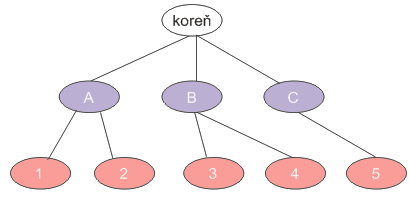
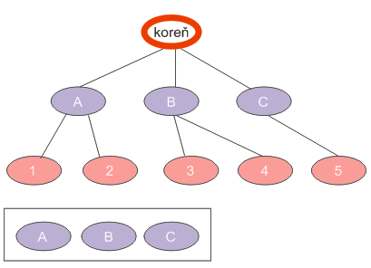
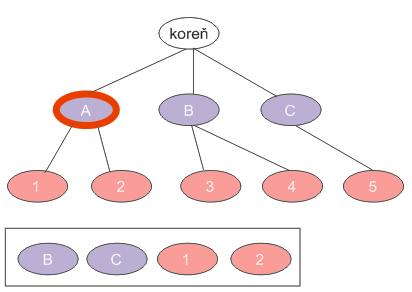
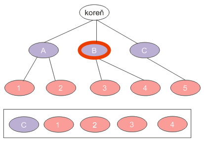
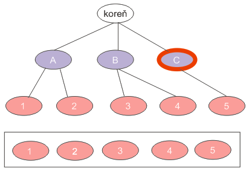

Úvod
====

Algoritmy na prehľadávanie stromov si množstvo ľudí pamätá (alebo nepamätá) z vysokej školy. Napriek tomu niekedy môže nastať situácia, keď je vhodné ich použiť a pri tej príležitosti si ich pripomenúť.

Predstavme si jednoduchú úlohu: máme stromovú štruktúru (napr. rodostrom predkov), ktorú chceme vypísať na konzolu. Príkladom takéhoto stromu je nasledovný obrázok: 



Výpis na konzolu by znamenal, že chceme vypísať niečo takéto:

```
koreň
A
B
C
1
2
3
4
5
```

Ako na to?

# Dátové štruktúry

Ako tvrdieval pán Wirth, *programovanie = dátové štruktúry + algoritmy*. Navrhnime si predovšetkým dátovú štruktúru, v ktorej budeme uchovávať náš strom.

Predovšetkým potrebujeme triedu, ktorá bude reprezentovať uzol. Tá bude jednoduchá: uzol totiž popíšeme nejakým názvom a zoznamom jeho potomkov. V našom prípade bude mať biely uzol popis "koreň" a v zozname jeho potomkov budú uzly s popismi "A", "B" a "C".

```java
import java.util.ArrayList;
import java.util.List;

public class Node {
    /**
     * Popis uzla
     */
    private String label;

    /**
     * zoznam potomkov
     */
    private List<Node> children = new ArrayList<Node>();

    /**
     * Vytvorí uzol bez detí s daným názvom.
     */
    public Node(String label) {
        this.label = label;
    }

    /**
     * Pridá daný uzol medzi potomkov uzla.
     */
    public void add(Node node) {
        this.children.add(node);
    }

    /**
     * Vráti zoznam potomkov uzla.
     */
    public List<Node> getChildren() {
        return children;
    }

    /**
     * Vráti popisok uzla.
     */
    public String getLabel() {
        return label;
    }
}
```

Ako budeme reprezentovať celý strom? Jednoducho. Dokonca si nemusíme si vytvárať samostatnú triedu pre strom, pretože si stačí pamätať koreňový uzol. Z neho sa vieme dostať do ľubovoľného potomka.

Strom z obrázka skonštruujeme nasledovne:

```java
Node root = new Node("koreň");

Node nodeA = new Node("A");
Node nodeB = new Node("B");
Node nodeC = new Node("C");

root.add(nodeA);
root.add(nodeB);
root.add(nodeC);

Node node1 = new Node("1");
Node node2 = new Node("2");
Node node3 = new Node("3");
Node node4 = new Node("4");
Node node5 = new Node("5");

nodeA.add(node1);
nodeA.add(node2);

nodeB.add(node3);
nodeB.add(node4);

nodeC.add(node5);
```

# Príklad algoritmu

Tento príklad vieme elegantne vyriešiť pomocou algoritmu prehľadávania stromu do šírky. O čo v ňom ide? Je zjavné, že strom musíme vypisovať po vrstvách, čiže najprv prvú vrstvu (*koreň*), potom druhú vrstvu (*A*, *B*, *C*) a nakoniec tretiu vrstvu (*1*, *2*, *3*, *4*, *5*). Navyše pri vypisovaní musíme zachovať správne poradie.

Ak by si každý uzol pamätal svojho ,,súrodenca", bolo by to jednoduché. Mohli by sme upraviť našu triedu tak, aby dávala k dispozícii túto možnosť. Síce by sme si zjednodušili algoritmus, ale značne skomplikovali réžiu pri pridávaní uzlov. Navyše, to vôbec nie je potrebné.

Náš strom totiž budeme prechádzať po jednotlivých uzloch. Pre každý uzol však môžeme vybaviť jeho potomkov až vtedy, čo sú vybavení jeho súrodenci. Inak povedané, ak vezmeme uzol, jeho potomkov musíme zaradiť do frontu, kde budú veselo čakať do chvíle, kým sa nedostanú na rad, čiže kým neodbavíme súrodencov uzla.

## Priebeh pre koreňový uzol

Pre uzol *koreň* vezmeme potomkov *A*, *B*, *C* a zaradíme ich do frontu, kým neodbavíme ostatných súrodencov. Našťastie v tomto prípade súrodenci nejestvujú. Tento uzol teda odbavíme (vypíšeme ho na konzolu), jeho potomkov dáme do frontu a hneď môžeme vybaviť prvého potomka, teda uzol *A*.

Front teda vyzerá nasledovne: 

```
A, B, C
```



## Spracovanie uzla *A*

Uzol *A* má dvoch potomkov (*1* a *2*). Tí sa však môžu rovnako vybaviť až po tom, čo vybavíme jeho súrodencov (čiže ostatné uzly na druhej vrstve s uzlom *A*). Jednotku a dvojku teda poslušne zaradíme do frontu za uzly *B* a *C* a uzol *A* považujeme za vybavený.

Front teda vyzerá nasledovne: 

```
B, C, 1, 2
```



Spracovanie uzla *B*
--------------------

Na čele frontu je uzol *B*. Už vieme, čo máme robiť. Vezmeme jeho potomkov, 3, 4, poslušne ich pošleme do frontu a vybavíme ho.

Front vyzerá nasledovne: 

```
C, 1, 2, 3, 4
```



Spracovanie uzla *C*
--------------------

Uzol *C* má jediného potomka, 5, ktorý sa do frontu postaví radšej dobrovoľne ;-)

Fronta vyzerá nasledovne: 

```
1, 2, 3, 4, 5
```



Spracovanie uzlov bez potomkov
------------------------------

Takýmto spôsobom postupujeme ďalej. Jednotkový uzol už nemá potomkov, teda nie je čo radiť do frontu a preto ho jednoducho vybavíme. Týmto spôsobom odbavíme všetky zostávajúce uzly až kým sa front nevyprázdni, čím algoritmus ukončíme.

Algoritmus
==========

Algoritmus je teda nasledovný:

1. Vložme koreňový uzol do frontu.
2. Vezmime uzol zo začiatku frontu a vybavme ho. Vezmime všetkých potomkov uzla a poslušne ich dodajme na koniec frontu.
3. Ak je front prázdny, sme hotoví.
4. Inak pokračujme krokom 2.

Čo je to vlastne ten front?
---------------------------

**Front** (alebo **rad** alebo **queue**) nie je ničím mimoriadnym (aj keď sa tak môže zdať). V podstate ide o klasický zoznam prvkov. Pridávanie a odoberanie prvkov do zoznamu funguje tzv. „FIFO“ spôsobom — *,,first-in first-out"*, čiže ,*,prvý dnu-prvý von"*. Prvok, ktorý bol do frontu pridaný skôr, bude aj skôr vybavený. Inak povedané, je to klasický príklad frontu na pomaranče, mäso či inú potravinu.

Front by sme si prirodzene mohli implementovať sami (to prenechávame na pozorného čitateľa), ale to nie je potrebné. V Jave je totiž takáto trieda priamo k dispozícii.

Interfejs `java.util.Queue` má k dispozícii niekoľko užitočných metód:

- **poll()** vráti prvok na začiatku frontu a zároveň ho odstráni. Ak je front prázdny, vráti `null`.
- **offer()**  ponúkne prvok frontu. Presnejšie, vloží prvok na koniec frontu a vráti `true`, ak sa vloženie podarilo.
- **peek()** vráti prvok zo začiatku frontu, ale neodstráni ho. (Doslova „nakukne“ na začiatok frontu.). Ak je front prázdny, vráti `null`

Tento interfejs je implementovaný viacerými triedami. Pre náš prípad nám stačí použiť implementáciu spojového zoznamu v podobe `java.util.LinkedList`.

## Implementácia

Implementácia v Jave je potom priamočiara:

```java
// vytvoríme front
Queue<Node> queue = new LinkedList<Node>();
// pridáme koreň do frontu
queue.add(root);

//pokiaľ front nie je prázdny
while (!queue.isEmpty()) {
    // vyberieme uzol zo začiatku frontu
    Node node = queue.poll();
    // vypíšeme ho / vybavíme ho
    System.out.println(node.getLabel());
    // potomkov zaradíme do frontu
    for (Node childNode : node.getChildren()) {
        queue.offer(childNode);
    }
}
```

# Prehľadávanie do šírky zabudované v Jave

Dátové štruktúry
----------------

Java poskytuje podporu stromové štruktúry, aj keď pravdupovediac na úplne nečakanom mieste — v balíčku pre používateľské rozhranie Swing. Trieda [`javax.swing.tree.DefaultMutableTreeNode`](https://docs.oracle.com/javase/7/docs/api/javax/swing/tree/DefaultMutableTreeNode.html) predstavuje uzol stromu, do ktorého môžeme pridávať potomkov. Náš príklad s budovaním stromu môžeme prepísať nasledovne:

```java
DefaultMutableTreeNode root = new DefaultMutableTreeNode("koreň");

DefaultMutableTreeNode nodeA = new DefaultMutableTreeNode("A");
DefaultMutableTreeNode nodeB = new DefaultMutableTreeNode("B");
DefaultMutableTreeNode nodeC = new DefaultMutableTreeNode("C");

root.add(nodeA);
root.add(nodeB);
root.add(nodeC);

DefaultMutableTreeNode node1 = new DefaultMutableTreeNode("1");
DefaultMutableTreeNode node2 = new DefaultMutableTreeNode("2");
DefaultMutableTreeNode node3 = new DefaultMutableTreeNode("3");
DefaultMutableTreeNode node4 = new DefaultMutableTreeNode("4");
DefaultMutableTreeNode node5 = new DefaultMutableTreeNode("5");

nodeA.add(node1);
nodeA.add(node2);

nodeB.add(node3);
nodeB.add(node4);

nodeC.add(node5);
```

K zoznamu detí sa pristupuje pomocou metódy `children()`, ktorá vracia enumeráciu [`Enumeration`](https://docs.oracle.com/javase/7/docs/api/java/util/Enumeration.html) potomkov. Metóda pre traverzovanie stromu potom vyzerá nasledovne:

```java
Queue<DefaultMutableTreeNode> queue
        = new LinkedList<DefaultMutableTreeNode>();
queue.add(root);

while(!queue.isEmpty()) {
    DefaultMutableTreeNode node = queue.poll();

  	// vybavíme uzol
    System.out.println(node.getUserObject());

    Enumeration<DefaultMutableTreeNode> children = node.children();
    while(children.hasMoreElements()) {
        queue.offer(children.nextElement());
    }
}
```

Prehľadávanie do šírky zo škatule
---------------------------------

`DefaultMutableTreeNode` poskytuje prehľadávanie do šírky ako jednu zo svojich metód. Na koreňovom uzle stačí zavolať `breadthFirstEnumeration()`, ktorá vráti enumeráciu uzlov v usporiadaní po vrstvách.

```java
Enumeration bfsEnum = root.breadthFirstEnumeration();
while(bfsEnum.hasMoreElements()) {
		DefaultMutableTreeNode treeNode 
    		= (DefaultMutableTreeNode) bfsEnum.nextElement();
	  // vybavíme uzol
  	System.out.println(treeNode.getUserObject());
}
```

