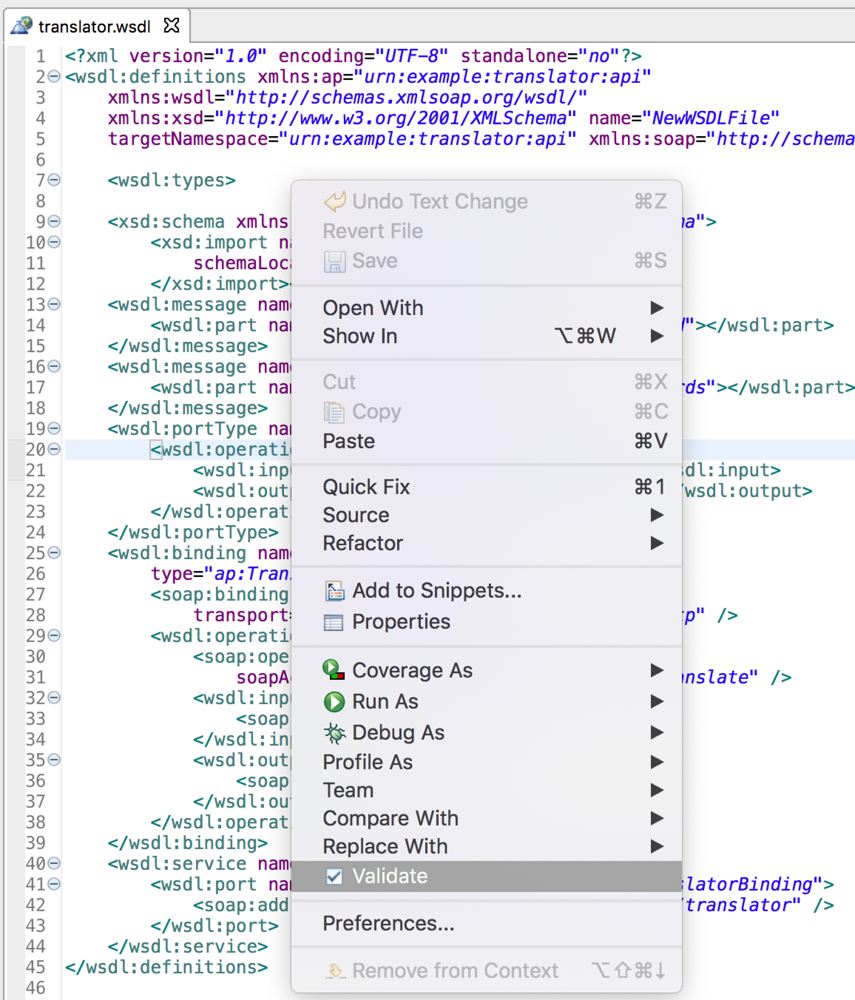
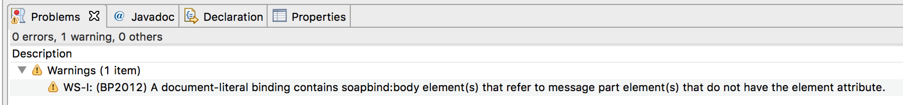

Eclipse IDE (with *Eclipse Java Web Developer Tools* plugin) provides a WS-IT Validation capability on WSDL files. This ensures a fundamental interoperability across major SOAP frameworks.

However, WS-IT.org is often offline. In that case, validation fails and we need to workaround!

== The best-case scenario

The WS-IT validator directly contacts the WS-IT.org portal. It fetches the validation results, processes and exports them to the *Problems* view.

== Working around WS-IT.org outages

WS-IT.org outages are very common.
Even with caching turned on, Eclipse IDE might not be able to reach the validation services (see https://bugs.eclipse.org/bugs/show_bug.cgi?id=535813[Eclipse Bug 535813]).
Sadly, unlike SOAP UI or other GUI tools, validation profiles are always downloaded from the web, and not provided offline.

Eclipse IDE requires at least the following:

* http://www.ws-i.org/Testing/Tools/2004/12/AP10_BP11_SSBP10_TAD.xml.
* http://www.ws-i.org/Testing/Tools/2004/12/BasicSecurityTestAssertions.xml

Workaround? Download the necessary files from a mirror and launch a local HTTP server.

== Roadmap

. Clone the necessary files.
. Setup Apache HTTP / local server
. Setup domain name aliasing

=== Cloning the repo

The https://github.com/novotnyr/ws-i_org[`novotnyr/ws-i_org`] repository is a partial mirror of WS-I.org with files that are necessary for validation.

=== Running the HTTP

Since Eclipse IDE requires the `ws-i.org` running on port 80, we need to adapt.

==== Running on MacOS

On MacOS, we can reuse the default Apache HTTPD running on port 80.
We can symlink the `Testing` directory to the `/Library/WebServer/Documents`.

==== Running elsewhere

With Python 3 available, we can run the embedded Python server.
From the Git clone root, let's run:

[source,bash]
python3 -m http.server 9990

=== Setup domain name

In `/etc/hosts`, let's alias `www.ws-it.org` to localhost.
Let's add the following entry:

[source]
127.0.0.1	www.ws-i.org

== Testing the Validation

Let's use a minimalistic, although noncompliant WSDL:

[source,xml]
----
<?xml version="1.0" encoding="UTF-8" standalone="no"?>
<definitions xmlns:e="urn:example:echo"
	xmlns="http://schemas.xmlsoap.org/wsdl/"
	xmlns:xsd="http://www.w3.org/2001/XMLSchema"
	targetNamespace="urn:example:echo" xmlns:soap="http://schemas.xmlsoap.org/wsdl/soap/">

	<message name="Request">
		<part name="body" type="xsd:string" />
	</message>

	<message name="Response">
		<part name="body" type="xsd:string" />
	</message>

	<portType name="PortType">
		<operation name="echo">
			<input message="e:Request" />
			<output message="e:Response" />
		</operation>
	</portType>

    <binding name="Binding"
    	type="e:PortType">
    	<soap:binding style="document"
    		transport="http://schemas.xmlsoap.org/soap/http" />
    	<operation name="echo">
    		<input>
    			<soap:body use="literal" />
    		</input>
    		<output>
    			<soap:body use="literal" />
    		</output>
    	</operation>
    </binding>

    <service name="Service">
    	<port name="Port" binding="e:Binding">
    		<soap:address location="http://localhost" />
    	</port>
    </service>
</definitions>
----

When running *Validate* from context menu, we will see a warning:

----
WS-I: (BP2012) A document-literal binding contains soapbind:body element(s) that refer to message part element(s) that do not have the element attribute.
----

This is a regular WS-I validation error, indicating a noncompliant document.
Despite warnings, we are successfully running the WS-I validation against our local server.