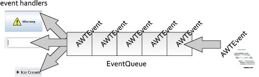
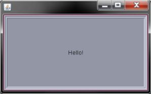
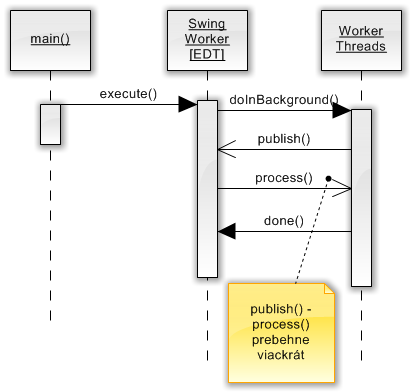
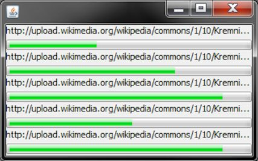

# Úvod

Jednou zo základných požiadaviek používateľského rozhrania je jeho
*responsiveness*, teda včasná a rýchla reakcia na používateľov vstup
(teda zadávanie z klávesnice, kliky myšou atď.) Rozhranie, ktoré
nedokáže reagovať včas, používateľa frustruje, pretože tempo svojej
práce musí prispôsobovať počítaču a začne mať dojem, že program ho v
práci zdržuje. Včas reagujúce používateľské rozhranie by malo spĺňať
nasledovné požiadavky:

- umožniť používateľovi vidieť aktuálny stav aplikácie
- dať na vedomie, že jeho vstup bol prijatý
- v prípade, že aplikácia rieši dlhotrvajúcu úlohu, dávať na známosť
priebežný stav a nebudiť dojem, že zamrzla
- ovplyvňovať beh programu (zatvoriť ho, pozastaviť atď.).

Pri vývoji swingovských aplikácii, ktoré spĺňajú vyššieuvedené zásady,
sa nevyhneme použitiu vlákien a iných vlastností konkurentného
programovania. Hoci sa to na prvý pohľad môže zdať pomerne odstrašujúce
(konkurentné programovanie v sebe nesie potenciál ťažko odladiteľných
chýb), v skutočnosti máme k dispozícii množstvo nápomocných tried a
metód, ktoré prácu uľahčia.

## Zmýšľanie pri grafických aplikáciách

Pri používaní klasických konzolových aplikácií používateľ uvažuje
lineárne: aplikácia si od neho postupne vyžaduje údaje, ktoré sú do nej
postupne zadávané z klávesnice.

    Enter username:
    > novotnyr
    New UNIX password: 
    > ******
    Retype new UNIX password: 
    > ******
    passwd: all authentication tokens updated successfully.

V prípade grafických aplikácii sa však spôsob zmýšľania mení -- a to
nielen na strane používateľa, ale i na strane vývojára.

Aplikácia musí reagovať na *udalosti*, ktoré používateľ vyvoláva na jej
ovládacích prvkoch, a v závislosti na nich aktualizovať a prekresľovať
používateľské rozhranie.

Kritickým problémom sú dlhotrvajúce operácie: kým v konzolovej aplikácii
stačí vypísať `„Prosím
čakajte...“` a o prekresľovanie sa starať netreba (všetky dáta sú už
totiž zobrazené), v grafickom používateľskom rozhraní je situácia presne
opačná. Ak aplikácia vykonáva tiahly výpočet, nesmie zabudnúť na
spracovávanie používateľovho vstupu a následné prekresľovanie, pretože
v opačnom prípade získa používateľ mylný pocit, že program vytuhol a
treba ho násilne ukončiť.

## Vlákna v Swingu

Kým bežná konzolová aplikácia v Jave si vystačí s jediným vláknom (tzv.
**main**), swingová aplikácia po spustení vytvorí viacero vlákien, ktoré
sú zodpovedné za prekresľovanie, vybavovanie udalostí a ich
rozosielanie jednotlivým event handlerom (teda kódu obsluhy udalostí) a
ďalšie nízkoúrovňové operácie. Vlákna v typickej aplikácii sú zobrazené
na nasledovnom obrázku:


Zo všetkých vlákien v swingovskej aplikácii sú však najdôležitejšie dve:

* **main:** Inštancie ľubovoľného swingovského okna z neho automaticky
naštartujú ostatné nízkoúrovňové vlákna (AWT-Shutdown,
AWT-Windows) a vlákno EDT.

* **event dispatch thread**: najdôležitejšie vlákno, ktoré je zodpovedné za spracovávanie udalostí a delegovanie udalostí pre ich obsluhu, ktorá sa nachádza v jednotlivých komponentoch.

## Event Dispatch Thread (EDT)

Predstavme si kód z jednoduchej aplikácie, kde vytvoríme tlačidlo
`JButton` a priradíme mu obsluhu udalosti, ktorá nastane po kliknutí
naň: Kód v rámci metódy `actionPerformed()` predstavuje **obsluhu
udalostí** (**event handler**).

Čo sa stane po kliknutí myšou?

Vlákno EDT v sebe obsahuje tzv. **front udalostí** (*event queue*).
Akákoľvek akcia, ktorú vyvolá používateľ v používateľskom rozhraní --
či už pohyb myšou, kliknutie, stlačenie klávesy atď -- spôsobí
vytvorenie objektu udalosť (v skutočnosti potomkovia triedy `AWTEvent`,
to však nie je dôležité) a jeho zaradenie na koniec tohto frontu.

Z jeho opačného konca EDT postupne vyberá jednotlivé objekty udalostí a
rozposiela ich do jednotlivých komponentov, ktoré ich ďalej posielajú do
svojich event handlerov, resp. listenerov. Tu však platí dôležitá a
kritická zásada: objekt udalosti je z frontu vybratý až potom, čo dobehne
kód v event handleri (listeneri), ktorý obslúži predošlú udalosť.



Z tejto dôležitej zásady vyplýva prvé dôležité pravidlo pri práci so
Swingom:

> **Warning**
> 
> V EDT nikdy nevykonávajte dlhotrvajúce operácie\!

Ukážme si príklad, čo sa stane, ak to nedodržíme. Predstavme si kód v
listeneri tlačidla, ktorý vykonáva dlhotrvajúcu operáciu, napríklad
výpočet najväčšieho prvočísla.

``` java
JButton button = new JButton("Hello!");
button.addActionListener(new ActionListener() {
    public void actionPerformed(ActionEvent e) {
        /* dlhotrvajúci výpočet... */
        stiahniSúbor("http://en.wikipedia.org/wiki/File:Java_logo.svg");
    }
});
add(button);
```

Po kliknutí na príslušný gombík sa do frontu udalostí zaradí nová
inštancia udalosti `ActionEvent`. Po spracovaní udalostí, ktoré sú pred
ňou, sa dostane na začiatok frontu. EDT ju z frontu vyberie, a pošle
príslušnému komponentu (teda gombíku `button`), ktorý ju odošle do
svojho *action listenera*. Ten vykoná kód vo svojej metóde
actionPerformed(), a po jeho dobehnutí umožní vláknu EDT spracovať
ďalšie udalosti vo fronte.

Kód v tejto metóde však predstavuje kritický bod: kým beží vyhľadávanie
najväčšieho prvočísla, nemôže prebiehať spracovanie udalostí vo fronte. Z
toho vyplýva doslova viditeľný dôsledok: používateľské rozhranie
„vytuhne“. Ak je pozastavené spracovanie udalostí, neprebieha ani
prekresľovanie používateľského rozhrania a používateľ začne byť
nervózny.



Predošlý obrázok ukazuje príklad zamrznutého používateľského rozhrania.
Používateľ stlačil tlačidlo, začal sa vykonávať *action listener*, ale
prekresľovanie ustalo -- rozbehne sa až po dobehnutí kódu v listeneri.
Všimnime si negatívny dôsledok: tlačidlo ostalo zobrazené v medzistave,
teda v stave „používateľ stlačil tlačidlo myši“. Nervózny používateľ
zrejme začne „zbesilo“ klikať do okna, prípadne sa snažiť ukončiť
aplikáciu, lenže jeho pokusy budú márne. Každý klik, či posun myši len
vyvolá ďalšiu udalosť, ktorá sa zaradí na koniec frontu udalostí. Ich
spracovanie je však pozastavené; čaká sa totiž na dobehnutie *action
listenera*.

Morálne ponaučenie sme už spomenuli: dlhotrvajúce operácie *nesmú*
prebiehať v EDT, inak zablokujú spracovávanie udalostí. Z toho však
vyplýva ešte jeden dôsledok, ktorý budeme musieť brať do úvahy v druhej
časti pravidiel pre prácu so Swingom:

> **Warning**
> 
> Kód v listeneroch komponentov vždy beží v rámci vlákna EDT.

# Dlhotrvajúce úlohy v Swingu

## Riešenie pomocou `SwingWorker`a

Jedným z tradičných spôsobov, ktorými možno riešiť beh dlhotrvajúcich
úloh bez toho, aby sme narušili prekresľovanie používateľského
rozhrania, je použitie triedy `SwingWorker`.

`SwingWorker` je veľmi flexibilná trieda, ktorá umožňuje elegantne
riešiť typické úlohy pri práci s viacerými vláknami v Swingu.

- spustenie dlhotrvajúcej úlohy bez zablokovania frontu EDT a teda
zastavenia prekresľovania používateľského rozhrania
- podpora dlhotrvajúcich úloh, ktoré vracajú výsledok
- priebežná aktualizácia používateľského rozhrania
- možnosť zistiť, či úloha ešte stále beží alebo či už bola dokončená
- zrušenie behu dlhotrvajúcej úlohy

Táto trieda je od JDK 6 priamo k dispozícii. Pre predošlé verzie Javy je
dostupná v podobe dodatočného projektu zo stránok
[dev.java.net](http://swingworker.dev.java.net). Ak chceme vytvoriť
`SwingWorker`, ktorý spustí sťahovanie súboru mimo vlákna EDT, vieme
použiť nasledovnú konštrukciu:

``` java
SwingWorker<Void, Void> swingWorker = new SwingWorker<Void, Void>() {
    @Override
        protected Void doInBackground() throws Exception {
            stiahniSúbor(
                "http://en.wikipedia.org/wiki/File:Java_logo.svg");
            return null;
        }
    };
swingWorker.execute();
```

Základom filozofie je vytvoriť novú inštanciu `SwingWorker`-a. Táto
trieda používa dva generické parametre, ktoré pôsobia pomerne šokujúco,
ale umožňujú dodržať typovú kontrolu. 

Prvý parameter v generiku určuje
návratovú hodnotu metódy `doInBackground()`. (V našom prípade nevracia
nič). 

Druhý parameter určuje dátový typ objektov prehadzovaných medzi
metódami `publish()` a `process()`. O oboch metódach sa podrobnejšie
zmienime v ďalších sekciách.

Po vytvorení inštancie potrebujeme prekryť niektoré z metód, a nakoniec
spustiť vykonávanie pomocou metódy `execute()`.

Kód v metóde `doInBackground()` sa spustí asynchrónne, teda v samostatnom
vlákne mimo EDT, čo presne spĺňa zásadu o neblokovaní prekresľovania.
Návratový typ tejto metódy sa musí zhodovať s generickým typom uvedeným
pri konštrukcii `SwingWorker`a. V prípade, že nevraciame žiadny objekt,
môžeme s výhodou využiť dátový typ `Void` (s veľkým „V“\!). Kvôli
syntaktickým obmedzeniam však i v tomto prípade musíme vrátiť nejakú
návratovú hodnotu, teda `null`.



Vytváranie a spustenie `SwingWorkera`, ktoré vykoná dlhotrvajúcu
operáciu, je možné vložiť do kódu metódy `actionPerformed()` v *action
listeneri*.

V prípade, že je `SwingWorker` komplexnejší a plánuje sa jeho použitie v
rámci volania action listenera, môžeme vytvoriť samostatnú triedu, ktorá
bude dediť od `SwingWorkera` a implementovať interfejs `ActionListener`:

``` java
public class DownloadActionListener extends SwingWorker<Void, Void> 
    implements ActionListener 
{
    private URL url;
    
    public DownloadActionListener(String url) {
        try {
            this.url = new URL(url);
        } catch (MalformedURLException e) {
            throw new IllegalArgumentException(
                "Illegal protocol in URL.", e);
        }
    }

    public DownloadActionListener(URL url) {
        this.url = url;
    }
    
    protected Void doInBackground() throws Exception {
        // dlhý výpočet
        return null;
    }

    public void actionPerformed(ActionEvent e) {
        new DownloadActionListener(url).execute();
    }
}
```

Metóda `actionPerformed()` následne vytvorí novú inštanciu `SwingWorker`a
a spustí ju, teda je ekvivalentná volaniu metódy `execute()`. Pridanie
asynchrónnej akcie do tlačidla je potom jednoduché:

``` java
button.addActionListener(
 new DownloadActionListener(
    "http://en.wikipedia.org/wiki/File:Java_logo.svg"))
```

Táto technika je prehľadná, hoci má drobnú nevýhodu vo viacnásobnom
vytváraní inštancie `SwingWorker`a (keďže s každým volaním
metódy `actionPerformed()` sa vytvárajú nové inštancie). Žiaľ, iný spôsob
nie je možný, lebo inštanciu `SwingWorkera` nemožno spúšťať opakovane
(podrobnosti pozri sekcia *Opakované úlohy*).

## Zistenie, či úloha dobehla

Kód pre preberanie súboru má jednu značnú nevýhodu: používateľ vonkoncom
netuší, v akom stave je jeho priebeh, pretože používateľské rozhranie
nedáva na známosť, či preberanie ešte stále beží alebo už skončilo.
SwingWorker dáva k dispozícii metódu `done()`, ktorú možno prekryť a
realizovať v nej kód, ktorý sa má vykonať po dobehnutí operácie v
`doInBackground()`. Typickým príkladom je aktualizácia používateľského
rozhrania, napr. zmenou textu v nejakom popisku `label`.

``` java
public class DownloadActionListener extends SwingWorker<Void, Void>
    implements ActionListener 
{

    private JLabel label;

    public DownloadActionListener(String url, JLabel labe) {
        //...
    }

    // ...

    protected void done() {
        label.setText("Hotovo.");
    }
}
```

> **Important**
> 
> Kým kód v metóde `doInBackground()` beží asynchrónne, metóda `done()` sa
> naopak vykonáva v rámci EDT. Kód v nej by mal prebehnúť čo
> najrýchlejšie, aby nebrzdil prekresľovanie.

Alternatívny spôsob využíva možnosť sledovania zmien vlastností
(*properties*) v JavaBeanoch. `SwingWorker` umožňuje sledovať zmeny
svojich properties, a jednou z nich je `status`. Ak zaregistrujeme na
`SwingWorker`i inštanciu triedy `PropertyChangeListener`, kde zistíme,
či vlastnosť `status` má hodnotu DONE, vieme následne aktualizovať
používateľské rozhranie.

``` java
swingWorker.addPropertyChangeListener(new PropertyChangeListener() {
    public void propertyChange(PropertyChangeEvent event) {
        if ("state".equals(event.getPropertyName())
            && SwingWorker.StateValue.DONE == event.getNewValue()) {
            label.setText("Hotovo.");
        }
    }
});
```

Tento druhý spôsob umožňuje striktnejšie oddeliť funkcionalitu
`SwingWorker`a od samotných komponentov používateľského rozhrania, hoci
na úkor komplexnosti.

> **Important**
> 
> Kód v obsluhe udalostí (teda v listeneroch) vždy beží vo vlákne EDT.
> Túto vlastnosť možno využiť pri modifikovaní stavu komponentov.

## Aktualizácia komponentov počas behu úlohy

Metóda `done()` slúži na notifikáciu ukončenia úlohy. Ako však informovať
o priebežnom stave? Zoberme si kus kódu, ktorý začne sťahovať dáta z
webovej adresy:

``` java
protected Void doInBackground() throws Exception {
    //...
    InputStream stream = ...
    BufferedOutputStream out = ...
    
    int b = -1;
    int progress = 0;
    while((b = stream.read()) != -1) {
        out.write(b);
        // priebežne aktualizujeme UI
        aktualizujUI(progress, contentLength);
    }
    // ...
}
```

Po zapísaní bajtu môžeme aktualizovať používateľské rozhranie --
napríklad môžeme využiť „teplomer“ v podobe `JProgressBar`, ktorý
dokáže zobraziť percentuálny stav úlohy. Ak poznáme dĺžku sťahovaného
súboru, percentuálny progres vieme odvodiť
nasledovne:

``` java
progressBar.setValue((int) (((double) progress / (double) contentLength) * 100));
```

Samozrejme, to predpokladá, že `SwingWorker` má inštančnú premennú s
*progress barom*, ktorú sme doň vopred dodali.

Pretypovávacie vúdú je potrebné kvôli celočíselnému deleniu: delenie
dvoch `int`ov vedie k `int`u, čo má dôsledky v podobe výpočtu `2 / 3 == 0`. 
Metóda `aktualizujUI()` by mohla vyzerať nasledovne:

``` java
private void aktualizujUI(double progress, double length) {
    int percents = (int) ((progress / contentLength) * 100);
    progressBar.setValue(percents);
}
```

Uvedený kus kódu je na prvý pohľad korektný, ale je v ňom jedna zásadná
chyba, ktorá súvisí s prácou so swingovskými vláknami. Metóda
`doInBackground()`, ako už bolo viackrát zmienené, beží v samostatnom
vlákne. V tom istom vlákne bežia aj metódy, ktorá sú z nej volané --
teda i naša metóda `aktualizujUI()`, v ktorej aktualizujeme stav progress
baru. V Swingu však platí dôležitá zásada:

> **Warning**
> 
> Stav swingovských komponentov možno meniť len z vlákna EDT\!

Toto je druhá a posledná kritická zásada práce so Swingom. Jej
ignorovanie nevedie k syntaktickým chybám, a aplikácia zrejme pobeží.
Skôr či neskôr, a hlavne v kritických situáciách, sa môže prejaviť
nečakaným správaním, ktoré sa môže prejaviť nesprávnym prekresľovaním
komponentov či iným čudným správaním.

Metóda `aktualizujUI()` túto zásadu ignoruje, pretože nebeží v rámci EDT.
Ako to však opraviť?

V samotnej podstate tu ide o problém odovzdávania dát medzi vláknami a
ich koordinácie. V bežnom konkurentnom programovaní je to nepríliš ľahká
úloha. `SwingWorker` však poskytuje elegantnú možnosť, ako to dosiahnuť
bez väčších ťažkostí.

> **Note**
> 
> V Swingu existuje niekoľko málo metód komponentov, ktoré sú
> *thread-safe*, teda možno ich bezpečne volať aj z iného vlákna než
> EDT. Je však smutným faktom, že i v prípade, že je v dokumentácii
> uvedená *thread-safety*, realita tomu nezodpovedá. Z tohto dôvodu je
> lepšie vždy a všade dodržiavať zásadu o modifikácii komponentov len z
> vlákna EDT, aj keď to podľa dokumentácie nie je nutné. V konečnom
> dôsledku to však nie je až také obmedzenie, keďže počet
> dokumentovaných *thread-safe* metód je pomerne malý.

### Metóda `publish()`

Základnou metódou, ktorou možno odoslať dáta do vlákna EDT, je
`publish()`, ktorá umožňuje odoslať do EDT dáta uvedené v jej parametroch.
Dátový typ parametra je špecifikovaný v druhom generickom argumente
uvedenom pri vytváraní inštancie `SwingWorker`a.

### Metóda `process()`

Dáta, ktoré sme odoslali do EDT použitím `publish()`, si môžeme vyzdvihnúť
v rámci metódy `process()`. Tá beží v rámci vlákna EDT, a teda je vhodným
miestom, kde môžeme aktualizovať komponenty bez toho, aby sme porušili
vyššieuvedenú zásadu. Táto metóda má svojskú signatúru:

``` java
protected void process(List<Integer> chunks)
```

Jej parametrom je zoznam, ktorý obsahuje prvky toho typu, ktorý bol
deklarovaný v generickom argumente, resp. v parametri metódy `publish()`.
V zozname sa ocitnú všetky *publikované dáta*. Za normálnych okolností
by sa dalo čakať, že každé volanie `publish()` je spárované s volaním
`process()`, ale kvôli efektivite volaní môže `SwingWorker` zlúčiť
niekoľko publikovaných dát do jedného volania metódy process().
Prirodzene, žiadne publikované dáta sa nestratia -- objavia sa v zozname
`chunks` v takom poradí, v akom boli publikované do EDT.

#### Zoskupovanie volaní

V dokumentácii sa udáva príklad zoskupovania viacerých volaní:

``` java
publish(123);
publish(860);
publish(2320);
```

Tieto volania môžu vyústiť v jediné volanie process(), kde bude zoznam
chunks obsahovať prvky 123, 860 a 2320.

Metóda `publish()` tiež podporuje odosielanie viacerých parametrov
naraz. V niektorých situáciách môžeme teda odoslať rovno
`publish(123, 860, 2320)` -- samozrejme, v našom príklade sledovania
priebehu to nemá zmysel.

#### Sledovanie priebehu

Ak sledujeme priebeh, bude nás zaujímať len posledná publikovaná
hodnota, teda posledný prvok zoznamu. V rámci metódy vypočítame percento
priebehu a nastavíme ho na zozname.

``` java
protected void process(List<Integer> chunks) {
    double progress = chunks.get(chunks.size() - 1);
    progressBar.setValue((int) (progress / contentLength) * 100));
}
```

## `SwingWorker` a sledovanie priebehu

Ak chceme priebežne sledovať percentuálny priebeh úlohy, môžeme tiež
použiť alternatívny spôsob, ktorý využíva metódu setProgress()
zabudovanú v SwingWorkeri. Má jeden parameter v intervale 0..100, ktorý
vieme nastaviť *property* s názvom `progress`.

``` java
protected Void doInBackground() throws Exception {
    //...
    while((b = stream.read()) != -1) {
        // .. priebežne publikujeme progres
        setProgress(percentProgress);
    }
    // ...
}
```

Zmenu stavu možno sledovať zaregistrovaním inštancie
`PropertyChangeListener` na inštancii `SwingWorker`a.

## Blokovanie EDT v prípade dlhotrvajúcej operácie

V niektorých prípadoch chceme vykonať dlhotrvajúcu operáciu tak, aby
používateľ musel vyslovene počkať na výsledok. Chceme mu zabrániť v
používaní grafického rozhrania, ale zároveň chceme predísť vytuhnutiu
aplikácie. Dokumentácia k `SwingWorker`u v tomto prípade radí trik,
ktorý využíva modálne okno.

Vo vlákne EDT vytvoríme inštanciu modálneho okna, spustíme `SwingWorker`
a toto okno (modálne okno „vyblokuje“ používateľské rozhranie). Zároveň
však budeme v *property change listeneri* priebežne sledovať, či ešte
operácia beží. Ak už dobehla, okno zatvoríme. Zmienený *property change
listener* vyzerá nasledovne a podobá sa na listener zo sekcie *Úloha dobehla*.

``` java
private final class SwingWorkerCompletionWaiter 
    implements PropertyChangeListener 
{
    private JDialog dialog;

    public SwingWorkerCompletionWaiter(JDialog dialog) {
        this.dialog = dialog;
    }

    public void propertyChange(PropertyChangeEvent event) {
        if ("state".equals(event.getPropertyName())
            && SwingWorker.StateValue.DONE == event.getNewValue()) {
            dialog.setVisible(false);
            dialog.dispose();
        }
    }
}
```

Použitie na príklade *action listenera* je nasledovné:

``` java
button.addActionListener(new ActionListener() {
    public void actionPerformed(ActionEvent e) {
        SwingWorker<Void, Void> worker = ...
        JDialog dialog = new JDialog(MainForm.this, true);
        worker.addPropertyChangeListener(
            new SwingWorkerCompletionWaiter(dialog));
        worker.execute();
        dialog.setVisible(true);        
    }
});
```

V tomto prípade treba dať pozor na správne poradie príkazov. Do
`worker`a treba vložiť *property change listener*, ktorý však potrebuje
inštanciu modálneho `JDialog`u. Metóda `execute()` spustí asynchrónne
`SwingWorker`, čo sa musí udiať ešte pred zobrazením modálneho okna (v
opačnom prípade okno blokuje EDT).

# `SwingWorker` ako úloha pre paralelné spustenie

Vyššie sme sa zmieňovali o metóde `execute()`, ktorá asynchrónne spustí
kód v metóde `doInBackground()`. V útrobách SwingWorkera sa udržiava
množina obslužných vlákien (typicky desiatich), ktorá automaticky
obsluhuje všetky workerovské úlohy.

Napriek tomu však existujú situácie, keď si chceme spúšťanie
SwingWorkera spravovať sami. `SwingWorker` je možné použiť v role bežnej
asynchrónne spúšťanej úlohy. Trieda implementuje interfejs
`RunnableFuture`, čím dokáže zároveň splniť rolu `Runnable` i `Future`.

## `SwingWorker` a `Thread`

Implementovaním interfejsu Runnable je umožnené spúšťanie inštancie
`SwingWorker`a pomocou klasickej triedy vlákna `Thread`. Nasledovný kód
spustí vo vlákne `Thread` inštanciu *workera* presne tak, ako akúkoľvek
inú inštanciu Runnable:

``` java
SwingWorker<Void, Integer> worker = ...
Thread thread = new Thread(worker);
thread.start();
```

Tento kód je zhruba ekvivalentný štandardnému spusteniu cez
`worker.execute()`. V tomto prípade však explicitne určíme vlákno, ktoré
bude spracovávať danú úlohu.

> **Note**
> 
> Za normálnych okolností nie je veľmi dôvod používať túto metódu.

## `SwingWorker` a exekútory

Keďže SwingWorker implementuje `Runnable`, možno ho zaslať do exekútora.
Táto možnosť má zmysel napr. v prípade, že chceme synchronizovať beh
viacerých vlákien. Predstavme si, že chceme zobraziť okno, ktoré má
viacero *progress barov* indikujúcich paralelné sťahovanie viacerých
súborov a po dokončení sťahovania sa automaticky zatvorí.



Tento problém vieme elegantne vyriešiť pomocou exekútora, teda inštancie
triedy `ExecutorService`. Doňho vieme odoslať viacero úloh, ktoré sa
spustia asynchrónne v samostatných vláknach. V tomto konkrétnom prípade
navyše vieme využiť metódu `invokeAll()`, ktorá blokuje dovtedy, kým
nedobehnú všetky úlohy. Inak povedané, spustíme úlohy, blokujeme a po
ich dobehnutí zatvoríme okno. Drobným nedostatkom je fakt, že
`invokeAll()` vyžaduje úlohu v podobe inštancie typu Callable. Našťastie,
volaním `Executors.callable()` vieme previesť `Runnable` na `Callable`.

``` java
setVisible(true);
try {
    ExecutorService executor = Executors.newCachedThreadPool();
    List<Callable<Object>> tasks 
        = new LinkedList<Callable<Object>>();
    for (Component c : this.getContentPane().getComponents()) {
        if (c instanceof DownloadProgressPanel) {
            // panel s progress barom a popiskom
            DownloadProgressPanel panel = (DownloadProgressPanel) c;
            // vytvoríme inštanciu SwingWorkera
            DownloadTask task
            = new DownloadTask(panel.getUrl(),
                panel.getProgressBar());
            // prevedieme ho na Callable a zaradíme do zoznamu úloh
            Callable<Object> callable = Executors.callable(task);
            tasks.add(callable);
        }
    }
    // vykonáme všetky úlohy. Volanie metódy čaká, kým nedobehnú úlohy.
    executor.invokeAll(tasks);
} catch (InterruptedException e) {
    e.printStackTrace();
} finally {
    setVisible(false);
}
```

## Opakované úlohy

V prípade, že sa snažíme pustiť úlohu reprezentovanú `SwingWorker`om
opakovane, treba dať pozor na jednu významnú zásadu.

> **Warning**
> 
> Inštanciu `SwingWorker`a možno spustiť len raz.

Táto vlastnosť v podstate zabraňuje opakovanému spúšťaniu úloh.

# Ostatné nástroje pre práce s vláknami v Swingu

`SwingWorker` je skutočne rafinovaná trieda, ktorou dokážeme vyriešiť
veľa problémov. Napriek tomu sa môže v zriedkavých prípadoch stať, že
si potrebujeme poradiť aj bez neho. Príkladom môže byť kód vykonávaný v
rámci vlákna, ktorý chce aktualizovať swingovské komponenty. Pravidlo v
Swingu tvrdí, že to možno robiť len v rámci EDT, čo sa v rámci
`SwingWorker`a dialo v metóde `process()`, resp. `done()`.

Nízkoúrovňové volanie využíva metódu `SwingUtilities.invokeLater()`,
ktorá vie zobrať parameter typu `Runnable`, predstavujúci úlohu. Po
zavolaní tejto metódy sa úloha `Runnable` zaradí na koniec radu v EDT, čo
zaručí vykonanie kódu vo vlákne EDT a teda možnosť meniť komponenty.
Úloha potom beží asynchrónne.

Podotknime, že zavolanie metódy `invokeLater()` môžeme vykonať z
ľubovoľného vlákna (aj z EDT). V prípade, že ho voláme z vlákna EDT,
sa kód v úlohe `Runnable` vykoná až potom, čo sa spracujú ostatné úlohy
čakajúce vo fronte EDT. Niekedy sa oplatí vedieť, či vykonávaný kód
beží v EDT alebo nie, čo zistíme nasledovne:

``` java
boolean smeVoVnutriEDT = SwingUtilities.isEventDispatchThread()
```

Doplnkom metódy `invokeLater()` je `SwingUtilities.invokeAndWait()`, ktorý
funguje rovnako, ale blokuje do chvíle, kým nedobehne úloha odoslaná do
EDT.

# Sumár

Programovanie svižného používateľského rozhrania v Swingu má svoje
úskalia. Trieda `SwingWorker` ich však v mnohom dokáže maximálne
uľahčiť. Najdôležitejšou zásadou je nezabúdať na niekoľko zásad.
Žiaľ, ak ich nedodržíme, žiadne IDE nás na to neupozorní a už zo
povahy konkurentného programovania vyplýva, že chyby, ktoré z toho
vyplynú, sa ladia extrémne ťažko.

1.  Dlhotrvajúce úlohy vykonávajte mimo EDT!

2.  Modifikácia komponentov sa musí udiať v rámci EDT!

Netreba však zabúdať ani na bočné zásady:

1.  Kód v listeneroch komponentu beží v rámci EDT.

2.  `SwingWorker` možno spustiť len raz.

Alexander Potočkin navrhuje niekoľko spôsobov, ktorými možno overiť
dodržanie nasledovných zásad. Väčšinou však používajú intenzívne Java
vúdú, či dokonca aspektovo orientované programovanie, a hodia sa len
pre ladiace účely, keďže dramaticky ovplyvňujú výkon. Idey sú zhrnuté v
jeho blogu na
[java.net](http://weblogs.java.net/blog/2006/02/16/debugging-swing-final-summary).

Často nastáva otázka, prečo niekto nevytvorí mechanizmus, ktorým sa kód
automaticky vykoná mimo EDT? Podľa Potočkina to je síce technicky možné,
ale len za cenu čiernej mágie založenej na generovaní kódu sa behu,
resp. aspektovo orientovanom programovaní, ktoré má opäť vplyv na výkon.
Úvahy zhrnul v samostatnom článku [Debugging Swing
Summary](http://weblogs.java.net/blog/2006/01/12/debugging-swing-summary-1)
na java.net.

## Sumár metód `SwingWorker`a

| Metóda                  | Význam                                                 | Beží v                                                |
| ----------------------- | ------------------------------------------------------ | ----------------------------------------------------- |
| `new SwingWorker<V, W>` | `V`: návratový typ done(), `W`: parameter v publish()  | V rámci vlákna, z ktorého sa volal tento konštruktor. |
| `doInBackground()`        | Umiestnenie kódu, ktorý má bežať asynchrónne mimo EDT. | mimo EDT                                              |
| `done()`                  | kód sa vykoná po dobehnutí metódy `doInBackground()`     | EDT                                                   |
| `publish(W...)`           | odošle parameter typu W do EDT                         | \-                                                    |
| `process(List<W>)`      | spracováva výsledky odoslané z metódy publish()        | EDT                                                   |


# Zdroje

0.  Viď
    http://developer.kde.org/documentation/books/kde-2.0-development/ch09.html.
1.  [Dokumentácia k
    SwingWorkeru](http://java.sun.com/javase/6/docs/api/javax/swing/SwingWorker.html)
2.  [Swing Threads](http://mindprod.com/jgloss/swingthreads.html),
    článok na mindprod.com
3.  [Threads and
    Swing](http://java.sun.com/products/jfc/tsc/articles/threads/threads1.html),
    článok o zásadách používania vlákien v Swingu
4.  [Swing Threads](http://mindprod.com/jgloss/swingthreads.html),
    článok na mindprod.com:


