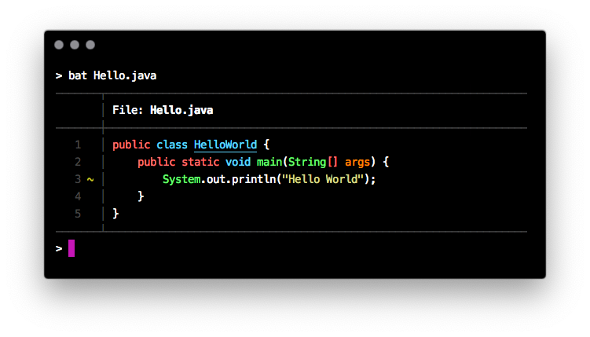
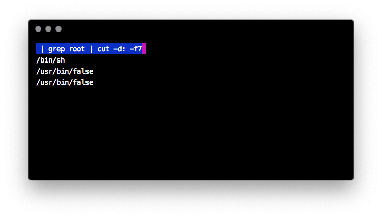
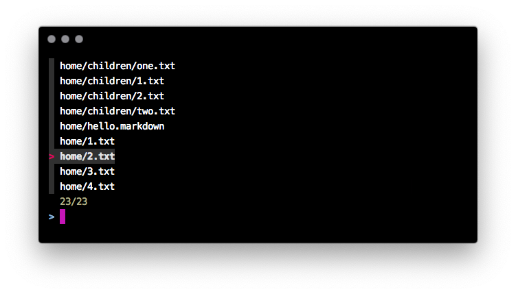

Na zimu sa treba zahriať pri termináli! Štyri utility v tom pomôžu:

* [`bat`](https://github.com/sharkdp/bat) — ako `cat`, ale s krídlami. 
* [`up`](https://github.com/akavel/up) — interaktívny budovateľ a vyhodnocovateľ rúr, pájp, či kolón
* [`fzf`](https://github.com/junegunn/fzf) — interaktívny fuzzy vyhľadávač všetkého — súborov, procesov a mnohého!

Nástroje sú dostupné pre akýkoľvek linuxoidný operačný systém a pre každý shell.

`cat` s farbami
===============

`cat` je ako Lada — dokonalý už od začiatku: jednoducho vypľuje dáta z rúry / súboru bez zmeny. 

```
brew install bat
```

`bat` je mačka s krídlami, teda netopier, ktorý je:

* farebný
* číslujúci riadky
* podporujúci Git a stavy jednotlivých riadkov



Netopier dokáže zobrazovať aj biele miesto, stačí dodať parameter `-A`.

Okrem toho fungujú všelijaké užitočné parametre:

* `—line-range 3:3` zobrazí len rozsah riadkov — v tomto prípade od tretieho po tretí.
* `-theme` zmení tému pre zvýrazňovanie syntaxe
* `-p` vypne všetky dekorácie a nechá len rýdze — ale farebné — riadky textu

`up` — interaktívne obzeranie dát v rúre
===========================

`up` má dosť mätúci názov, ale *universal plumber*, teda *mnohoúčelový klampiar* má s funkcionalitou spoločné asi toľko, ako mačka s výpisom súborov.

V tomto prípade ide o interaktívny vyhodnocovač príkazov v rúre, užitočný najmä pre vodičov v zácviku

```
brew install up
```

Stačí doňho poslať nejaké dáta:

```
cat /etc/passwd | up
```



A potom stačí už len uvádzať príkazy presne tak, ako sme na to zvyknutí z príkazového riadka!

```
| grep root
root:*:0:0:System Administrator:/var/root:/bin/sh
daemon:*:1:1:System Services:/var/root:/usr/bin/false
_cvmsroot:*:212:212:CVMS Root:/var/empty:/usr/bin/false
```

Za rúrou možno uviesť príkaz, následne ENTERovať a `up` automaticky vyhodnotí výsledok z rúry.

```
 | grep root | cut -d: -f1
root
daemon
_cvmsroot
```

Po riadku s príkazom môžeme slobodne behať, upravovať ho, enterovať a výstup sa bude okamžite aktualizovať.

Ak ukončíme príkaz pomocou `Ctrl-X`, `up` dokonca posledný príkaz utešene zapíše do shellskriptového súboru, ktorým ho môžeme zavolať.

Krása!

`fzf` — interaktívny fuzzy vyhľadávač
=====================================

`fzf` je interaktívny vyhľadávač v riadkoch zo vstupu. Niečo ako kombinácia `grep`u a ručného výberu položiek pomocou klávesnice. Okrem toho je to množstvo ďalších funkcií!

* fuzzy vyhľadávanie -- už si netreba pamätať presný názov súboru
* podpora farieb -- až 256 rozličných variantov
* výber z riadkov poskytovaných ľubovoľným linuxovým nástrojom!
* výber jednej alebo viacerých položiek úplne zadarmo!
* automatické dopĺňanie súborov, PIDov a SSH hostiteľov pre všetky bežné shelly!

```
brew install fzf
```

Vyhľadávanie v aktuálnom adresári je najjednoduchšie:

```
fzf
```

`fzf` nájde súbory a adresáre v celom podstrome aktuálneho adresára a vypíše ich do riadkov. Pomocou klávesnice (šípky hore/dole) a Enteru možno vybrať aktuálnu položku a voilá! objaví sa na štandardnom výstupe.

Okrem toho možno písať ľubovoľný text a tým filtrovať položky. `fzf` je fuzzy, takže nemusíme hľadať presnú zhodu, stačí sa približne trafiť a prípadne kurzorom doladiť výsledok.



Dokonca funguje aj viacnásobný výber!

```
fzf -m
```

Tabulátorom vyznačíme položky a po odENTERovaní sa zjaví výsledok!

Funguje aj spolupráca s akýmkoľvej linuxovým príkazom. Chceme interaktívne vybrať súbor na úpravu?

```
vim `fzf`
```

Parameter pre `vim` sa vyberie klávesnicou!

Ak je nainštalovaná podpora pre automatické dopĺňanie pre `bash`, `zsh`, či `fish`, funguje nádherný dvojhviezdičkový trik. Dve hviezdičky a následný TABulátor vyvolajú `fzf` a umožnia tým vybrať argument.

```
ls **[TAB]
```

Dopĺňanie v shelli funguje pre súbory/adresáre, SSH hostiteľov, identifikátory procesov v `kill`e a premenné prostredia!

Samozrejme, `fzf` funguje pre akýkoľvek filter. Chcete interaktívne vybrať zoznam používateľov z `/etc/passwd`?

```
< /etc/passwd fzf -m
```

Okrem toho je možné zapnúť mapovanie klávesov (*key bindings*)

* pre shell, kde pár klávesami priamo zabudujeme `fzf` do promptu
* pre príkaz, kde možno definovať ľubovoľnú skratku pre akýkoľvek príkaz nad položkou
