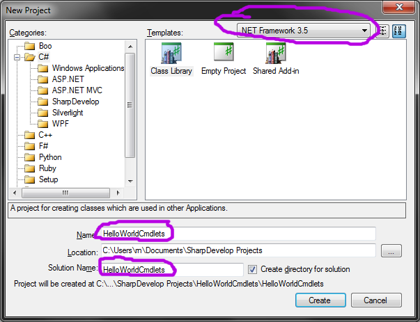
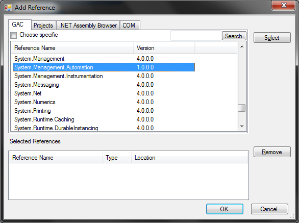
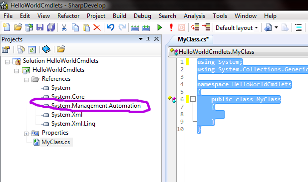
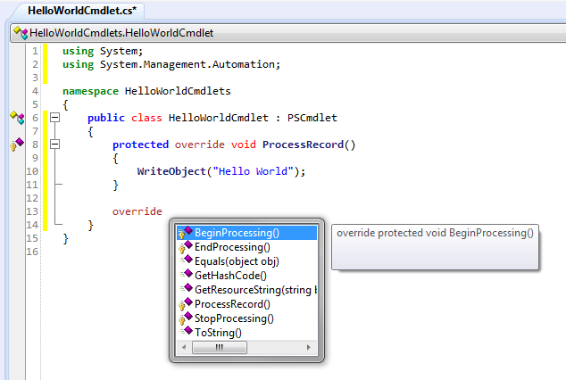
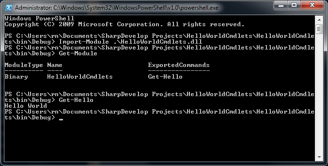

# Prečo cmdlety?

Skriptovacie možnosti PowerShellu sú dostatočne silné na to, aby bolo
možné v jeho skriptovacom jazyku napísať takmer akúkoľvek činnosť.
Existuje mnoho prípadov, keď namiesto komplikovaných skriptov chceme
využiť svoje znalosti C\# alebo iného programovacieho jazyka na
platforme .NET a vyvinúť si vlastný cmdlet, ktorý realizuje jednu
konkrétnu špecifickú úlohu. Náš kód sa v niektorých situáciách
zjednoduší a sprehľadní.

V tomto tutoriále si ukážeme, ako možno vytvoriť vlastný jednoduchý
cmdlet typu "Ahoj svet". Nebudeme však používať komplexné prostredie
Visual Studia.NET, ale využijeme bezplatné alternatívne prostredie
SharpDevelop, ktoré úplne postačí na riešenie tejto úlohy.

# SharpDevelop

[SharpDevelop](http://www.icsharpcode.net/OpenSource/SD/Download/) je
prostredie na vývoj aplikácií v .NET. Nie je také mocné, ani neponúka
toľko predpripravených šablón a nástrojov ako Visual Studio.NET, ale
zato je bezplatné a nie sú s ním spojené žiadne špecifické obmedzenia. K
októbru 2011 vyšla verzia 4.1 dostupná z [produktových
stránok](http://www.icsharpcode.net/OpenSource/SD/Download/#SharpDevelop4x).

Pred inštaláciou sa uistíme, že máme vo Windowse nainštalovaný .NET
Framework verzie 3.5 SP1 (dostupné [z webu
Microsoftu](http://www.microsoft.com/downloads/details.aspx?familyid=ab99342f-5d1a-413d-8319-81da479ab0d7&displaylang=en))
a zároveň .NET verzie 4.0 (opäť dostupné [z webu
Microsoftu](http://www.microsoft.com/downloads/details.aspx?FamilyID=0a391abd-25c1-4fc0-919f-b21f31ab88b7&displaylang=en)).
Inštalátor totiž kontroluje verzie až po voľbe súčastí, ktoré majú byť
nainštalované, čo môže byť pomerne otravné.

> **Note**
> 
> Na rozdiel od sveta Javy v .NET Frameworku nie vždy platí, že
> inštalácia novšej verzie v sebe automaticky nesie aj moduly staršej
> verzie. .NET Framework podporuje nezávislé moduly a aplikácia si môže
> vyžiadať použitie knižnice, či modulu (v terminológii .NET *assembly*)
> konkrétnej verzie.

Po spustení SharpDevelopera vytvoríme nový *solution*.

> **Note**
> 
> *Solution* v .NET terminológii zodpovedá skupine projektov, ktoré
> dohromady vyprodukujú spustiteľnú aplikáciu. V samotnej Jave
> neexistuje analógia tohto konceptu -- jeho realizácia obvykle záleží
> na použitom IDE.

Z ponuky zvolíme *solution* v jazyku C\# a použijeme možnosť *Class*
*Library*. Samotný skompilovaný cmdlet totiž naozaj nie je nič iné než
bežná knižnica (DLL).



*Solution* nazvime inteligentným spôsobom, napr. `HelloWorldCmdlets` a
vyberme z rozbaľovacieho menu profil .NET Framework 3.0.

> **Warning**
> 
> Voľba staršej verzie je veľmi podstatná\! SharpDevelop nám implicitne
> ponúkne verziu .NET 4.0, s ktorou PowerShell 2 nie je kompatibilný.
> Ranou istoty je použiť .NET 3.0, či 3.5 alebo ešte starší.

SharpDevelop automaticky vytvorí prvú triedu v mennom priestore
HelloWorldCmdlets, ktorá po odstránení komentárov vyzerá nasledovne:

    using System;
    using System.Collections.Generic;
    
    namespace HelloWorldCmdlets
    {
        public class MyClass
        {
            
        }
    }

Samotný cmdlet vytvoríme v nasledovnom kroku:

# Zavedenie *assemblies*

Samotná tvorba cmdletov sa nijak mimoriadne nelíši od tvorby akejkoľvej
inej DLL knižnice. Podobne za cmdletom netreba hľadať žiadnu mágiu:
cmdlet je trieda, ktorá dedí od rodičovskej triedy
`System.Management.Automation.PSCmdlet` a prekrýva jej metódy. Na to,
aby sme vedeli použiť túto rodičovskú triedu v našom projekte, musíme
doň zaviesť referenciu na *assembly*, ktorá ju obsahuje.

> **Note**
> 
> V Jave je obvyklé stiahnuť JAR s knižnicou, a vložiť ho do CLASSPATH,
> čím budeme mať k dispozícii všetky jej triedy. Keďže .NET podporuje
> verzionované knižnice, musíme zaviesť referenciu (odkaz) na konkrétnu
> knižnicu v danej verzii - inými slovami, zaviesť referenciu na
> konkrétne *assembly.*

Z menu Project vyberme Add Reference a pridajme referenciu na uvedenú
*assembly*:



Pridanie *assembly* vieme overiť v strome projektu, v uzle *References*.



# Tvorba cmdletu

## Tvorba prázdneho cmdletu

Teraz, keď sme zaviedli všetky požadované *assemblies*, môžeme
dopracovať náš cmdlet. Odstráňme z projektu súbor `MyClass.cs` a
namiesto neho vytvorme nový súbor pre triedu (*File | New... | File.... |*
*C\# File* a potvrdíme snahu vytvoriť súbor v projekte.) Súbor nazveme
`HelloWorldCmdlet` a vložíme doňho nasledovný obsah:

    using System;
    using System.Management.Automation;
    
    namespace HelloWorldCmdlets
    {
        [Cmdlet(VerbsCommon.Get, "Hello")]
        public class HelloWorldCmdlet : PSCmdlet
        {
            
        }
    }

Trieda dedí od rodičovskej triedy
`System.Management.Automation.PSCmdlet`. To však nie je všetko - cmdlet
musí byť označený atribútom `CmdletAttribute`, ktorý špecifikuje názov
cmdletu, pod ktorým sa sprístupní v prostredí PowerShellu.

Konvencia káže, aby každý cmdlet mal názov pozostávajúci zo slovesa a
podstatného mena a nie je dôvod ju nedodržať. Náš cmdlet sa sprístupní
pod menom Get-Hello.

> **Note**
> 
> Všimnime si niekoľko syntaktických rozdielov oproti Jave.
> 
>   - Namiesto deklarácie import používame na ten istý účel deklaráciu
>     using.
> 
>   - V C\# sa môže v rámci jedného súboru nachádzať i viacero tried
>     poskytnutých v rámci bloku namespace, ktorý je ekvivalentom
>     balíčka (*package*) v Jave.
> 
>   - Dedičnosť tried nezapisujeme kľúčovým slovom extends, ale prostou
>     dvojbodkou.
> 
>   - Atribúty sú .NETovským protipólom anotácií v Jave. Namiesto
>     zavináčovej notácie ich uvádzame do hranatých zátvoriek.

> **Note**
> 
> Atribút CmdletAttribute potrebuje dva reťazce: sloveso a podstatné
> meno. Názov slovesa prevezmeme zo statickej inštančnej premennej
> triedy `VerbsCommon`, ktorá môže slúžiť ako vzor typicky používaných
> slovies.

## Prekrytie metódy

Na to, aby cmdlet robil niečo zmysluplné, je potrebné prekryť niektorú z
metód rodičovskej triedy. Základnou metódou je `ProcessRecord()`, ktorá sa
zavolá jedenkrát pre každý objekt, ktorý príde z rúry do cmdletu. Ak z
rúry prichádza napr. 5 objektov, metóda sa zavolá päťkrát.

Dodajme túto metódu do cmdletu a dosiahnime tým najjednoduchšiu možnú
funkcionalitu: tzv. "Hello World". Cmdlet nech do rúry pošle jeden
pozdravný reťazec. Na zápis objektu do rúry použijeme rodičovskú metódu
`WriteObject()`.

    using System;
    using System.Management.Automation;
    
    namespace HelloWorldCmdlets
    {
        [Cmdlet(VerbsCommon.Get, "Hello")]
        public class HelloWorldCmdlet : PSCmdlet
        {
            protected override void ProcessRecord()
            {
                WriteObject("Hello World");
            }
            
        }
    }

> **Note**
> 
> Na rozdiel od Javy treba prekryté metódy explicitne označiť kľúčovým
> slovom override.

> **Note**
> 
> Ak hľadáte analógiu funkcie *Override and implement methods* z
> Eclipse, hľadáte v menu márne. Prekryť metódu môžete pomocou funkcie
> *autocomplete* iným spôsobom: uveďte do triedy kľúčové slovo override,
> a po stlačení Ctrl+Enter vám SharpDevelop ponúkne zoznam rodičovských
> metód určených na prekrytie.
> 
> 

# Vytvorenie inštalátora

Na to, aby sme mohli cmdlet použiť v prostredí PowerShellu, potrebujeme
obaliť triedu cmdletu do zásuvného modulu, tzv. snap-inu. Jeden
**snap-in** môže obsahovať i viacero cmdletov, či providerov, ktoré možno
naraz zaviesť do prostredia.

Snap-in je opäť bežná trieda dediaca od
`System.Management.Automation.PSSnapIn`, s povinným atribútom
`RunInstallerAttribute` a povinným poskytnuté nasledovných *properties*

  - `Name`: zmysluplný názov snap-inu

  - `Vendor`: poskytovateľ snap-inu, obvykle názov spoločnosti autora.

  - `Description`: používateľsky prítulný popis snap-inu

Snap-in musí mať zároveň povinný atribút `RunInstallerAttribute`, ktorý
indikuje spustenie inštalátora pri nasadzovaní snap-inu do prostredia.

``` 
    [RunInstaller(true)]
    public class HelloWorldSnapIns : PSSnapIn
    {
        public override string Name {
            get {
                return "HelloWorldSnapIns";
            }
        }
        
        public override string Description {
            get {
                return "A sample snap-in with Hello World message.";
            }
        }
        
        public override string Vendor {
            get {
                return "UINF PF UPJS";
            }
        }
    }
```

> **Note**
> 
> Na rozdiel od Javy v C\# nie je tradícia getterov a setterov v podobe
> metód. Zvyklosťou je pristupovať k inštančným premenným pomocou
> vlastností (*properties*), ktoré tvária ako priamo viditeľné verejné
> inštančné premenné. Ak potrebujeme pristúpiť k premennej pomocou
> metódy (ako v príklade), použijeme na to syntax get, resp. set, ako
> vidíme v príklade *properties* Name, Description a Vendor.

V tejto chvílu už môžeme projekt zostaviť: *Build | Build Solution*. Pri
prvom pokuse získame chybu:

```
The type 'System.Configuration.Install.Installer' is
defined in an assembly that is not referenced. You must add a reference
to assembly 'System.Configuration.Install, Version=2.0.0.0, Culture=neutral,
PublicKeyToken=b03f5f7f11d50a3a'. (CS0012) -
C:\Users\rn\Documents\SharpDevelop Projects\HelloWorldCmdlets\HelloWorldCmdlets\HelloWorldCmdlet.cs:18,15
```

Do projektu musíme pridať *assembly*
`System.Configuration.Install.Installer` podobne, ako sme to robili v
prvom kroku.

Teraz už zostavenie prebehne bez problémov a v adresári projektu sa
objaví súbor DLL s knižnicou. Na našom stroji sa nachádza v adresári
`c:\Users\novotnyr\Documents\SharpDevelop
Projects\HelloWorldCmdlets\HelloWorldCmdlets\bin\Debug\HelloWorldCmdlets.dll`.

# Zavedenie do PowerShellu

Spustíme PowerShell a presunieme sa do adresára s DLL súborom. Pomocou
cmdletu `Import-Module` zavedieme snap-in do prostredia.

    PS C:\Users\novotnyr\Documents\SharpDevelop Projects\HelloWorldCmdlets\HelloWorldCmdlets\bin\Debug> Import-Module .\HelloWorldCmdlets.dll

> **Warning**
> 
> Cmdlet `Import-Module` potrebuje absolútnu alebo relatívnu cestu k DLL
> súboru. Bodka a lomka na začiatku sa odkazujú na aktuálny adresár. V
> prípade, že ju vynecháme, bude importovací cmdlet protestovať, že
> nevie nájsť náš modul.

> **Warning**
> 
> Ak získame chybu:
> 
>       Import-Module : Could not load file or assembly
>		'file:///C:\Users\novotnyr\Documents\SharpDevelop\Projects\HelloWorldCmdlets\HelloWorldCmdlets\bin\Debug\HelloWorldCmdlets.dll' or one of its dependencies. This assembly is built by a runtime newer than the currently loaded runtime and cannot be loaded.
>       At line:1 char:14 + Import-Module .\HelloWorldCmdlets.dll + CategoryInfo : NotSpecified: (:)
>       [Import-Module], BadImageFormatException + FullyQualifiedErrorId : System.BadImageFormatException,Microsoft.PowerShell.Commands.ImportModuleCommand
> znamená to, že sme pri vytváraní projektu nastavili príliš novú verziu
> .NET Frameworku.

Overiť prítomnosť snap-inu v prostredí môžeme cmdletom `Get-Module`,
ktorý vypíše všetky snap-iny a cmdlety, ktoré dávajú k dispozícii.

V tejto chvíli už nič nebráni priamo spustiť z prostredia náš cmdlet
`Get-Hello` a obdivovať výpis, ktorý sme zadeklarovali.



# Rekompilácia po zmene

Po zmene súboru musíme zatvoriť PowerShell, prebudovať projekt v
SharpDevelope a použitím `Install-Module` ho opäť zaviesť do prostredia
a otestovať. Najlepší spôsob, akým zrýchliť túto nezáživnú činnosť, je
vytvoriť si vlastný powershellovský skript.

Ďalšie cmdlety
==============

V ukážke máme tri cmdlety v jednom snap-ine:

- `Say-Hello` demonštrujúci parameter `-UserName` s validáciou.
- `Get-Translation` demonštrujúci pozičný parameter, ktorý môže nadobúdať aj hodnotu z rúry.
- `Add-Extension` pracuje so súbormi a ukazuje povinný parameter.

```
using System;
using System.Collections.Generic;
using System.ComponentModel;
using System.IO;
using System.Management.Automation;

namespace HelloCmdlets
{
	[Cmdlet("Say", "Hello")]
	public class HelloWorldCmdlet : PSCmdlet
	{
		[Parameter]
		[ValidateSet("Steve Jobs", "Bill Gates")]
		public string UserName {
			get; set;
		}
		
		protected override void ProcessRecord()
		{
			WriteObject(UserName + ", Hello World!");
		}
	}
	
	[Cmdlet("Get", "Translation")]	
	public class TranslationCmdlet : PSCmdlet {
		
		[Parameter(Position=0, ValueFromPipeline=true)]
		public string Word {
			get;
			set;
		}
		
		private Dictionary<string, string> dictionary = new Dictionary<string, string>();
		
		public TranslationCmdlet() {
			dictionary["slovo"] = "word";
			dictionary["pes"] = "dog";
			dictionary["dom"] = "house";
			dictionary["zabijac"] = "slayer";
		}
		
		protected override void ProcessRecord()
		{
			if(dictionary.ContainsKey(Word)) {
				WriteObject(dictionary[Word]);
			} else {
				WriteError(new ErrorRecord(
					new KeyNotFoundException(), 
					"Slovo sa nenaslo", 
					ErrorCategory.InvalidData, 
					Word));
			}
		}
		
		protected override void BeginProcessing()
		{
			WriteObject("-----------------------------------------");
		}
	}
	
	[Cmdlet("Add", "Extension")]
	public class AddExtensionCmdlet : PSCmdlet {
		[Parameter(ValueFromPipeline=true, Position=0)]
		public FileInfo File;
		
		[Parameter(Mandatory=true)]
		public string Extension;
		
		protected override void ProcessRecord()
		{
			File.MoveTo(File.FullName + Extension);
		}
		
	}
	

	[RunInstaller(true)]
	public class HelloWorldSnapIn : PSSnapIn 
	{
		public override string Vendor {
			get {
				return "UPJS";
			}
		}
		
		public override string Name {
			get {
				return "HelloWorldSnapIn";
			}
		}
		
		public override string Description {
			get {
				return "Hello World cmdlets.";
			}
		}
	}
}
```

