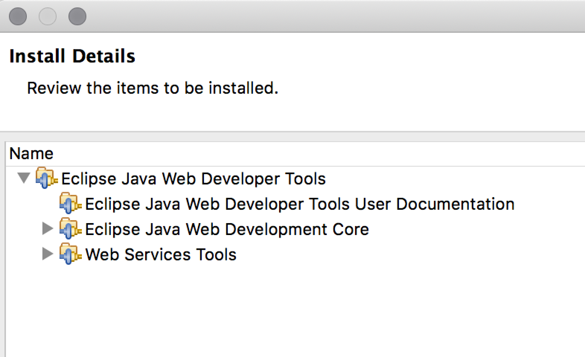
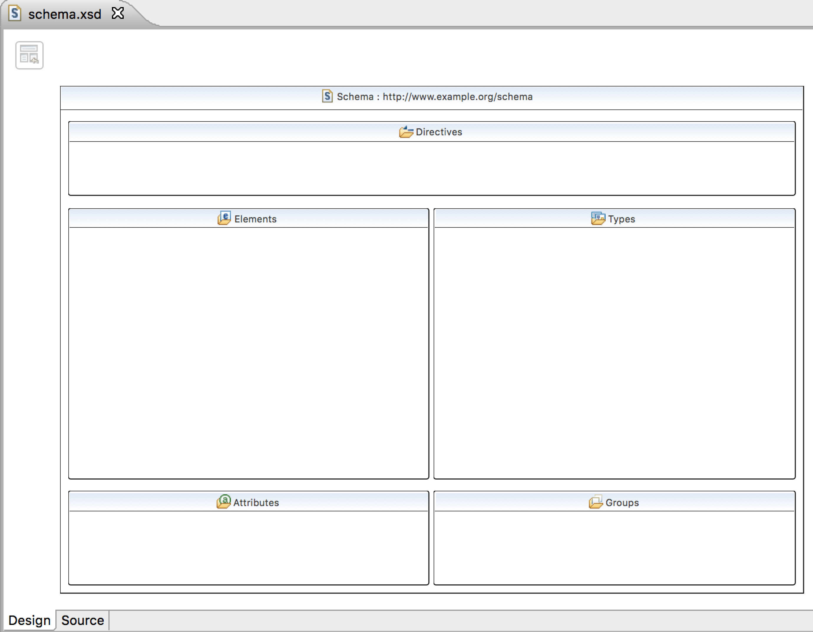
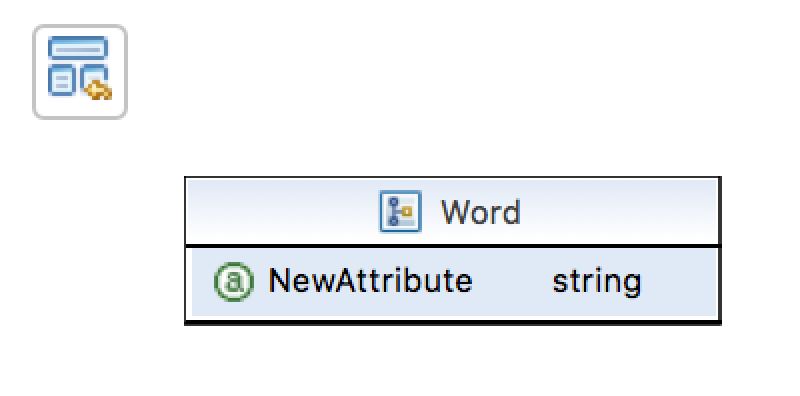
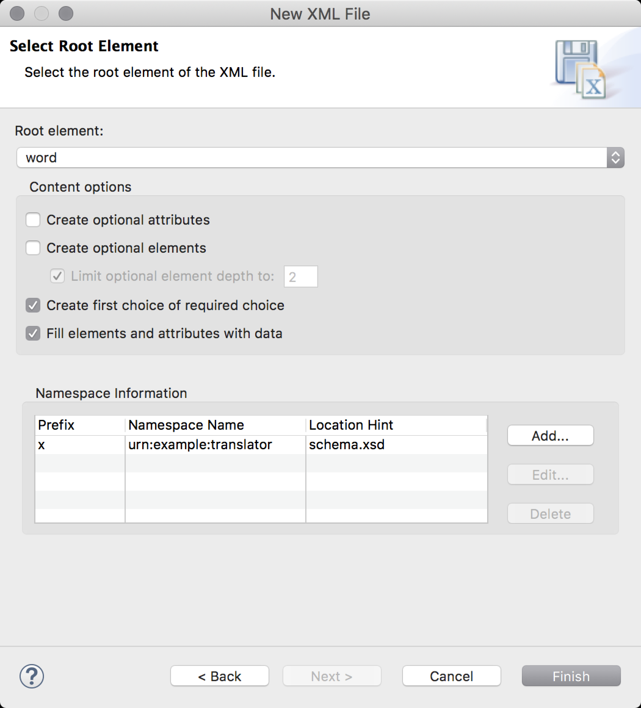
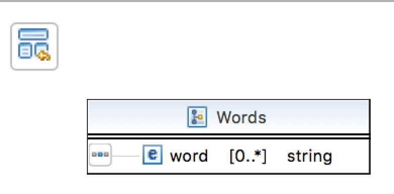
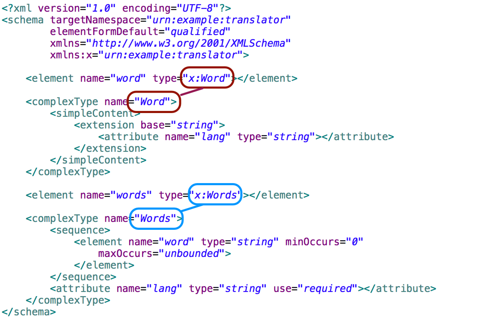

:icons: font
:toc:

== Úvod
Ukážeme si, ako je možné pomocou *Eclipse IDE* rýchlo vytvoriť XML schému pre dokumenty, čím si urobíme výborný základ pre budúci vývoj WSDL v SOAP službách alebo pre generovanie mapovaní medzi XML a objektami cez Java technológiu JAXB.

== Požadovaný softvér
Budeme potrebovať *Eclipse IDE* a modul *Eclipse Java Web Developer Tools*. Jeho súčasťou je podpora pre vývoj webových služieb protokolu SOAP (_Web Service Tools_).

== Príklad: budúca webová služba

=== Ustanovenie vstupno-výstupných dokumentov

Predstavme si, že chceme vyvinúť službu pre pre prekladový slovník, ktorá bude prijímať nasledovný dokument:

[source,xml]
----
<word lang="sk">pes</dog>
----

Keďže jazyk je metainformácia (informácia o slove *pes*), je lepšie ho uviesť do XML atribútu než do samostatného elementu.

Výstupom prekladovej služby by mohol byť dokument s viacerými slovami:

[source,xml]
----
<words lang="en">
    <word>dog</word>
    <word>hound</word>
</word>
----

Služba je navyše dostatočne flexibilná, aby mohla perspektívne vracať preklady z ľubovoľného jazyka do ľubovoľného iného.

=== Návrh XML schémy

Ak máme ujasnené dokumenty, môžeme navrhovať schému. V Eclipse môžeme zvoliť **New | File | XML | XML Schema File** a vytvoriť súbor `schema.xsd`.

Vygeneruje sa štandardná prázdna schéma:

[source,xml]
----
<?xml version="1.0" encoding="UTF-8"?>
<schema xmlns="http://www.w3.org/2001/XMLSchema"
        targetNamespace="http://www.example.org/schema"
        xmlns:tns="http://www.example.org/schema"
        elementFormDefault="qualified">
</schema>
----

_Eclipse IDE_ poskytuje dedikovaný grafický editor pre tvorbu schémy. Na spodku okna máme dve karty:

* *Design* s vizuálnym klikacím nástrojom
* *Source* s editorom zdrojového XML

Nezabudnime si zobraziť pohľad (_view_) *Properties*, ktorý zobrazí vlastnosti vybranej položky. Dostaneme sa k nemu cez *Window | Show View | Properties*.

Akčný plán na návrh schémy bude nasledovný:

. Upravíme cieľový menný priestor schémy.
. Upravíme prefix cieľového priestoru.
. Pripravíme definíciu elementu pre požiadavku SOAP služby.
. Pripravíme definíciu elementu pre odpoveď.

=== Menné priestory

Kliknime na fialový nadpis _Schema : http://www.example.org/schema_. V pohľade _Properties_ vieme nastaviť dve vlastnosti:

* *Prefix*: nastavme prefix cieľového menného priestoru, napr. na `x`.
* *Target Namespace*: cieľový menný priestor XML schémy nastavme na `urn:example:translator`

Ak sa prepneme do režimu zdrojového kódu (_Source_), uvidíme vygenerovaný kód:

[source,xml]
----
<?xml version="1.0" encoding="UTF-8"?>
<schema targetNamespace="urn:example:translator"
        xmlns:x="urn:example:translator"
        xmlns="http://www.w3.org/2001/XMLSchema"
        elementFormDefault="qualified">

</schema>
----

Menný priestor `urn:example:translator` je náš vlastný menný priestor, v duchu špecifikácie https://tools.ietf.org/html/rfc6963[RFC6963: A Uniform Resource Name (URN) Namespace for Examples].

== Definícia elementu pre požiadavku

Ak používame vizuálny návrh, kliknime na blok *Elements* a pridajme nový element cez kontextové menu a *Add Element*.

Eclipse vytvorí zástupný element `NewElement : string`. Kliknime naň a nastavme mu:

* *Name*: názov elementu, teda `word`.
* *Type*, teda typ. Z rozbaľovacieho comboboxu vyberme možnosť *New*, pretože potrebujeme definovať nový typ tohto elementu.

=== Typ elementu

Eclipse zobrazí dialóg pre výber typu elementu. Obsah elementu `word` je síce jednoduchý (obsahuje jedine text), ale vzhľadom na použitie atribútu ho musíme deklarovať ako komplexný typ. Pomenujme ho ako `Word` (s veľkým W).

Eclipse vygeneruje do bloku *Types* nový typ, a použije ako ako typ `x:Word` v type elementu `<word>`.

==== Atribút `lang`

Pridajme teraz atribút `lang`. Na type `Word` v bloku *Types* vyvolajme kontextové menu a zvoľme položku *Add Attribute*. Editor sa vnorí o úroveň nižšie, kde zobrazí len detaily tohto typu.

Po kliknutí na zástupný atribút `NewAttribute`:

* zmeňme jeho názov na `lang`
* preverme jeho dátový typ, ktorý je zatiaľ `string`, čo nám vyhovuje.

Kliknutím na tlačidlo v ľavom hornom rohu *Show Schema Index View* sa vynoríme naspäť na prehľad schémy.

Editor vygeneroval nasledovný zdrojový kód:

[source,xml]
----
<element name="word" type="x:Word"></element>
<complexType name="Word">
    <attribute name="lang" type="string"></attribute>
</complexType>
----

==== Deklarácia typu vnútra

Ešte potrebujeme deklarovať vnútro elementu `word`, pretože v tejto podobe schéma nič nehovorí o jeho obsahu.

Schéma XML pre element, ktorý je jednoduchého typu, ale obsahuje atribút, musí z technických dôvodov vyzerať nasledovne:

* Typ je deklarovaný ako komplexný typ.
* Typ textového obsahu špecifikuje odvodením (extenziou) od základného typu, napr. reťazca.

Kliknime opäť na typ `Word` a z vlastností vyberme možnosť *Inherit From*. Z rozbaľovacieho menu zvolíme *Browse...*, kde z následného dialógu vyberieme typ `string`.

Editor následne upraví kód typu:
[source,xml]
----
<complexType name="Word">
    <simpleContent>
        <extension base="string">
            <attribute name="lang" type="string"></attribute>
        </extension>
    </simpleContent>
</complexType>
----

=== Cvičné vygenerovanie inštancie

Eclipse umožňuje vygenerovať inštanciu XML schémy. Ak v pohľade _Project Explorer_ klikneme na súbor so schémou a vyvoláme *Generate | XML File...*

Umožní nám vybrať najmä:

* *root element*, teda koreňový element dokumentu. Keďže v schéme sme deklarovali jediný možný element, máme na výber len túto možnosť.
* *fill elements and attributes with data*: predvyplní povonné atribúty a obsahy cvičnými dátami.
* *namespace declarations*: vidíme deklarácie menných priestorov a prefixov. Zadefinuje sa rovnaký prefix a menný priestor, ktorý deklaruje schéma ako cieľový.

Výsledná inštancia vyzerá nasledovne:
[source,xml]
----
<?xml version="1.0" encoding="UTF-8"?>
<x:word xmlns:x="urn:example:translator" <!--1-->
	xmlns:xsi="http://www.w3.org/2001/XMLSchema-instance"
	xsi:schemaLocation="urn:example:translator schema.xsd"> <!--2-->
x:word</x:word> <!--3-->
----
<1> Deklaruje menný priestor `urn:example:translator` a jeho prefix `x`.
<2> Priamo asociuje inštanciu so súborom XML schémy
<3> Predvyplní hodnotu textového obsahu.

Atribút `lang`, ktorý nie je povinný, vynechá.

== Definícia elementu pre odpoveď

V schéme XML teraz pridáme druhý element do bloku *Elements*. Z kontextového menu zopakujeme *Add Element*, kde vyplníme meno (_name_) `words` a pre typ (_Type_) vytvoríme nový typ (_New Type..._)

=== Typ elementu

Pre typ elementu zvolíme *ComplexType* s názvom `Words`. V bloku typov sa tak objaví už druhý typ.

Pridajme doňho element pre jednotlivé preklady, teda sadu `<word>`. Na type `Words` vyvolajme kontextové menu a pridajme nový element pomocou *Add Element*. Editor sa opäť zahĺbi o úroveň nižšie a pridá element s provizórnym názvom `NewElement` typu `string`.

Kliknime na tento nový element a nastavme mu:

* názov (_name_) na `word`
* typ (_type_) ponechajme reťazcový `string`
* minimálny počet (_minimum occurences_) výskytov uveďme ako 0, čo je pre situáciu, keď sa pre slovo nenájdu žiadne preklady a vrátime prázdny zoznam slov, teda rodičovský element `<words>` nebude obsahovať nič.
* maximálny počet (_maximum occurences_) nastavme na *unbounded*, teda neohraničený.

Všimnime si, ako editor vizuálne zvýrazní typ, jeho názov, a kardinalitu (počty výskytov).

Editor vygeneroval nasledovné prvky do schémy:

[source,xml]
----
<element name="words" type="x:Words"></element>

<complexType name="Words">
    <sequence>
        <element name="word" type="string" minOccurs="0" maxOccurs="unbounded"></element>
    </sequence>
</complexType>
----

Pridajme ešte aj atribút `lang`. Vyvolajme kontextové menu na type `Words` a zvoľme *Add Attribute*. Opäť sa zanoríme o úroveň nižšie a uvidíme provizórny atribút `NewAttribute` typu `string`>
Kliknime naňho, zobrazme jeho vlastnosti a nastavme:

* *name* (_názov_) na `lang`
* *type* (_typ_) na `string`
* *usage* indikujúci povinnosť atribútu na `required`, čím z neho spravíme povinný atribút.

Editor dogeneruje do schémy nový atribút, v elemente `<attribute`>:
[source,xml]
----
<complexType name="Words">
    <sequence>
        <element name="word" type="string" minOccurs="0"
            maxOccurs="unbounded">
        </element>
    </sequence>
    <attribute name="lang" type="string" use="required"></attribute>
</complexType>
----

=== Cvičné vygenerovanie inštancie
Ak si necháme vygenerovať inštanciu (súbor schémy *| Generate | XML File...*), a ako koreňový element zvolíme *words*, uvidíme výsledok:

[source,xml]
----
<?xml version="1.0" encoding="UTF-8"?>
<x:words lang=""
     xmlns:x="urn:example:translator"
     xmlns:xsi="http://www.w3.org/2001/XMLSchema-instance"
     xsi:schemaLocation="urn:example:translator schema.xsd "></x:words>
----

Keďže atribút `lang` je povinný, v inštancii sa teraz nachádza, i keď s prázdnou hodnotou.

== Výsledná schéma XML

Výsledná schéma bude vyzerať nasledovne:

[source,xml]
----
<?xml version="1.0" encoding="UTF-8"?>
<schema targetNamespace="urn:example:translator" elementFormDefault="qualified" xmlns="http://www.w3.org/2001/XMLSchema" xmlns:x="urn:example:translator">
    <element name="word" type="x:Word"></element>

    <complexType name="Word">
    	<simpleContent>
    		<extension base="string">
    			<attribute name="lang" type="string"></attribute>
    		</extension>
    	</simpleContent>
    </complexType>

    <element name="words" type="x:Words"></element>

    <complexType name="Words">
    	<sequence>
    		<element name="word" type="string" minOccurs="0"
    			maxOccurs="unbounded">
    		</element>
    	</sequence>
    	<attribute name="lang" type="string" use="required"></attribute>
    </complexType>
</schema>
----

Obsahuje dva globálne elementy (`word` a `words`) a dva komplexné typy: jeden pre vstupné slovo (s atribútom) a druhý pre zoznam slov.

== Vizuálny diagram výslednej schémy

