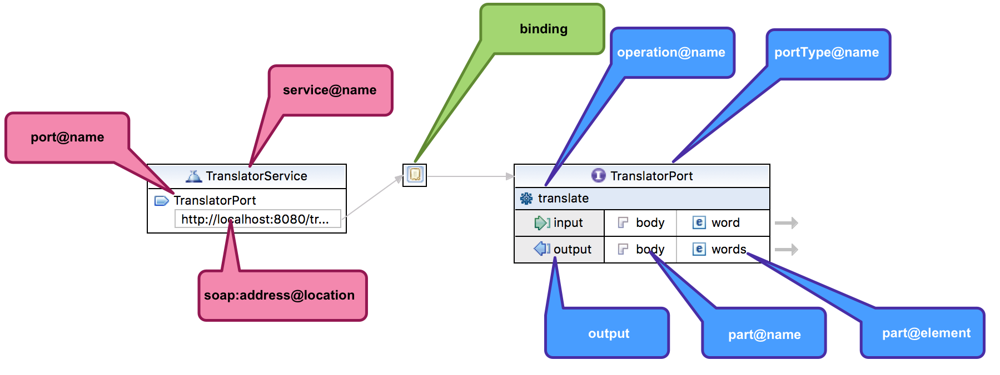

Screencast ukazuje, ako vytvárať webové služby nad protokolom SOAP s použitím *Eclipse IDE* a pluginu *Java EE Web Developer Tools*.

<video width="800" height="600" controls>
  <source src="vytvaranie-wsdl-s-eclipse-web-developer-tools.mp4" type="video/mp4">
Your browser does not support the video tag.
</video>

# Schéma pre správy

Schéma zobrazená vo videu pochádza z článku [Tvoríme XML schému pomocou Eclipse IDE](../tvorime-xml-schema-pomocou-eclipse/).

# Návrh WSDL

Ak máme ujasnenú schému, môžeme navrhovať WSDL. V Eclipse môžeme zvoliť **New | File | Web Services | WSDL File** a vytvoriť súbor `words.wsdl`.

V dialógu potrebujeme vyplniť štyri základné veci:

*	**cieľový menný priestor**: reprezentuje jednoznačný menný priestor pre deklarácie v tomto WSDL dokumente. Dôležité je dbať na:
    *	*unikátnosť menného priestoru* (v celom šírom svete...): pomenovanie URL adresou ju vie automaticky zabezpečiť. V ukážkach sa odporúča použiť adresu s prefixom `urn:example` určenú pre príklady a interné dokumenty.
    *	potenciálnu možnosť *navštíviť* URL adresu a získať z nej autoritatívnu (kanonickú) podobu WSDL súboru. Toto však nie je bezpodmienečne nutné, ani vyžadované.
*	**prefix menného priestoru**:
    *	vzhľadom na ťažkopádnosť pomenovaní menných priestorov možno využiť skratkový "alias", alebo prefix. V tomto prípade môžeme radostne použiť prefix `api` (alebo akýkoľvek iný). 
*	**štýl webovej služby**:
    *	ak chceme zachovať portabilitu a interoperabilitu, využime jedinú možnosť: *document/literal*.
*	**protokol**:
    *	využime možnosť **SOAP**.

V tomto prípade však vynechajme štýl, protokol i generovanie kostry služby, pretože si ho naklikáme vo vizuálnom editore WSDL.



Výsledné WSDL
=============

```xml
<?xml version="1.0" encoding="UTF-8" standalone="no"?>
<wsdl:definitions xmlns:api="urn:example:translator"
	xmlns:wsdl="http://schemas.xmlsoap.org/wsdl/"
	xmlns:xsd="http://www.w3.org/2001/XMLSchema" name="translator"
	targetNamespace="urn:example:translator"
	xmlns:soap="http://schemas.xmlsoap.org/wsdl/soap/">
	<wsdl:types>
		<xsd:schema xmlns:xsd="http://www.w3.org/2001/XMLSchema">
			<xsd:import namespace="urn:example:translator"
				schemaLocation="translator.xsd">
			</xsd:import>
		</xsd:schema>
	</wsdl:types>
	<wsdl:message name="translateRequest">
		<wsdl:part name="body" element="api:word"></wsdl:part>
	</wsdl:message>
	<wsdl:message name="translateResponse">
		<wsdl:part name="body" element="api:words"></wsdl:part>
	</wsdl:message>
	<wsdl:portType name="TranslatorPortType">
		<wsdl:operation name="translate">
			<wsdl:input message="api:translateRequest"></wsdl:input>
			<wsdl:output message="api:translateResponse"></wsdl:output>
		</wsdl:operation>
	</wsdl:portType>
	<wsdl:binding name="TranslatorPortBinding"
		type="api:TranslatorPortType">
		<soap:binding style="document"
			transport="http://schemas.xmlsoap.org/soap/http" />
		<wsdl:operation name="translate">
			<soap:operation
				soapAction="urn:example:translator/NewOperation" />
			<wsdl:input>
				<soap:body use="literal" />
			</wsdl:input>
			<wsdl:output>
				<soap:body use="literal" />
			</wsdl:output>
		</wsdl:operation>
	</wsdl:binding>
	<wsdl:service name="TranslatorService">
		<wsdl:port name="TranslatorPort"
			binding="api:TranslatorPortBinding">
			<soap:address
				location="http://localhost:8080/translator" />
		</wsdl:port>
	</wsdl:service>
</wsdl:definitions>
```

Literatúra
==========
*	[Od WSDL k webovej službe – tvoríme vlastné WSDL](../od-wsdl-k-webovej-sluzbe-tvorime-vlastne-wsdl/). Článok o budovaní webovej služby na základe WSDL, na zelenej lúke.
*	[WSDL Essentials](http://oreilly.com/catalog/webservess/chapter/ch06.html), Chapter 6 in *Web Services Essentials [Distributed Applications with XML-RPC, SOAP, UDDI & WSDL]*, O'Reilly 2002.
