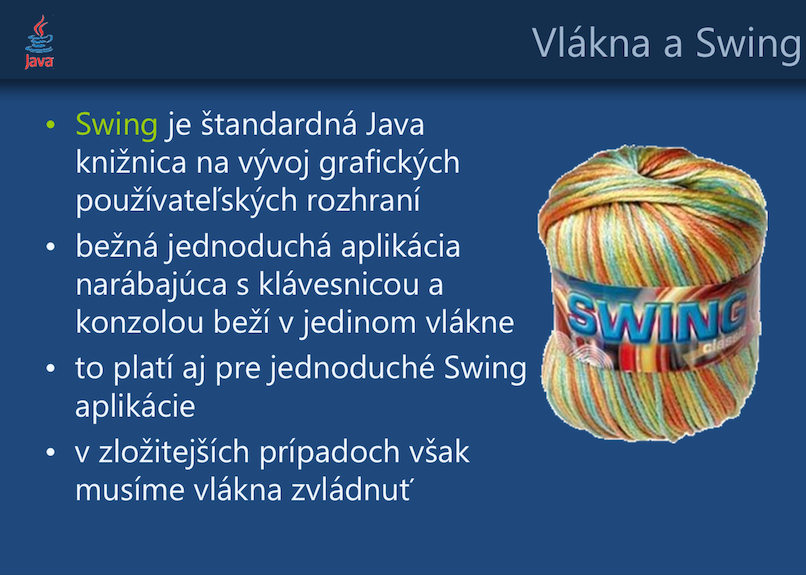

> Ako korektne programovať dlhotrvajúce operácie v Swing GUI?

Stiahnuť
========

- [PDF](threads-swing.pdf)
- [Powerpoint PPT](threads-swing.ppt) 

Obsah
=====

* Swing a vlákna.
* Problém s Event Dispatch Thread. 
* Metóda `invokeLater()` 
* Trieda `SwingWorker`