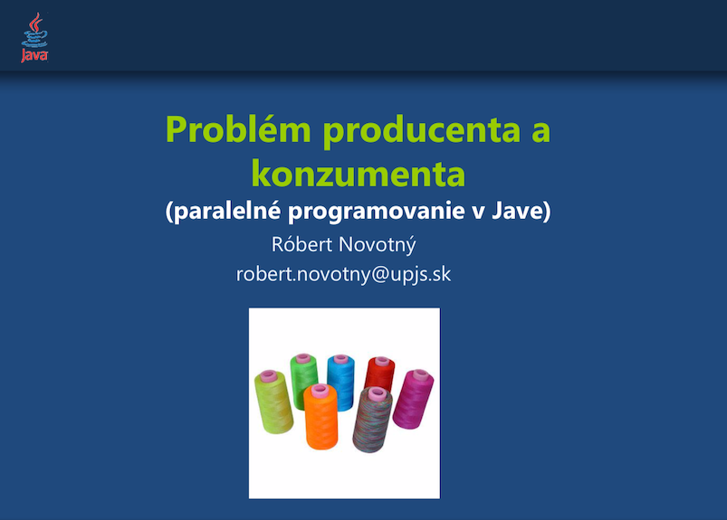

Stiahnuť
========

* [PDF](threads-producer-consumer.pdf)
* [PowerPoint PPT](threads-producer-consumer.ppt)

Obsah
=====

- Problém producenta a konzumenta ako mechanizmu koordinácie vlákien. 
- Ako si ho napísať od piky. 
- Návrhy riešení a poukázanie na ich chyby. 
  - aktívne čakanie
  - mechanizmus *wait/notify*
- Zabudované riešenia v Jave.

